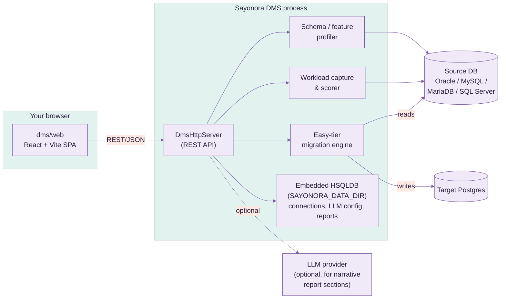
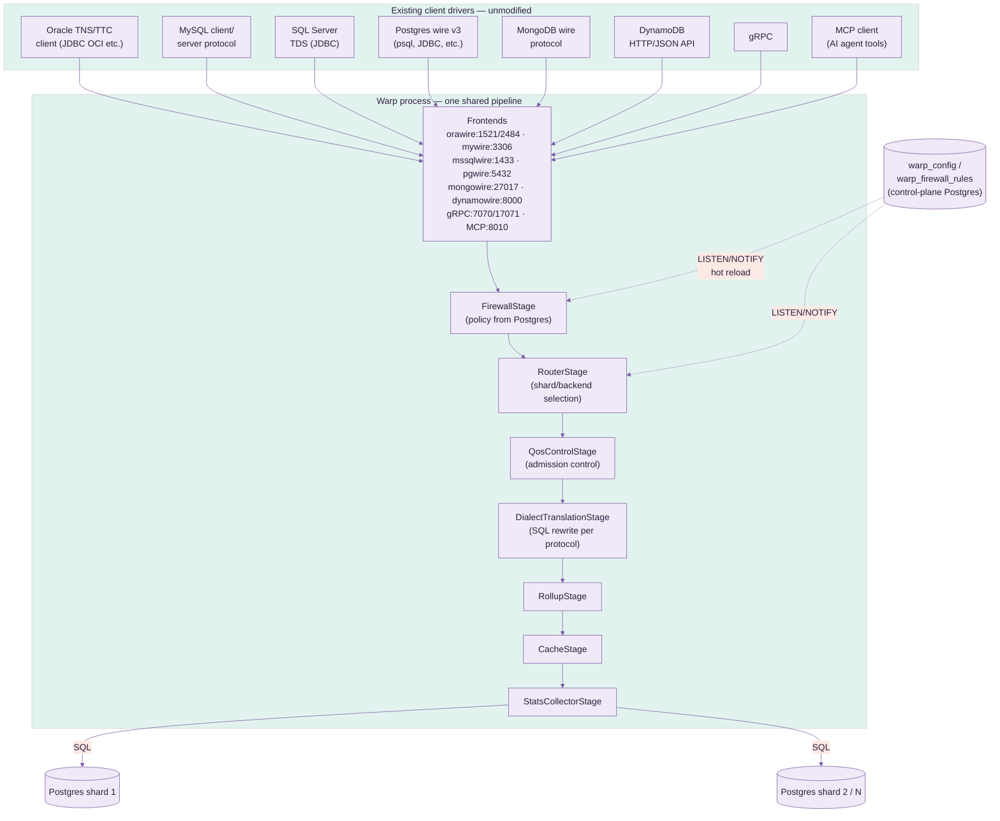
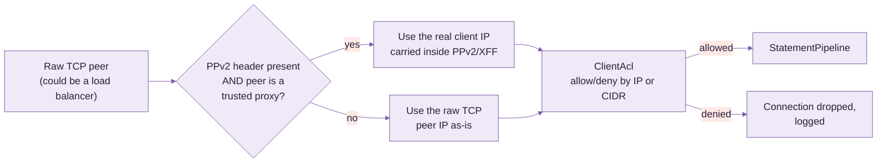
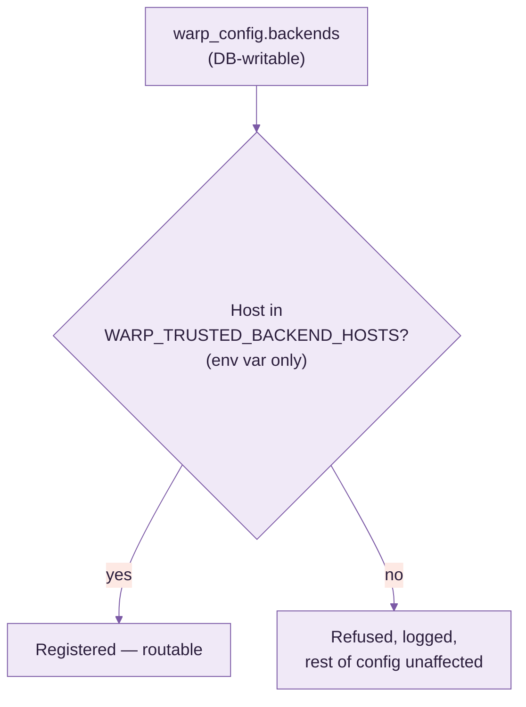
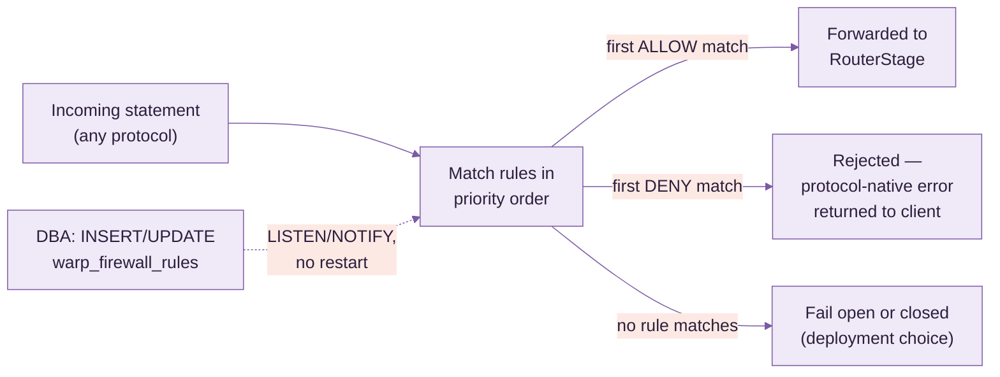
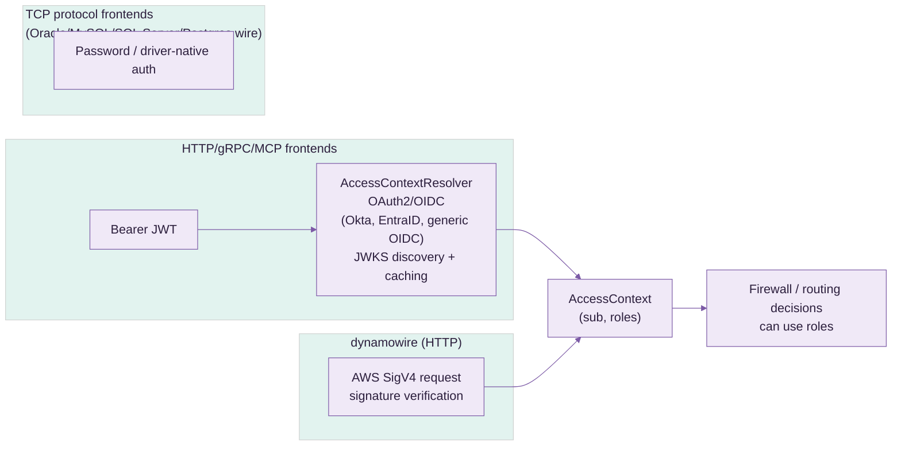
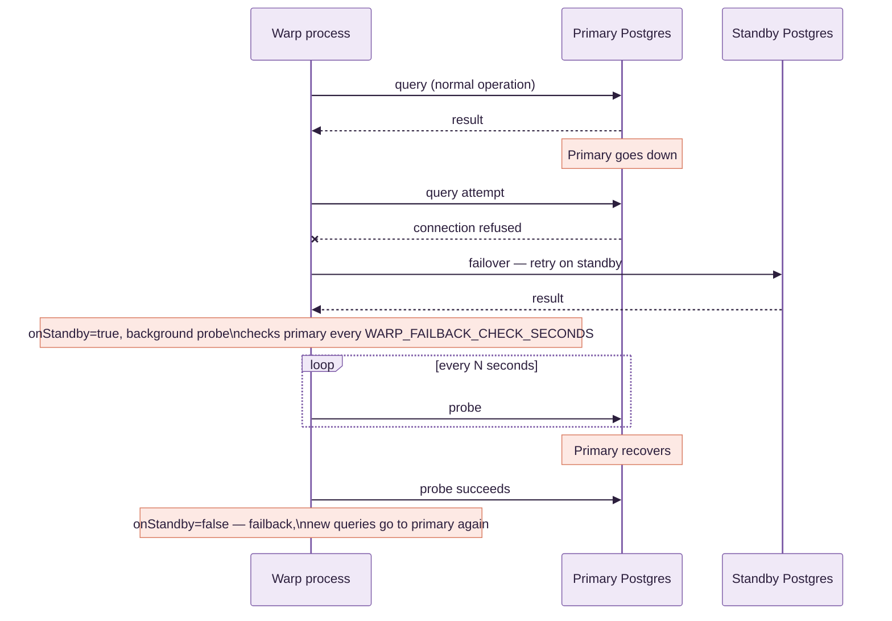
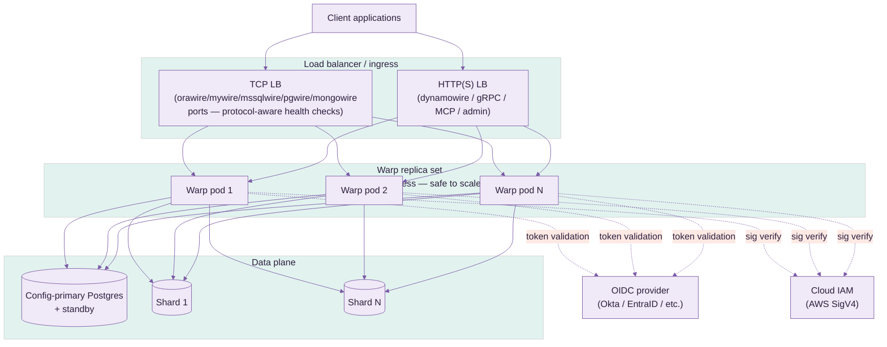

# Sayonora Use Case & Deployment Guide

Covers both modules — **Sayonora DMS** (migration assessment) and **Warp** (protocol
gateway) — plus the Docker packaging for each. Each section is self-contained; jump to what
you need.

> **On screenshots**: this guide doesn't include UI screenshots. Sayonora DMS's web UI only has
> real content once it's pointed at an actual source database, and generating images here would
> mean either fabricating a fake UI or a blank shell — neither is useful. Once you run `docker
> compose up` (see the Docker section), tell me and I'll drive the running UI in a browser and
> capture real screenshots of your actual data.

---

## 1. What each module is for

| Module | Question it answers | Output |
|---|---|---|
| **Sayonora DMS** | "How hard is it to migrate this Oracle/MySQL/SQL Server database to Postgres, and can you do the easy parts for me?" | Assessment report (schema/feature/workload scoring) + automated migration for low-risk objects |
| **Warp** | "Can my existing app, written against Oracle/MySQL/SQL Server/MongoDB/DynamoDB wire protocols, talk to Postgres without a rewrite?" | A gateway process that speaks the client's native wire protocol on one side and real Postgres SQL on the other |

They're complementary, not sequential-only: a team can run Warp indefinitely as a
permanent compatibility shim (e.g. legacy MongoDB driver code that's not worth rewriting) or
as a temporary cutover bridge while Sayonora DMS migrates schema/data behind the scenes.

---

## 2. Architecture

### 2.1 Sayonora DMS



- **Stateless compute, stateful store**: the process itself holds nothing between requests;
  all durable state (saved connections, LLM provider keys, uploaded/generated reports) lives
  in the embedded HSQLDB file store — one directory (`SAYONORA_DATA_DIR`), trivially backed up.
- **Read-mostly against the source**: profiling and workload capture are read-only against the
  source database. Only the migration engine writes, and only to the Postgres target — it
  never mutates the source.

### 2.2 Warp



- **One pipeline, many faces**: every frontend (Oracle, MySQL, SQL Server, Mongo, DynamoDB,
  gRPC, MCP, native Postgres) feeds the *same* `StatementPipeline` instance — firewall,
  routing, QoS, translation, caching, and stats are protocol-agnostic.
- **Config lives in Postgres, not just env vars**: `warp_config` (versioned, insert-only)
  and `warp_firewall_rules` (mutable, DBA-managed) are real tables in a designated
  "config-primary" Postgres. `LISTEN/NOTIFY` pushes changes to every running Warp process
  within milliseconds — no restart to change a firewall rule or add a backend.
- **Config-primary vs. data plane**: the `WARP_*` env vars point at the single Postgres
  that holds control-plane tables. `WARP_BACKENDS` / `WARP_SHARD_BACKENDS` are the
  separate, explicitly-registered data-plane shard targets actual queries are routed to — the
  config-primary is never automatically one of the shards.

---

## 3. Security

### 3.1 ACL (IP / CIDR allowlisting) & PPv2 / X-Forwarded-For



**ACL (`ClientAcl`)** — a plain, ordered allow/deny rule list evaluated per inbound
connection, on every frontend (pgwire, mywire, orawire, mssqlwire, mongowire, gRPC, dynamowire,
MCP, admin/metrics HTTP):

- Rule grammar: `allow <ip-or-cidr>` / `deny <ip-or-cidr>`, one per line/`;`-separated entry —
  e.g. `allow 10.0.0.0/8; allow 192.168.1.50; deny 0.0.0.0/0` (allow the private ranges you
  name, deny everything else).
- Sourced from **either** the env var (`WARP_ACL_RULES`) **or** `warp_config.aclRules`
  — same dual-source convention as every other setting; the DB-stored version hot-reloads via
  `LISTEN/NOTIFY` with zero restart.
- Default (unset) is fully open — no behavior change until you opt in.
- A rejected connection is dropped immediately, before it reaches the firewall/router stages,
  and logged with the offending IP — visible in Warp's own logs for audit.

**PPv2 (PROXY protocol v2) / `X-Forwarded-For`** — solves the problem that, once you put a
load balancer or connection pooler in front of Warp, every connection's raw TCP peer IP
*is the load balancer*, not the real client — so a naive ACL would only ever see one IP.

- `WARP_ACL_PPV2_ENABLED` (or `warp_config.aclPpv2Enabled`) turns on parsing of the
  PPv2 header (binary, used by TCP-level proxies — HAProxy, many cloud NLBs) or the
  `X-Forwarded-For` HTTP header (for the HTTP-based frontends) to recover the real client IP.
- **Trust is opt-in per proxy, not global**: `WARP_ACL_TRUSTED_PROXIES` (or
  `warp_config.aclTrustedProxies`) is a separate IP/CIDR list — the forwarded-IP header is
  only honored when the *direct* TCP peer is itself in this list. Without this check, any
  client could simply forge its own `X-Forwarded-For` header and impersonate an allowlisted IP
  — this is the exact spoofing vector the trusted-proxy check exists to close.
- Typical setup: `WARP_ACL_TRUSTED_PROXIES=10.0.0.0/24` (your load balancer's subnet),
  `WARP_ACL_RULES=allow 203.0.113.0/24` (the actual office/VPN range you want to allow) —
  Warp then correctly evaluates the ACL against the client's real IP even though every
  packet physically arrives from the load balancer.

### 3.2 Backend-poisoning protection

Because `WARP_BACKENDS` can be set via the DB-writable `warp_config` table, anyone
with write access to that table could otherwise register an arbitrary host and have real
client traffic silently routed to it (a config-driven SSRF). `TrustedBackendHosts`
(`WARP_TRUSTED_BACKEND_HOSTS`) closes this:



Deliberately **env-var only, never itself in `warp_config`** — if the allowlist lived in
the same DB-writable surface it gates, the protection would be circular. Entries accept IPs,
CIDR blocks, or literal hostnames (docker-compose service names, internal DNS).

### 3.3 SQL Firewall

Runs as its own pipeline stage (`FirewallStage`), first in line — every statement on every
frontend is checked before routing, translation, or execution. Rules live in a real,
DBA-managed Postgres table, **not** an env var or app config file, so a DBA can change policy
with an `UPDATE`/`INSERT` statement and see it apply in milliseconds, no Warp redeploy.



**Table schema** (`warp_firewall_rules`, auto-created, own `LISTEN/NOTIFY` trigger):

| column | meaning |
|---|---|
| `id` | primary key |
| `priority` | lower evaluates first; first matching rule wins |
| `action` | `ALLOW` or `DENY` |
| `statement_type` | `SELECT` / `INSERT` / `UPDATE` / `DELETE` / `DDL` / `*` (any) |
| `table_pattern` | glob against the target table, schema-qualification optional (`orders` matches both `orders` and `public.orders`) |
| `sql_pattern` | optional raw regex escape hatch — matched against the full SQL text when a table-level rule isn't expressive enough |
| `enabled` | boolean — disable a rule without deleting it |
| `description` | free text, shows up in denial logs |

**Example policy:**

| priority | action | statement_type | table_pattern | description |
|---|---|---|---|---|
| 10 | DENY | DELETE | `*orders*` | block bulk order deletes from any app |
| 20 | DENY | `*` | `*pii_*` | block all access (read or write) to PII-prefixed tables |
| 30 | DENY | `*` | `*` *(sql_pattern: `(?i)DROP\s+TABLE`)* | block DDL drops regardless of table name |
| 100 | ALLOW | `*` | `*` | default allow — everything not matched above |

**Config surface** — configured, like every other feature, from **either**:

- a plain SQL `INSERT INTO warp_firewall_rules (...)` (the intended day-to-day DBA path —
  no application deploy involved at all), or
- the equivalent Postgres stored procedure Warp ships (wraps the same insert/update with
  validation), for teams that prefer calling a procedure over hand-writing DML.

Changes are pushed to every running Warp process instantly via the table's `NOTIFY`
trigger — matches the same hot-reload mechanism used by `warp_config`, `ClientAcl`, and
`TrustedBackendHosts`.

### 3.4 Authentication



- OAuth2/OIDC bearer-token validation for every HTTP-based frontend (gRPC, MCP, admin API),
  with configurable claim mapping (`sub` → user id, custom claim → roles).
- AWS Signature v4 verification for `dynamowire`, opt-in via `WARP_AWS_IAM_CREDENTIALS`.
- TCP wire-protocol frontends (Oracle/MySQL/SQL Server/Postgres) authenticate with the
  client driver's own native password exchange, passed through to the real Postgres backend.

### 3.5 TLS

- `orawire` has a dedicated TLS listener (TCPS, port 2484) alongside plaintext TNS (1521).
- gRPC has a dedicated TLS listener (17071) alongside plaintext (7070).
- All built from one shared keystore — one cert to rotate, not one per frontend.

---

## 4. High Availability

### 4.1 Config-primary failover



- Configured via `WARP_STANDBY_HOST`/`WARP_STANDBY_PORT`. Applies to both the
  control-plane connection (`warp_config`/firewall rules) and, via `BackendTarget`'s
  `failoverOptions`, the actual query-execution path for the synthetic default backend.
- Explicitly-named shard backends (`WARP_BACKENDS`) do **not** get automatic failover — a
  named shard isn't presumed to be a replica pair of another named shard; pair them yourself
  at the infrastructure layer (e.g. a PgBouncer/HAProxy VIP per shard) if needed.
- Failback is automatic, probed in the background (`WARP_FAILBACK_CHECK_SECONDS`, default
  10s) — no manual intervention once the primary recovers.

### 4.2 Sharding / scatter-gather

`WARP_SHARD_BACKENDS` names a subset of the registered backends as a shard group;
`RoutingBackendExecutor` fans a matching query out to all of them and merges results — useful
for read-side aggregate queries across horizontally-partitioned Postgres backends.

### 4.3 What HA does *not* cover yet

Cross-AZ distributed cache (Ignite) placement is verified locally (2-node) but not yet
cloud-native — AZ-aware backup placement, cloud discovery (not static IP lists), and TLS
between cache nodes are open follow-up work before a real multi-AZ production deploy. Treat
single-AZ or single-host as the currently-proven HA envelope; see project memory for the
detailed gap list.

---

## 5. Deploying on a laptop (fastest path)

Both modules have a Docker Compose file that needs nothing but Docker Desktop.

**Warp** (gateway only, bring your own Postgres or point at one running elsewhere):

```bash
docker compose -f docker/warp/docker-compose.yml up --build
```

**Sayonora DMS** (one container — API + SPA served together by embedded Jetty):

```bash
docker compose -f docker/dms/docker-compose.yml up --build
```

Then open `http://localhost:8080`. Both commands must run from the **repo root** — the build
context is the repo root even though each Dockerfile lives under `docker/<module>/` (see each
module's own `docker/*/README.md` for why).

For iterative Java development without Docker:

```bash
cd dms && mvn package -DskipTests && ./scripts/run.sh   # if present
cd wire && mvn package -DskipTests && scripts/run.sh
```

No cloud account, no Kubernetes, no external Postgres required to try either module — a local
`sb-postgres`-style container (see either compose file) is enough for a full smoke test.

---

## 6. Cloud deployment



- **Warp itself is stateless** — every pod reads its live config from the same
  config-primary Postgres via `LISTEN/NOTIFY`, so horizontal scaling is just "add more pods
  pointed at the same `WARP_*`." No sticky sessions needed at the LB beyond normal TCP
  connection affinity for the life of one client session.
- **`WARP_TRUSTED_BACKEND_HOSTS`** must be set at deploy time (env var / secret /
  Kubernetes `NetworkPolicy`-equivalent) — this is infrastructure config, not something to put
  in application config management that developers can edit.
- **Container images**: build with the Dockerfiles under `docker/warp/` and
  `docker/dms/`, push to a registry (e.g. `ghcr.io` — see the repo root
  `.env.example` for the token fields needed), deploy via your platform's normal rolling
  update mechanism (ECS service, GKE/EKS Deployment, etc.).
- **Secrets**: `WARP_PASSWORD`, `WARP_AWS_IAM_CREDENTIALS`, OAuth client secrets, and
  the registry token belong in your cloud's secret manager (Secrets Manager, Secret Manager,
  Key Vault) or a Kubernetes `Secret`, injected as env vars — never baked into the image.
- **What's still cloud-*agnostic* by design**: Warp has no hard dependency on any one
  cloud's networking primitives — it only needs TCP reachability to its Postgres backends and,
  optionally, an OIDC issuer and/or AWS IAM for auth. Cross-AZ cache placement is the one piece
  still marked open (§4.3) before treating a specific cloud's multi-AZ topology as fully proven.

---

## 7. Docker packaging reference

| | Warp | Sayonora DMS |
|---|---|---|
| Images | 1 (`docker/warp/Dockerfile`) | 1 (`docker/dms/Dockerfile`) — API + SPA in one container |
| Base (build) | `maven:3.9-eclipse-temurin-21` | same, plus a `node:22-alpine` stage to build the SPA |
| Base (runtime) | `eclipse-temurin:21-jre-jammy` | same |
| Published ports | 15432, 13306, 11521, 2484, 14333, 27017, 7070, 17071, 18000, 18010, 19090 | 8090 only |
| Persistent state | none in the image — all state is the external control-plane Postgres | named volume `polyadvisor-data` → `SAYONORA_DATA_DIR` (embedded HSQLDB) |
| How the SPA is served | n/a | `DmsHttpServer` runs on embedded Jetty (already a dependency) and serves the built `dms/web` SPA itself via `SpaResourceHandler` (`SAYONORA_DMS_WEB_DIR=/app/web`) — no nginx or second container. Unset that env var to run API-only; `Dockerfile.frontend`/`nginx.conf` are still available in `docker/dms/` for teams that want a separately-scaled static tier instead |
| `.dockerignore` | repo-root only — both compose files set `context: ../..`, and classic Docker only honors a root-level `.dockerignore` | same |

Build standalone (no compose):

```bash
# from repo root
docker build -f docker/warp/Dockerfile -t warp:latest .
docker build -f docker/dms/Dockerfile -t sayonora-dms:latest .
```

---

## 8. Complete feature reference

Every end-user-facing feature in both modules, in one place, with its config knob.

### 8.1 Sayonora DMS features

| Feature | What it does | Where |
|---|---|---|
| Source connection management | Save/reuse connections to Oracle, MySQL, MariaDB, SQL Server | web UI + `ConnectionStore` |
| Schema profiler | Inventories tables, columns, types, constraints, indexes on the source | `DmsHttpServer` |
| Feature-usage detection | Flags source-specific features with no direct Postgres equivalent (proprietary types, stored-proc dialects, partitioning schemes, etc.) | profiler |
| Workload capture | Samples real query traffic against the source to weight the assessment by actual usage, not just schema shape | `Workload capture` |
| Migration difficulty scoring | Produces an object-by-object and overall difficulty score | scorer |
| Easy-tier automated migration | Executes the migration itself for objects scored low-risk, writing only to the Postgres target | migration engine |
| LLM-assisted narrative reports | Optional natural-language summary/explanation sections in the report | pluggable LLM provider config |
| Report storage & history | Past assessment/migration reports kept for comparison over time | `ReportStore` (embedded HSQLDB) |
| React/TS web UI | Full workflow — connect, profile, review score, trigger migration, read reports | `dms/web` |

### 8.2 Warp — protocol frontends

| Frontend | Protocol | Default port | Notes |
|---|---|---|---|
| pgwire | Postgres wire protocol v3 | 15432 | native passthrough, no translation needed |
| mywire | MySQL client/server protocol | 13306 | SQL dialect translated to Postgres by default; `WARP_MYWIRE_BACKEND=mysql` for native-backend mode |
| orawire | Oracle TNS/TTC | 11521 (plaintext), 2484 (TCPS/TLS) | SQL dialect translated by default; both plaintext and TLS listeners run together; `WARP_ORACLE_BACKEND_MODE=native` for native-backend mode |
| mssqlwire | SQL Server TDS | 14333 | T-SQL dialect translated by default; `WARP_MSSQLWIRE_BACKEND=sqlserver` for native-backend mode |
| mongowire | MongoDB wire protocol | 27017 | document ops mapped to SQL |
| dynamowire | DynamoDB HTTP/JSON API | 18000 | AWS SigV4-verifiable, item ops mapped to SQL |
| gRPC | gRPC | 7070 (plaintext), 17071 (TLS) | both listeners run together, one shared keystore |
| MCP | JSON-RPC 2.0 over Streamable HTTP | 18010 | dialect-translated to Postgres by default; `WARP_MCP_BACKEND=oracle/mysql/sqlserver` for native-backend mode — see §8.6 |
| Admin / metrics | HTTP | 19090 | health, metrics, read-only config introspection (never returns passwords) |

mywire/orawire/mssqlwire/MCP's native-backend mode proxies straight through to a real Oracle/
MySQL/SQL Server connection with nothing rewritten in transit, instead of translating into
Postgres — for keeping the engine you already run. It bypasses the shared pipeline below
entirely (SQL Firewall and QoS admission control included), keeping only connection ACL and
pooling. Full detail: [`WARP_GUIDE.md` §8.1.1](WARP_GUIDE.md#811-native-backend-mode-proxy-straight-to-oracle-mysql-or-sql-server-instead-of-translating).

### 8.3 Warp — statement pipeline stages

Every frontend above feeds the same shared pipeline, in this order:

| Stage | Feature |
|---|---|
| `FirewallStage` | SQL Firewall — see §3.3 |
| `RouterStage` | Backend/shard selection per statement |
| `QosControlStage` | Admission control — caps in-flight work per backend to protect it from overload |
| `DialectTranslationStage` | Rewrites source-dialect SQL (Oracle/MySQL/T-SQL) into Postgres SQL |
| `RollupStage` | Aggregates/merges results for scatter-gather (shard-group) queries |
| `CacheStage` | Translation-result and read caching (`warp_translation_cache`) |
| `StatsCollectorStage` | Per-statement metrics feeding the admin/metrics HTTP endpoint |

### 8.4 Warp — security features

| Feature | Config knob | Detail |
|---|---|---|
| ACL (IP/CIDR allow-deny) | `WARP_ACL_RULES` / `warp_config.aclRules` | §3.1 |
| PPv2 / X-Forwarded-For trusted-proxy resolution | `WARP_ACL_PPV2_ENABLED`, `WARP_ACL_TRUSTED_PROXIES` | §3.1 |
| SQL Firewall | `warp_firewall_rules` table | §3.3 |
| Backend-poisoning allowlist | `WARP_TRUSTED_BACKEND_HOSTS` (env var only) | §3.2 |
| OAuth2 / OIDC bearer auth | `WARP_OAUTH_ISSUER`, `WARP_OAUTH_AUDIENCE`, claim-mapping vars | §3.4 — Okta, EntraID, any standard OIDC issuer |
| AWS SigV4 request verification | `WARP_AWS_IAM_CREDENTIALS` | §3.4 — for `dynamowire` |
| Native driver password auth | n/a, always on | TCP frontends (Oracle/MySQL/SQL Server/Postgres) |
| TLS listeners | shared keystore config | §3.5 — orawire TCPS, gRPC TLS |

### 8.5 Warp — configuration & operations features

| Feature | Detail |
|---|---|
| Dual config source | Every setting readable from an env var **or** `warp_config` — pick per-deployment |
| Hot reload | `LISTEN/NOTIFY` on `warp_config_changed` and the firewall table's own trigger — no restart for any config change |
| Config-primary designation | `WARP_*` names the one Postgres holding control-plane tables, separate from data-plane shard backends (§2.2) |
| Config-primary HA failover | `WARP_STANDBY_HOST`/`_PORT`, automatic failover + failback probe (§4.1) |
| Postgres stored-procedure config API | Wraps `warp_config`/firewall inserts with validation, for teams that prefer calling a procedure over hand-writing DML |
| Backend registry | `WARP_BACKENDS` — named additional Postgres targets beyond the implicit default |
| Sharding / scatter-gather | `WARP_SHARD_BACKENDS` — fan a query to a named group, merge via `RollupStage` (§4.2) |
| Translation cache | `warp_translation_cache` — avoids re-translating identical statements |
| Failed-statement log | `warp_failed_statements` — durable record of statements the pipeline rejected or errored on, for audit/debugging |

### 8.6 Warp — MCP (AI agent tool access)

| Feature | Detail |
|---|---|
| Generic SQL tools | `execute_sql`, `list_tables`, `describe_table` exposed as MCP tools out of the box |
| Native-backend mode | `WARP_MCP_BACKEND=oracle/mysql/sqlserver` (default `postgres`) points the generic SQL tools at a real Oracle/MySQL/SQL Server connection instead — `document_schema`/`explain_query`/`query_natural_language` stay Postgres-only and are refused with a clear error (not advertised by `tools/list`) in native mode, since they hardcode Postgres-specific SQL |
| Data-investigation tool set | `run_sql`, `inspect_schema`, `column_stats`, `compare_groups`, `correlation`, `sample_rows`, `find_outliers`, `find_join_path`, `explain_sql` — real per-dialect SQL (Oracle has no `information_schema`; MySQL/SQL Server have no `CORR()` aggregate), available in every native-backend mode. Built for the [agent-loop small-model-training approach](https://www.linkedin.com/pulse/how-train-small-model-databases-kumar-rajamani-n1i5c/) described in `WARP_GUIDE.md` §8.5.1 |
| Registered stored-procedure tools | `WARP_MCP_TOOLS` names specific Postgres functions/procedures to expose as individually-named MCP tools — only what's explicitly registered is callable, not arbitrary SQL; Postgres mode only |
| Automatic input-schema generation | Introspects each registered function's real Postgres parameter types and builds the matching JSON Schema (`PgFunctionIntrospector`, `PgTypeToJsonSchema`) |
| OUT-parameter handling | OUT parameters are correctly excluded from the callable input schema |
| JSON Streamable HTTP transport | Standard MCP transport, so any MCP-compatible AI client can connect without custom glue |

## 9. Use case matrix

| Scenario | Module(s) | Notes |
|---|---|---|
| Assess Oracle → Postgres migration difficulty | Sayonora DMS | Read-only profiling, no source-side risk |
| Auto-migrate low-risk schema objects | Sayonora DMS | Writes only to the Postgres target |
| Keep a legacy Oracle-driver app running against Postgres, permanently | Warp (orawire) | No app rewrite; TNS/TTC + TCPS supported |
| Cut over a MySQL-protocol app during a migration window | Warp (mywire) | Temporary bridge, decommission after cutover |
| Let an AI agent call vetted stored procedures as tools | Warp (MCP frontend) | Only `WARP_MCP_TOOLS`-registered functions are exposed, not arbitrary SQL |
| Enforce "no bulk deletes from `orders`" org-wide, DBA-editable, no redeploy | Warp (SQL firewall) | Rule lives in Postgres, hot-reloaded |
| Multi-region app needing Okta-based access control on a DynamoDB-protocol endpoint | Warp (dynamowire + OAuth) | SigV4 or OIDC bearer, per deployment choice |
| Horizontally shard reads across N Postgres backends | Warp (shard group + RouterStage) | Scatter-gather via `WARP_SHARD_BACKENDS` |
| Try either module locally before committing to infrastructure | Docker Compose | See §5 |
