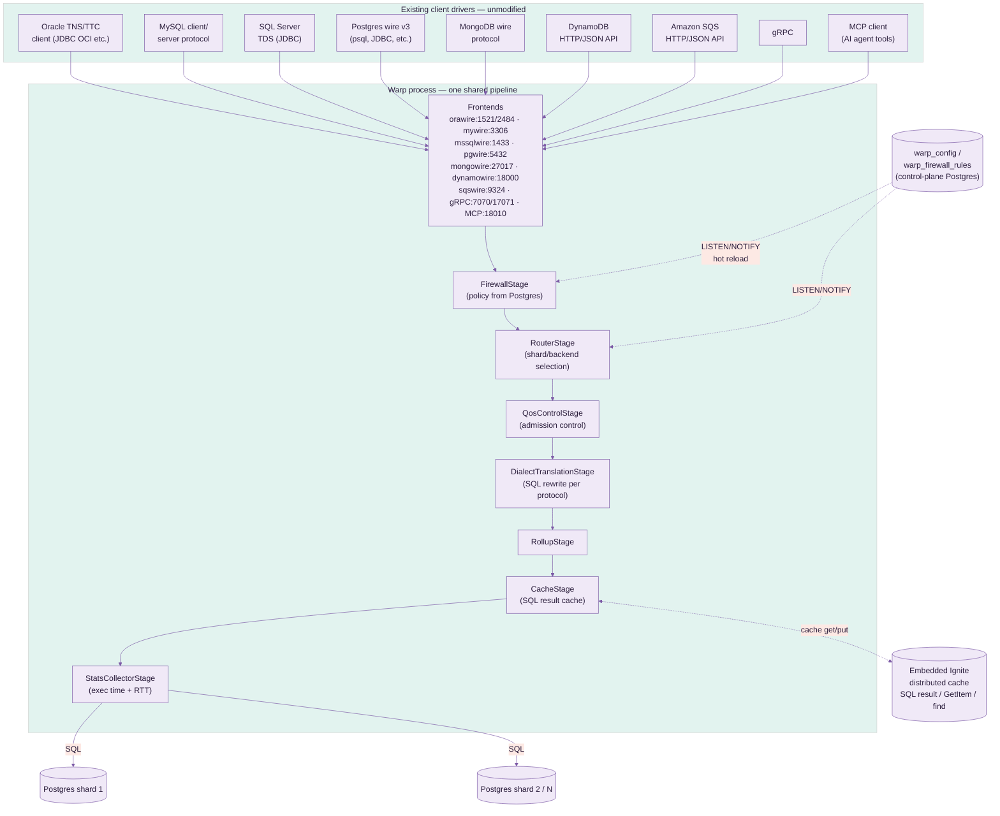
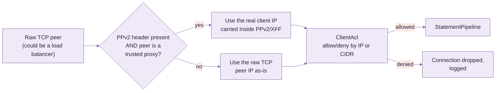
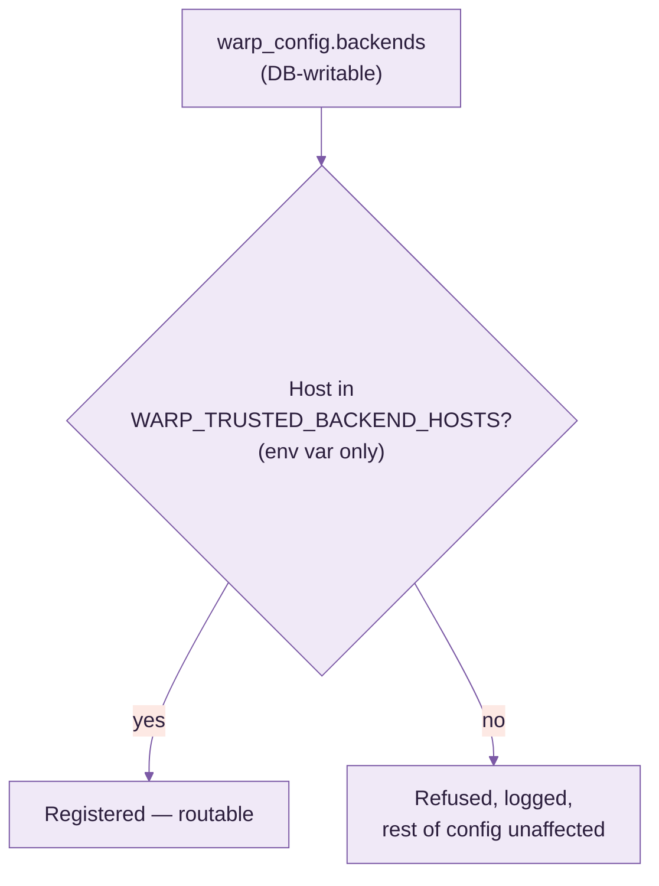
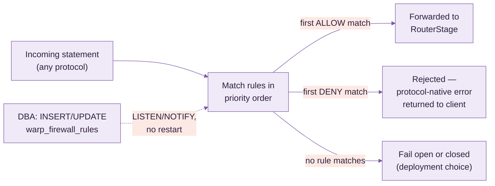
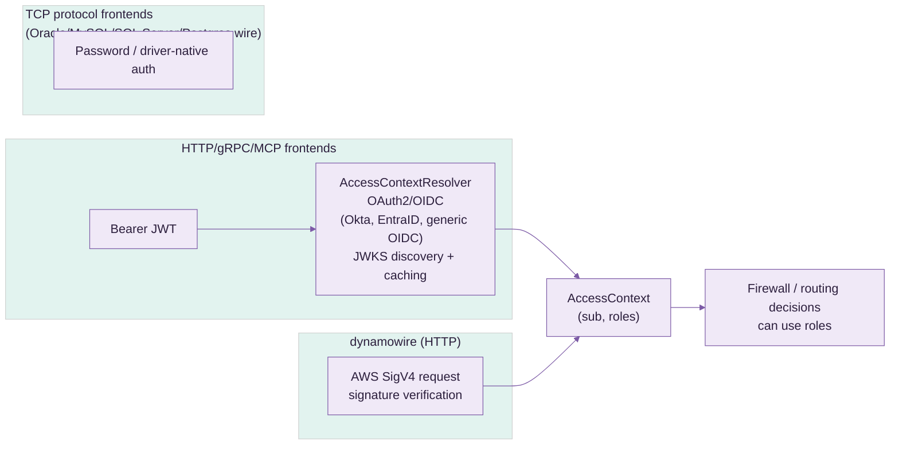
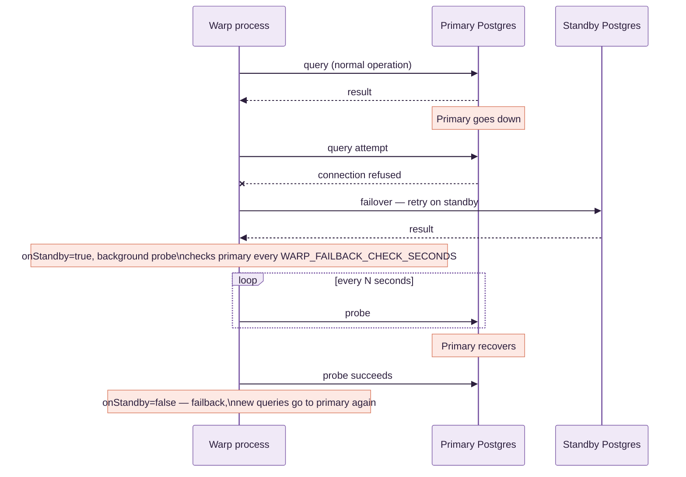
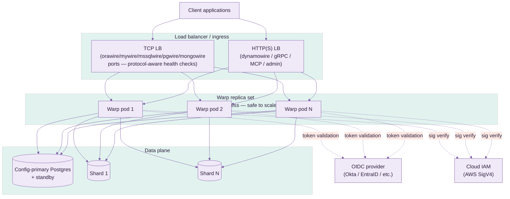

# Warp — Use Case & Deployment Guide

> **This is a technical/internal reference** for operators and contributors — pipeline internals,
> security, HA, deployment. If you're an application team looking to connect to Warp, start
> with [`USER_GUIDE.md`](USER_GUIDE.md) instead.

Warp is a mid-tier database gateway. It speaks Oracle TNS/TTC, MySQL client/server protocol,
SQL Server TDS, Postgres wire protocol v3, MongoDB wire protocol, DynamoDB's HTTP/JSON API,
Amazon SQS's HTTP/JSON API, gRPC, and MCP to clients — by default, translating and routing every
one of them to real Postgres backend(s), the wire-protocol-compatibility path for a pre- or
post-migration cutover (not a schema/data migration tool itself). mywire, orawire, mssqlwire, and
MCP can each also run in **native-backend mode** instead (§8.1.1): no translation at all, proxying
straight through to a real Oracle/MySQL/SQL Server database of your own — for keeping the engine
you already run, not just migrating off it. §4.4 covers a third, independent capability: real
Oracle/SQL Server/MySQL `WARP_BACKENDS` targets that Warp routes plain SQL to, federates `JOIN`s
against, and runs real distributed (XA) transactions across, alongside Postgres.

> **Performance**: every number claimed anywhere in this guide about latency, caching, or RTT is
> backed by a live before/after benchmark against a real client library, documented in
> [`PERFORMANCE.md`](PERFORMANCE.md) — not estimated.

> **On screenshots**: Warp is a headless gateway process — there's no UI to screenshot.
> Its "surface" is protocol traffic and the admin/metrics HTTP endpoint (`:19090`); once you
> have it running (see §4), I can capture the metrics endpoint's live output or a packet-level
> trace if that's useful.

---

## 1. What question it answers

**"Can my existing app, written against an Oracle/MySQL/SQL Server/MongoDB/DynamoDB driver,
talk to Postgres without a rewrite?"** — yes: point the app's connection string at Warp
instead of its original database, and Warp translates and routes to real Postgres.

Run it indefinitely as a permanent compatibility shim (e.g. legacy MongoDB driver code that's
not worth rewriting), or as a temporary cutover bridge while a migration tool moves schema/data
behind the scenes.

---

## 2. Architecture



- **One pipeline, many faces**: every SQL-shaped frontend (Oracle, MySQL, SQL Server, native
  Postgres, gRPC) feeds the *same* `StatementPipeline` instance — firewall, routing, QoS,
  translation, caching, and stats are protocol-agnostic. mongowire/dynamowire/sqswire don't build
  a SQL `Statement` (there's no dialect to translate), so they feed the shared metrics collector
  directly at their own single dispatch choke point instead — same dashboard, same `/api/metrics/
  summary`, different entry point. See §9 for the caching layer and §10 for what gets measured.
- **Config lives in Postgres, not just env vars**: `warp_config` (versioned, insert-only)
  and `warp_firewall_rules` (mutable, DBA-managed) are real tables in a designated
  "config-primary" Postgres. `LISTEN/NOTIFY` pushes changes to every running Warp process
  within milliseconds — no restart to change a firewall rule or add a backend.
- **Config-primary vs. data plane**: the `WARP_*` env vars point at the single Postgres
  that holds control-plane tables. `WARP_BACKENDS` / `WARP_SHARD_BACKENDS` are the
  separate, explicitly-registered data-plane shard targets actual queries are routed to — the
  config-primary is never automatically one of the shards.

---

## 3. Security

### 3.1 ACL (IP / CIDR allowlisting) & PPv2 / X-Forwarded-For



**ACL (`ClientAcl`)** — a plain, ordered allow/deny rule list evaluated per inbound
connection, on every frontend (pgwire, mywire, orawire, mssqlwire, mongowire, gRPC, dynamowire,
MCP, admin/metrics HTTP):

- Rule grammar: `allow <ip-or-cidr>` / `deny <ip-or-cidr>`, one per line/`;`-separated entry —
  e.g. `allow 10.0.0.0/8; allow 192.168.1.50; deny 0.0.0.0/0` (allow the private ranges you
  name, deny everything else).
- Sourced from **either** the env var (`WARP_ACL_RULES`) **or** `warp_config.aclRules`
  — same dual-source convention as every other setting; the DB-stored version hot-reloads via
  `LISTEN/NOTIFY` with zero restart.
- Default (unset) is fully open — no behavior change until you opt in.
- A rejected connection is dropped immediately, before it reaches the firewall/router stages,
  and logged with the offending IP — visible in Warp's own logs for audit.

**PPv2 (PROXY protocol v2) / `X-Forwarded-For`** — solves the problem that, once you put a
load balancer or connection pooler in front of Warp, every connection's raw TCP peer IP
*is the load balancer*, not the real client — so a naive ACL would only ever see one IP.

- `WARP_ACL_PPV2_ENABLED` (or `warp_config.aclPpv2Enabled`) turns on parsing of the
  PPv2 header (binary, used by TCP-level proxies — HAProxy, many cloud NLBs) or the
  `X-Forwarded-For` HTTP header (for the HTTP-based frontends) to recover the real client IP.
- **Trust is opt-in per proxy, not global**: `WARP_ACL_TRUSTED_PROXIES` (or
  `warp_config.aclTrustedProxies`) is a separate IP/CIDR list — the forwarded-IP header is
  only honored when the *direct* TCP peer is itself in this list. Without this check, any
  client could simply forge its own `X-Forwarded-For` header and impersonate an allowlisted IP
  — this is the exact spoofing vector the trusted-proxy check exists to close.
- Typical setup: `WARP_ACL_TRUSTED_PROXIES=10.0.0.0/24` (your load balancer's subnet),
  `WARP_ACL_RULES=allow 203.0.113.0/24` (the actual office/VPN range you want to allow) —
  Warp then correctly evaluates the ACL against the client's real IP even though every
  packet physically arrives from the load balancer.

### 3.2 Backend-poisoning protection

Because `WARP_BACKENDS` can be set via the DB-writable `warp_config` table, anyone
with write access to that table could otherwise register an arbitrary host and have real
client traffic silently routed to it (a config-driven SSRF). `TrustedBackendHosts`
(`WARP_TRUSTED_BACKEND_HOSTS`) closes this:



Deliberately **env-var only, never itself in `warp_config`** — if the allowlist lived in
the same DB-writable surface it gates, the protection would be circular. Entries accept IPs,
CIDR blocks, or literal hostnames (docker-compose service names, internal DNS).

### 3.3 SQL Firewall

Runs as its own pipeline stage (`FirewallStage`), first in line — every statement on every
frontend is checked before routing, translation, or execution. Rules live in a real,
DBA-managed Postgres table, **not** an env var or app config file, so a DBA can change policy
with an `UPDATE`/`INSERT` statement and see it apply in milliseconds, no Warp redeploy.



**Table schema** (`warp_firewall_rules`, auto-created, own `LISTEN/NOTIFY` trigger):

| column | meaning |
|---|---|
| `id` | primary key |
| `priority` | lower evaluates first; first matching rule wins |
| `action` | `ALLOW` or `DENY` |
| `statement_type` | `SELECT` / `INSERT` / `UPDATE` / `DELETE` / `DDL` / `*` (any) |
| `table_pattern` | glob against the target table, schema-qualification optional (`orders` matches both `orders` and `public.orders`) |
| `sql_pattern` | optional raw regex escape hatch — matched against the full SQL text when a table-level rule isn't expressive enough |
| `enabled` | boolean — disable a rule without deleting it |
| `description` | free text, shows up in denial logs |

**Example policy:**

| priority | action | statement_type | table_pattern | description |
|---|---|---|---|---|
| 10 | DENY | DELETE | `*orders*` | block bulk order deletes from any app |
| 20 | DENY | `*` | `*pii_*` | block all access (read or write) to PII-prefixed tables |
| 30 | DENY | `*` | `*` *(sql_pattern: `(?i)DROP\s+TABLE`)* | block DDL drops regardless of table name |
| 100 | ALLOW | `*` | `*` | default allow — everything not matched above |

**Config surface** — configured, like every other feature, from **either**:

- a plain SQL `INSERT INTO warp_firewall_rules (...)` (the intended day-to-day DBA path —
  no application deploy involved at all), or
- the equivalent Postgres stored procedure Warp ships (wraps the same insert/update with
  validation), for teams that prefer calling a procedure over hand-writing DML.

Changes are pushed to every running Warp process instantly via the table's `NOTIFY`
trigger — matches the same hot-reload mechanism used by `warp_config`, `ClientAcl`, and
`TrustedBackendHosts`.

### 3.4 Authentication



- OAuth2/OIDC bearer-token validation for every HTTP-based frontend (gRPC, MCP, admin API),
  with configurable claim mapping (`sub` → user id, custom claim → roles).
- AWS Signature v4 verification for `dynamowire`, opt-in via `WARP_AWS_IAM_CREDENTIALS`.
- TCP wire-protocol frontends (Oracle/MySQL/SQL Server/Postgres) authenticate with the
  client driver's own native password exchange, passed through to the real Postgres backend.

### 3.5 TLS

- `orawire` has a dedicated TLS listener (TCPS, port 2484) alongside plaintext TNS (1521).
- gRPC has a dedicated TLS listener (17071) alongside plaintext (7070).
- All built from one shared keystore — one cert to rotate, not one per frontend.

---

## 4. High Availability

### 4.1 Config-primary failover



- Configured via `WARP_STANDBY_HOST`/`WARP_STANDBY_PORT`. Applies to both the
  control-plane connection (`warp_config`/firewall rules) and, via `BackendTarget`'s
  `failoverOptions`, the actual query-execution path for the synthetic default backend.
- Explicitly-named shard backends (`WARP_BACKENDS`) do **not** get automatic failover — a
  named shard isn't presumed to be a replica pair of another named shard; pair them yourself
  at the infrastructure layer (e.g. a PgBouncer/HAProxy VIP per shard) if needed.
- Failback is automatic, probed in the background (`WARP_FAILBACK_CHECK_SECONDS`, default
  10s) — no manual intervention once the primary recovers.

### 4.2 Sharding / scatter-gather

`WARP_SHARD_BACKENDS` names a subset of the registered backends as a shard group;
`RoutingBackendExecutor` fans a matching query out to all of them and merges results — useful
for read-side aggregate queries across horizontally-partitioned Postgres backends. The protocol
frontends (DynamoDB, MongoDB, SQS, OpenSearch, InfluxDB, S3) now shard across the backends of a backend
set that enable them — see §4.7; `WARP_SHARD_BACKENDS` remains the fallback when no backend enables
the store.

### 4.3 Cross-shard / cross-backend JOIN federation

§4.2's scatter-gather path has a real, silent correctness gap: it broadcasts identical SQL to
every shard and concatenates/merges the results — wrong the instant a `JOIN`'s matching row pair
spans two different shards (never found on either shard alone, and no error raised). Two Calcite
federation engines close this gap by actually planning and executing the `JOIN`, not
broadcast-and-merge:

- **`ShardJoinExecutor`** — Warp's own homogeneous horizontal sharding (the SAME logical
  table split by row across every shard in a `WARP_SHARD_BACKENDS` group). Mounts each
  distinct `schema.table` reference in the query as a real `UNION ALL` across every shard's own
  copy, then hands the rewritten query to a real Calcite planner.
- **`SchemaFederationStage`** — Warp's own heterogeneous vertical/functional sharding
  (`WARP_ROUTER_SCHEMA_RULES` routing a whole table's traffic to one named backend, e.g. every
  `orders_db.orders` query to backend `orders`). Runs *before* `RouterStage` in the pipeline —
  federating across backends has to happen before routing narrows a statement to one target. Each
  matching backend is mounted directly as its own Calcite schema.

Both push predicates/columns down into each shard/backend's own SQL via Calcite's real JDBC
adapter rules (`JdbcRules`) — not a row-pull-and-join-in-Java.

**Real, statistics-driven cost-based planning.** When `StatisticsStore` is configured, every
mounted table is wrapped so Calcite's own join-order cost model sees a real row-count estimate
(Postgres's own `pg_class.reltuples`, the same number the Postgres planner itself already uses —
a single fast catalog lookup, not a `COUNT(*)` scan) instead of `Statistics.UNKNOWN`.
`StatisticsScheduler` proactively refreshes it in the background
(`WARP_STATS_REFRESH_INTERVAL_MINUTES`); a cold cache still gets a real number via an
on-demand probe on the first federated query after startup. TTL-bounded
(`WARP_STATS_TTL_MS`, default 24h) — a stale statistic degrades the cost estimate, never the
correctness of the result.

**Real semi-join pushdown.** Checked first whether Calcite already does this given real
statistics — it doesn't: no Bloom filter concept exists anywhere in Calcite (that's a runtime
technique with no portable way to ship into a remote backend's own SQL), and Calcite's own
semi-join rules can't apply to a federated join either (`JdbcJoinRule` only pushes a join down
when both sides already share one `JdbcConvention` — never true across two different mounted
backends). `SemiJoinPushdown` closes the gap with a real, exact filter instead: when a query is a
single, unambiguous equi-join between exactly two known table references, it collects the
smaller (build) side's real distinct join-key values (capped, `WARP_SEMIJOIN_MAX_KEYS`,
default 20,000) and pushes them down as a real `col IN (...)` predicate on the larger (probe)
side, before that side's own leaf query ever runs. Live-verified against two real Postgres
backends (10-row `customers`, 200,000-row `orders`, ~19,000 actually matching): the larger side's
real, MEASURED row count (not estimated) dropped from 200,000 to ~19,000 with an identical,
correct join result — a genuine ~90% reduction in what crossed the wire. Deliberately
conservative: no confident stats for both sides, an ambiguous `ON` clause, or either known table
reference appearing more than once in the statement (rules out self-joins) all just skip the
optimization — the real join still runs, only without the extra filter, never a wrong answer.

**Real SQL plan cache/history** (`SqlPlanStore`, `WARP_FEDERATION_PLAN_HISTORY=<capacity>` to
enable) — a `V$SQL_PLAN`-style record of every federated query's own real `EXPLAIN PLAN FOR` text,
timing, row count, and success/failure, visible in the admin UI (§11). Per-leaf-scan profiling
(`LeafScanProfiler`) goes further than `EXPLAIN PLAN FOR` (which only ever reports the planner's
own pre-execution ESTIMATE): it re-executes each leaf's own pushed-down SQL separately, with real
wall-clock timing and a real row count from actually iterating the result — the same honest
tradeoff a DBA manually running `EXPLAIN ANALYZE` on a suspect subquery makes.

**Cluster-shared, not just per-instance.** When Warp's embedded Ignite cluster is genuinely
multi-instance (`WARP_CLUSTER_ENABLED=true`, not just the default single-node cache-only
grid), both `StatisticsStore` and `SqlPlanStore` switch to an Ignite-backed shared cache instead
of a local `ConcurrentHashMap` — every instance sees the SAME row-count statistics and the SAME
federated-query plan history, regardless of which instance actually ran each query. Live-verified
with two real, separate JVM processes joining one real Ignite cluster: a plan/stat written by one
process was immediately visible to the other.

**Deliberately narrow scope, still**: a fresh Calcite connection per statement (no connection
cache), no native RLS/VPD session pass-through for the federated connection (`AccessControlStage`'s
own row-filter/column-mask SQL rewriting, run earlier in the pipeline, is the only enforcement),
and a statement referencing more than 2 federated backends in one query falls straight through to
scatter-gather's own broadcast-and-merge behavior, unfiltered.

**Real, declarative per-table sharding (`WARP_TABLE_SHARDS`).** Everything above (`ShardRule`)
needs a client to type a schema-qualifier prefix like `public.` in every query just to opt a
statement into scatter-gather — a real footgun (a client that queries `orders` unqualified, which
is completely normal, silently misses sharding and only ever sees one shard's own data) and not
how a table's own partitioning should actually work: it should be transparent, keyed by the
table's own bare name, with the query planner picking the fastest real path on its own.
`WARP_TABLE_SHARDS` is that: one declaration per table, `table:strategy:column:params`
(`|`-delimited between tables), reusing `ShardingStrategy` (hash/consistent/list/range/date, the
same real strategies `WARP_ROUTER_VALUE_SHARD_RULES` already has) —
`orders:hash:customer_id:shard1,shard2,shard3`. The table's own bare name is matched directly (no
qualifier needed anywhere), and the router picks the real fastest path per statement:

- A query that supplies a real literal value for the declared partition column (`WHERE
  customer_id = 42`) routes straight to the ONE shard `ShardingStrategy#resolve` says owns it —
  no scatter, no merge, same cost as a single-backend query. Same real, disclosed limitation
  `ValueShardColumnRule` already has: a client that BOUND the value as a parameter instead of a
  literal isn't detected this way (no real SQL parser threading bind positions back to column
  names) and just falls through to the path below instead — correct, not the fastest available.
- A query that doesn't (a full-table aggregate, or a `JOIN` of two declaratively-sharded tables)
  transparently falls back to scatter-gather (or a real federated `JOIN`, `ShardJoinExecutor`)
  across exactly THIS table's own declared shard set (`ShardingStrategy#allBackends`) — which can
  be a different subset of backends than any OTHER declaratively-sharded table uses, unlike
  `ShardRule`'s one shared `registry.shardGroup()`.

`WARP_ROUTER_SHARD_TABLES`/`WARP_ROUTER_VALUE_SHARD_RULES` keep working unchanged for
anyone not migrating — this is additive, not a replacement. Real vertical/functional sharding
(a whole table routed to one specific backend, no partitioning) is unaffected too; that's still
`WARP_ROUTER_SCHEMA_RULES` (§4.3's own `SchemaFederationStage`), a real, already-correctly-
scoped mechanism this doesn't duplicate.

**Named backend sets (`WARP_BACKEND_SETS`).** A `hash`/`consistent` params field above is
just a flat backend list typed out by hand every time — fine for one rule, tedious and
error-prone across several, and there's nowhere to give that set a name. `WARP_BACKEND_SETS`
is that: `name=backend1,backend2,...` entries, `|`-delimited (same convention
`WARP_TABLE_SHARDS` uses), each member checked against the real registered backend list at
config-load time — a typo fails loud at startup/reload, not silently at the first statement that
hits it. A set can mix engines freely: `all-engines=pg,ora,mysql,mssql,mongo` names a Postgres,
an Oracle, a MySQL, a SQL Server, and a MongoDB backend together. Reference the set's name
anywhere a `hash`/`consistent` backend list is otherwise expected —
`orders:hash:customer_id:all-engines` in `WARP_TABLE_SHARDS`, or as the params field of a
`WARP_ROUTER_VALUE_SHARD_RULES` entry — and `RouterStage` expands it to the set's members
(`BackendRegistry#backendSets`); a plain backend name alongside a set name in the same field
still works unchanged and de-duplicates against the set's own members. `list`/`range`/`date`
strategies name exactly one backend per value/range entry, not a flat set, so set expansion
doesn't apply there. Manage sets from the admin console's Backend sets page, or `PUT
/api/config` with a `backendSets` field, same as any other config.

### 4.4 Multiple backend engines (top-5-by-DB-Engines-ranking, alongside Postgres)

Warp used to be Postgres-only end to end, by explicit design (`BackendRegistry`/
`BackendConnectionPools`/`BackendTarget` all assumed it). **Oracle, SQL Server, and MySQL/MariaDB
are now real second/third/fourth backend engines** — not just something orawire's/mssqlwire's/
mywire's own wire-protocol frontends decode against, but real `WARP_BACKENDS` targets Warp
connects to, routes plain SQL to (read AND write), federates `JOIN`s against (§4.3), and
coordinates real `XAResource`-based 2PC transactions with (Oracle and SQL Server; MySQL's own
driver has no support for the 2PC path specifically — see below).

**`BackendDriverRegistry`** is the one place a real driver class gets chosen from a
`BackendTarget`'s own `jdbcUrl` prefix — `ShardJoinExecutor`, `SchemaFederationStage`,
`RollupStage`, and `BackendConnectionPools` all dispatch through it instead of each hardcoding
`"org.postgresql.Driver"`. **`XaBackendFactory`** dispatches separately (a backend can be a fine
plain read/write or federation target without being a real XA participant) — every one of Postgres,
Oracle, SQL Server, and MySQL gets a real, vendor-provided `XADataSource` implementation
(`PGXADataSource`, `OracleXADataSource`, `SQLServerXADataSource`, `MysqlXADataSource`), the same
real, proven shape the sibling Omnigate project uses for its own Postgres/Oracle pair.

**Live-verified against real instances of all three new engines**, with real bugs found and fixed
along the way — this project's own established discipline, not a claim taken on faith:

- Plain routed `SELECT`/`INSERT` against Oracle, SQL Server, and MySQL all worked through the
  existing, previously Postgres-only `RoutingBackendExecutor`/`JdbcBackendExecutor` path with
  **zero code changes** to that layer — plain JDBC `PreparedStatement`, no Postgres-specific SQL.
- A real cross-engine `JOIN` — Postgres `orders_db.orders` (~200 real, skewed rows) `JOIN` a
  10-row `customers_db.customers` table — returned correct, exact per-customer counts against
  **each** of Oracle, SQL Server, and MySQL in turn. Real bugs found and fixed getting there:
  1. `BackendConnectionPools` hardcoded `"org.postgresql.Driver"` unconditionally — crashed
     HikariCP pool creation for any non-Postgres URL. Now dispatches through
     `BackendDriverRegistry`.
  2. Oracle folds an unquoted schema/user name to UPPERCASE in its own catalog (Postgres folds to
     lowercase, SQL Server/MySQL preserve case as typed) — Calcite's backend-side table lookup
     needs that real casing even though the client's own SQL can still reference the schema in
     whatever case it likes (`BackendDriverRegistry.realCatalogSchemaName`).
  3. `BackendConnectivityTest`'s health-check probe used `SELECT version()` unconditionally (a
     Postgres — and, coincidentally, real MySQL — function) — marked a healthy Oracle/SQL Server
     backend DOWN with a real syntax error. Now dialect-aware (`v$version` for Oracle,
     `@@VERSION` for SQL Server).
  4. `DialectTranslationStage` had never had SQL Server as a translation *target* before — its
     `RENDERERS` table had no entry for it at all, forcing even a plain ANSI `INSERT`/`SELECT`
     into an (unconfigured) LLM fallback. Added a real `renderSqlServer`, handling `LIMIT n` →
     `OFFSET 0 ROWS FETCH NEXT n ROWS ONLY` the same way the existing `renderOracle` handles
     `LIMIT n` → `FETCH FIRST n ROWS ONLY`.
  5. A JDBC URL containing a literal `;` (SQL Server's own property separator, e.g.
     `;databaseName=x;encrypt=false`) collided with `WARP_BACKENDS`' own `;`-delimited entry
     separator — silently truncated the URL. The existing `%3B` escape (already documented for
     this exact reason) fixes it; a real, easy-to-hit config trap for any semicolon-bearing JDBC
     URL, not SQL-Server-specific.
  6. `TrustedBackendHosts.isTrusted()` only ever recognized `jdbc:postgresql:` URLs — with
     `WARP_TRUSTED_BACKEND_HOSTS` enabled, every other real engine's own URL shape returned
     "not trusted" (silent, full refusal), defeating the whole feature for a non-Postgres backend.
     Extended to recognize Oracle's `thin:@//host:port` shape and the plain `host:port`-style URLs
     SQL Server/MySQL/MariaDB use.
- An unbounded Oracle `NUMBER` column (no explicit precision) makes Calcite reject the plan
  outright (`DECIMAL precision 0 must be between 1 and 19`) — a real, disclosed limitation:
  Oracle tables federated into a `JOIN` need an explicit `NUMBER(p[,s])` precision today, not the
  common unconstrained-`NUMBER` idiom.
- Real, full 2PC — one client `BEGIN`/`COMMIT` touching both a real Postgres backend and a real
  Oracle **or** MySQL backend genuinely prepared and committed atomically across both engines.
  MySQL's own real, Oracle-published Connector/J ships a real `MysqlXADataSource` and it actually
  works end to end — a genuine improvement over the sibling Omnigate project's own broader
  "MySQL/MariaDB has no usable XADataSource" finding, which was specifically about the *MariaDB*
  driver, a different vendor's implementation. **SQL Server's own XA path is real code, but not
  live-verified working** — a fresh SQL Server instance needs the driver's own `sqljdbc_xa`
  MSDTC support procedures (`xp_sqljdbc_xa_init_ex` etc.) installed server-side before any XA
  transaction can even start, a genuine Microsoft-documented prerequisite this project's own test
  instance (a Linux-based Azure SQL Edge container) doesn't have installed and — being a
  reduced-feature SQL Server variant on Linux, with no native MSDTC service — may not support at
  all; a real, disclosed gap, not assumed away.
- Real, standard operational prerequisites had to be met before Postgres/Oracle 2PC worked at all
  (neither is a Warp bug): Postgres's own `max_prepared_transactions` defaults to 0 (2PC is
  off until an operator raises it), and Oracle requires an operator grant on
  `DBA_2PC_PENDING`/`PENDING_TRANS$`/`DBMS_SYSTEM` before any schema can participate in a
  distributed transaction at all — undocumented anywhere in this project until now, worth calling
  out explicitly for anyone deploying this for real.

**MongoDB was attempted and reverted — a real, unresolved blocker, not started work.** MongoDB
isn't JDBC/SQL at all, so the JDBC-based approach above doesn't apply; the real path tried was
Calcite's own `calcite-mongodb` adapter (mounting a real MongoDB database as a Calcite schema, the
same real mechanism used for every JDBC engine). It hit a genuine, verified binary-incompatible
version conflict: `calcite-mongodb:1.42.0` is compiled against `mongodb-driver-sync:4.10.2`
(confirmed directly from its own real `pom.xml`), but this project's own `mywire`/`mongowire`
compatibility work already requires `mongodb-driver-sync:5.5.1` (documented lockstep-version
requirement with `bson`, elsewhere in `pom.xml`) — connecting real Mongo 7 to a `MongoSchema`
built this way throws a real `NoSuchMethodError` (`MongoDatabase.listCollectionNames()`, a method
whose signature changed across that major version gap) the moment Calcite tries to list the
database's own collections. Downgrading the driver project-wide would regress `mongowire`'s own
real, tested functionality; there's no supported way to run two major versions of the same driver
in one shaded jar. Real follow-up options, none attempted yet: a newer `calcite-mongodb` release
built against a 5.x driver (would mean upgrading `calcite-core` project-wide too — a much larger,
riskier change given how much of §4.3's own federation work depends on today's pinned 1.42.0
behavior), or a hand-written MongoDB executor bypassing Calcite's adapter entirely.

### 4.5 Non-SQL protocol storage: backend-engine prerequisites and limitations

`dynamowire`, `influxwire`, `sqswire`, and the Bolt/Cypher graph frontend (`boltwire`) don't speak
SQL to their clients, but every one of them stores its own data as real SQL underneath, in a real
backend — `PgItemStore`, `PgTimeSeriesStore`, `PgQueueStore`, `PgGraphStore`. §4.4 above is about
letting *SQL-speaking* clients (pgwire/orawire/mywire/mssqlwire) reach a non-Postgres backend; this
section is about whether these *other four* protocols' own storage can too — a genuinely different
question, since each one owns its own schema and query logic rather than just passing through
whatever SQL a client sent.

**Real DDL, no longer hardcoded in Java.** Every one of these stores used to build its own
`CREATE TABLE`/`CREATE INDEX` text as inline Java string literals — real engine differences had
nowhere to live but a pile of if/else branches inside otherwise storage-logic-only methods. DDL
now lives in `Warp/src/main/resources/ddl/<engine>/<name>.sql` (`postgres`/`oracle`/`sqlserver`/
`mysql`), loaded and parameterized (`${table}`) at runtime by `DdlTemplates` — a real, engine-keyed
directory, not a config format for its own sake: `BackendDriverRegistry.engineDirFor`-equivalent
dispatch (`DdlTemplates.engineDirFor`) picks the right file from a `BackendTarget`'s own `jdbcUrl`,
the same real dispatch shape §4.4's `BackendDriverRegistry` already uses for driver classes.

**Only two of the four can even reach a non-default backend today.** `PgItemStore` (dynamowire)
and `PgQueueStore` (sqswire) both support real shard routing (`WARP_SHARD_BACKENDS` — hashing
by DynamoDB partition key / SQS queue name, same as real DynamoDB/SQS partitioning), so a shard
group member CAN be an Oracle/SQL Server/MySQL backend. `PgTimeSeriesStore` (influxwire) and
`PgGraphStore` (boltwire) only ever call `backendRegistry.resolveForRouting(DEFAULT_BACKEND_NAME)`
— no sharding at all — and the default backend doubles as Warp's own control-plane connection
(`warp_config`, `warp_firewall_rules`, `LISTEN/NOTIFY`), which has to stay Postgres. Adding
real shard routing to these two is a real, scoped, not-yet-started follow-up — until then, their
own storage is Postgres-only regardless of what other backends are configured.

**Live-verified, real per-engine status, table DDL vs. query logic kept separate on purpose** —
DDL portability and query portability are genuinely different problems, and this project only
solves what it's actually solved, not by engine-level vibes:

| Store | Protocol | Can target a non-default backend | Table DDL | Query logic (INSERT/SELECT/UPDATE) |
|---|---|---|---|---|
| `PgItemStore` | dynamowire | Yes (`WARP_SHARD_BACKENDS`) | **Real DDL for all 4 engines**, live-verified (`CreateTable` actually succeeds against real Oracle/SQL Server/MySQL instances) | Postgres-only (`ON CONFLICT`, `::jsonb` casts — a real, live-confirmed failure on MySQL: `PutItem` still fails past `CreateTable`) |
| `PgTimeSeriesStore` | influxwire | No (default-backend only) | Real DDL exists for all 4 engines (each engine's own `CREATE TABLE ddl/<engine>/influxwire_measurement_table.sql`, live-verified directly against real Oracle/SQL Server/MySQL) but unreachable in practice until shard routing is added | Postgres-only (`->`/`->>` jsonb operators, `date_bin()`) |
| `PgQueueStore` | sqswire | Yes (`WARP_SHARD_BACKENDS`) | **Real DDL for all 4 engines**, live-verified | **Real query support for all 4 engines**, live-verified end to end — CreateQueue, SendMessage, ReceiveMessage (including FIFO group-exclusion and dedup), DeleteMessage, ChangeMessageVisibility, GetQueueAttributes, DeleteQueue, against real Oracle/SQL Server/MySQL instances |
| `PgGraphStore` | Bolt/Cypher graph frontend | No (default-backend only) | Postgres-only — the `labels TEXT[]` array column has no cross-engine equivalent at all; a real port needs a schema redesign (JSON array column or a normalized join table), not a syntax swap | Postgres-only |

**Real bug found and fixed along the way**: `PgItemStore.createTable()` used to write its own
catalog metadata row (`_dynamo_tables`) *before* attempting the real backend `CREATE TABLE` — a
DDL failure on the real backend (the MySQL `jsonb`-syntax failure that motivated this whole
section, but just as real for a plain transient Postgres failure) left the metadata row committed
and orphaned, so every later `CreateTable` for that same name permanently, incorrectly reported
`ResourceInUseException` ("already exists") instead of the real cause — confirmed live: the client
only ever saw a misleading result from boto3's own automatic retry of the original failed call.
Physical DDL now runs first; the catalog row is only written once the real table genuinely exists.

**Real, disclosed engine-specific DDL quirk, found live**: Oracle treats an empty string (`''`) as
`NULL` — dynamowire's own "no sort key" convention (`sk_value` defaults to `''`) would violate the
item table's own `PRIMARY KEY (pk_value, sk_value)` `NOT NULL` requirement the instant such an item
reached Oracle (confirmed live: `ORA-01400`). The table DDL itself is real and correct — verified
with a non-empty `sk_value` — but a real fix for the empty-sort-key case needs a non-empty sentinel
value on Oracle specifically, not attempted here.

**sqswire is now a genuinely portable queue, not just DDL** — designed deliberately, not by
mechanically translating Postgres syntax. Each engine's own real idiomatic queue mechanism was
researched before writing any code (Oracle's own JDBC driver really does support a real
single-statement `RETURNING INTO` via `OraclePreparedStatement.registerReturnParameter`, and SQL
Server has a real, first-class `OUTPUT` clause equivalent to `RETURNING` — but adopting either
would mean a real, separate engine-specific Java code path). The deliberate design instead: keep
Postgres's own single-statement `UPDATE ... WHERE msg_id = (SELECT ... FOR UPDATE SKIP LOCKED)
RETURNING ...` claim untouched, and give Oracle/SQL Server/MySQL one shared, real, portable
**two-statement** claim (`SqswireDialect`) — a `SELECT ... FOR UPDATE` with each engine's own real
lock-skip hint (`FOR UPDATE SKIP LOCKED` for MySQL/Oracle, `WITH (ROWLOCK, READPAST, UPDLOCK)` for
SQL Server) to find and lock a candidate row, then a plain `UPDATE ... WHERE msg_id = ?` to claim
it — both in one real transaction on the same connection. One extra real round trip per claim on
those three engines versus Postgres's own single statement, a disclosed tradeoff for a uniform
code path, not a hidden cost. Insert-id capture (`SendMessage`) uses the standard portable JDBC
`getGeneratedKeys()` API instead of `RETURNING`, real and simple across all three.

Real, live-verified end to end against real Oracle, SQL Server, and MySQL instances — CreateQueue,
SendMessage (real `AUTO_INCREMENT`/`IDENTITY` ids), ReceiveMessage (including real FIFO
group-exclusion and dedup-window logic, not just plain-queue claiming), DeleteMessage,
ChangeMessageVisibility, GetQueueAttributes counts, and DeleteQueue/recreate — with real bugs found
and fixed along the way:

- **Oracle's own `Statement.RETURN_GENERATED_KEYS`** returns a `ROWID`, not the real generated
  column value, unless the generated column is named explicitly — the generic JDBC flag produced a
  real `ORA-17132: Invalid conversion requested` the moment the code tried to read it as a `long`.
  Fixed by using the real, standard `prepareStatement(sql, String[] columnNames)` overload instead
  (portable JDBC API, not Oracle-specific — harmless and equally correct on MySQL/SQL Server too).
- **Oracle rejects `ORDER BY ... FETCH FIRST n ROWS ONLY FOR UPDATE` outright** (`ORA-02014`) — and,
  found live right after switching to the textbook pre-`FETCH FIRST` `ROWNUM`-filtered-subquery
  idiom, that ALSO fails with the identical `ORA-02014`, since that subquery still carries the same
  `ORDER BY`. The real, actually-working idiom (confirmed against real Oracle community reports of
  the same wall): pick the target row's own `ROWID` through an `ORDER BY`-bearing view with NO
  `FOR UPDATE` on it at all, then a separate outer query — a trivial `ROWID` equality lookup, no
  `ORDER BY` of its own — is what actually carries `FOR UPDATE SKIP LOCKED`.
- **A real, pre-existing, non-engine-specific bug**, found live testing `DeleteQueue`+recreate: the
  `tableEnsured` per-(queue,backend) cache was only ever set, never invalidated on `DeleteQueue` —
  recreating a queue right after deleting it silently skipped `CREATE TABLE` on the next
  `SendMessage`, since the cache still thought the just-dropped table existed, producing a real
  "relation/object does not exist" failure instead of transparently recreating it. This bug existed
  on Postgres too, before this work — just never live-tested this specific sequence before now.

**TimescaleDB is a real, optional Postgres extension, not a hard requirement** — `PgTimeSeriesStore`
detects it (`SELECT 1 FROM pg_extension WHERE extname = 'timescaledb'`) and only calls
`create_hypertable(...)` when it's actually installed; without it, `influxwire` still works
correctly against plain Postgres, just without chunked partitioning/retention-deletion performance
(every write/query path — including the `date_bin()`-based time-bucketing aggregation — is
byte-for-byte identical between the hypertable and plain-table paths by design). This capability
has no equivalent at all on Oracle, SQL Server, or MySQL — none of the three expose a matching
`create_hypertable()`-style call (all three DO have their own native table partitioning, but
wiring that in is a separate, from-scratch feature, not a substitution for TimescaleDB's own real
mechanism); once influxwire gains real shard routing, those three engines' own measurement tables
will simply stay plain tables permanently, the same real, already-proven-safe fallback behavior
Postgres itself gets without the extension.

### 4.6 Multi-AZ distributed cache

The distributed cache (Ignite, `com.sayonora.wire.cluster.WarpCluster`) is cloud-native and
AZ-aware: cluster discovery via `WARP_CLUSTER_DISCOVERY=static|s3|gcs|azure` (not just a
static IP list), a configurable backup count (`WARP_CLUSTER_CACHE_BACKUPS`, default 1) whose
placement is AZ-aware — a cache entry's backup never lands on a node in the same
`WARP_AVAILABILITY_ZONE` as its primary, live-proven by
`WarpClusterAzBackupPlacementTest` (three real Ignite nodes, not a simulation) — and TLS
between cache nodes via `WARP_TLS_KEYSTORE`, live-verified both positive (two nodes on the
same keystore form one cluster) and negative (a third node on a different keystore fails the
handshake and never joins).

What's still genuinely open: the S3/GCS/Azure discovery finders are verified against the real
Ignite classes but not yet exercised against real cloud storage (no cloud credentials available
to test with in this environment — static discovery is the only mode live-tested end to end), AZ
is operator-supplied rather than auto-detected from cloud instance-metadata, and split-brain
behavior under a network partition is unaddressed (backup placement guarantees each AZ *would*
hold a full copy if reachable, not that reads stay consistent during a partition).

---

### 4.7 Backend sets and enabled stores

**Every backend belongs to a backend set, and a Postgres backend can host protocol stores.** This is
the one place backends are added, edited and removed (Admin UI → *Backend sets*, or the admin API
below).

**One concept, one name.** Warp used to have two look-alikes: `WARP_BACKEND_GROUPS` (every backend in
exactly one group; what an MCP scope `group:<name>` names) and `WARP_BACKEND_SETS` (named lists a
backend may appear in several of, used inside router rules). The user-facing **backend set** is the
first: a set has a name and an optional description, and every backend is in exactly one. A backend
with no declared group lives in the implicit set `default`, so **an existing config needs no migration
and behaves exactly as before** (`default` is the set holding the `default` backend). The older
multi-membership `WARP_BACKEND_SETS` is unchanged, is now called *router aliases*, and is edited under
"Advanced" on the Backend sets page.

**Enabled stores.** A Postgres backend can be asked to *host* any of `influxdb`, `mongodb`, `sqs`,
`neo4j`, `opensearch`, `dynamodb`, `s3`. Enabling a store on a backend means:

* Warp creates that protocol's schema **in that Postgres**, idempotently, before the change is
  saved (fixed catalog/graph tables, plus a `warp_enabled_stores` marker table; per-collection tables
  such as Mongo collections, Influx measurements, OpenSearch indexes, DynamoDB item tables and SQS queue
  tables are created on first use on every host). If the schema cannot be created the request fails
  and nothing changes.
* The protocol frontend reads and writes there instead of the hard-wired `default` backend, and MCP
  lists the store as a typed store of the backend (§8.5.2).
* Only Postgres backends may enable stores; anything else is rejected with HTTP 400.
* **Disabling never drops data.** Warp stops serving the store; the tables and rows stay in that
  database. (There is deliberately no purge switch: drop the tables yourself if you want them gone.)

**Which set does a frontend serve?** The set that holds the `default` backend, unless a per-frontend
setting names another set:

| Setting | Frontend |
|---|---|
| `WARP_DYNAMOWIRE_SET` | DynamoDB (`dynamodb`) |
| `WARP_SQSWIRE_SET` | SQS (`sqs`) |
| `WARP_MONGOWIRE_SET` | MongoDB (`mongodb`) |
| `WARP_INFLUXWIRE_SET` | InfluxDB (`influxdb`) |
| `WARP_OSWIRE_SET` | OpenSearch (`opensearch`) |
| `WARP_BOLTWIRE_SET` | Neo4j (`neo4j`) |
| `WARP_S3WIRE_SET` | S3 (`s3`) |

A store enabled on a backend in a set the frontend does not serve is reported as `servedFromThisSet:
false` and does nothing. **A store enabled on no backend keeps its previous behavior** (the `default`
backend, or the `WARP_SHARD_BACKENDS` group for DynamoDB/MongoDB/SQS/OpenSearch), which is why
single-backend deployments are unchanged.

#### Sharding across the backends of a set

When several backends of the set enable the same store, the frontend **shards across them**, using the
same hash machinery as `WARP_SHARD_BACKENDS` (`ShardingStrategy.hash` over the enabled backends in the
order they were declared in `WARP_BACKENDS`; the mapping of a key is stable as long as that host list
is unchanged). With one enabled backend all data lives there.

| Store | Shard key | Point operations | Scatter-gather (merged) | Not supported on several hosts |
|---|---|---|---|---|
| DynamoDB | table + partition key | PutItem, GetItem, UpdateItem, DeleteItem, Query on the table or an LSI | Scan and parallel Scan (exact global `(pk, sk)` order, so `Limit`/`ExclusiveStartKey` pagination is exact), GSI Query/Scan (k-way merge in index order), item and index counts, TTL sweep, PartiQL SELECT, ListTables (catalog on the first host); table/index DDL (CreateTable, UpdateTable) runs on every host | a `TransactWriteItems` spanning hosts commits one database transaction per host after locking and validating everything (see *The DynamoDB store*); a host failing at commit time after another committed leaves a partial transaction |
| MongoDB | collection + `_id` | insert, find/update/delete by `_id` | find, count, distinct, `updateOne`/`deleteOne` (exactly one document in total), `$group` with `$sum`/`$min`/`$max`/`$avg` (partials merged exactly, then `$sort`/`$limit`) | `aggregate` with `$sort`/`$limit` and no `$group` (a clear error) |
| SQS | queue name | a queue **lives wholly on one host**, so send/receive/visibility/FIFO ordering are exactly the single-host behavior | ListQueues (catalog on the first host) | dead-letter redrive between queues on different hosts is a best-effort two-step move |
| InfluxDB | measurement + full tag set (one series never splits) | line-protocol writes | every InfluxQL statement: each host returns the raw points the query needs (time range and tag equality pushed down to SQL), the points are merged and evaluated once, so **every** function is exact across shards -- count/sum/min/max/mean and also median, percentile, mode, stddev, spread, distinct, top/bottom, integral, derivative, moving_average, GROUP BY time with fill(); LIMIT/OFFSET/ORDER BY apply after the merge; DELETE / DROP SERIES / DROP MEASUREMENT / DROP DATABASE run on every host (catalog on the first host) | a write batch spanning hosts is applied host by host; if one host fails the error names the points that were **not** written (see *The InfluxDB store*) |
| OpenSearch | index + `_id` | index/get/update/delete/bulk/`_mget` by `_id` | the full search surface (query DSL, sort, `from`/`size`, `search_after`, scroll, aggregations, k-NN and hybrid) is evaluated over the documents of every host, so results and aggregations are exact; relevance is scored per host (see *The OpenSearch store*) | scroll and point-in-time contexts live in the memory of the Warp node that created them |
| S3 | bucket + object key | PutObject, GetObject (Range), HeadObject, DeleteObject, tagging, ACLs, versions (a key and all its versions live on one shard), CopyObject within a shard, multipart incl. ListParts/UploadPartCopy (an upload lives wholly on the shard owning its key) | ListObjects v1/v2 and ListObjectVersions / ListMultipartUploads (k-way merge in key order; common prefixes de-duplicated), ListBuckets and CreateBucket/DeleteBucket and every bucket configuration document (bucket catalog on the first host), DeleteObjects (grouped by shard), CopyObject across shards (streamed through Warp) | see *The S3 store* below |
| Neo4j | — | — | — | **not sharded** (below) |

`BatchWriteItem` is not atomic (as in real DynamoDB): on several hosts a write that fails on its host is
returned in `UnprocessedItems` for the client to retry instead of failing the whole call.

**Neo4j: one backend per set.** The graph store (`warp_graph_nodes`/`warp_graph_edges`) cannot answer
traversals correctly when nodes and relationships are spread across several databases, so enabling Neo4j on
a second backend of the same set is rejected with a validation error that says why. This is the one
exception to "several hosts ⇒ sharding". A different set may host Neo4j on its own backend.

**Neo4j / Bolt (`boltwire`) in detail.** The official Neo4j drivers connect to `WARP_BOLTWIRE_PORT` (7687).

- *Protocol*: Bolt 5.0-5.4 and 4.4 (highest offered wins), HELLO/LOGON/LOGOFF (no authentication is performed),
  RUN, PULL/DISCARD with `n` and `qid`, BEGIN/COMMIT/ROLLBACK, RESET (FAILED-state IGNORED semantics), ROUTE (a
  routing table pointing at the address the client used, so `neo4j://` works), TELEMETRY, GOODBYE, chunked messages;
  the server agent is `Neo4j/5.26.30`. PackStream: every value type (int64, floats incl. NaN/Inf, bytes, unicode,
  lists, maps, Node/Relationship/Path with 4.x and 5.x layouts, Date/Time/LocalTime/DateTime/LocalDateTime/Duration,
  Point2D/3D).
- *Cypher*: a real parser, compile-time semantic analysis (Neo4j's SyntaxError family: undefined variables, type
  conflicts, ambiguous aggregation, clause composition ...) and an executor over the graph tables. Supported:
  MATCH / OPTIONAL MATCH (labels, properties, directions, type alternatives, variable-length paths, path variables,
  shortestPath / allShortestPaths, relationship uniqueness), WHERE (all predicates, pattern predicates, EXISTS/COUNT/COLLECT
  subqueries), WITH / RETURN (DISTINCT, ORDER BY, SKIP, LIMIT, aggregation incl. percentiles and stDev), UNWIND, UNION
  [ALL], CALL {} subqueries, CREATE, MERGE (ON CREATE / ON MATCH), SET (`=`, `+=`, labels), REMOVE, DELETE / DETACH DELETE,
  FOREACH, CASE, list / map / string / math / temporal (`date`, `time`, `datetime`, `localtime`, `localdatetime`,
  `duration`, truncation, arithmetic) / point functions, comprehensions, quantifiers, `reduce`, map projections.
  Parameters (`$param`) of every type. Procedures: `db.labels`, `db.relationshipTypes`, `db.propertyKeys`, `dbms.components`
  and a few more; `SHOW INDEXES|CONSTRAINTS|PROCEDURES|FUNCTIONS|DATABASES`.
- *Transactions*: auto-commit statements run in one backend transaction each; `BEGIN` pins one backend connection until
  COMMIT / ROLLBACK / RESET / disconnect (see 4.8 "Connection multiplexing"); a failed statement rolls the transaction
  back like Neo4j. Read-only statements run lazily at PULL (runtime errors surface there), updating ones at RUN.
- *Schema*: `CREATE CONSTRAINT ... REQUIRE ... IS UNIQUE` (a real unique partial index; violations are
  `Neo.ClientError.Schema.ConstraintValidationFailed`), `CREATE INDEX` (range / text; composite), `DROP`, `IF [NOT] EXISTS`.
- *Verified against real Neo4j 5.26*: the openCypher TCK (3,810 scenario instances that pass on real Neo4j all pass on
  Warp; error scenarios must return the same status code) and a ~950-case differential corpus replayed from recorded golden
  answers (`Warp/tests/python/bolt_conformance/`, `test_boltwire_conformance.py`).
- *Differences from Neo4j*: property key order follows jsonb (length, then alphabetical) instead of creation order;
  node deletions are checked at the end of each statement, not at commit; data and schema changes may share a
  transaction; `valueType()` prints `LIST<ANY>` for heterogeneous lists and `ANY` for byte arrays; the `system` database and
  security commands (users, roles, `SHOW CURRENT USER`) do not exist; an unmatched Bolt `db` name goes to the default backend
  unless strict routing rejects it. The full list is `bolt_known.py`.
- *Not supported* (clear Neo4j-style errors): full-text and vector indexes, relationship-property indexes and constraints,
  property-existence / node-key / property-type constraints (Enterprise features), APOC, GDS, `LOAD CSV`, `CREATE DATABASE`
  and other multi-database administration, cluster routing beyond a single-member table, EXPLAIN / PROFILE plans, user
  procedures. The graph lives on one Postgres backend (it is not sharded).
- *Implementation note*: Cypher is interpreted in Java over row sets; only label scans, scalar property equality and
  one-hop expansions are pushed to SQL (jsonb containment, `(from_id, type)` indexes). Very large traversals are therefore
  slower than in Neo4j.

#### Adding a backend does not rebalance

Adding a host (or enabling a store on one more backend) changes the host list, so keys re-hash over the
new list. **Warp does not move existing data.** The write/patch/delete response lists every affected store
in `rebalanceRequired` (`store`, `before`, `after`, `message`), the UI shows it as a warning, and Warp
logs it. Data written before the change stays where it was written and is no longer found for keys that now
hash elsewhere until it is copied to the host they hash to. What to do: enable the store on the extra
backend **before** the store has data; or copy the rows yourself (each store's tables have the same name
and shape on every host: `dynamo_item_<table>`, `sqs_queue_<queue>`, `"<db>"."<collection>"`,
`warp_influx_<measurement>`, `warp_search_<index>`, `warp_s3_objects`/`warp_s3_chunks`), moving each key to the host `ShardingStrategy.hash`
picks. Removing a host has the same effect. The catalogs (`_dynamo_tables`, `sqs_queues_catalog`) live on
the **first enabled host in declaration order**; keep it first.

#### Admin API

All calls take the admin bearer token, return JSON, and persist as a new `warp_config` version that every
Warp instance hot-reloads over `LISTEN/NOTIFY` (`backendStores` and `backendSetNames` sit next to
`backends`/`backendGroups`; `WARP_BACKEND_STORES=pg2=mongodb,sqs|default=dynamodb` and
`WARP_BACKEND_SET_NAMES=a,b` are the env spellings). The raw `PUT /api/config` route still works but
runs the same store validation.

| Call | Purpose |
|---|---|
| `GET /api/backend-sets[?health=true]` | Every set with its backends: `name`, `type`, `family`, masked `url`, `description`, `enabledStores`, `canHostStores`, `state`, `health` (live connectivity probe with `health=true`), plus per set `stores` (`hosts`, `sharded`, `servedFromThisSet`) and the store catalog |
| `POST /api/backend-sets` | `{"name","description"}` → 201 |
| `PATCH /api/backend-sets/{set}` | `{"description"}` |
| `DELETE /api/backend-sets/{set}` | 409 if the set is not empty or holds the `default` backend / is the `default` set |
| `POST /api/backend-sets/{set}/backends` | `{"name","url","user","password","description","enabledStores":[..]}` → 201 with `backend`, `rebalanceRequired`, `warnings`. A set is required: `POST /api/backends` (the legacy path) without `set` is HTTP 400, an unknown set is 404 |
| `PATCH /api/backend-sets/{set}/backends/{name}` | any of `description`, `enabledStores`, `url`, `user`, `password` (blank/omitted password keeps the stored one) |
| `DELETE /api/backend-sets/{set}/backends/{name}` | 409 for `default`; a hosted store's data stays in its database |
| `POST /api/backend-sets/{set}/backends/{name}/test` | connectivity probe (`POST /api/backends/{name}/test` and `/api/backends/test` keep working) |
| `GET /api/backend-stores` | the seven stores with descriptions |
| `GET /api/backends` | unchanged read endpoint, now also `backendSet` and `enabledStores` |

Errors: 400 invalid request (no set, non-Postgres backend with stores, unknown store, Neo4j twice in
one set, untrusted host, license cap), 404 unknown set/backend, 409 delete rules or duplicate name,
502 the schema could not be created on that backend (nothing was saved). Passwords are never returned.

**Limits.** The Developer license caps `WARP_BACKENDS` at 3 backends of any engine (`default` counts) and
the API refuses to add a fourth; there is no workaround. When `WARP_BACKENDS` was unset, the first backend
you add makes the implicit `default` an explicit entry (this drops its `WARP_STANDBY_*` failover settings,
and the response says so).

#### The DynamoDB store (dynamowire)

dynamowire serves the DynamoDB JSON API (`X-Amz-Target: DynamoDB_20120810.*`, SigV4 verified when
`WARP_AWS_IAM_CREDENTIALS` is set) over Postgres. It aims to behave like the real service: the validation
rules, error types and messages, expression language, pagination and limits below were checked against
Amazon's DynamoDB Local and the AWS documentation, and against Floci's DynamoDB SDK compatibility suites
(`Warp/tests/python/floci_compat/`). Where it deliberately differs, the difference is listed under
*Differences from real DynamoDB*.

**Storage.** One Postgres table per DynamoDB table (`dynamo_item_<name>`: `pk_value`, `sk_value`, `sk_num`,
`item jsonb`; `COLLATE "C"` so keys sort in UTF-8 byte order), the table's DynamoDB-level metadata (attribute
definitions, indexes, billing, deletion protection, TTL attribute, tags, PITR flag) as one JSON document in
the `_dynamo_tables` catalog row (column `meta`, added in place to existing catalogs; tables created by older
versions keep working with defaults). **Secondary indexes are Postgres expression indexes over the stored
item** (`CREATE INDEX ... ((item->'a'->>'S') COLLATE "C"), ...` with a partial predicate that is what makes
an index sparse), so an index needs no separate storage, is always consistent with the table, and adding or
dropping one is DDL only. Partition and sort keys of type `S`, `N` and `B` are supported; numbers are
arbitrary precision (up to 38 digits, `1e-130`..`9.99e125`) and stored normalised (`100.50` is `100.5`, as in
DynamoDB), binary keys are stored as lower-case hex so byte order is preserved.

**Operations.** CreateTable, DescribeTable, UpdateTable (billing mode/throughput, deletion protection, table
class, add/delete/update a global secondary index), DeleteTable (honours deletion protection), ListTables
(`Limit` 1-100, `ExclusiveStartTableName`), PutItem, GetItem, UpdateItem, DeleteItem, Query, Scan (including
`Segment`/`TotalSegments`), BatchGetItem, BatchWriteItem, TransactGetItems, TransactWriteItems,
ExecuteStatement, BatchExecuteStatement, ExecuteTransaction (PartiQL), DescribeTimeToLive, UpdateTimeToLive,
DescribeContinuousBackups, UpdateContinuousBackups, TagResource, UntagResource, ListTagsOfResource,
DescribeLimits. Every operation also accepts the legacy parameters (`AttributesToGet`, `Expected`,
`ConditionalOperator`, `AttributeUpdates`, `KeyConditions`, `QueryFilter`, `ScanFilter`) and rejects mixing
them with the expression parameters exactly as DynamoDB does.

**Secondary indexes.** `GlobalSecondaryIndexes` and `LocalSecondaryIndexes` in CreateTable; a GSI key may
have several `HASH` and several `RANGE` attributes (multi-attribute keys: every HASH attribute needs an
equality, RANGE attributes are constrained left to right with equalities and one final range condition).
Projections `ALL`, `KEYS_ONLY`, `INCLUDE`; sparse (an item without the index key attributes is not in the
index); an item whose index key attribute has the wrong type or is an empty string is rejected on write,
as in DynamoDB. Query/Scan with `IndexName` support `ScanIndexForward`, `Limit`, `ExclusiveStartKey` (the
key carries the table key *and* the index key attributes), filters, projections and `Select`; a GSI rejects
`ConsistentRead` and `Select=ALL_ATTRIBUTES` unless it projects `ALL`, a projection expression naming an
attribute the GSI does not project is rejected, an LSI can fetch the full item. `DescribeTable` reports every
index with its status, key schema, projection, ARN and item count. `UpdateTable` `Create`/`Delete` builds or
drops the index on **every** shard before the metadata change is committed; the index is usable
(`IndexStatus: ACTIVE`) as soon as the call returns, existing items included.

**Queries, scans, pagination.** As in DynamoDB, `Limit` bounds the items *evaluated* (before
`FilterExpression`), `ScannedCount` is what was evaluated, a page ends after 1 MB of evaluated items, and
`LastEvaluatedKey` is the key of the last evaluated item (returned whenever a limit ended the page, even at
the very end of the data). `Select=COUNT` returns counts only. Key conditions accept parenthesised and
`BETWEEN` forms, `begins_with`, either operand order; a `FilterExpression` may not name the queried key
attributes. On several hosts a Query with a partition-key equality (table or LSI) goes to the one host that
owns the partition; a table Scan, a GSI Query/Scan, parallel-scan segments and counts go to every host and the hosts' ordered
streams are **merged k-way**, so ordering, `Limit`, `ExclusiveStartKey` and the 1 MB cut-off are exact across
hosts (each shard's rows are streamed, never materialised). Parallel scan hashes the partition key to a
segment, so segments are disjoint and complete.

**Expressions and validation.** A full tokenizer/parser (condition, filter, key-condition, update and
projection expressions) with DynamoDB's error messages: `Invalid ConditionExpression: Syntax error; token: ...,
near: ...`, reserved words (all 573) must be aliased, every `#name`/`:value` used must be defined and every
one supplied must be used, `BETWEEN`/`IN`/operand-type/arity rules, redundant parentheses, overlapping and
conflicting update paths, the 4 KB expression limit. Conditions: `=`, `<>`, `<`, `<=`, `>`, `>=` (BOOL, NULL,
sets, lists, maps compare by value; a missing attribute is `<>` anything), `BETWEEN`, `IN`, `AND`/`OR`/`NOT`,
`attribute_exists`, `attribute_not_exists`, `attribute_type`, `begins_with`, `contains`, `size`, nested
paths and list indexes. Updates: `SET` (arithmetic, `if_not_exists`, `list_append`, nested paths,
list indexes), `REMOVE`, `ADD` (numbers and sets), `DELETE` (sets); all operands are evaluated against the
item as it was, so `SET a = b, b = a` swaps. Also enforced: 400 KB items, 2048/1024-byte key limits,
nesting depth 32, empty key strings, empty/duplicate sets, key type checks, table/index names (3-255 of
`[a-zA-Z0-9_.-]`), 25 items per BatchWriteItem, 100 per BatchGetItem/TransactGetItems/TransactWriteItems,
duplicate keys in a batch or transaction, enum values validated before the table is looked up,
`ReturnValues` valid per operation. `ReturnValues` `ALL_OLD`/`ALL_NEW`/`UPDATED_OLD`/`UPDATED_NEW` (the
`UPDATED_*` forms return the whole top-level attribute that was touched, as DynamoDB does) and
`ReturnValuesOnConditionCheckFailure=ALL_OLD` (the failed item is in the error body).

**Atomicity.** Conditional writes take a Postgres row lock (`SELECT ... FOR UPDATE`) and, because a missing
row cannot be locked, a transaction-scoped advisory lock on the item's key, both in one round trip, so
concurrent `attribute_not_exists` puts, `if_not_exists(...) + 1` counters and version-checked updates
serialise per item exactly as DynamoDB's per-item linearisability requires. `TransactWriteItems` locks every
row and evaluates every condition **before writing anything**; a failed condition cancels the transaction
with `TransactionCanceledException` and a `CancellationReasons` list with one entry per item (`None`,
`ConditionalCheckFailed`, `TransactionConflict`, `DuplicateItem` for PartiQL inserts; `None` entries have no
message). `ClientRequestToken` makes a retry within 10 minutes return success without re-applying it and a
retry with different items fail with `IdempotentParameterMismatchException` (tokens live in `_dynamo_txn_tokens`
on the catalog host, so it works across Warp nodes). `TransactGetItems` reads one snapshot per host.

**Several hosts and transactions.** A transaction whose items live on different hosts uses one database
transaction per host: all rows are locked and all conditions evaluated on every host first, then the writes
are applied and the hosts committed one after the other. If a host fails at commit time after another host
committed, the transaction is partially applied; Warp logs it as an error (Postgres `PREPARE TRANSACTION`
would close that window but needs `max_prepared_transactions`, which Warp does not assume). Deadlocks and
serialisation failures between overlapping transactions surface as `TransactionCanceledException` with reason
`TransactionConflict`.

**TTL.** `UpdateTimeToLive` enables/disables expiry on a Number attribute holding epoch seconds (a partial
expression index keeps the sweep cheap); `DescribeTimeToLive` reports `ENABLED`/`DISABLED`. A background
sweeper on every Warp node deletes expired items in batches of 1000 on **every** host and drops them from the
row cache. `WARP_DYNAMOWIRE_TTL_SWEEP_MS` (default 30000, `0` disables) sets the interval. As in DynamoDB
expiry is not instantaneous: an expired item can be read until the next sweep (real DynamoDB: typically
within 48 hours).

**PartiQL.** `SELECT` (any `WHERE`: a partition-key equality drives a Query, anything else a filtered Scan;
projections incl. nested paths; `ORDER BY` the sort key; `"table"."index"` with GSI/LSI rules;
`Limit`/`NextToken`, the token is bound to the statement), `INSERT` (duplicate key is `DuplicateItemException`),
`UPDATE` (`SET` with arithmetic, `list_append`, `set_add`/`set_delete`, `REMOVE`; `WHERE` must pin the whole primary key, other
conditions become a condition, a missing item is `ConditionalCheckFailedException`), `DELETE`, `RETURNING`,
`?` parameters and literals (`{...}` maps, `[...]` lists, `<<...>>` sets), `IS [NOT] MISSING`/`NULL`, `BETWEEN`, `IN`,
`begins_with`, `contains`, `size`. `BatchExecuteStatement` runs per-statement (reads must give the whole primary key; a bad
statement is a per-slot `Error` with code `ValidationError`, `ConditionalCheckFailed`, ...), `ExecuteTransaction`
is all reads or all writes and shares the transaction machinery above. Not supported: joins, subqueries,
`EXISTS(...)`, `GROUP BY`.

**ConsumedCapacity and ItemCollectionMetrics.** `ReturnConsumedCapacity` `TOTAL`/`INDEXES` on every
read/write/batch/transaction operation with DynamoDB's unit arithmetic (4 KB read units, halved for eventually
consistent reads and doubled for transactions; 1 KB write units, per-index breakdown). Nothing is
throttled: capacity is reported, never enforced. `ReturnItemCollectionMetrics=SIZE` on tables with an LSI
returns the item collection key and `SizeEstimateRangeGB: [0.0, 1.0]`.

**Tags, continuous backups, limits.** `TagResource`/`UntagResource`/`ListTagsOfResource` (max 50 tags; a
malformed ARN is a ValidationException, a well-formed ARN of a missing table an `AccessDeniedException`, as in
DynamoDB); `UpdateContinuousBackups`/`DescribeContinuousBackups` store and report the point-in-time-recovery flag
(`RecoveryPeriodInDays: 35` once enabled) but there is nothing to restore from; `DescribeLimits`. The ARN region
and account come from `WARP_DYNAMOWIRE_REGION` (default `us-east-1`) and `WARP_DYNAMOWIRE_ACCOUNT_ID`
(default `000000000000`).

**Differences from real DynamoDB** (and unsupported features; each of these fails with a clear
ValidationException/`UnsupportedOperationException`, never silently):

* **Not supported:** DynamoDB Streams (`StreamSpecification.StreamEnabled=true` is rejected; every
  `DynamoDBStreams_20120810.*` call answers `UnsupportedOperationException`), global tables/replicas (`ReplicaUpdates`), on-demand backups and restore,
  point-in-time restore, table export/import, contributor insights, Kinesis destinations, DAX. `SearchVectors` and the other Floci
  extensions are not DynamoDB APIs.
* Tables and indexes are `ACTIVE` as soon as the call returns (no `CREATING`/`UPDATING` phase); GSIs are
  strongly consistent with the table rather than eventually consistent; `UpdateTable` may change several
  indexes in one call.
* No throttling or provisioned-capacity enforcement; `ProvisionedThroughput`/auto scaling settings are stored
  and reported only. `DescribeTable.ItemCount`/`TableSizeBytes` are live counts (real DynamoDB refreshes them
  about every six hours); `TableSizeBytes` is the stored JSON size.
* Two table names that differ only in case or in `.`/`-`/`_` map to the same Postgres table
  (`dynamo_item_<lower-cased name with non-alphanumerics replaced by _>`); the second CreateTable is rejected
  with a ValidationException that says so.
* A schema change made through another Warp node is picked up within 10 seconds (the table schema is cached).
* A multi-host transaction is atomic except for a host failing exactly at commit time (above); Streams-driven
  triggers, PITR restore and backup of the data are Postgres-side concerns (use Postgres backups).
* A DynamoDB store hosted on a non-Postgres backend (Oracle/MySQL/SQL Server, the legacy single-store
  mode) supports item CRUD, Query, Scan, batches and transactions, but not secondary indexes, TTL, tags,
  PITR, UpdateTable or the atomic-condition advisory locks (they need the Postgres catalog).
* Numbers are normalised on write (`100.50` is stored and returned as `100.5`), including numeric keys; a numeric
  key that an older Warp version stored in a non-canonical form (`1.0`) is only found by its canonical form (`1`).
* Stricter than before: clients written against older Warp versions must now alias reserved words, give a
  billing mode (or throughput) to CreateTable, use table names of at least 3 characters and not send unused
  `ExpressionAttributeNames`/`Values` -- exactly what real DynamoDB requires.

#### The InfluxDB store (influxwire)

`influxwire` speaks InfluxDB 1.x's HTTP API (plus the 2.x write endpoint) over plain Postgres tables, so Telegraf, the `influxdb` /
`influxdb-client` SDKs, `curl` and Grafana's InfluxQL data source work unchanged. Its behaviour is defined by a **differential test
against a real InfluxDB 1.8.10** (`Warp/tests/python/influx_conformance/`: 290 scenarios, 1,821 requests replayed identically against the
real server and against Warp on one Postgres backend and on two sharded backends): 1,794 answers are byte-identical after normalisation,
16 are documented divergences, 8 are clock/server-state dependent, and 3 differ only in the wording of a parse error (before this work 208
of the 1,821 matched). The same corpus, with InfluxDB's answers recorded as a golden file, runs against Warp alone in
`tests/python/test_influxwire_conformance.py`.

| Endpoint | Behaviour |
|---|---|
| `POST /write?db=&rp=&precision=` | line protocol, gzip bodies (`Content-Encoding: gzip`), partial writes (`partial write: unable to parse '...': ... dropped=N`), `field type conflict` errors, `database not found` (404), `retention policy not found`, precision `n/ns/u/ms/s/m/h` |
| `GET|POST /query?q=&db=&rp=&epoch=&chunked=&chunk_size=&pretty=&params=` | InfluxQL (below); `Accept: application/csv`; `epoch`; `pretty=true`; `chunked=true` with `partial` markers; `params={"h":"a"}` bind parameters; several statements per request (`;`); write statements over GET run with InfluxDB's *deprecated use of ... in a read only context* warning |
| `POST /api/v2/write?org=&bucket=&precision=` | the 2.x write: bucket = database (`db/rp` allowed), `Authorization: Token ...`, errors as `{"code":"invalid","message":...}`; the org is ignored |
| `POST /api/v2/query` | Flux is **not supported**: a clear `501 {"code":"unimplemented", "message":"the Flux query language is not supported by Warp's influxwire; use InfluxQL through /query"}` |
| `GET|HEAD /ping`, `GET /health` | `204` + `X-Influxdb-Version`; `?verbose=true`; health JSON |
| credentials (optional) | `WARP_INFLUXWIRE_USER` + `WARP_INFLUXWIRE_PASSWORD` (basic auth or `u=`/`p=`) and/or `WARP_INFLUXWIRE_TOKEN` (`Authorization: Token ...`, also accepted as the password of the v1 endpoints); wrong or missing credentials give InfluxDB's 401 bodies. Unset (the default) means open, unless Warp's OAuth is configured |

**Line protocol** is a port of InfluxDB's own scanner: float, `i` integer, string, boolean (`t T true True TRUE f F false False FALSE`), all
escaping rules, comments and blank lines, missing timestamps (server time), negative and extreme timestamps (`time outside range`), and
the exact rejection texts (`invalid number`, `invalid boolean`, `missing tag value`, `unbalanced quotes`, `bad timestamp`, ...). Like the
stock 1.8 binary it rejects the unsigned `u` suffix and CRLF line ends. A second write of the same series and timestamp merges its fields
(later value wins), exactly as InfluxDB does.

**InfluxQL.** `SELECT` with fields, tags (`::tag`/`::field`/`::float` casts), `*`, `*::field`, `/regex/`, arithmetic (`+ - * / % & | ^`, integer `/` gives a float,
division by zero gives 0), aliases; `FROM` lists, regexes, `db.rp.m` qualifiers and subqueries; `WHERE` with tags, fields, `=~ !~`, `AND OR ( )`, `time` bounds
(RFC3339, `'YYYY-MM-DD hh:mm:ss'`, epoch integers, durations, `now() +/- d`); `GROUP BY` tags, `*`, `/re/`, `time(interval[, offset])` with
epoch-aligned buckets and `fill(null|none|previous|linear|<number>)`; `ORDER BY time [DESC]`, `LIMIT/OFFSET/SLIMIT/SOFFSET`; `SELECT ... INTO`.
Functions: `COUNT DISTINCT INTEGRAL MEAN MEDIAN MODE SPREAD STDDEV SUM FIRST LAST MAX MIN PERCENTILE TOP BOTTOM`, `DERIVATIVE NON_NEGATIVE_DERIVATIVE
DIFFERENCE NON_NEGATIVE_DIFFERENCE ELAPSED MOVING_AVERAGE CUMULATIVE_SUM`, `ABS ACOS ASIN ATAN ATAN2 CEIL COS EXP FLOOR LN LOG LOG2 LOG10 POW ROUND SIN SQRT TAN`,
wildcard and regex arguments (`mean(*)`, `max(/^u/)`), `count(distinct(x))`. Metadata: `SHOW DATABASES / MEASUREMENTS / TAG KEYS / TAG VALUES / FIELD KEYS / SERIES /
RETENTION POLICIES` (with `ON`, `FROM`, `WHERE`, `WITH KEY/MEASUREMENT`, `LIMIT/OFFSET`, `CARDINALITY`), `CREATE/DROP DATABASE`, `CREATE/ALTER/DROP RETENTION POLICY`,
`DROP MEASUREMENT`, `DROP SERIES`, `DELETE FROM ... WHERE time/tags`, `CREATE/DROP USER` + `SHOW USERS` (names only, in memory). Error messages,
including `error parsing query: found X, expected Y at line L, char C`, follow InfluxDB.

**Storage.** One table per measurement, `warp_influx_<measurement>` (`time timestamptz`, `tags jsonb`, `fields jsonb`, plus `db`, `rp` and `ns`, the
sub-microsecond remainder, so timestamps are exact to the nanosecond); a unique index gives the overwrite/merge semantics. Any measurement name is a
distinct measurement (case, unicode, spaces): plain lower-case identifiers keep the historical table name, others are hex-encoded. Field types (float /
integer / string / boolean, which JSON numbers cannot carry) and tag keys live in a small catalog (`_warp_influx_dbs/_rps/_meas/_fields/_tagkeys`) on the store's
first host and are cached for 2 seconds. Tables written by earlier versions (which had no databases) are adopted automatically: their points are visible from every database, are not merged with new writes of the same series and timestamp, and a database that old clients used implicitly must be created (`CREATE DATABASE`, or simply written to again in the default lenient mode) before it can be queried. TimescaleDB is used for the hypertable when present.

**Sharding.** With several hosts a series (measurement + full tag set) lives on exactly one host, chosen by hash; a query fetches the points it needs from every host
and evaluates once (there is no partial-aggregate protocol to get wrong: `median`, `percentile`, `mode`, `derivative`, ... are as exact as on one host). Deletes and drops
reach every host. The conformance corpus and `test_influxwire_conformance.py` run identically on one and on two backends.

**Databases.** By default a write to an unknown database creates it (Warp's historical behaviour; `WARP_INFLUXWIRE_STRICT_DB=true` gives InfluxDB's `404 database not found`,
which the conformance runs use). Queries always require an existing database (`database not found: x`).

**Documented differences from real InfluxDB 1.8**

- *Not implemented:* Flux, continuous queries, subscriptions, `HOLT_WINTERS`, `SAMPLE()` (returns the first N points instead of a random sample), `EXPLAIN [ANALYZE]` plans,
  msgpack responses (JSON is returned), the `_internal` database and `SHOW STATS/DIAGNOSTICS/SHARDS`, `/debug/*`, `SHOW GRANTS`, per-user privileges and password checks
  (only the optional shared credentials above), multipart `q` uploads.
- *Retention policies* are created, listed, altered, dropped and selectable (`rp=`, `db.rp.m`), but their durations are **not enforced**: nothing expires.
- *Field types* are fixed per measurement (InfluxDB fixes them per shard, so its conflicts depend on the time range written).
- *Memory:* a query loads the points it selects into memory (time range and tag equality are pushed down to SQL; field predicates, regexes and functions run in the engine),
  and a `GROUP BY time()` query is capped at 5,000,000 buckets. Very large unbounded scans belong on InfluxDB or TimescaleDB itself.
- *Postgres only:* the query path uses `jsonb` operators; other backend engines cannot host an InfluxDB store.
- *Ordering ties:* points of different series with identical timestamps in one output series come out in an unspecified order (InfluxDB's own order is a heap-merge
  artifact); `integral()` without `GROUP BY time` lists series in an order InfluxDB itself does not keep stable.
- *Wording:* a few Go-specific texts differ (the JSON decoder message for a malformed `params`, the column of a parse error after a trailing comma or a dangling `::`), the
  last digit of `acos/atan/atan2/exp/tan` can differ (Go's `math` versus the JVM's), deletion errors carry no internal shard id, `integral()` with `GROUP BY time` plus a tag
  ending exactly on a bucket boundary yields one more (correct) window than InfluxDB.
- *Cross-node caches:* with several Warp nodes a schema change made on another node is seen within 2 seconds; a measurement dropped on another node can keep a stale cache entry on this one until restart.

#### The S3 store (s3wire in Postgres mode)

s3wire serves the Amazon S3 REST API (path-style and virtual-hosted-style, SigV4 headers and presigned URLs, POST-policy form uploads) in one of two modes.
The rest of this section documents **Postgres mode**, which implements the full feature list below; **proxy mode** keeps the smaller original surface (see *Proxy mode* at the end).

| | **Postgres mode** (the `s3` store) | **Proxy mode** |
|---|---|---|
| Enabled by | `s3` in `enabledStores` of one or more Postgres backends of the set s3wire serves | `WARP_S3WIRE_BACKEND_BUCKET` (+ `_ENDPOINT`, `_ACCESS_KEY`, `_SECRET_KEY`, …) |
| Objects live in | the Postgres backends (chunked `bytea`), sharded by key | one real S3/MinIO bucket (`bucket/key` → backend key `bucket/key`) |
| Best for | small and medium objects, one operational store, no extra infrastructure | large objects, real object storage, multi-TB data |

**Minimal setup, no MinIO.** Enable the store on a Postgres backend (`PATCH /api/backend-sets/default/backends/default`
with `{"enabledStores":["s3"]}`, the *Backend sets* page, or `WARP_BACKEND_STORES=default=s3` on a fresh
config) and start Warp with `WARP_S3WIRE_CREDENTIALS=key=secret`. s3wire serves the set holding `default`
unless `WARP_S3WIRE_SET` names another set. Point boto3/aws-cli at `http://<warp>:18020` (path-style).

**Which mode?** Checked on every request, so enabling or disabling the store on a running Warp switches
mode without a restart (a store enabled in a set s3wire does not serve does nothing). If **both** are
configured, **Postgres mode wins** and Warp logs a WARN at startup that the proxy configuration is ignored
(a startup failure would take the S3 endpoint down over a config that is harmless to resolve, and removing
the store is an explicit way back to the proxy). With neither, s3wire is off. The listener itself is bound
at startup: it starts when the store is already enabled, when the proxy bucket is set, or when
`WARP_S3WIRE_ENABLED=true` (start now and adopt the store when it is enabled later); enabling the *first*
store on a Warp that started with none of these needs that flag or a restart.
`WARP_BACKEND_STORES` only seeds a config that has not yet been saved; once a `warp_config` version exists in
the config database, the admin API is the source of truth.

**Schema (created idempotently on every host that enables the store; `warp_enabled_stores` gets an `s3` row):**

| Table | Purpose |
|---|---|
| `warp_s3_buckets(name, created_at, region, versioning, object_lock, ownership)` | bucket catalog, **written on the first host of the set only** (like the queue / table catalogs of the other stores). `versioning` is NULL (never enabled), `Enabled` or `Suspended` |
| `warp_s3_bucket_config(bucket, kind, body)` | the bucket subresource documents (`cors`, `lifecycle`, `policy`, `acl`, `tagging`, `encryption`, `website`, `logging`, `notification`, `replication`, `publicAccessBlock`, `ownershipControls`, `object-lock`, `analytics:<id>`, `metrics:<id>`, `inventory:<id>`, `intelligent-tiering:<id>`, ...), stored as the (validated) XML/JSON the client sent; first host only |
| `warp_s3_objects(bucket, key, version_id, object_id, size, etag, chunk_size, segments, content_type, cache_control, content_disposition, content_encoding, content_language, expires, user_metadata, last_modified, checksums, checksum_type, extra)` | the **current version** of every key: the committed name → content pointer; `PRIMARY KEY (bucket, key)`, both `COLLATE "C"`, so the plain GET/PUT/list fast path touches this table only. `version_id` NULL = the *null* version; `checksums`/`checksum_type` = the additional checksums; `extra` (json) = tags, ACL, SSE, storage class, website redirect, object-lock retention/legal hold, annotation flag |
| `warp_s3_versions(seq, bucket, key, version_id, delete_marker, ...same columns...)` | the **history** of a key in a versioned bucket (older versions and delete markers), `PRIMARY KEY (bucket, key, version_id)`, `seq` = insertion order. See *Versioning design* |
| `warp_s3_annotations(bucket, key, version_id, name, payload, ...)` | S3 object annotations (Put/Get/List/DeleteObjectAnnotation), attached to one version |
| `warp_s3_blobs(object_id, state, size, state_at)` | lifecycle of a chunk set: `uploading` → `committed` → `garbage` (the "state" of an object: it lives here, not on the object row, because an overwrite needs the old committed row and the new upload to coexist under one key) |
| `warp_s3_chunks(object_id, seq, data)` | fixed-size pieces; `data` is `STORAGE EXTERNAL` (no compression, cheap `substring` slices for ranges) |
| `warp_s3_multipart_uploads`, `warp_s3_parts` | in-flight multipart uploads (attributes, checksum algorithm/type, tags/ACL/SSE) and their parts (size, ETag, per-part checksums, modified) |

All schema changes are `ALTER TABLE ... ADD COLUMN IF NOT EXISTS` / `CREATE TABLE IF NOT EXISTS` in `ddl/postgres/s3wire_store.sql`, so an existing store
(created by an earlier Warp) upgrades in place on first use and its objects keep working (`version_id NULL` = the null version, no checksum = none stored)

`COLLATE "C"` makes the btree order equal S3's UTF-8 byte order (`A` < `a b` < `a+b` < `a-b` < `a.b` <
`a/b` < `b` < `ü`, and U+FFEE before U+10000), so a listing is an index range scan and a prefix is a range
(`key >= prefix AND key < <prefix with its last code point incremented>`). Warp's own merge compares by code
point for the same reason (Java's `String.compareTo` is UTF-16 order and would disagree).

**Chunking and connections.** Objects are cut into chunks of `WARP_S3WIRE_CHUNK_BYTES` (default 4 MiB, 64 KiB–64 MiB;
each object records the size it was written with). Request bodies (including `aws-chunked`) are streamed
one chunk at a time and the MD5 ETag is computed on the way; at most one chunk per in-flight request is held
in memory (a 200 MiB object goes through a 384 MiB heap in the tests). **Every chunk insert and every chunk
read is its own short statement on a connection borrowed from the backend pool and returned at once**, so a
slow client upload or download never pins a pooled connection (tested with `WARP_POOL_MAX_SIZE=4` and eight
concurrent trickle uploads plus slow downloads, see §*Connection multiplexing*). Objects up to one chunk are
stored in a single transaction.

**Visibility and isolation.** A new upload is a blob in state `uploading` that no object row points at, so
a half-written object is invisible. The final step is one transaction: lock the current row, point
`(bucket, key)` at the new blob (or, for multipart, at the list of part blobs), mark the new blob
`committed` and the replaced one `garbage`. A reader resolves the row once and keeps reading *that*
version's chunks; the collector removes garbage chunks only after `WARP_S3WIRE_GC_GRACE_SECONDS`
(default 600), so a download that started before an overwrite or delete is never torn as long as it finishes
within the grace period. Concurrent overwrites of one key serialize on the row lock (last commit wins).
There is no cross-shard atomicity: DeleteObjects across shards, cross-shard CopyObject and DeleteBucket are
sequences of per-shard steps. Background collector (every `WARP_S3WIRE_GC_INTERVAL_SECONDS`, default 60):
discards `uploading` blobs idle for `WARP_S3WIRE_GC_UPLOADING_AGE_SECONDS` (default 3600; every chunk write
refreshes the clock and a chunk is only accepted while the blob is still `uploading`, so a collected upload
cannot be resurrected), deletes `garbage` blobs after the grace period, and aborts multipart uploads older
than `WARP_S3WIRE_GC_MULTIPART_AGE_SECONDS` (default 7 days).

**Multipart assembles by reference.** Each part is its own blob on the shard that owns `(bucket, key)`; the
upload id is `base64url(host).<uuid>` so its shard is readable from the id. CompleteMultipartUpload writes
one object row whose `segments` lists the part blobs (no bytes are copied); a range read maps the byte range
onto (part, chunk) slices. ETag is `md5(md5(part1)+md5(part2)+…)-N` as in S3. Rules enforced like S3:
1–10000 parts, every part except the last ≥ 5 MiB (`EntityTooSmall`), ascending order (`InvalidPartOrder`),
matching ETags (`InvalidPart`), unknown/aborted/completed upload (`NoSuchUpload`, 404). A completed part list
that no longer hashes to the upload's host (topology changed mid-upload) answers `NoSuchUpload`.

**Sharding.** The owning shard is `ShardingStrategy.hash(hosts).resolve(bucket + "/" + key)` over the
enabled hosts in declaration order (the same hash and order as the other stores). Point operations go to
that shard. Bucket catalog on the first host (not on all hosts: existence is one indexed lookup there, cached
per Warp process for `WARP_S3WIRE_BUCKET_CACHE_MILLIS`, default 2000 — on other Warp nodes a deleted bucket
may still accept writes for that long; `0` disables the cache). `DeleteBucket` requires emptiness on every
shard (`409 BucketNotEmpty`). `ListObjects` v1/v2 ask every shard for `max-keys + 1` entries after the
marker (skip-scanning over common prefixes inside each shard), merge them in code point order, drop a common
prefix reported by several shards, and truncate; the continuation token is the last returned entry
(`K<key>` or `P<prefix>`, base64url), so a page never depends on shard state and resumes after a whole
common prefix. `CopyObject` inside a shard duplicates the chunk rows in SQL (no bytes reach Warp), across
shards or from a multipart object it streams chunk by chunk through Warp; copying onto itself requires
`x-amz-metadata-directive: REPLACE` (a metadata-only update).

**Adding a backend does not rebalance** (`rebalanceRequired` lists `s3`, as for the other stores): an object
written before the change may now hash to a shard that lacks it, and a GET/HEAD for it answers `NoSuchKey`
until it is copied to the shard it hashes to (rows of `warp_s3_objects`, their `warp_s3_chunks` and
`warp_s3_blobs`). `WARP_S3WIRE_PROBE_OTHER_SHARDS=true` (default off) makes GET/HEAD/copy-source also look on
the other hosts on a miss; writes and deletes always use the owning shard, so a stale copy can remain
elsewhere. Listings only see what is on the current hosts' shards, wherever it lies.

**Limits and errors.** Single PUT and each part ≤ `WARP_S3WIRE_MAX_OBJECT_BYTES` (default 5 GiB); a completed
multipart object ≤ `WARP_S3WIRE_MAX_MULTIPART_BYTES` (default 50 GiB, a practical cap for one Postgres
shard; S3's 5 TiB is not offered) — both answer `EntityTooLarge`. Key ≤ 1024 UTF-8 bytes
(`KeyTooLongError`), no NUL or unpaired surrogates. Conditional GET/HEAD (`If-Match`, `If-None-Match`,
`If-Modified-Since`, `If-Unmodified-Since`; 304/412), single-range `Range` (`206`; `416 InvalidRange`;
multiple or malformed ranges are ignored and the whole object served, like S3), `Content-MD5` (`BadDigest` /
`InvalidDigest`; nothing becomes visible on mismatch), `x-amz-meta-*`, Content-Type (default
`binary/octet-stream`), Cache-Control, Content-Disposition, Content-Encoding, Content-Language, Expires.
Keys may contain `//`, `.`/`..` segments, `+`, spaces and any Unicode (s3wire relaxes Jetty's ambiguous-path
checks in both modes). Operations are reported to the metrics collector as protocol `s3wire`, with the same
operation labels in both modes (backend label `s3pg:<hosts>` in Postgres mode).

**Operations (Postgres mode).**

| Area | Supported |
|---|---|
| Buckets | ListBuckets (`prefix`, `max-buckets`, `continuation-token`, `bucket-region`), CreateBucket (LocationConstraint / signing region, `x-amz-object-ownership`, canned ACL, `x-amz-bucket-object-lock-enabled`), HeadBucket (`x-amz-bucket-region`), DeleteBucket, GetBucketLocation |
| Objects | PutObject (streamed, `Content-MD5`, `Expect: 100-continue`, `If-None-Match: *` / `If-Match` conditional writes), GetObject / HeadObject (Range, `partNumber`, `response-*` overrides, all four conditionals, `x-amz-checksum-mode`), DeleteObject(s) (with versions, `x-amz-bypass-governance-retention`), CopyObject (metadata / tagging / annotation directives, `x-amz-copy-source-if-*`, source `?versionId=`), GetObjectAttributes, RestoreObject (answers `InvalidObjectState`: everything is STANDARD) |
| Listing | ListObjects v1, ListObjectsV2 (`fetch-owner`, `encoding-type`, `start-after`, checksum algorithm + storage class per entry), ListObjectVersions (key/version markers, prefix, delimiter), ListMultipartUploads (prefix, delimiter, markers), ListParts (`max-parts`, `part-number-marker`) |
| Multipart | Create (checksum algorithm + type), UploadPart, **UploadPartCopy** (with `x-amz-copy-source-range`), Complete (part checksums, `If-None-Match`), Abort |
| Versioning | Put/GetBucketVersioning, version ids, delete markers, GET/HEAD/DELETE by `versionId`, copy from a version, `null` version for pre-versioning and suspended writes, per-version tagging/ACL/annotations |
| Tagging | Put/Get/DeleteObjectTagging, `x-amz-tagging` on Put/Copy/CreateMultipartUpload/POST, `x-amz-tagging-count`, `x-amz-tagging-directive`, Put/Get/DeleteBucketTagging |
| ACL / access | Put/GetBucketAcl, Put/GetObjectAcl (canned, `x-amz-grant-*`, XML body), PublicAccessBlock (Put/Get/Delete), OwnershipControls (Put/Get/Delete), Put/Get/DeleteBucketPolicy, GetBucketPolicyStatus |
| Bucket configuration documents | CORS, lifecycle (with `x-amz-transition-default-minimum-object-size`), encryption, logging, website, notification, replication, requestPayment, accelerate, analytics / metrics / inventory / intelligent-tiering (by id, plus the list calls), Object Lock configuration: validated, stored and returned verbatim (they are **configuration only**, see *Enforcement*) |
| Object lock | bucket `ObjectLockEnabled`, default retention, per-object retention / legal hold (Put/Get, request headers), deleting a locked *version* is `AccessDenied` (GOVERNANCE can be bypassed with the header) |
| CORS | stored rules; `OPTIONS` preflight answered before authentication (`403 AccessForbidden` when no rule matches, like S3); `Access-Control-*` / `Vary` headers on actual responses, including errors |
| Encryption headers | SSE-S3 (`AES256`, the default) and `aws:kms` recorded and echoed (`x-amz-server-side-encryption[-aws-kms-key-id]`), bucket default encryption applied; SSE-C answers `InvalidRequest` over HTTP like S3. Objects are **not actually encrypted** by s3wire (Postgres at-rest encryption is the operator's job) |
| Auth variants | SigV4 header auth, presigned GET/PUT URLs (expiry, and every `x-amz-*` header sent must be signed: `AccessDenied` + `HeadersNotSigned`), `STREAMING-AWS4-HMAC-SHA256-PAYLOAD[-TRAILER]` with every chunk and trailer **signature verified**, `STREAMING-UNSIGNED-PAYLOAD-TRAILER`, browser **POST policy** uploads (policy conditions, `content-length-range`, `${filename}`, `success_action_status/redirect`, signature; body buffered up to `WARP_S3WIRE_POST_MAX_BYTES`, default 64 MiB) |
| Select | SelectObjectContent over CSV / JSON (lines or document), optionally GZIP: `SELECT` lists with aliases, arithmetic and `CAST/LOWER/UPPER/TRIM/SUBSTRING/CHAR_LENGTH/COALESCE/NULLIF`, `WHERE` (AND/OR/NOT, comparisons, BETWEEN, IN, LIKE, IS NULL), `LIMIT`, aggregates `COUNT/SUM/AVG/MIN/MAX`; event-stream response (Records, Stats, End). Whole object in memory (max 128 MiB) |
| Annotations | Put/Get/List/DeleteObjectAnnotation (AWS's 2026 object annotations: named payloads of 1 byte to 1 MiB, per version; copied by CopyObject unless `x-amz-annotation-directive: EXCLUDE`) |

**Versioning design.** The current version of every key stays in `warp_s3_objects` (so an unversioned bucket, and the current-object path of a versioned one,
cost exactly what they always did); older versions and delete markers live in `warp_s3_versions` on the **same shard** (a key and all of its versions hash together).
In a bucket with versioning **Enabled**, a PUT / copy / complete-multipart moves the current row into `warp_s3_versions` in the same transaction that writes the new
current row with a fresh 32-character version id; a DELETE without a version id moves it too and inserts a delete marker (which is *not* in `warp_s3_objects`: no
current row means "deleted", so listings and GETs need no filter). Deleting a version by id removes it; when that leaves no current row, the newest remaining
non-marker version is **promoted** back into `warp_s3_objects` (deleting the latest delete marker "undeletes" the key). With versioning **Suspended** a write
creates/replaces the `null` version (its `version_id` is NULL in `objects`, `null` in `versions`) and a DELETE creates a `null` delete marker; versions written before
suspension are kept. A bucket that was never versioned reports the `null` version in ListObjectVersions and emits no `x-amz-version-id`.
ListObjectVersions asks each shard for its entries in (key ascending, current row first, then history newest first by `seq`), and merges by key exactly like ListObjects,
so order and `IsLatest` are correct across shards; the continuation is the (key, version id) of the last entry. The bucket's versioning state is read with the bucket row
(cached for `WARP_S3WIRE_BUCKET_CACHE_MILLIS`, default 2000 ms: on *other* Warp nodes a versioning change can take that long to apply).

**Checksums.** CRC32, CRC32C, CRC64NVME, SHA1 and SHA256 (`x-amz-checksum-*`, `x-amz-sdk-checksum-algorithm`, `x-amz-checksum-algorithm`, and trailing checksums of
`aws-chunked` bodies) are computed while the body streams, verified against what the client claimed (`BadDigest`, nothing becomes visible), stored with the object and returned
on PUT/UploadPart/Complete/Copy responses and (with `x-amz-checksum-mode: ENABLED`) GET/HEAD together with `x-amz-checksum-type`. When the client names no algorithm the object gets a
**CRC64NVME full-object checksum**, as on S3 since 2025. Multipart: a COMPOSITE checksum is the algorithm over the concatenated part checksums with a `-N` suffix; a FULL_OBJECT
checksum (CRC family) is **combined from the part CRCs** (`Checksums.crcCombine`, no bytes re-read); a composite upload's Complete must carry every part checksum
(`InvalidRequest ... must include the checksum for each part`); a CopyObject of a multipart object writes a single object with a full-object checksum and a plain MD5 ETag
(streamed once through Warp); GetObjectAttributes returns the un-suffixed checksum, the part list (with part checksums only for COMPOSITE) and the unquoted ETag.

**Addressing.** Path-style always. Virtual-hosted-style when the `Host` is `<bucket>.<domain>` for a domain in `WARP_S3WIRE_VHOST_DOMAIN` (comma separated), any
`<bucket>[.s3].localhost` host (localhost-friendly: browsers and SDKs resolve `*.localhost` to loopback with no DNS), the public wildcard-DNS names
`*.localhost.localstack.cloud` / `*.localhost.floci.io`, or a real AWS endpoint name (`bucket.s3.amazonaws.com`, `bucket.s3.<region>.amazonaws.com`, `bucket.s3-<region>.amazonaws.com`,
dualstack/fips). IP literals and dotless hosts are path-style; a host equal to a configured domain (or `s3.<domain>`) is the bucketless service endpoint. The request
signature covers the `Host` header, so the client must sign with the host it sends.

**Enforcement, exactly.** s3wire authenticates with SigV4 against `WARP_S3WIRE_CREDENTIALS` (one account: every valid key reaches every bucket and object) plus the connection ACL.
*Stored but not enforced:* bucket policies, ACL grants, ownership controls, lifecycle/replication/notification/website/logging/inventory/analytics/metrics/tiering
configurations (no rule runs, no event is emitted, no object expires; **anonymous requests are always denied** except CORS preflight and signed POST forms).
*Enforced:* Block Public Access `BlockPublicAcls` (a public canned ACL or grant on PutBucketAcl / PutObjectAcl / PutObject / Copy / CreateBucket is `AccessDenied`) and
`BlockPublicPolicy` (a policy with an `Allow` for principal `*` is `AccessDenied`; the check is a heuristic on the policy document), `BucketOwnerEnforced` (ACL requests fail with
`AccessControlListNotSupported`), object-lock retention/legal hold on deleting a version, `x-amz-storage-class` validity.

**Differences from real S3 (deliberate or unavoidable).**
- No bucket policy / ACL evaluation, no IAM, no anonymous access (above); `GetBucketPolicyStatus` reports `IsPublic` by the same heuristic.
- No lifecycle expiry or transition, replication, event notifications, access logs, inventory or analytics reports: the documents round-trip and nothing else happens.
- One region: CreateBucket records the LocationConstraint (or the signing region) and reports it from HeadBucket / GetBucketLocation, but data is not placed per region. A regional
  signing region other than `us-east-1` combined with a *different* constraint is `IllegalLocationConstraintException`; an empty body uses the signing region (S3 itself would reject
  that on some endpoints).
- Storage classes are accepted and reported but everything is stored the same way; RestoreObject is `InvalidObjectState`.
- Object bytes are not encrypted by s3wire; SSE-KMS keys are recorded, never used. SSE-C is refused.
- Multipart: at most 10000 parts, min part 5 MiB (last excepted); a completed object is capped at `WARP_S3WIRE_MAX_MULTIPART_BYTES` (50 GiB default), not 5 TiB.
- ListObjectsV2 `optional-object-attributes` (RestoreStatus) is ignored. `encoding-type=url` percent-encodes keys (spaces as `%20`).
- POST form uploads are buffered in memory (default cap 64 MiB); SelectObjectContent needs the whole object in memory (128 MiB cap) and does not read Parquet or BZIP2.
- `Content-MD5` is not *required* on DeleteObjects / PutBucketLifecycle etc. (S3 demands MD5 or a checksum there).
- Behaviour where Floci's own tests expect something real S3 does not: `GetBucketTagging` after `DeleteBucketTagging` is `NoSuchTagSet` (404) as on S3, and a malformed
  presigned `X-Amz-Credential` is `400 AuthorizationQueryParametersError`, not `403 InvalidAccessKeyId`.
- Verified against MinIO where it implements the operation (a practical oracle, not AWS itself); AWS documentation is the reference where MinIO differs.

**Limits and errors.** Single PUT and each part ≤ `WARP_S3WIRE_MAX_OBJECT_BYTES` (default 5 GiB); a completed
multipart object ≤ `WARP_S3WIRE_MAX_MULTIPART_BYTES` (default 50 GiB, a practical cap for one Postgres
shard) — both answer `EntityTooLarge`. Key ≤ 1024 UTF-8 bytes (`KeyTooLongError`), no NUL or unpaired surrogates. Error bodies carry `Code`, `Message`,
the operation's extra fields (`Key`, `BucketName`, `UploadId`, `VersionId`, `HeadersNotSigned`, ...), `Resource`, `RequestId`, `HostId`; every response has `x-amz-request-id` and
`x-amz-id-2`. Request header sections up to 32 KiB are parsed so Warp (not Jetty) answers oversized `x-amz-tagging` values. Operations are reported to the metrics collector as
protocol `s3wire`, with the same operation labels in both modes (backend label `s3pg:<hosts>` in Postgres mode).

**Not implemented (Postgres mode):** S3 Object Lambda / Access Points / S3 Control (a different API), Multi-Region Access Points, torrent, `x-amz-mfa` MFA delete, bucket policy /
ACL enforcement, event delivery, lifecycle execution, SelectObjectContent over Parquet/BZIP2, CopyObject of objects above the multipart cap, Content-MD5 requirement checks.

**Proxy mode (`WARP_S3WIRE_BACKEND_BUCKET`).** Unchanged from before: ListBuckets, CreateBucket, HeadBucket, DeleteBucket, GetBucketLocation, PutObject, GetObject (Range, If-Match,
If-None-Match), HeadObject, DeleteObject(s), CopyObject (single request), ListObjects v1/v2, multipart Create/UploadPart/Complete/Abort, presigned GET/PUT, plus virtual-hosted
addressing. Every operation in the table above that is not in this list answers a clear `501 NotImplemented` (`s3wire does not implement this operation ...`): the proxy maps client
buckets onto key prefixes of one backend bucket, so bucket-level subresources (versioning, tagging, CORS, policies...) have no backend equivalent to pass through to.

**When to prefer proxy mode:** objects in the hundreds of MB and above (Postgres write amplification, WAL and bloat grow with object bytes), very large
data sets, or when you already operate an object store.

#### The OpenSearch store (oswire)

oswire is OpenSearch 2.x's REST/JSON API on the Postgres backends of a set (`WARP_OSWIRE_PORT`, default 9200): real clients
(`opensearch-py`, `opensearch-java`, Logstash/Fluent Bit outputs, curl) point at Warp and get the answers OpenSearch gives --
same paths, status codes, error types (`index_not_found_exception`, `version_conflict_engine_exception`,
`mapper_parsing_exception`, `parsing_exception`, `search_phase_execution_exception` with `root_cause`, ...) and response shapes.
`GET /` advertises OpenSearch `2.19.6` (Lucene `9.12.3`); nothing else is required to run -- no OpenSearch, no Postgres extension.

**Storage.** An index is one table per host, `warp_search_<index>` (`doc_id`, `source JSONB`, `seq_no`, `version`, ...; index names
that are not plain lower-case identifiers such as `my-logs-2024.01.01` get a sanitised name plus a hash), created on **every**
host that has the `opensearch` store enabled; a document lives on exactly one host (hash of its `_id`). Settings, mappings,
aliases, uuid and creation date live in `warp_os_catalog` (templates in `warp_os_templates`) on the set's first host. Tables written by an
older oswire (no catalog row) are adopted on first use: the mapping is inferred from the documents and they are numbered. `_source` is
stored as JSONB, so key order is not preserved and duplicate keys collapse.

**How a search runs.** `_search`/`_count`/`_msearch`/by-query operations read the documents of every host of the addressed indices
(a SQL pre-filter on `term`/`terms`/`ids`/integer `range`/`bool` of those narrows the rows when the result cannot depend on
corpus statistics), evaluate the query tree per document in the JVM with **Lucene's own formulas**, sort, page and aggregate over
the union of all hosts -- so hits, `total`, sorting, `from`/`size`, `search_after` and **every aggregation are exact across hosts**
(unlike OpenSearch's approximate multi-shard `terms`). The price: a search costs O(documents read) (a 20,000-document index answers
in 10-110 ms), so oswire suits indexes up to the order of 10^5-10^6 documents, not log-analytics volumes.

**API coverage** (paths as in OpenSearch; every one answered by the same code with 1 host or many):

| Area | Supported |
|---|---|
| Documents | `PUT/POST /{index}/_doc[/{id}]`, `_create`, `GET/HEAD _doc`, `_source`, `DELETE _doc`, `_update` (doc, `doc_as_upsert`, `upsert`, `scripted_upsert`, `detect_noop`, `retry_on_conflict`, `_source` filtering, mini-Painless scripts), `_bulk` (index/create/update/delete, per-item errors, NDJSON validation, `filter_path`), `_mget`, `_delete_by_query`, `_update_by_query`, `_reindex`; `op_type=create`, `if_seq_no`/`if_primary_term`, `version`/`version_type` (internal/external/external_gte), `refresh`, auto ids, `require_alias` |
| Search | `_search` (GET/POST, URI `q=`), `_msearch`, `_count`, `_explain` (summary), `_validate/query`, scroll (`_search/scroll`, clear), point-in-time (create/delete/list; live view, not a snapshot), `search_after`, `_source` filtering, `fields`, `docvalue_fields`, `stored_fields`, `sort` (multi-key, `mode`, `missing`, `unmapped_type`, nested), `track_total_hits`, `track_scores`, `min_score`, `terminate_after`, `post_filter`, `collapse` (+ inner_hits), `highlight`, `indices_boost`, `_name`/`matched_queries`, `typed_keys`, `rest_total_hits_as_int`, `search_type=dfs_query_then_fetch` |
| Query DSL | `match_all`, `match_none`, `match`, `match_phrase`, `match_phrase_prefix`, `match_bool_prefix`, `multi_match` (best/most/cross fields, phrase, phrase_prefix, bool_prefix), `term`, `terms`, `range` (numbers, dates with formats/time zones/date math, strings), `exists`, `ids`, `prefix`, `wildcard`, `regexp`, `fuzzy`, `bool` (+ `minimum_should_match`), `constant_score`, `dis_max`, `boosting`, `function_score` (weight, field_value_factor, random_score, gauss/exp/linear), `nested` (+ inner_hits), `query_string`, `simple_query_string`, `geo_distance`, `geo_bounding_box`, `wrapper`, `knn`, `hybrid` |
| Aggregations | buckets `terms`, `rare_terms`, `multi_terms`, `histogram`, `date_histogram` (calendar/fixed intervals, time zones, `extended_bounds`, `format`), `range`, `date_range`, `filter`, `filters`, `global`, `missing`, `nested`, `reverse_nested`, `sampler`, `adjacency_matrix`, `composite`; metrics `min`, `max`, `sum`, `avg`, `value_count`, `stats`, `extended_stats`, `cardinality` (exact), `percentiles`, `percentile_ranks`, `top_hits`, `weighted_avg`, `string_stats`, `geo_bounds`, `geo_centroid`, `median_absolute_deviation`; pipelines `sum_bucket`, `avg_bucket`, `min_bucket`, `max_bucket`, `stats_bucket`, `percentiles_bucket`, `cumulative_sum`, `derivative`, `serial_diff`, `bucket_sort` |
| Index management | create (settings, mappings, aliases, templates applied), delete (lists, wildcards, date-math names), get/exists, `_mapping` (get/put, `field/`), `_settings`, `_alias`/`_aliases` (filters, write index), legacy `_template`, composable `_index_template` and `_component_template`, `_analyze`, `_field_caps`, `_refresh`/`_flush`/`_forcemerge`/`_cache/clear` (accepted), `_open`/`_close`, `_stats`, `_resolve/index` |
| Cluster / cat | `GET /`, `HEAD /`, `_cluster/health` (+ `level`), `_cluster/settings|stats|state`, `_nodes`, `_nodes/stats`, `_cat/indices|health|count|shards|aliases|nodes|master|cluster_manager|templates|plugins|allocation` (text with `v`/`h`/`s`/`bytes`, or `format=json`) |

**Analysis and scoring.** The `standard` analyzer (Unicode word breaking, lower-casing) plus `simple`, `whitespace`, `keyword`, `stop`, custom
analyzers/normalizers from index settings (standard/whitespace/keyword/letter/lowercase/pattern/ngram/edge_ngram/path_hierarchy tokenizers;
lowercase/uppercase/stop/asciifolding/trim/unique/length/truncate/reverse/ngram/edge_ngram filters; html_strip/pattern_replace char filters) run in
the JVM. Relevance is Lucene 9 BM25 (k1 1.2, b 0.75, one-byte length norms, the 2.2 factor) computed from exact corpus statistics: on one
host `_score` equals OpenSearch's to 6 digits for term, match, phrase, bool, multi_match, fuzzy (blended document frequency),
query_string and simple_query_string queries (recorded comparisons in the conformance corpus).

**Dynamic mapping** follows OpenSearch: string -> `text` + `keyword` sub-field (`ignore_above` 256) or `date`, integer -> `long`, decimal ->
`float`, boolean, object; arrays by first element; `dynamic` true/false/strict/strict_allow_templates per object; `dynamic_templates`;
numeric/date/boolean/ip values are validated and coerced exactly like OpenSearch (`mapper_parsing_exception` with the same reason). Sorting or
aggregating on a `text` field fails as in OpenSearch ("fielddata is disabled"): use the `.keyword` sub-field.

**Sharding across hosts.** With the store enabled on several backends of the set (one host = one shard):
index create/delete and template application run on every host; point operations (index/get/update/delete, `_mget`, bulk items) go to the host
owning the `_id`; search, count, by-query operations, scroll, `search_after`, aggregations, **k-NN and hybrid search** read every host and merge
exactly. Relevance is scored **per host** (like per-shard scoring in OpenSearch) unless `search_type=dfs_query_then_fetch`, so the score
and the order of score-ranked hits can differ from one host's numbers -- sorted queries, filters and aggregations do not. `_doc` sort order is
host-local; `terminate_after` applies per host. Scroll and PIT contexts are kept in the memory of the Warp node that created them (use one node
or sticky routing).

**Refresh.** Writes are visible to search at once. Set `index.refresh_interval` to `-1` to get OpenSearch's explicit-refresh behaviour: documents
become searchable only after `_refresh`/`refresh=true|wait_for` (`GET` is always realtime). Deletes are always immediate.

**Where it differs from real OpenSearch** (documented, checked by the conformance corpus): all indices are always green (there are no replica
shards to be unassigned; `number_of_replicas` is stored and echoed); `number_of_shards` is stored but sharding is by host; no delete tombstones
(the version after delete + re-index restarts at 1); `_routing` is ignored; `percentile_ranks` interpolates slightly differently from OpenSearch's t-digest (`percentiles` matches on the recorded corpus); `_explain` returns a one-line explanation; geo distance
uses a haversine with doubles (a point exactly on a bounding-box edge can differ from Lucene's 32-bit encoding); scripts are a small Painless
subset (`ctx._source` assignments and compound assignment, `remove`, `add`, `if/else`, `params`, `ctx.op`, arithmetic/comparison/logic);
`simple_query_string` and `query_string` implement the documented syntax (including Lucene's odd `mouse -pad` = `mouse OR NOT pad`) but not every flag.
Scores of documents on several hosts are per host (above).

**Not supported** (each fails with a `parsing_exception` / `illegal_argument_exception` saying so, never silently): `intervals`, `span_*`,
`more_like_this`, `terms` lookup, `percolate`, `script`/`script_score`/`script_fields`, `rescore`, `suggest`, `runtime_mappings`,
`profile`, `geo_shape`/`geo_polygon`, `has_child`/`has_parent`, `combined_fields`, `distance_feature`, `rank_feature`, aggregations
`significant_terms`/`significant_text`/`geohash_grid`/`geotile_grid`/`ip_range`/`auto_date_histogram`/`variable_width_histogram`/`scripted_metric`/
`matrix_stats`/`boxplot`/`t_test`/`rate`, scripted metrics and pipelines (`bucket_script`, `bucket_selector`, `moving_fn`), `unsigned_long`,
range field types, `flat_object`, `join`, `percolator`, data streams, rollover, snapshot/ingest/task/ISM/Security/Alerting plugin APIs (a plugin
path answers `400 no handler found`), `_termvectors`, `_search/template`, custom routing, `_reindex` from a remote cluster. OpenSearch Dashboards
has not been verified against oswire.

**Conformance evidence** (harness in `Warp/tests/python/os_conformance/`, README there): (1) OpenSearch's own REST API YAML tests
(`rest-api-spec`, 42 directories: document/search/aggregation/index/cat/cluster APIs), first run against a real OpenSearch 2.19.6 to keep the
936 tests that are valid for it, then against Warp: **21 -> 693 of 936** (the remaining failures are
classified in `results/spec_failures.tsv`: unsupported features above, routing/refresh/shard-internals that cannot exist here, details).
(2) A differential corpus of 321 request sequences replayed against the real OpenSearch and against Warp with normalised comparison of status,
error types and bodies: **18 -> 313 exactly matching** (8 more differ only in the documented ways above); with the index
sharded over two Postgres backends 310 match and 11 differ in documented ways (per-host scores). `tests/python/test_oswire_conformance.py`
replays the corpus against Warp (single and two-backend) using the recorded OpenSearch answers, so it needs no OpenSearch to run.

#### The SQS store (sqswire)

sqswire is Amazon SQS on the Postgres backends of a set: a queue is one Postgres table (`sqs_queue_<name>`, a pgmq-style
`vt` visibility column claimed with `FOR UPDATE SKIP LOCKED`, no extension needed) plus a row in the `sqs_queues_catalog` on
the set's first host. It speaks **both wire protocols real SQS speaks**: the JSON protocol current SDKs use
(`X-Amz-Target: AmazonSQS.<Action>`, `application/x-amz-json-1.0`) and the older **AWS Query protocol** (form-encoded
`Action=...` POST or GET, XML responses, `ErrorResponse/Error/{Type,Code,Message}`) that AWS CLI v1, Terraform and old SDKs
use. Both run the same operation code. Requests are not signature-verified (any SigV4 credentials are accepted; the
connection ACL is the access control).

**Queue URL / ARN.** `http://<Host header>/<account>/<queue>` and `arn:aws:sqs:<region>:<account>:<queue>`; region and account
come from `WARP_SQSWIRE_REGION` (default `us-east-1`) and `WARP_SQSWIRE_ACCOUNT_ID` (default `000000000000`). A queue is
found from the last URL path segment, so old `/queue/<name>` URLs keep working.

**Operations (both protocols).** CreateQueue, DeleteQueue, GetQueueUrl, ListQueues (`QueueNamePrefix`, `MaxResults`,
`NextToken`), GetQueueAttributes, SetQueueAttributes, SendMessage, SendMessageBatch, ReceiveMessage, DeleteMessage,
DeleteMessageBatch, ChangeMessageVisibility, ChangeMessageVisibilityBatch, PurgeQueue, TagQueue, UntagQueue, ListQueueTags,
AddPermission, RemovePermission, ListDeadLetterSourceQueues, StartMessageMoveTask, CancelMessageMoveTask,
ListMessageMoveTasks.

**Semantics implemented like real SQS**

* *Attributes*: `GetQueueAttributes` returns `QueueArn`, the three `ApproximateNumberOfMessages*` counters (visible / in
  flight / delayed), `CreatedTimestamp`, `LastModifiedTimestamp`, `VisibilityTimeout`, `MaximumMessageSize`,
  `MessageRetentionPeriod`, `DelaySeconds`, `ReceiveMessageWaitTimeSeconds`, `Policy`, `RedrivePolicy`,
  `RedriveAllowPolicy`, `SqsManagedSseEnabled`, `KmsMasterKeyId` and (FIFO) `FifoQueue`, `ContentBasedDeduplication`,
  `DeduplicationScope`, `FifoThroughputLimit`. No `AttributeNames` returns none; `All` returns everything. Ranges are
  validated (`VisibilityTimeout` 0-43200, `DelaySeconds` 0-900, `MaximumMessageSize` 1024-262144, `MessageRetentionPeriod`
  60-1209600, `ReceiveMessageWaitTimeSeconds` 0-20, `maxReceiveCount` 1-1000); unknown or read-only attributes are
  `InvalidAttributeName`; `FifoQueue` cannot be changed after creation; re-creating a queue with different attributes is
  `QueueNameExists`. Queue names: 1-80 of `[A-Za-z0-9_-]`, FIFO queues must also end in `.fifo` (and `FifoQueue=true`).
* *Messages*: `MessageAttributes` (String / Number / Binary with custom `.suffix`, max 10, name rules) are stored and
  returned; `MD5OfMessageBody`, `MD5OfMessageAttributes` (AWS's exact length-prefixed algorithm, so SDK client-side
  validation passes) and `MD5OfMessageSystemAttributes` are computed; `MessageSystemAttributes.AWSTraceHeader` is stored.
  `ReceiveMessage` filters with `AttributeNames`/`MessageSystemAttributeNames` (`All`, `SentTimestamp`,
  `ApproximateReceiveCount`, `ApproximateFirstReceiveTimestamp`, `SenderId`, `SequenceNumber`, `MessageDeduplicationId`,
  `MessageGroupId`, `AWSTraceHeader`, `DeadLetterQueueSourceArn`) and `MessageAttributeNames` (`All`, `.*`, exact names,
  `prefix.*`); the returned `MD5OfMessageAttributes` covers the returned subset. Body limit = the queue's
  `MaximumMessageSize` (body plus attribute names/types/values); a body with characters outside the SQS-allowed Unicode
  ranges is `InvalidMessageContents`.
* *Visibility*: receive hands out a receipt handle, `ChangeMessageVisibility` (0-43200 s) on a message that is not in
  flight is `MessageNotInflight`, a malformed handle is `ReceiptHandleIsInvalid`. `DeleteMessage` is idempotent (a handle for
  an already-deleted or re-received message succeeds and deletes nothing).
* *Delay*: queue `DelaySeconds` and per-message `DelaySeconds` (standard queues only; on a FIFO queue a per-message delay
  is `InvalidParameterValue`, exactly like real SQS). Delayed messages count as `...Delayed`, not `...NotVisible`.
* *Batches*: up to 10 entries with distinct ids (`[A-Za-z0-9_-]{1,80}`); per-entry results/failures
  (`Successful`/`Failed` with `Code`, `Message`, `SenderFault`); `EmptyBatchRequest`, `TooManyEntriesInBatchRequest`,
  `BatchEntryIdsNotDistinct`, `InvalidBatchEntryId`, and `BatchRequestTooLong` (sum of all entries above 262144 bytes) fail the
  whole request.
* *Long polling*: `WaitTimeSeconds` (0-20) or the queue's `ReceiveMessageWaitTimeSeconds` really waits and wakes as soon as
  a message arrives (in-process wake-up, plus a 500 ms poll to notice visibility-timeout expiry and sends via another
  Warp node). **No database connection is held while waiting** (each attempt borrows and returns one, as described under
  *Connection multiplexing*); a parked poll costs a request thread (`WARP_SQSWIRE_MAX_THREADS`, default 400), not a backend
  connection. A time spent parked is excluded from the reported RTT.
* *FIFO*: messages keep insertion order per `MessageGroupId`; one `ReceiveMessage` returns up to `MaxNumberOfMessages`
  messages, taking the group holding the oldest message first and as many of its messages as fit, then the next group; a
  group with any message in flight is skipped until its messages are deleted or become visible again; sequence numbers are
  18-digit and increasing; `ReceiveRequestAttemptId` retries within 5 minutes return the same messages and handles.
  Deduplication (`MessageDeduplicationId`, or SHA-256 of the body with `ContentBasedDeduplication`, per queue or per
  message group with `DeduplicationScope`) holds for **5 minutes even after the original was deleted** (a separate
  `sqs_queue_<name>_dd` table) and a duplicate send returns the original `MessageId`/`SequenceNumber`.
* *Dead-letter queues*: `RedrivePolicy` is validated (the DLQ must exist, be the same queue type, and its
  `RedriveAllowPolicy` must allow the source). A message received more than `maxReceiveCount` times is moved to the DLQ
  (keeping `MessageId`, attributes and enqueue time, `ApproximateReceiveCount` restarts, `DeadLetterQueueSourceArn` is
  set). `ListDeadLetterSourceQueues` reads the catalog. **Message move tasks** (`StartMessageMoveTask` with the DLQ's ARN, an
  optional `DestinationArn` - default: each message's original source queue - and `MaxNumberOfMessagesPerSecond`) run in the
  background, survive a Warp restart, allow one running task per source, and end `COMPLETED`, `FAILED` or (after
  `CancelMessageMoveTask`) `CANCELLED`.
* *Retention*: a sweeper deletes messages older than `MessageRetentionPeriod` (every `WARP_SQSWIRE_SWEEP_SECONDS`, default 30);
  expired messages are never delivered even before a sweep.
* *Tags and permissions*: up to 50 tags (`TagQueue`/`UntagQueue`/`ListQueueTags`, also `Tags` on CreateQueue);
  `AddPermission`/`RemovePermission` maintain the queue `Policy` document (they are not enforced - there is no IAM).

**Errors.** JSON responses carry `__type: com.amazonaws.sqs#<Type>` plus the awsQuery-compatibility header
`x-amzn-query-error: <legacy code>;Sender`, so SDKs report the same codes real SQS does
(`AWS.SimpleQueueService.NonExistentQueue`, `...BatchEntryIdsNotDistinct`, `...MessageNotInflight`, `QueueAlreadyExists`,
`InvalidParameterValue`, `MissingParameter`, `ReceiptHandleIsInvalid`, ...); Query responses use the same legacy codes in
`<Code>`. HTTP status is 400 for client errors.

**Sharding and backend sets.** Each queue lives wholly on **one** Postgres backend chosen by hashing the queue name over
the hosts of the set that enabled `sqs`, so ordering, FIFO groups and visibility behave exactly as on one host. The
catalog (names, attributes, tags, redrive policy, move tasks) is on the set's first host, so `ListQueues` and
`ListDeadLetterSourceQueues` see every queue whichever shard holds it. A DLQ, or a move-task destination, may be on a
different host than the source: the message is inserted into the destination first and then deleted from the source, so a
crash between the two duplicates the message rather than losing it (at-least-once). Adding a host does not move existing
queues (see *Adding a backend does not rebalance*).

**Upgrade.** Existing queues are upgraded in place the first time they are used: new columns and the dedup table are
added with idempotent `ALTER TABLE ... IF NOT EXISTS`/`CREATE TABLE IF NOT EXISTS`, and a queue created by an older Warp keeps
its table. New queues record their physical table name in the catalog so that two names which differ only in case or
`-`/`.`/`_` (which would fold to the same Postgres identifier) get different tables.

**Differences from real SQS and limits**

* No signature verification, IAM policies or KMS: `Policy`, `KmsMasterKeyId` and `SqsManagedSseEnabled` are stored and
  returned only. There is no `PurgeQueueInProgress` 60-second rule and no `QueueDeletedRecently` 60-second rule.
* Message ids are UUIDs; receipt handles look like `<n>-<hex>` (opaque to clients). `ChangeMessageVisibility` does not enforce
  the 12-hour total in-flight cap. The physical table name is derived from the queue name (lower-cased, non-alphanumerics
  folded to `_`); queues created by this version whose names are longer than 40 characters get a hash suffix so the
  80-character SQS name limit fits Postgres identifiers.
* Approximate counters are exact counts at query time, expired-but-unswept messages included.
* Long polling wake-ups are in-process: a send handled by another Warp node is noticed within 500 ms, not instantly.
* Move-task queries in the Query protocol are rendered as `<ListMessageMoveTasksResultEntry>` elements (the SQS Query
  reference for the newest actions is not published; the JSON protocol is authoritative).
* **Non-Postgres backends** (Oracle, SQL Server, MySQL in the legacy shard group) keep the older core only: create, send,
  receive, delete, change visibility, counts and FIFO group exclusion/dedup by body id. Message attributes, per-message
  delay, message move tasks, receive-request attempt ids and the rest above need a Postgres backend and return
  `UnsupportedOperation`; those engines were not re-verified in this change.
* Validation: the Floci compatibility suites (python 16/16, node 8/8, java 27/27) and `tests/python/test_sqswire_conformance.py`
  (JSON and Query protocols, one and two backends) pass; where Floci's emulator differs from real SQS, real SQS wins
  (Floci errors on deleting an already-deleted handle, clamps an out-of-range `MaxNumberOfMessages`, ignores a per-message
  delay on FIFO queues and returns all attributes when none are requested; Warp does what real SQS does).

#### The Redis store (rediswire)

rediswire speaks Redis' wire protocol (RESP2 and RESP3, `HELLO 2|3`, pipelining, inline commands, binary-safe keys and values up to 512 MB) and keeps the data in
Postgres, so one frontend serves what AWS ElastiCache/MemoryDB, Azure Cache for Redis, GCP Memorystore and Valkey clients expect. Enable the `redis` store on one or
more Postgres backends of a set (Backend sets page or `enabledStores: ["redis"]`); it listens on `WARP_REDISWIRE_PORT` (default 16379) when that variable is set, the
store is enabled, or `WARP_REDISWIRE_ENABLED=true`. `WARP_REDISWIRE_SET` picks the set, `WARP_REDISWIRE_PASSWORD` (or `CONFIG SET requirepass`) requires `AUTH`.

**Data model** (tables `warp_redis_*`, created idempotently): `warp_redis_keys` (db, key bytea, type, expiry ms, version, hash slot, element counter `n`, string value) plus one
table per type: hashes, lists (sparse bigint positions: head/tail push and pop are index lookups, a middle insert takes the midpoint and renumbers only when no gap is left),
sets, sorted sets (index on key, score, member), stream entries / groups / consumers / pending list, and a pub/sub overflow table. HyperLogLog and bitmaps are strings
(`HYLL` + 16384 one-byte registers); geo is a sorted set with Redis' 52-bit geohash score. `SELECT 0-15` is the namespace column. Each command is one statement or one short transaction on a
pooled connection that is returned before the next command; nothing is held while a client is idle, blocked or subscribed. Durability is Postgres' (no RDB/AOF; `SAVE`/`BGSAVE` are no-ops), `maxmemory` is
ignored (no eviction, `noeviction` policy is reported).

**Sharding.** A key's hash slot is CRC16 with `{hash tags}` exactly as in Redis Cluster; the 16384 slots are cut into contiguous ranges over the redis-enabled backends of the set. Commands whose keys
map to different backends (MSET, RENAME, SUNIONSTORE, ZUNIONSTORE, LMOVE, MULTI/EXEC ...) fail with `CROSSSLOT Keys in request don't hash to the same slot` unless all keys share a hash tag; on one backend nothing is
restricted. `KEYS`, `SCAN`, `DBSIZE`, `FLUSHDB`, `RANDOMKEY` fan out over all hosts (not allowed inside MULTI when sharded). Existing data is not rebalanced when a host is added.
`CLUSTER SLOTS|SHARDS|NODES|INFO|KEYSLOT|COUNTKEYSINSLOT|GETKEYSINSLOT|MYID` advertise this Warp as one node owning all slots (INFO reports `redis_mode:standalone`; `SELECT` stays available).

**Connect-time routing (4.8).** Redis has no database name: the `AUTH`/`HELLO` username plays that role (`default` = none) and the numeric `SELECT n` is looked up as the name `dbN`. Add explicit routes with
protocol `redis`, e.g. `{"protocol":"redis","database":"db3","target":"pg2"}` (SELECT 3 lives on backend `pg2`) or `{"protocol":"redis","database":"tenant-a","target":"set:a"}` (user `tenant-a`). Without a password any password is accepted and the username is only
a routing hint; with `WARP_REDISWIRE_PASSWORD` every username needs that password. `WARP_CONNECT_ROUTING=strict` rejects connections that match no route.

**Blocking and pub/sub.** `BLPOP BRPOP BLMOVE BRPOPLPUSH BLMPOP BZPOPMIN BZPOPMAX BZMPOP XREAD/XREADGROUP BLOCK` park the client thread, not a connection; a push commits a `pg_notify` and one dedicated LISTEN connection per Warp
process and host wakes the waiter (any connection, any Warp node); blocked clients are served first come, first served. Pub/sub messages travel through `NOTIFY` (over 6 KB through a side table) to the subscribers of every Warp node; `PUBLISH` returns the number of
receivers on the Warp that handled it. `SSUBSCRIBE/SPUBLISH` use the shard of the channel's slot. Keyspace notifications are accepted by `CONFIG SET` but not generated.

**Supported commands.**

| Family | Commands |
|---|---|
| Connection / server | HELLO AUTH PING ECHO QUIT RESET SELECT CLIENT (ID SETNAME GETNAME SETINFO INFO LIST KILL NO-EVICT REPLY UNBLOCK PAUSE) INFO CONFIG GET/SET/RESETSTAT COMMAND (COUNT INFO LIST DOCS GETKEYS) TIME DBSIZE SLOWLOG LATENCY MEMORY USAGE ACL WHOAMI/LIST/CAT/GENPASS CLUSTER WAIT ROLE LASTSAVE LOLWUT |
| Strings | GET SET (NX XX GET EX PX EXAT PXAT KEEPTTL) SETNX SETEX PSETEX GETSET GETDEL GETEX MGET MSET MSETNX INCR DECR INCRBY DECRBY INCRBYFLOAT APPEND STRLEN GETRANGE SUBSTR SETRANGE LCS |
| Keys | DEL UNLINK EXISTS TOUCH TYPE RENAME RENAMENX COPY MOVE EXPIRE PEXPIRE EXPIREAT PEXPIREAT (NX XX GT LT) TTL PTTL EXPIRETIME PEXPIRETIME PERSIST KEYS SCAN RANDOMKEY FLUSHDB FLUSHALL SWAPDB OBJECT DUMP RESTORE (own format) SORT SORT_RO |
| Hashes | HSET HMSET HSETNX HGET HMGET HGETALL HDEL HEXISTS HLEN HKEYS HVALS HSTRLEN HINCRBY HINCRBYFLOAT HRANDFIELD HSCAN |
| Lists | LPUSH RPUSH LPUSHX RPUSHX LPOP RPOP LLEN LRANGE LINDEX LSET LINSERT LREM LTRIM LMOVE RPOPLPUSH LPOS LMPOP BLPOP BRPOP BLMOVE BRPOPLPUSH BLMPOP |
| Sets | SADD SREM SISMEMBER SMISMEMBER SMEMBERS SCARD SPOP SRANDMEMBER SMOVE SINTER SUNION SDIFF (+STORE) SINTERCARD SSCAN |
| Sorted sets | ZADD (NX XX GT LT CH INCR) ZINCRBY ZREM ZSCORE ZMSCORE ZCARD ZCOUNT ZLEXCOUNT ZRANK ZREVRANK (WITHSCORE) ZRANGE (BYSCORE BYLEX REV LIMIT WITHSCORES) ZRANGESTORE ZREVRANGE ZRANGEBYSCORE ZREVRANGEBYSCORE ZRANGEBYLEX ZREVRANGEBYLEX ZREMRANGEBYRANK/SCORE/LEX ZPOPMIN ZPOPMAX ZMPOP BZPOPMIN BZPOPMAX BZMPOP ZUNION ZINTER ZDIFF (+STORE) ZINTERCARD ZRANDMEMBER ZSCAN |
| Streams | XADD (NOMKSTREAM MAXLEN MINID ~) XLEN XRANGE XREVRANGE XDEL XTRIM XSETID XREAD XREADGROUP (BLOCK NOACK) XGROUP CREATE/SETID/DESTROY/CREATECONSUMER/DELCONSUMER XACK XPENDING XCLAIM XAUTOCLAIM XINFO STREAM/GROUPS/CONSUMERS |
| Pub/sub | SUBSCRIBE UNSUBSCRIBE PSUBSCRIBE PUNSUBSCRIBE SSUBSCRIBE SUNSUBSCRIBE PUBLISH SPUBLISH PUBSUB CHANNELS/NUMSUB/NUMPAT/SHARDCHANNELS/SHARDNUMSUB |
| Transactions | MULTI EXEC DISCARD WATCH UNWATCH (optimistic locking with per-key versions; EXEC is one Postgres transaction) |
| HyperLogLog / bitmaps / geo | PFADD PFCOUNT PFMERGE; SETBIT GETBIT BITCOUNT BITPOS BITOP (AND OR XOR NOT) BITFIELD BITFIELD_RO; GEOADD GEOPOS GEODIST GEOHASH GEOSEARCH GEOSEARCHSTORE GEORADIUS(_RO) GEORADIUSBYMEMBER(_RO) |

**Differences from real Redis / gaps.** Not supported (clear error): `EVAL EVALSHA SCRIPT LOAD FUNCTION FCALL` (no Lua engine on the classpath, none was added: `EVALSHA` answers `NOSCRIPT`, `EVAL` an `ERR scripting is not supported` --
redis-py's `Lock` registers Lua scripts and therefore fails; plain `SET NX PX` locks work), `MONITOR`, replication (`REPLICAOF SYNC PSYNC FAILOVER`), `MODULE`, `DEBUG`, client-side caching (`CLIENT TRACKING`), ACL users beyond the single one,
eviction, keyspace notifications, `OBJECT FREQ`. Details: hashes and sets come back ordered by field/member (Redis: insertion or hash order); `INCRBYFLOAT` computes in exact decimal (Redis in long double: `1e400` and hex floats are refused);
scores print like Redis' fpconv except rare doubles where Grisu2 is not the shortest; stream ids use unsigned 64 bits, `XADD ... ~` trims in nodes of 100 like Redis; `SSCAN/HSCAN/ZSCAN` return small collections whole and use offset cursors beyond 128 elements; a WATCHed key that was
missing and is created and deleted again before EXEC is not detected; GEO searches scan the key (O(n)); memory numbers in `INFO`/`MEMORY USAGE` are estimates; `PUBLISH` counts local receivers only. `redis_version` is reported as 7.2.5.

**Conformance and performance.** `Warp/tests/python/redis_conformance/` holds a differential corpus (82 cases, 2,229 replies: RESP2 and RESP3 types, error texts, blocking, pub/sub, transactions) whose answers were recorded from a real Redis 7.4.11
(`run_redis_oracle.py record`, starts a `redis:7` container) in a gzip-JSON golden file; `test_rediswire_conformance.py` replays it against Warp offline. `test_rediswire.py` covers all families on one and on two sharded backends,
concurrency, expiry sweeper, pool starvation (`WARP_POOL_MAX_SIZE=4` with idle subscribers and blocked clients) and cluster emulation. RTT numbers: `docs/RTT_BASELINE_2026.md`.

#### The Azure Storage stores (azurewire)

azurewire speaks the Azure Storage REST APIs -- **Blob**, **Queue** and **Table** (OData JSON) -- and keeps the data in the Postgres backends of a
backend set. It reuses the machinery of the other stores (chunked rows like s3wire, a visibility-timeout queue like sqswire, key/partition sharding like
dynamowire) and is verified against Microsoft's own emulator, **Azurite 3.37**, as the oracle. Three listeners, one Jetty each:

| service | port env (default) | store type | shards by |
|---|---|---|---|
| Blob | `WARP_AZBLOBWIRE_PORT` (10000) | `azblob` | hash(account/container/blob name); snapshots live with their blob; container catalog on the first host |
| Queue | `WARP_AZQUEUEWIRE_PORT` (10001) | `azqueue` | hash(account/queue name): a queue lives wholly on one host; the queue catalog (ListQueues) on the first host |
| Table | `WARP_AZTABLEWIRE_PORT` (10002) | `aztable` | hash(account/table/PartitionKey); the table catalog on the first host |

**Why three store types, not one.** The services are independent products with different shard keys and different hosting needs (a blob store wants big
disks, a queue wants fast small writes). One type per service lets an operator put blobs on two hosts and queues on a third, and keeps `rebalanceRequired`
honest per service. Each store has its own `WARP_AZBLOBWIRE_SET` / `WARP_AZQUEUEWIRE_SET` / `WARP_AZTABLEWIRE_SET` (default: the set that holds `default`).
A listener starts when its store is enabled on a Postgres backend, when its port variable is set, or when `WARP_AZ<BLOB|QUEUE|TABLE>WIRE_ENABLED=true`. It
refuses to start without a storage account (logged, the other protocols stay up). Schema is idempotent (`CREATE ... IF NOT EXISTS`), tables are prefixed
`warp_azblob_` / `warp_azqueue_` / `warp_aztable_`, disabling a store never drops data. The admin UI lists the three stores (with one-line descriptions) as
checkboxes; MCP `describe` lists containers with blob counts and bytes, queues with message counts, tables with entity counts, per shard.

**Accounts and addressing.** `WARP_AZURE_ACCOUNTS='account1:base64key;account2:base64key'`; `WARP_AZURE_DEV_ACCOUNT=true` additionally enables Azurite's
public `devstoreaccount1` and its PUBLIC key (never enable on a reachable host). Path style (`http://host:10000/<account>/<container>/<blob>`) as Azurite, and
host style `<account>.blob.<domain>` where the domain is `WARP_AZURE_DOMAIN` (default `localhost`). Each account is its own namespace. Connect-time routing
(section 4.8): the storage **account name** is the routing key -- an account named like a backend or backend set stores in that backend / set; a route
`{protocol: "http", database: "<account>", target: ...}` maps an account elsewhere; `WARP_CONNECT_ROUTING=strict` rejects unknown account names. Connections
are borrowed per statement/chunk, never pinned across slow client I/O (see *Connection multiplexing*): a 100 MiB upload streams in 4 MiB chunk rows, each
its own short borrow, so `WARP_POOL_MAX_SIZE=4` with many slow uploaders keeps other requests responsive (tested).

**Authentication.**

| mode | support |
|---|---|
| SharedKey, SharedKeyLite | HMAC-SHA256 over the canonicalized string-to-sign exactly as documented, per service (Blob/Queue full form; Table's shorter form; Lite forms). Both the encoded and the decoded canonical path are accepted. A wrong signature answers 403 `AuthenticationFailed` with `AuthenticationErrorDetail` carrying the string Warp expected (Table: in the message) |
| service SAS | blob (`sr=b/c/bs`), queue, table (incl. `tn`, `spk/srk/epk/erk`); `sp`, `st`, `se`, `si` (stored access policy of the container / queue / table), `sip` (IP range), `spr` (https), response-header overrides; permission, expiry, IP and protocol checks -> `AuthorizationPermissionMismatch`, `AuthorizationSourceIPMismatch`, `AuthorizationProtocolMismatch`, `AuthenticationFailed` (time frame) |
| account SAS | `ss`, `srt`, `sp` for all three services |
| anonymous | Blob only, on containers whose public access level is `blob` or `container` (get blob / list) |
| Entra ID bearer | NOT validated. One static test token is accepted (`WARP_AZURE_BEARER_TOKEN`); any other bearer gets 401 `InvalidAuthenticationInfo` |

**Blob operations.** Containers: Create / Delete / Get Properties / Get+Set Metadata / Get+Set ACL (stored access policies, public access) / List (prefix, marker,
maxresults, include=metadata) / Lease (acquire, renew, change, release, break; fixed and infinite). Blobs: Put Blob (block blob up to 5000 MiB), Put Block, Put Block
List, Get Block List (committed / uncommitted / all), Append Blob (Create, Append Block with `appendpos` / `maxsize` conditions, Seal), Page Blob (Create, Put Page
update/clear, Get Page Ranges, Resize, sequence numbers), Get Blob (Range / `x-ms-range`, `x-ms-range-get-content-md5`, conditional headers, 304), Get/Set Blob
Properties, Get/Set Blob Metadata, Delete Blob (`x-ms-delete-snapshots`), Snapshot Blob + `include=snapshots`, Copy Blob and Copy Blob From URL (immediate `success`;
same Warp only, other accounts need a valid SAS or public access), Abort Copy (always "no pending copy"), Set Blob Tier (stored), Blob Tags (Set/Get, `x-ms-tags`,
Find Blobs by Tags with the `AND` of `= > >= < <=` terms and `@container`), List Blobs (flat and hierarchical with delimiter, prefix, marker, maxresults,
include=metadata/snapshots/tags/copy), Get/Set Service Properties (CORS rules are stored and drive OPTIONS preflight and response headers), Get Account Information,
Get Service Stats (always `live`), Blob Batch (Delete Blob and Set Blob Tier sub-requests), `x-ms-lease-*` and 409/412 lease errors, `Content-MD5` validation
(`Md5Mismatch`), `x-ms-request-id` / `x-ms-client-request-id` echo, `x-ms-version` echoed. **Not supported:** soft delete / Undelete, blob versioning (`x-ms-version-id`),
Query Blob Contents, user delegation keys, Set Blob Expiry, immutability policies, page-blob incremental copy / `prevsnapshot` diff, `x-ms-content-crc64`
validation, `include=uncommittedblobs` (accepted, nothing extra listed), sub-request authorization inside a batch (the outer credential is used).

**Queue operations.** Create (201, or 204 when it exists with the same metadata, 409 `QueueAlreadyExists` otherwise) / Delete / List (prefix, marker, maxresults,
include=metadata) / Get+Set Metadata (`x-ms-approximate-messages-count`) / Get+Set ACL / Put Message (`visibilitytimeout`, `messagettl` incl. -1) / Get Messages
(`numofmessages` 1-32, `visibilitytimeout`) / Peek Messages / Update Message / Delete Message / Clear Messages / service properties + CORS + stats. Messages carry
MessageId, InsertionTime, ExpirationTime, PopReceipt, TimeNextVisible, DequeueCount; wrong pop receipts answer `PopReceiptMismatch`, unknown ids `MessageNotFound`,
oversized bodies `MessageTooLarge` (64 KiB). Dequeue is one `UPDATE ... FOR UPDATE SKIP LOCKED` (no duplicates under 16 concurrent consumers, tested); expired
messages are removed by a sweeper every 10 s (`WARP_AZQUEUEWIRE_SWEEP_SECONDS`) and are invisible immediately. No long polling exists in Azure Queue, none here.

**Table operations.** Create / Delete / Query Tables (`$filter` on `TableName`, `$top`, `NextTableName`), Insert Entity (`Prefer: return-no-content|return-content`),
Get Entity (`$select`), Query Entities (full `$filter` grammar: `eq ne gt ge lt le and or not`, parentheses, string / Int32 / Int64 `L` / double / bool /
`datetime'..'` / `guid'..'` / `X'..'` / `binary'..'` literals; `$select`, `$top`, continuation via `x-ms-continuation-NextPartitionKey/NextRowKey`), Update (PUT,
`If-Match`), Merge (MERGE and PATCH), Insert Or Replace / Insert Or Merge (PUT/MERGE without `If-Match`), Delete Entity, **Entity Group Transactions** (`$batch`
changesets, one PartitionKey, up to 100 operations, 4 MiB, one Postgres transaction on the owning shard, all-or-nothing, error reported as `<index>:<message>`), Get/Set
Table ACL, service properties + CORS. `application/json;odata=nometadata|minimalmetadata|fullmetadata` are honoured; Atom is refused with 415. ETags are
`W/"datetime'<Timestamp>'"`; Timestamps have 7 fractional digits and are strictly increasing. Queries without a PartitionKey equality scatter-gather over all
shards and merge in (PartitionKey, RowKey) byte order; the continuation token is the next entity's key pair (base64), so it is stateless and survives shard changes.
Limits: 252 user properties, 1 MiB per entity, 32K characters per string, page size 1000. **Not supported:** the 5 s server-side query time limit, atom+xml,
`$expand`/`$orderby`, `Edm.Decimal`.

**Sharding semantics.** Same conventions as the other stores: deterministic hash over the hosts in declaration order, `rebalanceRequired` when a host is added
(existing data is not moved), `WARP_*_PROBE_OTHER_SHARDS` is not needed because a key's owner is computed, not looked up. Every feature works on one backend and
on two sharded backends (the whole golden corpus runs on both). Cross-partition entity group transactions are rejected like Azure; a cross-shard blob copy streams
chunk by chunk.

**Differences from real Azure / Azurite (documented, tested).** (1) Azurite is lax where real Azure is strict and Warp follows real Azure: malformed `If-*` dates, `maxresults=0`,
unknown `x-ms-blob-public-access`, `$top=0`, batches spanning partitions, PUT with a key that differs from the URL, lease operations on a leased container. (2) Azurite has
quirks Warp does not copy: `Range: bytes=-N` echoes `NaN`, no error body on many 400s, no SharedKeyLite for Blob, no `AuthenticationErrorDetail` (Azurite answers
`AuthorizationFailure` for a bad signature), delimiter listings put all prefixes first. (3) Warp deliberately differs: `MessageTooLarge` is 400 (Azurite 413), `Content-MD5`
is returned on Put Block / Append Block / Put Page, Table `odata.metadata` names the table in queries, `x-ms-version` is echoed. The classes are tracked in
`Warp/tests/python/az_conformance/az_known.py`.

**Conformance and performance.** `Warp/tests/python/az_conformance/` holds a differential corpus (36 cases, 529 REST steps: every operation above, error cases with each
code/status, conditional requests, ranges, SharedKey / SharedKeyLite / SAS generated by the harness and verified by Azurite) replayed against Azurite and Warp with
normalised comparison (status, meaningful headers, canonicalised XML/JSON/multipart bodies). Result: **443 identical, 49 same failing status with a different error code or
text, 37 documented differences, 0 unexpected**, on one backend and on two sharded backends. The oracle answers are recorded in `golden.json.gz`;
`test_azure_conformance.py` replays them offline (no Docker) on one and two backends and adds: rows really landing on both hosts, a 100 MiB block-blob upload in a JVM
with a 300 MB heap, 16 clients hammering table upserts and queue dequeues without duplicates, `WARP_POOL_MAX_SIZE=4` with slow uploaders. The official Azure SDKs were not
installed on the test machine, so the harness talks raw REST with its own signer (verified by Azurite). RTT: `RTT_BASELINE_2026.md`. Java unit tests:
`AzurewireUnitTest` (string-to-sign, SAS, OData grammar, continuation tokens, XML).

### 4.8 Connecting to a specific backend or set

A client driver picks **one backend** or **one whole backend set** with the database / service name it already
sends at connect time -- no client code change. Routing by SQL text (§4.2/§4.3, router rules) still exists;
this is the missing "which database do I mean" half.

**Per-driver connection strings** (the admin UI *Backend sets* page shows these for every set and backend, with a copy button):

| Client | Selects the backend / set with | Example |
|---|---|---|
| pgwire (psql, psycopg2, pgjdbc) | startup `database` | `psql "host=warp port=15432 dbname=pg_east user=app"` |
| mywire (mysql, PyMySQL, MySQL JDBC) | handshake database, `USE db`, `COM_INIT_DB` | `mysql -h warp -P 13306 -D pg_east -u app -p` |
| mssqlwire (sqlcmd, pymssql, mssql-jdbc) | LOGIN7 database, `USE db` | `sqlcmd -S warp,14333 -d pg_east -U app` |
| orawire (sqlplus, python-oracledb, ojdbc) | TNS service name (and the login user, in routes) | `jdbc:oracle:thin:@//warp:11521/pg_east` |
| mongowire (mongosh, pymongo) | the `$db` of each command | `mongodb://warp:27017/pg_east` |
| boltwire (neo4j driver) | `db` in the Bolt RUN message | `driver.session(database="pg_east")` |
| gRPC | optional `ExecuteRequest.database` (field 5, additive) | `ExecuteRequest(database="pg_east", ...)` |

The HTTP frontends (dynamowire, sqswire, oswire, influxwire, s3wire) have no database concept and are **not**
routed (no header/path convention was added: it would not be a boundary those protocols' own clients can express).

**Resolution order** (first hit wins): (1) explicit routes in `warp_config.connectionRoutes`; (2) the name equals a
backend name -> that backend; equals a backend set name -> that set; (3) otherwise nothing changes (today's
behaviour, no error) -- unless `WARP_CONNECT_ROUTING=strict`, which rejects the connection. `WARP_CONNECT_ROUTING=off`
disables the feature. Names compare **case-insensitively** on every protocol (an exact-case match is preferred if two
backends differ only by case). A bare name that is both a backend and a set resolves to the backend; write `set:NAME`
in a route to reach the set. The name is resolved *after* a successful login, so an unauthenticated client cannot probe
which names exist. The database name is **not authentication**: existing auth is unchanged, and non-strict mode is a
convenience, not a boundary -- use strict mode when the name must be enforced.

**Scope semantics** (reuses the MCP `BackendScope` machinery): a route to a backend is a DATABASE scope -- every statement
is pinned to it, no router rule is consulted, every other backend is unreachable (schema-qualified names, federation,
cursors, scatter-gather, prepared statements, transactions: SQLSTATE `42501`). A route to a set is a GROUP scope: router
rules, table-name auto-discovery and cross-backend joins apply, but only among the set's members (a rule that resolves
outside the set is refused with `42501`; a shard rule spanning outside the set is refused, never silently narrowed). A
statement no rule claims runs on the set's **default backend**: `default` when it is a member, otherwise the route's
`defaultBackend`, otherwise the set's first backend. A bare single table that lives only on another member is *not*
auto-routed there (it runs on the set's default backend); join it to a member table (auto-federated) or use a schema rule.
The result caches never serve a routed connection another backend's single-row entry. Table auto-discovery is scoped:
a same-named table on an out-of-scope backend is invisible (no "ambiguous table" error for a connection that can only see its own backend).

**Routes.** `warp_config.connectionRoutes` (env `WARP_CONNECTION_ROUTES`) is a JSON array, hot-reloaded across instances like the rest of the config:

```json
[{"protocol": "oracle", "database": "FREEPDB1", "user": "hr_*", "target": "pg_east"},
 {"database": "sales_*", "target": "set:alpha", "defaultBackend": "pg_c"},
 {"protocol": "postgres", "database": "postgres", "target": "default"}]
```

`protocol` (`postgres|mysql|sqlserver|oracle|mongodb|bolt|grpc`) and `user` are optional; `database`/`user` are exact or
`*`/`?` globs (case-insensitive); the first match wins. A matched route whose target no longer exists **rejects** the
connection (fail closed). Admin API (admin role, validated; duplicate matchers `409`, unknown target `400`):
`GET/POST /api/connection-routes`, `PATCH/DELETE /api/connection-routes/{id}` (id = `protocol|database|user`). Deleting a backend or set
a route points at is refused (`409`). `GET /api/backend-sets` now returns `connectAs` (the exact database name) per set and per
backend, and `connectionRouting` (mode + routes).

**Strict mode errors:** pgwire FATAL `3D000` `database "x" does not exist`; MySQL `1049` `Unknown database 'x'`; SQL Server `4060`
`Cannot open database "x" requested by the login`; Oracle `ORA-12514`; MongoDB `26 NamespaceNotFound`; Bolt
`Neo.ClientError.Database.DatabaseNotFound`; gRPC `sql_state 3D000`. A blank name is unknown in strict mode (add a
`{"database":"*","target":...}` route to allow it); the default `postgres` name most tools send needs an explicit route
(`postgres -> default`). A rejected `USE db` / `COM_INIT_DB` leaves the connection on its previous route.

**Per-frontend notes.** `USE db` (mywire, mssqlwire) and `COM_INIT_DB` re-resolve the route; in native passthrough modes
(`WARP_MYWIRE_BACKEND`, `WARP_MSSQLWIRE_BACKEND`) `USE` still runs on the real backend. orawire native relay mode
(dual-exec Oracle authority) bypasses Warp's pipeline and is not routed. orawire multi-statement transactions on a
non-default backend are autocommit per statement (same as rule-routed statements today), and each orawire statement
still transiently borrows a connection to the default backend, so `default` must be reachable. mongowire: the `$db`
also becomes the Postgres schema, so it must match `[A-Za-z0-9_]+` and not start with `pg_` (use an explicit route for
backends named like `pg_east`); documents live on the routed backend, a set hashes them by `_id` across its Postgres
members; only Postgres backends can host documents/graphs. boltwire: routes match on the database name only (no user
is authenticated by Bolt); graph data lives on the routed Postgres. Session `SET`s are replayed only on the default
backend's connection; on other backends each statement uses a fresh pooled connection.

**Multiplexing (`WARP_MULTIPLEX_SESSIONS`).** The session lease only ever holds the *default* backend's connection; other
backends always use per-statement pooled connections or the session's transaction map, so nothing is shared between
backends. A session routed away from `default` never borrows a `default` connection for transactions (pinned by test).

**Scale (100 backends).** The Developer license caps at 3 backends (Enterprise is unlimited); the resolver is two hash
probes plus a scan of the route list (tested: 10k resolutions across 100 backends / 10 sets in milliseconds).
Per-backend Hikari pools are created lazily on first use and idle pools shrink to 0 connections
(`minimumIdle=0`, `WARP_POOL_IDLE_TIMEOUT_MS`), but the worst case is `backends x WARP_POOL_MAX_SIZE` per Warp instance:
with many backends set `WARP_POOL_MAX_SIZE` low (4-8) and size the *backend* side accordingly (there is no global cap
across pools yet). The health checker probes all backends concurrently with a per-probe timeout
(`WARP_BACKEND_HEALTH_PROBE_TIMEOUT_SECONDS`, default 10), so one dead backend costs one timeout, not the whole cycle.

## 5. Deploying on a laptop (fastest path)

```bash
docker compose -f docker/warp/docker-compose.yml up --build
```

Run from the **repo root** — the build context is the repo root even though the Dockerfile
lives under `docker/warp/` (see `docker/warp/README.md` for why). Bring your own
Postgres, or point `WARP_*` at one running elsewhere — no cloud account, no Kubernetes
required for a full local smoke test.

For iterative Java development without Docker:

```bash
cd wire && mvn package -DskipTests && scripts/run.sh
```

---

## 6. Cloud deployment



- **Warp itself is stateless** — every pod reads its live config from the same
  config-primary Postgres via `LISTEN/NOTIFY`, so horizontal scaling is just "add more pods
  pointed at the same `WARP_*`." No sticky sessions needed at the LB beyond normal TCP
  connection affinity for the life of one client session.
- **`WARP_TRUSTED_BACKEND_HOSTS`** must be set at deploy time (env var / secret /
  Kubernetes `NetworkPolicy`-equivalent) — this is infrastructure config, not something to put
  in application config management that developers can edit.
- **Container image**: build with `docker/warp/Dockerfile`, push to a registry (e.g.
  `ghcr.io` — see the repo root `.env.example` for the token fields needed), deploy via your
  platform's normal rolling update mechanism (ECS service, GKE/EKS Deployment, etc.).
- **Secrets**: `WARP_PASSWORD`, `WARP_AWS_IAM_CREDENTIALS`, OAuth client secrets, and
  the registry token belong in your cloud's secret manager (Secrets Manager, Secret Manager,
  Key Vault) or a Kubernetes `Secret`, injected as env vars — never baked into the image.
- **What's still cloud-*agnostic* by design**: Warp has no hard dependency on any one
  cloud's networking primitives — it only needs TCP reachability to its Postgres backends and,
  optionally, an OIDC issuer and/or AWS IAM for auth. Cross-AZ cache placement (§4.3) is
  implemented and tested for all three; only live end-to-end verification against real cloud
  storage for the S3/GCS/Azure discovery finders remains open.

---

## 7. Docker packaging reference

| | Detail |
|---|---|
| Image | 1 — `docker/warp/Dockerfile` |
| Base (build) | `maven:3.9-eclipse-temurin-21` |
| Base (runtime) | `eclipse-temurin:21-jre-jammy` |
| Published ports | 15432 (pgwire), 13306 (mywire), 11521/2484 (orawire plaintext/TLS), 14333 (mssqlwire), 27017 (mongowire), 7070/17071 (gRPC plaintext/TLS), 18000 (dynamowire), 9324 (sqswire), 18010 (MCP), 19090 (admin/metrics) |
| Persistent state | none in the image — all state lives in the external config-primary Postgres |
| `.dockerignore` | repo-root only — `docker-compose.yml` sets `context: ../..`, and classic Docker only honors a root-level `.dockerignore` |

Build standalone (no compose), from the repo root:

```bash
docker build -f docker/warp/Dockerfile -t warp:latest .
```

---

## 8. Complete feature reference

### 8.1 Protocol frontends

| Frontend | Protocol | Default port | Notes |
|---|---|---|---|
| pgwire | Postgres wire protocol v3 | 15432 | native passthrough, no translation needed |
| mywire | MySQL client/server protocol | 13306 | SQL dialect translated to Postgres by default; `WARP_MYWIRE_BACKEND=mysql` switches to native mode — see §8.1.1 |
| orawire | Oracle TNS/TTC | 11521 (plaintext), 2484 (TCPS/TLS) | SQL dialect translated by default; both plaintext and TLS listeners run together; `WARP_ORACLE_BACKEND_MODE=native` switches to native mode — see §8.1.1 |
| mssqlwire | SQL Server TDS | 14333 | T-SQL dialect translated by default; `WARP_MSSQLWIRE_BACKEND=sqlserver` switches to native mode — see §8.1.1 |
| mongowire | MongoDB wire protocol | 27017 | document ops mapped to SQL |
| dynamowire | DynamoDB HTTP/JSON API | 18000 | AWS SigV4-verifiable, item ops mapped to SQL; sharded by partition key |
| sqswire | Amazon SQS (JSON and AWS Query/XML protocols) | 9324 | pgmq-style Postgres storage (no `pgmq` extension needed); batches, message attributes + MD5, long polling, FIFO groups/dedup, DLQ/redrive and message move tasks, tags, retention sweeper; a queue lives on one shard chosen by name — §4.7 *The SQS store* |
| oswire | OpenSearch 2.x REST/JSON API | 9200 | documents, `_bulk`, `_search` (query DSL, aggregations, highlight, scroll, PIT, k-NN, hybrid), index management, templates, cat/cluster probes; Lucene BM25 scoring, OpenSearch error shapes; sharded over the `opensearch` store hosts -- see *The OpenSearch store* in §4.7 |
| s3wire | Amazon S3 REST API | 18020 | two modes, chosen per request: **Postgres mode** (the `s3` store enabled on Postgres backend(s) of the set: objects chunked into bytea rows, sharded by key — §4.7 *The S3 store*) or **proxy mode** (`WARP_S3WIRE_BACKEND_BUCKET`: buckets are key prefixes in one backend S3/MinIO bucket); SigV4 verified against `WARP_S3WIRE_CREDENTIALS`; streaming PUT/GET/Range, list, copy, batch delete, multipart; Postgres mode adds versioning, tagging, ACL/public-access/policy documents, CORS, checksums (CRC32/CRC32C/CRC64NVME/SHA1/SHA256), ListParts/UploadPartCopy, presigned + POST-policy uploads, virtual-hosted addressing, SelectObjectContent |
| gRPC | gRPC | 7070 (plaintext), 17071 (TLS) | both listeners run together, one shared keystore |
| MCP | JSON-RPC 2.0 over Streamable HTTP | 18010 | dialect-translated to Postgres by default; `WARP_MCP_BACKEND=oracle/mysql/sqlserver` switches to native mode — see §8.1.1 and §8.5 |
| Admin / metrics | HTTP | 19090 | health, metrics, read-only config introspection (never returns passwords) |

#### 8.1.1 Native-backend mode: proxy straight to Oracle, MySQL, or SQL Server instead of translating

mywire, orawire, mssqlwire, and MCP each default to **dialect-translation mode**: the client's own
SQL/T-SQL/PL-SQL is rewritten into Postgres dialect and run against the real, configured Postgres
backend — the shared eight-stage pipeline in §8.2, unmodified. Each of the four also has a
**native-backend mode**, which instead proxies the client's SQL straight through, completely
unmodified, to a real Oracle/MySQL/SQL Server connection of Warp's own:

| Frontend | Env var to enable | Backend connection config |
|---|---|---|
| mywire | `WARP_MYWIRE_BACKEND=mysql` (default `postgres`) | `WARP_MYSQL_HOST`/`_PORT`/`_DATABASE`/`_USER`/`_PASSWORD` |
| orawire | `WARP_ORACLE_BACKEND_MODE=native` (default `jdbc`) | `WARP_ORACLE_HOST`/`_PORT`/`_SERVICE`; credentials come from the client's own O5LOGON login, not a separate config var |
| mssqlwire | `WARP_MSSQLWIRE_BACKEND=sqlserver` (default `postgres`) | `WARP_MSSQL_HOST`/`_PORT`/`_DATABASE`/`_USER`/`_PASSWORD` |
| MCP | `WARP_MCP_BACKEND=oracle` / `mysql` / `sqlserver` (default `postgres`) | Reuses the same `WARP_ORACLE_*`/`WARP_MYSQL_*`/`WARP_MSSQL_*` vars above, plus `WARP_ORACLE_USER`/`WARP_ORACLE_PASSWORD` specifically for MCP's Oracle mode — MCP has no client login step to source per-caller Oracle credentials from the way orawire's native mode does, so it needs a real, gateway-held credential configured |

**Native mode bypasses the shared pipeline entirely for every statement, not just the
dialect-translation stage** — a real, previously-live bug, not a design choice: `RouterStage`'s
"default" backend target is always Postgres-typed regardless of a frontend's own mode (it's shared
across every protocol in the same process), so running native-dialect SQL through the ordinary
pipeline still translated it toward Postgres and sent the (wrong) translated SQL to the real
non-Postgres backend — confirmed live via a real `'set_config' is not a recognized built-in
function name` error from a real SQL Server instance. The fix is that native mode never enters the
pipeline at all: it executes directly against a fresh backend connection. The consequence, stated
plainly: **the SQL Firewall and QoS admission control (both pipeline stages) do not apply to
native-mode traffic**, any more than the distributed cache, rollups, or cross-backend
value-sharding do (all of those are built against Postgres). What still applies, because it
happens before a statement ever reaches the pipeline: connection ACL (§3.1, enforced at TCP/HTTP
accept time, protocol-agnostic) and the connection pool itself (§8.4's `WARP_POOL_MAX_SIZE`, a
real fixed-size pool of backend connections that a much larger number of client connections can
share, decoupled from client concurrency exactly as it is in dialect-translation mode). Pick
native mode when keeping the current engine matters more than SQL Firewall/QoS/caching coverage,
and dialect-translation mode (the default) when it doesn't.

MCP's own native mode narrows further: `execute_sql`, `list_tables`, and `describe_table` all work
natively (with real per-dialect catalog queries for `list_tables`/`describe_table` — Oracle has no
`information_schema`, so those use `user_tables`/`all_tab_columns` instead), but `document_schema`,
`explain_query`, and `query_natural_language` stay Postgres-only — they hardcode Postgres-specific
SQL (a literal `EXPLAIN (FORMAT JSON ...)`, or an LLM schema-drafting prompt written assuming
Postgres). `tools/list` doesn't even advertise those three in native mode, and calling one anyway
returns a clear "not supported" error rather than silently running SQL that's wrong for the
configured backend. `WARP_MCP_TOOLS` (real Postgres functions/procedures registered as MCP tools
via `pg_proc` introspection) is Postgres-only for the same reason and isn't introspected at all in
native mode.

### 8.2 Statement pipeline stages

Every frontend above feeds the same shared pipeline, in this order:

| Stage | Feature |
|---|---|
| `SchemaFederationStage` | Cross-backend `JOIN` federation via Calcite, runs *before* `RouterStage` — see §4.3 |
| `FirewallStage` | SQL Firewall — see §3.3 |
| `RouterStage` | Backend/shard selection per statement |
| `QosControlStage` | Admission control — caps in-flight work per backend to protect it from overload |
| `DialectTranslationStage` | Rewrites source-dialect SQL (Oracle/MySQL/T-SQL) into Postgres SQL |
| `RollupStage` | Aggregates/merges results for scatter-gather (shard-group) queries |
| `CacheStage` | Translation-result and read caching (`warp_translation_cache`) |
| `StatsCollectorStage` | Per-statement metrics feeding the admin/metrics HTTP endpoint |

### 8.3 Security features

| Feature | Config knob | Detail |
|---|---|---|
| ACL (IP/CIDR allow-deny) | `WARP_ACL_RULES` / `warp_config.aclRules` | §3.1 |
| PPv2 / X-Forwarded-For trusted-proxy resolution | `WARP_ACL_PPV2_ENABLED`, `WARP_ACL_TRUSTED_PROXIES` | §3.1 |
| SQL Firewall | `warp_firewall_rules` table | §3.3 |
| Backend-poisoning allowlist | `WARP_TRUSTED_BACKEND_HOSTS` (env var only) | §3.2 |
| OAuth2 / OIDC bearer auth | `WARP_OAUTH_ISSUER`, `WARP_OAUTH_AUDIENCE`, claim-mapping vars | §3.4 — Okta, EntraID, any standard OIDC issuer |
| AWS SigV4 request verification | `WARP_AWS_IAM_CREDENTIALS` | §3.4 — for `dynamowire` |
| Native driver password auth | n/a, always on | TCP frontends (Oracle/MySQL/SQL Server/Postgres) |
| TLS listeners | shared keystore config | §3.5 — orawire TCPS, gRPC TLS |

### 8.4 Configuration & operations features

| Feature | Detail |
|---|---|
| Dual config source | Every setting readable from an env var **or** `warp_config` — pick per-deployment |
| Hot reload | `LISTEN/NOTIFY` on `warp_config_changed` and the firewall table's own trigger — no restart for any config change |
| Config-primary designation | `WARP_*` names the one Postgres holding control-plane tables, separate from data-plane shard backends (§2) |
| Config-primary HA failover | `WARP_STANDBY_HOST`/`_PORT`, automatic failover + failback probe (§4.1) |
| Postgres stored-procedure config API | Wraps `warp_config`/firewall inserts with validation, for teams that prefer calling a procedure over hand-writing DML |
| Backend registry | `WARP_BACKENDS` — named additional Postgres targets beyond the implicit default |
| Sharding / scatter-gather | `WARP_SHARD_BACKENDS` — fan a query to a named group, merge via `RollupStage` (§4.2) |
| Cross-shard/cross-backend `JOIN` federation | Real Calcite planning + execution for a `JOIN` spanning shards or `WARP_ROUTER_SCHEMA_RULES` backends (§4.3) |
| Federated-query statistics | `WARP_STATS_TTL_MS`, `WARP_STATS_REFRESH_INTERVAL_MINUTES` — real row-count-driven cost-based join planning (§4.3) |
| Semi-join pushdown | `WARP_SEMIJOIN_MAX_KEYS` — exact build-side-key filter pushed onto the larger side of a federated equi-join (§4.3) |
| SQL plan cache/history | `WARP_FEDERATION_PLAN_HISTORY` — real `EXPLAIN PLAN FOR` + measured per-leaf timing/rows for every federated query (§4.3) |
| Translation cache | `warp_translation_cache` — avoids re-translating identical statements |
| Failed-statement log | `warp_failed_statements` — durable record of statements the pipeline rejected or errored on, for audit/debugging |

#### Connection multiplexing (many clients, few backend connections)

The dialect-translating wire frontends — **pgwire, mywire, mssqlwire, orawire, boltwire** — multiplex client
sessions onto a small pool of Postgres connections, PgBouncer-transaction-pooling style. A client no longer owns a
backend connection for its whole life: Warp borrows one **when a statement or transaction actually needs it**
(after the firewall, QoS and cache stages, so a cache hit or a rejected statement never borrows) and returns it
**as soon as the response is computed**, unless the session holds state that lives on that one physical
connection. Hundreds of mostly-idle clients then share `WARP_POOL_MAX_SIZE=10` connections. The HTTP frontends and
gRPC already borrowed per request; native-proxy modes (orawire `NativeSessionRelay`, mywire/mssqlwire native
backend) are a byte relay or a dedicated connection and are unchanged.

**What pins a session** (it keeps its connection until the state is gone):

| Trigger | pgwire | mywire | mssqlwire | orawire | boltwire | Released when |
|---|---|---|---|---|---|---|
| Open transaction: `BEGIN`/`START TRANSACTION`, JDBC/driver autocommit=false | `BEGIN` | `START TRANSACTION`/`BEGIN`; with `SET autocommit=0` from the first statement that is not a plain read | `BEGIN TRAN`; with `SET IMPLICIT_TRANSACTIONS ON` from the first statement that is not a plain read | Oracle's implicit transaction: from an uncommitted write (a plain `SELECT` runs in autocommit mode and does not pin) | Bolt `BEGIN` (explicit transaction) | `COMMIT`/`ROLLBACK` (or disconnect: rolled back) |
| SQL-level cursor | `DECLARE ... CURSOR` until `CLOSE`/end of transaction | — | — | — | — | `CLOSE` / transaction end |
| Session state on the backend | non-`LOCAL` `SET`/`RESET`, `SET ROLE`, `SET SESSION AUTHORIZATION`, `DISCARD`, `LISTEN`, SQL `PREPARE`, `CREATE TEMP TABLE`, `SELECT ... INTO TEMP`, `pg_advisory_lock*`, `set_config`, `nextval`/`currval`/`lastval`, `DECLARE ... WITH HOLD` | `SET time_zone`, `SET TRANSACTION ISOLATION LEVEL`, `CREATE TEMPORARY TABLE`, sequences | `#temp` tables, sequences | `seq.NEXTVAL/CURRVAL`, `ALTER SESSION`, `DBMS_OUTPUT`/`DBMS_SESSION` | none | **disconnect only** (irreversible) |

Notes:

* **Session-state pins are irreversible** — Warp cannot prove a `SET` or temp table is gone, so the session keeps
  that physical connection until it disconnects. On disconnect the connection is wiped before it returns to the pool
  (`RESET ALL`, `DISCARD TEMP`, `DISCARD SEQUENCES`, `CLOSE ALL`, `UNLISTEN *`, `pg_advisory_unlock_all()`), or
  evicted from the pool if the wipe fails. Not wiped: SQL-level `PREPARE` names and extension-private state such as
  pg_oracle's `DBMS_OUTPUT` buffer. Transaction and cursor pins are reversible.
* **Prepared statements and portals need no pin.** Warp keeps a named prepared statement as SQL text on its own
  side and executes it (through the JDBC driver's per-connection prepared-statement cache) on whichever connection
  the statement borrows; results are fully materialised before the connection is returned, so a partly-fetched
  pgwire portal or an un-`PULL`ed Bolt result holds nothing on the backend. Reusing a prepared statement across
  releases is therefore correct and cheap.
* **Per-session results Warp answers itself:** `LAST_INSERT_ID()` (mywire) and `SCOPE_IDENTITY()`/`@@IDENTITY`
  (mssqlwire) are session-scoped in the real products; since the connection changes between statements they are
  served from the generated key of the session's last `INSERT`.
* **Identity and dialect emulation follow the connection, not the session.** What Warp applied to a physical
  connection (`warp.*` RLS identity via `set_config`, `db_emulation`, orawire's tenant `search_path`) is recorded per
  physical connection and reconciled before each statement: the same connection handed back costs no extra round
  trip; a different client's leftovers are replaced, and an identity-less client gets the identity **cleared** —
  one client's identity never reaches another. Internal callers (HTTP frontends, MCP, the admin API) get connections
  scrubbed on borrow.
* Idle time in the pool: Hikari validates a connection idle for more than 500 ms when it is borrowed, so the first
  statement after client think time can cost one extra round trip.

**Kill switch:** `WARP_MULTIPLEX_SESSIONS=false` restores the previous behaviour for all five frontends (a session
borrows one connection at its first statement and holds it until it disconnects; orawire still releases at
`COMMIT`/`ROLLBACK`). Default: on.

**Sizing.** `WARP_POOL_MAX_SIZE` (default 30) now bounds peak *concurrent work*, not connected clients: size it for
(concurrent open transactions) + (sessions that pinned state) + (statements in flight), within Postgres's
`max_connections`. Every pinned session is one connection removed from the shared set, so a fleet of `SET`-happy or
`autocommit=false`-and-idle clients still needs a large pool. The Developer license caps **25 concurrent client
connections per instance** regardless of pool size (Enterprise has no cap); multiplexing relieves the backend, not
that cap.

**When the pool is exhausted** (every connection pinned or busy) a statement waits up to
`WARP_POOL_CONNECT_TIMEOUT_MS` (default 5000) and then fails with an error in the client's own protocol that names
Warp's backend pool, the wait, and the knob — SQLSTATE `53300`, mapped to `ORA-00018` (orawire), error 1040 (mywire),
`53300` (pgwire), a generic 50000-class error (mssqlwire) and `Neo.TransientError.General.DatabaseUnavailable`
(boltwire), e.g. `Warp backend connection pool exhausted: waited 5000ms for one of 10 pooled backend connections (10 in
use, 3 other request(s) waiting ...): raise WARP_POOL_MAX_SIZE, shorten transactions, or raise
WARP_POOL_CONNECT_TIMEOUT_MS`. Connecting and the handshake never wait for the pool. To fail fast instead of queueing,
set `WARP_QOS_POOL_WAIT_THRESHOLD=N`: a statement is rejected immediately (same `53300`) when N or more requests are
already waiting for a connection of its backend's pool.

Related hardening shipped with this: an aborted client connection can no longer end a wire listener; the
failed-statement log is written off-thread and its schema check runs once per process (it used to run on the accept
thread for every connection); mssqlwire accepts `USE <db>` as a no-op.

### 8.5 MCP (AI agent tool access)

| Feature | Detail |
|---|---|
| Generic SQL tools | `execute_sql`, `list_tables`, `describe_table` exposed as MCP tools out of the box |
| Native-backend mode | `WARP_MCP_BACKEND=oracle/mysql/sqlserver` (default `postgres`) points the generic SQL tools at a real Oracle/MySQL/SQL Server connection instead of the dialect-translated Postgres backend — see §8.1.1 for exactly which tools work in each mode and which are refused |
| Data-investigation tool set | `run_sql`, `inspect_schema`, `column_stats`, `compare_groups`, `correlation`, `sample_rows`, `find_outliers`, `find_join_path`, `explain_sql` — see §8.5.1. Real per-dialect SQL, available in every `WARP_MCP_BACKEND` mode |
| Registered stored-procedure tools | `WARP_MCP_TOOLS` names specific Postgres functions/procedures to expose as individually-named MCP tools — only what's explicitly registered is callable, not arbitrary SQL; Postgres mode only (skipped, with a clear log message, in native mode) |
| Automatic input-schema generation | Introspects each registered function's real Postgres parameter types and builds the matching JSON Schema (`PgFunctionIntrospector`, `PgTypeToJsonSchema`) |
| OUT-parameter handling | OUT parameters are correctly excluded from the callable input schema |
| JSON Streamable HTTP transport | Standard MCP transport, so any MCP-compatible AI client can connect without custom glue |

#### 8.5.1 Data-investigation tool set (for training/evaluating a small model against a database)

Nine tools, real per-dialect SQL, available in every `WARP_MCP_BACKEND` mode — built for the
agent-loop approach [this post](https://www.linkedin.com/pulse/how-train-small-model-databases-kumar-rajamani-n1i5c/)
describes for training a small model (SLM) to investigate a real database: a fixed toolset of
structured, JSON-shaped operations an agent calls step by step to build up evidence, rather than
generating raw SQL as the only interface. The database is external working memory the model
learns which evidence to seek from, not something to embed into the model's own weights.

| Tool | What it does | Real dialect difference |
|---|---|---|
| `run_sql` | Executes a SQL statement and returns the results — identical to `execute_sql` | — |
| `inspect_schema` | Lists every table and column | Oracle has no `information_schema`; uses `user_tab_columns` instead |
| `column_stats` | Row count, null count, mean, standard deviation, min, max, distinct count for one column | SQL Server's population-stddev function is `STDEVP`, not `STDDEV_POP` |
| `compare_groups` | Aggregates a metric column grouped by another column | Row-cap syntax: `LIMIT` (Postgres/MySQL), `FETCH FIRST n ROWS ONLY` (Oracle), `TOP n` (SQL Server, a prefix not a suffix) |
| `correlation` | Pearson correlation coefficient between two numeric columns | Postgres/Oracle have a real `CORR()` aggregate; MySQL/SQL Server don't, so their SQL derives it by hand from `AVG`/`STDDEV_POP` — SQL Server additionally needs an explicit `FLOAT` cast to avoid its own integer-division truncation in that formula |
| `sample_rows` | A representative sample of rows | Same row-cap syntax split as `compare_groups` |
| `find_outliers` | Rows more than *threshold* standard deviations from the column's own mean (z-score), most extreme first | Same stddev-function and row-cap differences as `column_stats`/`compare_groups` |
| `find_join_path` | Real breadth-first search over the schema's own foreign keys — the shortest JOIN chain between two tables, as a hop list plus ready-to-use JOIN SQL | Postgres/MySQL/SQL Server share one ANSI query (`information_schema.referential_constraints` joined to `key_column_usage` twice); Oracle uses `user_constraints`/`user_cons_columns` (no `information_schema` at all) |
| `explain_sql` | A real EXPLAIN plan, no LLM narration (unlike the Postgres-only `explain_query`) | Postgres/MySQL: one `EXPLAIN ... FORMAT JSON` statement, never executes the query. Oracle: `EXPLAIN PLAN FOR` then `DBMS_XPLAN.DISPLAY()` reads the plan back from the session's own `PLAN_TABLE` — two statements, same connection. SQL Server: `SET SHOWPLAN_ALL ON` puts the whole session into plan-only mode for the next statement — genuinely different in kind, not just spelling, and must be turned back `OFF` before the connection returns to its pool |

Table/column/group-by identifiers arrive as free-form tool arguments and get interpolated
directly into SQL text (bind parameters can't stand in for identifiers) — every tool validates
each one against a plain-identifier pattern first, the one guard against a caller closing a
string and injecting arbitrary SQL through what's supposed to be a bare name.

#### 8.5.2 MCP endpoints, backend types and automatic tool association

An MCP endpoint reaches **one backend or a whole backend set**, each backend has a **type derived
automatically from its own definition**, and the tools `tools/list` advertises follow the types
present in the endpoint's scope. An agent learns what is behind an endpoint with `list_backends` /
`describe_backend`; the operator supplies the human descriptions.

**Terms used by Warp today** (unchanged): a *backend* is one `WARP_BACKENDS` entry
(`name=URL|user|password[|fallback]`, `;`-separated; persisted in the `warp_config` table and
hot-reloaded); a *backend group* (`WARP_BACKEND_GROUPS`, `name[:sharded|:plain]=a,b|...`; every
backend is in exactly one) is the "backend set" an MCP scope can name (`group:<name>`); the older
`WARP_BACKEND_SETS` (named routing lists, a backend may be in several) are also reported. Scope
grammar is unchanged: `WARP_MCP_SCOPE` = `db:<backend>` / `group:<name>` / `all`, plus per-token
`warp_scope` claims and `WARP_MCP_ROLE_SCOPES`.

**Types (never configured).** `BackendTypes` reads the type off the URL: `jdbc:postgresql:` →
`postgres`, `jdbc:mysql:` → `mysql`, `jdbc:mariadb:` → `mariadb`, `jdbc:oracle:` → `oracle`,
`jdbc:sqlserver:` → `sqlserver`, every other bundled JDBC dialect is its lower-cased name
(`snowflake`, `redshift`, `bigquery`, `clickhouse`, `trino`, ...; unknown `jdbc:` prefix → `jdbc`), and
`mongodb://` → `mongodb`, `dynamodb://` → `dynamodb`, `s3://` → `s3`, `kafka://` → `kafka`,
`cassandra://` → `cassandra`, `splunk://` → `splunk`. Each type belongs to a tool *family*:
**relational** (every JDBC type: today's SQL tools, unchanged), `dynamodb`, `mongodb`, `s3`, and
the emulated `influx`; `kafka`/`cassandra`/`splunk` have no MCP data tools (they are federated SQL
sources) but are listed and described.

**Backend sets and enabled stores (§4.7).** The user-facing *backend set* is the group concept above
(a backend with no group is in the implicit `default` set). A Postgres backend that *enables* a store
(`influxdb`, `mongodb`, `sqs`, `neo4j`, `opensearch`, `dynamodb`, `s3`) lists it as a typed store named
`<backend>.<kind>` (`pg2.dynamodb`, `default.mongodb`, `default.influx`, `pg2.sqs`, `default.opensearch`,
`default.neo4j`, `pg2.s3store`), one per hosting backend, with `hostedOn` (all hosts) and `sharded`. `list_backends` /
`describe_backend` also show `enabledStores` and `backendSet` on the real backend. The tools behind
`dynamodb`/`mongodb`/`influx` stores run the sharded frontends' own logic, so a call sees the whole
store whichever host's entry it addresses (`query_influxql`, list/scan, find, count, writes); Influx's
`query_sql` / `get_measurement_schema` run on the addressed host and see only that host's shard.
`sqs`, `opensearch`, `neo4j` and `s3store` are listed and described (queues with their shard, indexes with document
counts, node/relationship counts, S3 buckets with object counts and bytes plus per-host totals) but have no MCP data tools yet
(the MCP kind of the `s3` store is `s3store`, distinct from `s3`, which is a real external S3 backend). This replaces reliance on the
environment variable below for any store enabled through config; `WARP_MCP_EMULATED_STORES` still works
as a fallback and only adds `default.<kind>` for stores not enabled through config.

**Warp-emulated stores** (dynamowire / mongowire / influxwire, data in Postgres tables) appear as
*logical backends of the default backend*: `default.dynamodb`, `default.mongodb`, `default.influx`
(type `dynamodb`/`mongodb`/`influx`, `engine: warp-emulated`, `host: default`). They show up only when
(a) the `default` backend is inside the scope, (b) the wire frontend is running, and (c) the operator
opted in with `WARP_MCP_EMULATED_STORES=dynamodb,mongodb,influx` (or `all`; default none, so a plain
gateway's tool list does not change).

**Descriptions (operator-supplied).** Two more fields in the same `warp_config` document as the
backends, settable by env var at bootstrap or `PUT /api/config` afterwards (hot-reloaded, persisted,
cluster-wide like every other backend setting). Both are JSON objects of name → text:
`WARP_BACKEND_DESCRIPTIONS='{"default":"Gateway Postgres: people","pg2":"Orders (finance)","default.dynamodb":"Sessions"}'`
(config key `backendDescriptions`; emulated stores are keyed by their `default.<kind>` name) and
`WARP_BACKEND_GROUP_DESCRIPTIONS='{"sales":"Everything sales may query"}'` (`backendGroupDescriptions`;
group names, and `WARP_BACKEND_SETS` names). A malformed value is logged and ignored (never fails a
reload). `GET /api/backends` returns `type`, `family`, `description`, `group`, `sets` per backend.

**Tool association and routing.**

| Scope contains | `tools/list` advertises |
|---|---|
| relational backend(s) | today's SQL tools, unchanged |
| dynamodb / mongodb / s3 / influx backend(s) | that family's tools (tables below) |
| any scope | `list_backends`, `describe_backend` |

The advertised list is the **union** over the backends in scope. Names are bare. Where several
families use the same name (`list_tables`, `describe_table` for relational/dynamodb/influx) there is
**one** entry: its description lists the backends it applies to ("Applies to backends: pg2
(postgres), default.dynamodb (dynamodb)") and its schema is the union of the properties. The
routing argument is `backend`:

* single-backend endpoint (e.g. `db:pg2`): only that type's tools, never needs `backend`;
* a tool call may carry `backend`: it must name an in-scope backend of a type that supports the tool,
  else a tool error (`ERROR [42501]` for unknown/out-of-scope names -- the same text for both, so
  names outside the scope are not revealed -- or "does not apply to backend ..." listing the valid ones);
* omitted: if exactly one in-scope backend of the non-relational types supports the tool it is used;
  if several do, the call errors with `argument "backend" is required ... applies to N backends: a
  (mongodb), b (mongodb)` and the schema marks `backend` required;
* **relational exception:** SQL tools (`execute_sql`, `run_sql`, `list_tables`, `describe_table`,
  `column_stats`, `compare_groups`, `correlation`, `sample_rows`, `find_outliers`, `find_join_path`,
  `explain_sql`) treat `backend` as an *optional pin*: omitted = the gateway's own routing/federation
  exactly as before (Warp's SQL pipeline already spans relational backends by design; requiring it
  would regress every existing client); `query_federated`, `inspect_schema`, `document_schema`,
  `query_natural_language`, `explain_query` are gateway-wide and take none. A bare `list_tables` with
  no `backend` therefore stays the relational one.

Rationale for bare names + `backend` over kind-prefixed names: agents already know each system's
official tool names; the routing argument is the same for every type and the single-type case stays
bare. (The legacy prefixed form is still available with `WARP_MCP_KIND=a,b`.)

**Enforcement is unchanged.** `McpScope` still applies per statement/tool call: an endpoint scoped
to one backend cannot reach another (SQLSTATE 42501 / `Unknown tool` / tool error), including via
the new non-SQL tools; group scope still refuses non-members; emulated stores need `default` in
scope; `WARP_MCP_READ_ONLY=true` hides and refuses every non-relational write tool (`put_item`,
`insert-many`, `put_object`, `write_line_protocol`, ...); SQL types keep going through the full
pipeline (firewall, QoS, RLS, stats). Real backends are bound to what the operator registered: a
`mongodb://host/appdb` backend refuses other databases, an `s3://bucket` backend refuses other buckets.

**list_backends / describe_backend.** `list_backends` → `{scope{type,name,description}, endpoint?,
backends:[{name, type, family, engine, host?, description, groups, sets, status, tools}], backendSets:
[{name, kind, description, members}]}` (`status` = the registry state, ACTIVE/DRAINING/DOWN).
`describe_backend {backend}` (name optional when the endpoint has one backend) adds `contents`, listed
live: relational → tables + columns (JDBC metadata, ≤200 tables); dynamodb → tables + key schema;
mongodb → databases + collections; influx → measurements; s3 → bucket, top-level prefixes, root
objects; kafka → topics; cassandra → keyspaces → tables; splunk → the searches declared on the
URL. An unreachable backend degrades to `contents: null` + `contentsNote` (relational waits the
connection-pool timeout, ~30 s; Mongo 8 s). `inspect_schema`'s multi-backend listing gains
`backend_type` and `backend_description` columns.

**Real external backends.** The tools also operate on backends registered with `mongodb://`,
`dynamodb://`, `s3://` URLs, through the same client construction/credential handling the federated
connectors use (`MongoSchemaFactory`, `DynamoSchemaFactory`, `S3SchemaFactory`; `vault:`/`cyberark:`
passwords resolve as usual). One client per backend, rebuilt on config change. The `table.<name>=...`
federation declarations are not needed for MCP (it lists what the credentials can see).

**Endpoints (`/e/<id>`) with optional expiry.** A user-created *endpoint* is a scoped, credentialed
handle served by the existing MCP listener (no port per endpoint): name, scope (`db:`/`group:`/`all`),
description, `createdAt`/`createdBy`, and `expiresAt` (null = never). It authenticates with
`Authorization: Bearer wmcp_...` at `POST /e/<id>`, and can only **narrow** the listener/caller scope
(an endpoint wider than `WARP_MCP_SCOPE` / the caller's `warp_scope` is refused). Admin API (admin
token, same surface as backends; stored as the `mcpEndpoints` JSON array inside `warp_config`, so it
persists and hot-reloads on every instance sharing the config DB via LISTEN/NOTIFY):

| Call | Body / result |
|---|---|
| `POST /api/mcp-endpoints` | `{name, scope, description?, expiresAt? \| ttlSeconds?}` → 201 `{id, name, scope, path:"/e/<id>", expiresAt, status, token, mcpPort}`; the token is shown **once** |
| `GET /api/mcp-endpoints`, `GET /api/mcp-endpoints/<id>` | endpoint views (never token or hash); `status` active/expired |
| `PATCH /api/mcp-endpoints/<id>` | `{expiresAt \| ttlSeconds \| null, description?}` -- extend, shorten, revive an expired one, or `expiresAt: null` = never expires |
| `DELETE /api/mcp-endpoints/<id>` | revoke (hot-reloaded, no restart) |

`expiresAt` is ISO-8601 **with** an offset (`2026-12-31T23:59:00Z`, `...-05:00`); zone-less,
unparseable, non-future, both-given, duplicate-name, unknown backend/group are 400/409 with a clear
message. Expiry is compared with server time on **every** request (`initialize`, `tools/list`,
`tools/call`); an expired, revoked, unknown or wrong-token endpoint gets the same HTTP 401 +
JSON-RPC error -32001 ("MCP endpoint is not valid (unknown, expired or revoked)"), so ids are not
enumerable. `WARP_MCP_REQUIRE_ENDPOINT=true` makes the listener refuse everything except `/e/<id>`.
Security notes: tokens are 256-bit random, only their SHA-256 is stored, compared in constant time;
`warp_config` is readable by anyone with DB access (hashes only, but so are backend passwords
unless `SAYONORA_ENCRYPTION_KEY` is set); create/patch/delete are read-modify-write of the config
document (two admins editing at once on different instances can lose an update); there is no
rate limit or audit-of-denials beyond the server log; tool calls through an endpoint carry its name
in the `MCP_TOOL_CALLED` audit event. Revocation/expiry reach other instances at NOTIFY latency
(milliseconds).

**Legacy `WARP_MCP_KIND`** is now only a backward-compatible override/filter: unset (default) =
automatic association as above. Set = restrict the endpoint to those families; with more than one
family the non-relational tools are `<kind>_`-prefixed (`dynamodb_query_table`, `mongodb_find`), a
request to `/kinds/<kind>` returns one family's bare vocabulary (without `list_backends`), and the
named non-relational families' emulated stores are opted in implicitly. `/kinds/<kind>` also works in
automatic mode.

| Family | Tools (arguments) | Notes |
|---|---|---|
| dynamodb | `list_tables`{limit, exclusiveStartTableName}, `describe_table`{tableName}, `create_table`{tableName, partitionKey, partitionKeyType, sortKey, sortKeyType}, `put_item`{tableName, item}, `get_item`{tableName, key}, `update_item`{tableName, key, updateExpression, expressionAttributeNames/Values, conditionExpression, returnValues}, `query_table`{tableName, keyConditionExpression, expressionAttributeValues/Names, filterExpression, limit, indexName}, `scan_table`{tableName, filterExpression, expressionAttributeValues/Names, limit, indexName}, `delete_item` | Names/args from imankamyabi/dynamodb-mcp-server. Items/keys accept DynamoDB typed JSON or plain JSON; results are typed JSON. Real DynamoDB enforces its own rules (e.g. reserved words need `expressionAttributeNames`), and dynamowire enforces them too. `query_table`/`scan_table` accept `indexName`. Not exposed as tools: `create_gsi`, `update_gsi`, `create_lsi`, `update_capacity` (use UpdateTable / CreateTable through the DynamoDB endpoint). |
| mongodb | `list-databases`, `list-collections`{database}, `find`{database, collection, filter, projection, sort, limit, skip}, `aggregate`{database, collection, pipeline}, `count`{database, collection, query}, `collection-schema`{database, collection}, `insert-many`{...documents}, `update-many`{...filter, update}, `delete-many`{...filter} | Follows mongodb-js/mongodb-mcp-server. Emulated store: mongowire's command subset. Real: full server semantics. Unsupported: `create/drop-collection`, `drop-database`, `rename-collection`, index tools, `explain`, `db-stats`, `collection-storage-size`, upsert. |
| s3 (real only) | `list_buckets`, `list_objects`{prefix, delimiter, maxKeys, continuationToken}, `head_object`{key}, `get_object`{key, maxBytes ≤1 MiB; UTF-8 or base64}, `put_object`{key, content \| contentBase64, contentType}, `delete_object`{key} | Bound to the backend's one bucket. The Postgres-hosted S3 store (s3wire Postgres mode) is a different kind, `s3store`: listed and described only (§4.7). |
| influx (emulated only) | `health_check`, `list_databases`, `get_measurements`, `list_tables`, `get_measurement_schema`, `describe_table`, `query_sql`, `query_influxql`, `write_line_protocol` | Follows influxdata/influxdb3_mcp_server; `db` selects the InfluxDB database (default `default`, created on first write); `query_influxql` runs the full InfluxQL engine (SELECT/SHOW; DDL and DELETE need the HTTP frontend). No real InfluxDB backend type. |
| relational | `execute_sql`, `list_tables`, `describe_table`, `run_sql`, `inspect_schema`, `column_stats`, `compare_groups`, `correlation`, `sample_rows`, `find_outliers`, `find_join_path`, `explain_sql`, `query_federated`, `document_schema`, `explain_query`, `query_natural_language` (+ `WARP_MCP_TOOLS`) | unchanged (optional `backend` pin on the SQL ones) |
| kafka / cassandra / splunk | none | `list_backends`/`describe_backend` only; query them with `query_federated` |

**Not supported / limits:** real InfluxDB backends; real-backend *write governance* beyond the
credentials the operator registered (the firewall/QoS pipeline governs SQL types only); Kafka/
Cassandra/Splunk data tools; `describe_backend` of Splunk lists only declared searches; a
Developer-edition process registers at most 3 `WARP_BACKENDS` (the license cap), so `default` + two
more; descriptions/endpoints are not yet editable in the admin web UI (API/config only).

---

## 9. Caching

An embedded Apache Ignite node (single-node cache-only mode by default; see §4.3 for the
multi-AZ caveat) backs three independent caches, one per data shape:

| Cache | Backs | Key | What it stores | Invalidated by |
|---|---|---|---|---|
| `CacheStage`'s result cache | SQL frontends (pgwire/mywire/mssqlwire/orawire/gRPC) | tenant + backend + normalized SQL + binds | full `ExecutionResult` (rows), via `ObjectOutputStream` | write statements matching `WARP_CACHE_TABLES` |
| `DynamoCache` | dynamowire | table + partition/sort key | the item's JSON | `PutItem`/`DeleteItem`/`UpdateItem` on that key |
| `MongoCache` | mongowire | db + collection + `_id` | the `Document` object directly | `updateMany`/`deleteMany` on that `_id` |

- **Opt-in, not automatic**: `WARP_CACHE_TABLES` (SQL) is a table allowlist — nothing is
  cached until named. `WARP_DYNAMOWIRE_CACHE_ENABLED`/`WARP_MONGOWIRE_CACHE_ENABLED`
  default **on**, but only for exact-key lookups (`GetItem`, `find({_id: ...})`) — never a
  `Scan`/`Query`/filtered `find`, since those have no single cache key to invalidate correctly.
- **`CacheStage` deliberately does *not* use a typed Ignite value** — tried it (to skip the
  manual `ObjectOutputStream` serialization below), and it crashed real requests: Ignite's
  reflective marshaller doesn't support Java `record` types (`ExecutionResult` is one). Reverted;
  see [`PERFORMANCE.md`](PERFORMANCE.md) §4 for the full story.
- **TTL, not size-bounded**: each cache has a configurable TTL (`WARP_CACHE_TTL_MS` /
  `WARP_DYNAMOWIRE_CACHE_TTL_MS` / `WARP_MONGOWIRE_CACHE_TTL_MS`, default 30s) rather
  than an LRU eviction policy.
- **A cache hit bypasses `StatsCollectorStage`** for the SQL result cache specifically —
  `CacheStage` sits earlier in the pipeline and returns immediately on a hit, so SQL cache hits
  don't currently appear in `/api/metrics/summary`'s exec-time/RTT breakdown (a known blind spot,
  not a bug — DynamoDB/Mongo's caches sit differently and don't have this gap; see
  [`PERFORMANCE.md`](PERFORMANCE.md) §1.2).

---

## 10. SQL Statistics & RTT

Every protocol's traffic is measured, not estimated — `SqlMetricsCollector` tracks two distinct
numbers per normalized statement/operation (fingerprinted `pg_stat_statements`-style: literals
replaced with `?`, so `WHERE id = 7` and `WHERE id = 42` share one bucket):

- **Exec time** — time inside the pipeline/backend round trip.
- **RTT** — the fuller request-read-to-response-written span, including response serialization
  and the socket write. This is **server-side round trip** (the same thing a reverse proxy's
  `$request_time` means), not network RTT to the client — no server can measure that about
  itself.

Exposed at `GET /api/metrics/summary` (admin HTTP, bearer-token gated) — top-10 statements by
cumulative cost, per-backend breakdown, reads/writes-per-sec, protocol counts — and rendered on
the Metrics page in the admin UI (§11) with an "Avg RTT" tile and column, showing **"—"** rather
than a misleading `0ms` wherever a call site genuinely doesn't report RTT (pgwire's `Bind` step,
by design — see [`PERFORMANCE.md`](PERFORMANCE.md) §1.2 for exactly why).

Full methodology, per-protocol coverage table, and the seven real bottlenecks this
instrumentation found (each with a live before/after benchmark) are in
[`PERFORMANCE.md`](PERFORMANCE.md).

---

## 11. Admin UI

A React/TS/Vite app (`Warp/web`) gives Warp a real operator UI on top of the HTTP endpoints in
§4.3/§8.3/§9/§10 — built with `npm run build` and served directly by Warp's own admin HTTP
server (`WARP_ADMIN_WEB_DIR` pointing at the built `dist/`, no separate process). An operator
opens the admin URL, enters the `WARP_ADMIN_TOKEN` bearer token once, and the browser talks to
Warp's admin API directly — the token is kept only in that tab's own session storage, never
sent anywhere else.

| Page | Backs onto |
|---|---|
| Metrics | `/api/metrics/summary` — live traffic dashboard, top-SQL-by-cost, per-backend breakdown, Avg RTT (§10) |
| Federation Plans | `/api/federation/plans` — real `EXPLAIN PLAN FOR` plus MEASURED per-leaf-scan timing/rows for every cross-shard/cross-backend `JOIN` (§4.3) |
| SQL Firewall | `warp_firewall_rules` CRUD (§3.3) |
| ACL | `warp_config.aclRules`/PPv2 settings (§3.1) |
| OAuth | OIDC issuer/audience/claim-mapping config (§3.4) |
| Backend sets | `/api/backend-sets` — the single place backends live (§4.7): sets and their backends (type, masked target, description, enabled-store tags, health), add/edit/test/delete a backend inside a set, "Enable stores" for Postgres backends (with sharding and Neo4j-once notes), create/delete sets; router aliases and the legacy shard group under "Advanced". `/backends` redirects here |
| Queues | sqswire's queues — live depth (visible/in-flight), FIFO/DLQ attributes, resolved shard backend, delete action; polls every 5s |
| Data Explorer | object browser + ad-hoc SQL console against any configured backend, bypassing the wire pipeline (firewall/ACL don't apply — gated the same way as every other admin route instead) |
| Router rules | `RouterStage` schema/predicate/value-shard rules |
| QoS | admission-control rate/burst/per-class limits |

Every admin route is gated by the same `WARP_ADMIN_TOKEN` bearer check.

---

## 12. Use case matrix

| Scenario | Feature | Notes |
|---|---|---|
| Keep a legacy Oracle-driver app running against Postgres, permanently | orawire | No app rewrite; TNS/TTC + TCPS supported |
| Join or 2PC-coordinate a transaction across Postgres AND a real Oracle/SQL Server/MySQL database | `WARP_BACKENDS` (non-Postgres target) + `SchemaFederationStage`/`XaBackendFactory` | Real Calcite `JOIN` federation for all three; real `XAResource`-based 2PC for Postgres+Oracle and Postgres+MySQL (SQL Server real but not live-verified — see §4.4) |
| Cut over a MySQL-protocol app during a migration window | mywire | Temporary bridge, decommission after cutover |
| Let an AI agent call vetted stored procedures as tools | MCP frontend | Only `WARP_MCP_TOOLS`-registered functions are exposed, not arbitrary SQL |
| Enforce "no bulk deletes from `orders`" org-wide, DBA-editable, no redeploy | SQL Firewall | Rule lives in Postgres, hot-reloaded |
| Multi-region app needing Okta-based access control on a DynamoDB-protocol endpoint | dynamowire + OAuth | SigV4 or OIDC bearer, per deployment choice |
| Horizontally shard reads across N Postgres backends | shard group + RouterStage | Scatter-gather via `WARP_SHARD_BACKENDS` |
| Run a correct `JOIN` across shards or functionally-separated backends | `ShardJoinExecutor` / `SchemaFederationStage` | Real Calcite planning, cost-based ordering, semi-join pushdown — not scatter-gather's own broadcast-and-merge (§4.3) |
| Restrict which IPs/subnets can even open a connection | ACL + PPv2 | Trusted-proxy-aware, works behind a load balancer |
| Stop config-table write access from becoming a routing-hijack vector | `WARP_TRUSTED_BACKEND_HOSTS` | Env-var-only allowlist, not itself DB-writable |
| Try Warp locally before committing to infrastructure | Docker Compose | See §5 |
