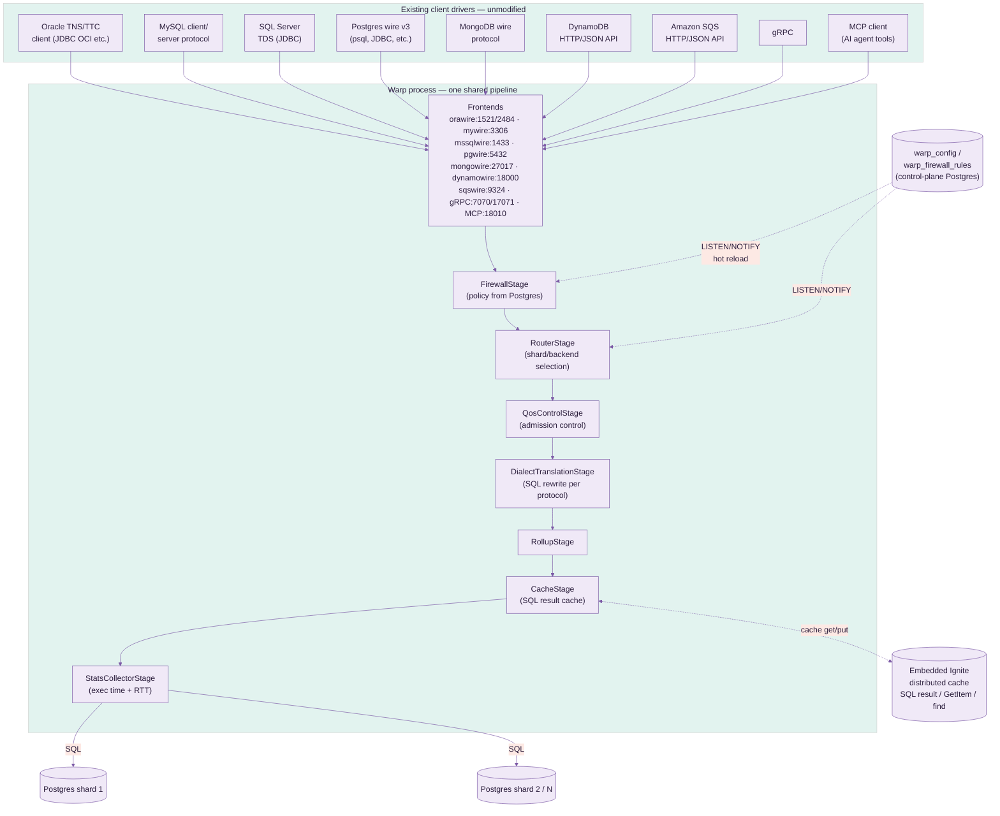
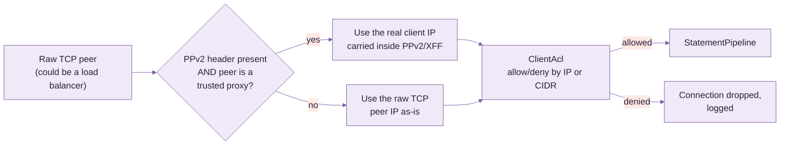
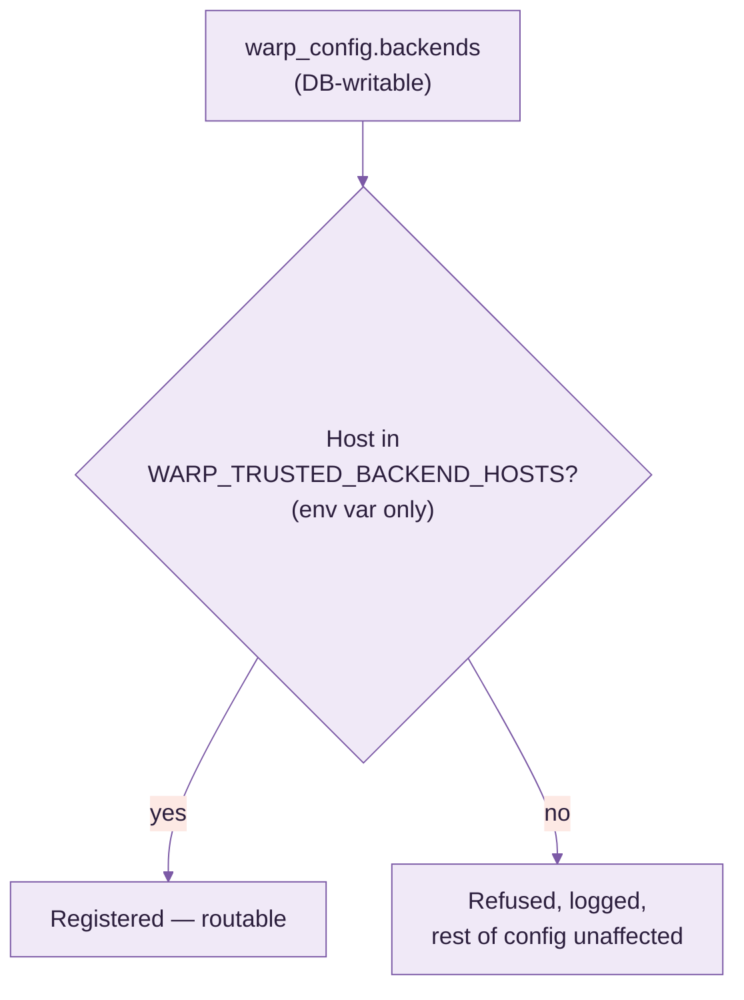
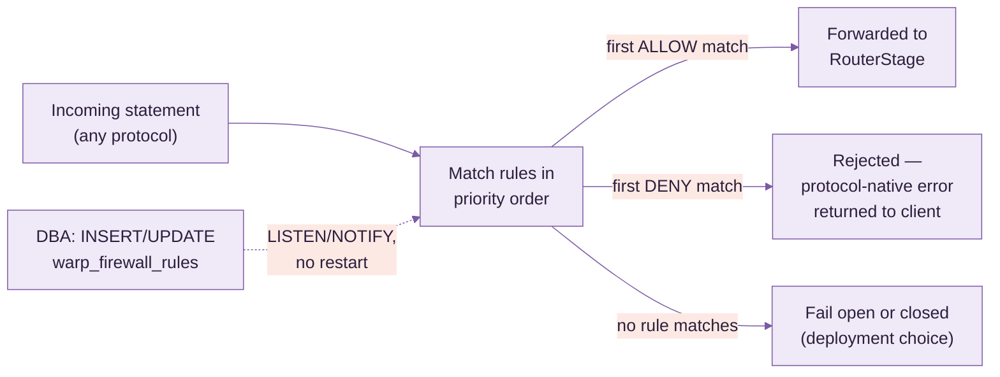
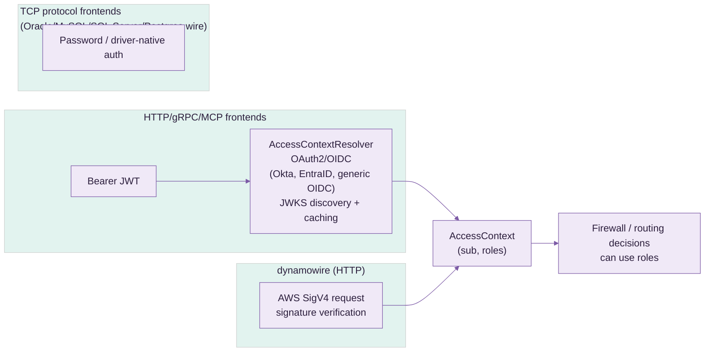
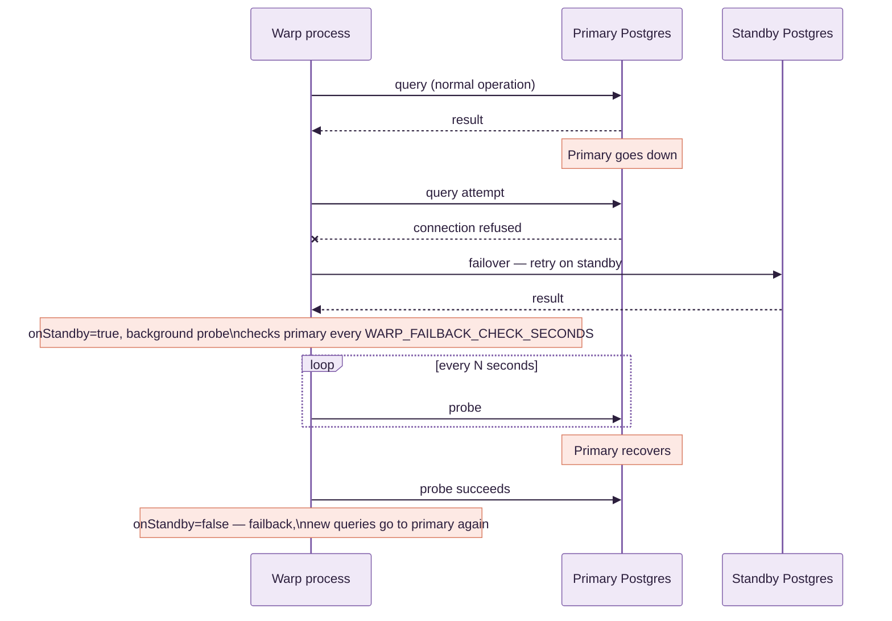
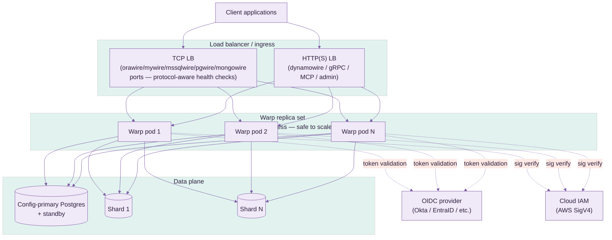

# Warp — Use Case & Deployment Guide

> **This is a technical/internal reference** for operators and contributors — pipeline internals,
> security, HA, deployment. If you're an application team looking to connect to Warp, start
> with [`USER_GUIDE.md`](USER_GUIDE.md) instead.

Warp is a mid-tier database gateway. It speaks Oracle TNS/TTC, MySQL client/server protocol,
SQL Server TDS, Postgres wire protocol v3, MongoDB wire protocol, DynamoDB's HTTP/JSON API,
Amazon SQS's HTTP/JSON API, gRPC, and MCP to clients — by default, translating and routing every
one of them to real Postgres backend(s), the wire-protocol-compatibility path for a pre- or
post-migration cutover (not a schema/data migration tool itself). mywire, orawire, mssqlwire, and
MCP can each also run in **native-backend mode** instead (§8.1.1): no translation at all, proxying
straight through to a real Oracle/MySQL/SQL Server database of your own — for keeping the engine
you already run, not just migrating off it. §4.4 covers a third, independent capability: real
Oracle/SQL Server/MySQL `WARP_BACKENDS` targets that Warp routes plain SQL to, federates `JOIN`s
against, and runs real distributed (XA) transactions across, alongside Postgres.

> **Performance**: every number claimed anywhere in this guide about latency, caching, or RTT is
> backed by a live before/after benchmark against a real client library, documented in
> [`PERFORMANCE.md`](PERFORMANCE.md) — not estimated.

> **On screenshots**: Warp is a headless gateway process — there's no UI to screenshot.
> Its "surface" is protocol traffic and the admin/metrics HTTP endpoint (`:19090`); once you
> have it running (see §4), I can capture the metrics endpoint's live output or a packet-level
> trace if that's useful.

---

## 1. What question it answers

**"Can my existing app, written against an Oracle/MySQL/SQL Server/MongoDB/DynamoDB driver,
talk to Postgres without a rewrite?"** — yes: point the app's connection string at Warp
instead of its original database, and Warp translates and routes to real Postgres.

Run it indefinitely as a permanent compatibility shim (e.g. legacy MongoDB driver code that's
not worth rewriting), or as a temporary cutover bridge while a migration tool moves schema/data
behind the scenes.

---

## 2. Architecture



- **One pipeline, many faces**: every SQL-shaped frontend (Oracle, MySQL, SQL Server, native
  Postgres, gRPC) feeds the *same* `StatementPipeline` instance — firewall, routing, QoS,
  translation, caching, and stats are protocol-agnostic. mongowire/dynamowire/sqswire don't build
  a SQL `Statement` (there's no dialect to translate), so they feed the shared metrics collector
  directly at their own single dispatch choke point instead — same dashboard, same `/api/metrics/
  summary`, different entry point. See §9 for the caching layer and §10 for what gets measured.
- **Config lives in Postgres, not just env vars**: `warp_config` (versioned, insert-only)
  and `warp_firewall_rules` (mutable, DBA-managed) are real tables in a designated
  "config-primary" Postgres. `LISTEN/NOTIFY` pushes changes to every running Warp process
  within milliseconds — no restart to change a firewall rule or add a backend.
- **Config-primary vs. data plane**: the `WARP_*` env vars point at the single Postgres
  that holds control-plane tables. `WARP_BACKENDS` / `WARP_SHARD_BACKENDS` are the
  separate, explicitly-registered data-plane shard targets actual queries are routed to — the
  config-primary is never automatically one of the shards.

---

## 3. Security

### 3.1 ACL (IP / CIDR allowlisting) & PPv2 / X-Forwarded-For



**ACL (`ClientAcl`)** — a plain, ordered allow/deny rule list evaluated per inbound
connection, on every frontend (pgwire, mywire, orawire, mssqlwire, mongowire, gRPC, dynamowire,
MCP, admin/metrics HTTP):

- Rule grammar: `allow <ip-or-cidr>` / `deny <ip-or-cidr>`, one per line/`;`-separated entry —
  e.g. `allow 10.0.0.0/8; allow 192.168.1.50; deny 0.0.0.0/0` (allow the private ranges you
  name, deny everything else).
- Sourced from **either** the env var (`WARP_ACL_RULES`) **or** `warp_config.aclRules`
  — same dual-source convention as every other setting; the DB-stored version hot-reloads via
  `LISTEN/NOTIFY` with zero restart.
- Default (unset) is fully open — no behavior change until you opt in.
- A rejected connection is dropped immediately, before it reaches the firewall/router stages,
  and logged with the offending IP — visible in Warp's own logs for audit.

**PPv2 (PROXY protocol v2) / `X-Forwarded-For`** — solves the problem that, once you put a
load balancer or connection pooler in front of Warp, every connection's raw TCP peer IP
*is the load balancer*, not the real client — so a naive ACL would only ever see one IP.

- `WARP_ACL_PPV2_ENABLED` (or `warp_config.aclPpv2Enabled`) turns on parsing of the
  PPv2 header (binary, used by TCP-level proxies — HAProxy, many cloud NLBs) or the
  `X-Forwarded-For` HTTP header (for the HTTP-based frontends) to recover the real client IP.
- **Trust is opt-in per proxy, not global**: `WARP_ACL_TRUSTED_PROXIES` (or
  `warp_config.aclTrustedProxies`) is a separate IP/CIDR list — the forwarded-IP header is
  only honored when the *direct* TCP peer is itself in this list. Without this check, any
  client could simply forge its own `X-Forwarded-For` header and impersonate an allowlisted IP
  — this is the exact spoofing vector the trusted-proxy check exists to close.
- Typical setup: `WARP_ACL_TRUSTED_PROXIES=10.0.0.0/24` (your load balancer's subnet),
  `WARP_ACL_RULES=allow 203.0.113.0/24` (the actual office/VPN range you want to allow) —
  Warp then correctly evaluates the ACL against the client's real IP even though every
  packet physically arrives from the load balancer.

### 3.2 Backend-poisoning protection

Because `WARP_BACKENDS` can be set via the DB-writable `warp_config` table, anyone
with write access to that table could otherwise register an arbitrary host and have real
client traffic silently routed to it (a config-driven SSRF). `TrustedBackendHosts`
(`WARP_TRUSTED_BACKEND_HOSTS`) closes this:



Deliberately **env-var only, never itself in `warp_config`** — if the allowlist lived in
the same DB-writable surface it gates, the protection would be circular. Entries accept IPs,
CIDR blocks, or literal hostnames (docker-compose service names, internal DNS).

### 3.3 SQL Firewall

Runs as its own pipeline stage (`FirewallStage`), first in line — every statement on every
frontend is checked before routing, translation, or execution. Rules live in a real,
DBA-managed Postgres table, **not** an env var or app config file, so a DBA can change policy
with an `UPDATE`/`INSERT` statement and see it apply in milliseconds, no Warp redeploy.



**Table schema** (`warp_firewall_rules`, auto-created, own `LISTEN/NOTIFY` trigger):

| column | meaning |
|---|---|
| `id` | primary key |
| `priority` | lower evaluates first; first matching rule wins |
| `action` | `ALLOW` or `DENY` |
| `statement_type` | `SELECT` / `INSERT` / `UPDATE` / `DELETE` / `DDL` / `*` (any) |
| `table_pattern` | glob against the target table, schema-qualification optional (`orders` matches both `orders` and `public.orders`) |
| `sql_pattern` | optional raw regex escape hatch — matched against the full SQL text when a table-level rule isn't expressive enough |
| `enabled` | boolean — disable a rule without deleting it |
| `description` | free text, shows up in denial logs |

**Example policy:**

| priority | action | statement_type | table_pattern | description |
|---|---|---|---|---|
| 10 | DENY | DELETE | `*orders*` | block bulk order deletes from any app |
| 20 | DENY | `*` | `*pii_*` | block all access (read or write) to PII-prefixed tables |
| 30 | DENY | `*` | `*` *(sql_pattern: `(?i)DROP\s+TABLE`)* | block DDL drops regardless of table name |
| 100 | ALLOW | `*` | `*` | default allow — everything not matched above |

**Config surface** — configured, like every other feature, from **either**:

- a plain SQL `INSERT INTO warp_firewall_rules (...)` (the intended day-to-day DBA path —
  no application deploy involved at all), or
- the equivalent Postgres stored procedure Warp ships (wraps the same insert/update with
  validation), for teams that prefer calling a procedure over hand-writing DML.

Changes are pushed to every running Warp process instantly via the table's `NOTIFY`
trigger — matches the same hot-reload mechanism used by `warp_config`, `ClientAcl`, and
`TrustedBackendHosts`.

### 3.4 Authentication



- OAuth2/OIDC bearer-token validation for every HTTP-based frontend (gRPC, MCP, admin API),
  with configurable claim mapping (`sub` → user id, custom claim → roles).
- AWS Signature v4 verification for `dynamowire`, opt-in via `WARP_AWS_IAM_CREDENTIALS`.
- TCP wire-protocol frontends (Oracle/MySQL/SQL Server/Postgres) authenticate with the
  client driver's own native password exchange, passed through to the real Postgres backend.

### 3.5 TLS

- `orawire` has a dedicated TLS listener (TCPS, port 2484) alongside plaintext TNS (1521).
- gRPC has a dedicated TLS listener (17071) alongside plaintext (7070).
- All built from one shared keystore — one cert to rotate, not one per frontend.

---

## 4. High Availability

### 4.1 Config-primary failover



- Configured via `WARP_STANDBY_HOST`/`WARP_STANDBY_PORT`. Applies to both the
  control-plane connection (`warp_config`/firewall rules) and, via `BackendTarget`'s
  `failoverOptions`, the actual query-execution path for the synthetic default backend.
- Explicitly-named shard backends (`WARP_BACKENDS`) do **not** get automatic failover — a
  named shard isn't presumed to be a replica pair of another named shard; pair them yourself
  at the infrastructure layer (e.g. a PgBouncer/HAProxy VIP per shard) if needed.
- Failback is automatic, probed in the background (`WARP_FAILBACK_CHECK_SECONDS`, default
  10s) — no manual intervention once the primary recovers.

### 4.2 Sharding / scatter-gather

`WARP_SHARD_BACKENDS` names a subset of the registered backends as a shard group;
`RoutingBackendExecutor` fans a matching query out to all of them and merges results — useful
for read-side aggregate queries across horizontally-partitioned Postgres backends.

### 4.3 Cross-shard / cross-backend JOIN federation

§4.2's scatter-gather path has a real, silent correctness gap: it broadcasts identical SQL to
every shard and concatenates/merges the results — wrong the instant a `JOIN`'s matching row pair
spans two different shards (never found on either shard alone, and no error raised). Two Calcite
federation engines close this gap by actually planning and executing the `JOIN`, not
broadcast-and-merge:

- **`ShardJoinExecutor`** — Warp's own homogeneous horizontal sharding (the SAME logical
  table split by row across every shard in a `WARP_SHARD_BACKENDS` group). Mounts each
  distinct `schema.table` reference in the query as a real `UNION ALL` across every shard's own
  copy, then hands the rewritten query to a real Calcite planner.
- **`SchemaFederationStage`** — Warp's own heterogeneous vertical/functional sharding
  (`WARP_ROUTER_SCHEMA_RULES` routing a whole table's traffic to one named backend, e.g. every
  `orders_db.orders` query to backend `orders`). Runs *before* `RouterStage` in the pipeline —
  federating across backends has to happen before routing narrows a statement to one target. Each
  matching backend is mounted directly as its own Calcite schema.

Both push predicates/columns down into each shard/backend's own SQL via Calcite's real JDBC
adapter rules (`JdbcRules`) — not a row-pull-and-join-in-Java.

**Real, statistics-driven cost-based planning.** When `StatisticsStore` is configured, every
mounted table is wrapped so Calcite's own join-order cost model sees a real row-count estimate
(Postgres's own `pg_class.reltuples`, the same number the Postgres planner itself already uses —
a single fast catalog lookup, not a `COUNT(*)` scan) instead of `Statistics.UNKNOWN`.
`StatisticsScheduler` proactively refreshes it in the background
(`WARP_STATS_REFRESH_INTERVAL_MINUTES`); a cold cache still gets a real number via an
on-demand probe on the first federated query after startup. TTL-bounded
(`WARP_STATS_TTL_MS`, default 24h) — a stale statistic degrades the cost estimate, never the
correctness of the result.

**Real semi-join pushdown.** Checked first whether Calcite already does this given real
statistics — it doesn't: no Bloom filter concept exists anywhere in Calcite (that's a runtime
technique with no portable way to ship into a remote backend's own SQL), and Calcite's own
semi-join rules can't apply to a federated join either (`JdbcJoinRule` only pushes a join down
when both sides already share one `JdbcConvention` — never true across two different mounted
backends). `SemiJoinPushdown` closes the gap with a real, exact filter instead: when a query is a
single, unambiguous equi-join between exactly two known table references, it collects the
smaller (build) side's real distinct join-key values (capped, `WARP_SEMIJOIN_MAX_KEYS`,
default 20,000) and pushes them down as a real `col IN (...)` predicate on the larger (probe)
side, before that side's own leaf query ever runs. Live-verified against two real Postgres
backends (10-row `customers`, 200,000-row `orders`, ~19,000 actually matching): the larger side's
real, MEASURED row count (not estimated) dropped from 200,000 to ~19,000 with an identical,
correct join result — a genuine ~90% reduction in what crossed the wire. Deliberately
conservative: no confident stats for both sides, an ambiguous `ON` clause, or either known table
reference appearing more than once in the statement (rules out self-joins) all just skip the
optimization — the real join still runs, only without the extra filter, never a wrong answer.

**Real SQL plan cache/history** (`SqlPlanStore`, `WARP_FEDERATION_PLAN_HISTORY=<capacity>` to
enable) — a `V$SQL_PLAN`-style record of every federated query's own real `EXPLAIN PLAN FOR` text,
timing, row count, and success/failure, visible in the admin UI (§11). Per-leaf-scan profiling
(`LeafScanProfiler`) goes further than `EXPLAIN PLAN FOR` (which only ever reports the planner's
own pre-execution ESTIMATE): it re-executes each leaf's own pushed-down SQL separately, with real
wall-clock timing and a real row count from actually iterating the result — the same honest
tradeoff a DBA manually running `EXPLAIN ANALYZE` on a suspect subquery makes.

**Cluster-shared, not just per-instance.** When Warp's embedded Ignite cluster is genuinely
multi-instance (`WARP_CLUSTER_ENABLED=true`, not just the default single-node cache-only
grid), both `StatisticsStore` and `SqlPlanStore` switch to an Ignite-backed shared cache instead
of a local `ConcurrentHashMap` — every instance sees the SAME row-count statistics and the SAME
federated-query plan history, regardless of which instance actually ran each query. Live-verified
with two real, separate JVM processes joining one real Ignite cluster: a plan/stat written by one
process was immediately visible to the other.

**Deliberately narrow scope, still**: a fresh Calcite connection per statement (no connection
cache), no native RLS/VPD session pass-through for the federated connection (`AccessControlStage`'s
own row-filter/column-mask SQL rewriting, run earlier in the pipeline, is the only enforcement),
and a statement referencing more than 2 federated backends in one query falls straight through to
scatter-gather's own broadcast-and-merge behavior, unfiltered.

**Real, declarative per-table sharding (`WARP_TABLE_SHARDS`).** Everything above (`ShardRule`)
needs a client to type a schema-qualifier prefix like `public.` in every query just to opt a
statement into scatter-gather — a real footgun (a client that queries `orders` unqualified, which
is completely normal, silently misses sharding and only ever sees one shard's own data) and not
how a table's own partitioning should actually work: it should be transparent, keyed by the
table's own bare name, with the query planner picking the fastest real path on its own.
`WARP_TABLE_SHARDS` is that: one declaration per table, `table:strategy:column:params`
(`|`-delimited between tables), reusing `ShardingStrategy` (hash/consistent/list/range/date, the
same real strategies `WARP_ROUTER_VALUE_SHARD_RULES` already has) —
`orders:hash:customer_id:shard1,shard2,shard3`. The table's own bare name is matched directly (no
qualifier needed anywhere), and the router picks the real fastest path per statement:

- A query that supplies a real literal value for the declared partition column (`WHERE
  customer_id = 42`) routes straight to the ONE shard `ShardingStrategy#resolve` says owns it —
  no scatter, no merge, same cost as a single-backend query. Same real, disclosed limitation
  `ValueShardColumnRule` already has: a client that BOUND the value as a parameter instead of a
  literal isn't detected this way (no real SQL parser threading bind positions back to column
  names) and just falls through to the path below instead — correct, not the fastest available.
- A query that doesn't (a full-table aggregate, or a `JOIN` of two declaratively-sharded tables)
  transparently falls back to scatter-gather (or a real federated `JOIN`, `ShardJoinExecutor`)
  across exactly THIS table's own declared shard set (`ShardingStrategy#allBackends`) — which can
  be a different subset of backends than any OTHER declaratively-sharded table uses, unlike
  `ShardRule`'s one shared `registry.shardGroup()`.

`WARP_ROUTER_SHARD_TABLES`/`WARP_ROUTER_VALUE_SHARD_RULES` keep working unchanged for
anyone not migrating — this is additive, not a replacement. Real vertical/functional sharding
(a whole table routed to one specific backend, no partitioning) is unaffected too; that's still
`WARP_ROUTER_SCHEMA_RULES` (§4.3's own `SchemaFederationStage`), a real, already-correctly-
scoped mechanism this doesn't duplicate.

### 4.4 Multiple backend engines (top-5-by-DB-Engines-ranking, alongside Postgres)

Warp used to be Postgres-only end to end, by explicit design (`BackendRegistry`/
`BackendConnectionPools`/`BackendTarget` all assumed it). **Oracle, SQL Server, and MySQL/MariaDB
are now real second/third/fourth backend engines** — not just something orawire's/mssqlwire's/
mywire's own wire-protocol frontends decode against, but real `WARP_BACKENDS` targets Warp
connects to, routes plain SQL to (read AND write), federates `JOIN`s against (§4.3), and
coordinates real `XAResource`-based 2PC transactions with (Oracle and SQL Server; MySQL's own
driver has no support for the 2PC path specifically — see below).

**`BackendDriverRegistry`** is the one place a real driver class gets chosen from a
`BackendTarget`'s own `jdbcUrl` prefix — `ShardJoinExecutor`, `SchemaFederationStage`,
`RollupStage`, and `BackendConnectionPools` all dispatch through it instead of each hardcoding
`"org.postgresql.Driver"`. **`XaBackendFactory`** dispatches separately (a backend can be a fine
plain read/write or federation target without being a real XA participant) — every one of Postgres,
Oracle, SQL Server, and MySQL gets a real, vendor-provided `XADataSource` implementation
(`PGXADataSource`, `OracleXADataSource`, `SQLServerXADataSource`, `MysqlXADataSource`), the same
real, proven shape the sibling Omnigate project uses for its own Postgres/Oracle pair.

**Live-verified against real instances of all three new engines**, with real bugs found and fixed
along the way — this project's own established discipline, not a claim taken on faith:

- Plain routed `SELECT`/`INSERT` against Oracle, SQL Server, and MySQL all worked through the
  existing, previously Postgres-only `RoutingBackendExecutor`/`JdbcBackendExecutor` path with
  **zero code changes** to that layer — plain JDBC `PreparedStatement`, no Postgres-specific SQL.
- A real cross-engine `JOIN` — Postgres `orders_db.orders` (~200 real, skewed rows) `JOIN` a
  10-row `customers_db.customers` table — returned correct, exact per-customer counts against
  **each** of Oracle, SQL Server, and MySQL in turn. Real bugs found and fixed getting there:
  1. `BackendConnectionPools` hardcoded `"org.postgresql.Driver"` unconditionally — crashed
     HikariCP pool creation for any non-Postgres URL. Now dispatches through
     `BackendDriverRegistry`.
  2. Oracle folds an unquoted schema/user name to UPPERCASE in its own catalog (Postgres folds to
     lowercase, SQL Server/MySQL preserve case as typed) — Calcite's backend-side table lookup
     needs that real casing even though the client's own SQL can still reference the schema in
     whatever case it likes (`BackendDriverRegistry.realCatalogSchemaName`).
  3. `BackendConnectivityTest`'s health-check probe used `SELECT version()` unconditionally (a
     Postgres — and, coincidentally, real MySQL — function) — marked a healthy Oracle/SQL Server
     backend DOWN with a real syntax error. Now dialect-aware (`v$version` for Oracle,
     `@@VERSION` for SQL Server).
  4. `DialectTranslationStage` had never had SQL Server as a translation *target* before — its
     `RENDERERS` table had no entry for it at all, forcing even a plain ANSI `INSERT`/`SELECT`
     into an (unconfigured) LLM fallback. Added a real `renderSqlServer`, handling `LIMIT n` →
     `OFFSET 0 ROWS FETCH NEXT n ROWS ONLY` the same way the existing `renderOracle` handles
     `LIMIT n` → `FETCH FIRST n ROWS ONLY`.
  5. A JDBC URL containing a literal `;` (SQL Server's own property separator, e.g.
     `;databaseName=x;encrypt=false`) collided with `WARP_BACKENDS`' own `;`-delimited entry
     separator — silently truncated the URL. The existing `%3B` escape (already documented for
     this exact reason) fixes it; a real, easy-to-hit config trap for any semicolon-bearing JDBC
     URL, not SQL-Server-specific.
  6. `TrustedBackendHosts.isTrusted()` only ever recognized `jdbc:postgresql:` URLs — with
     `WARP_TRUSTED_BACKEND_HOSTS` enabled, every other real engine's own URL shape returned
     "not trusted" (silent, full refusal), defeating the whole feature for a non-Postgres backend.
     Extended to recognize Oracle's `thin:@//host:port` shape and the plain `host:port`-style URLs
     SQL Server/MySQL/MariaDB use.
- An unbounded Oracle `NUMBER` column (no explicit precision) makes Calcite reject the plan
  outright (`DECIMAL precision 0 must be between 1 and 19`) — a real, disclosed limitation:
  Oracle tables federated into a `JOIN` need an explicit `NUMBER(p[,s])` precision today, not the
  common unconstrained-`NUMBER` idiom.
- Real, full 2PC — one client `BEGIN`/`COMMIT` touching both a real Postgres backend and a real
  Oracle **or** MySQL backend genuinely prepared and committed atomically across both engines.
  MySQL's own real, Oracle-published Connector/J ships a real `MysqlXADataSource` and it actually
  works end to end — a genuine improvement over the sibling Omnigate project's own broader
  "MySQL/MariaDB has no usable XADataSource" finding, which was specifically about the *MariaDB*
  driver, a different vendor's implementation. **SQL Server's own XA path is real code, but not
  live-verified working** — a fresh SQL Server instance needs the driver's own `sqljdbc_xa`
  MSDTC support procedures (`xp_sqljdbc_xa_init_ex` etc.) installed server-side before any XA
  transaction can even start, a genuine Microsoft-documented prerequisite this project's own test
  instance (a Linux-based Azure SQL Edge container) doesn't have installed and — being a
  reduced-feature SQL Server variant on Linux, with no native MSDTC service — may not support at
  all; a real, disclosed gap, not assumed away.
- Real, standard operational prerequisites had to be met before Postgres/Oracle 2PC worked at all
  (neither is a Warp bug): Postgres's own `max_prepared_transactions` defaults to 0 (2PC is
  off until an operator raises it), and Oracle requires an operator grant on
  `DBA_2PC_PENDING`/`PENDING_TRANS$`/`DBMS_SYSTEM` before any schema can participate in a
  distributed transaction at all — undocumented anywhere in this project until now, worth calling
  out explicitly for anyone deploying this for real.

**MongoDB was attempted and reverted — a real, unresolved blocker, not started work.** MongoDB
isn't JDBC/SQL at all, so the JDBC-based approach above doesn't apply; the real path tried was
Calcite's own `calcite-mongodb` adapter (mounting a real MongoDB database as a Calcite schema, the
same real mechanism used for every JDBC engine). It hit a genuine, verified binary-incompatible
version conflict: `calcite-mongodb:1.42.0` is compiled against `mongodb-driver-sync:4.10.2`
(confirmed directly from its own real `pom.xml`), but this project's own `mywire`/`mongowire`
compatibility work already requires `mongodb-driver-sync:5.5.1` (documented lockstep-version
requirement with `bson`, elsewhere in `pom.xml`) — connecting real Mongo 7 to a `MongoSchema`
built this way throws a real `NoSuchMethodError` (`MongoDatabase.listCollectionNames()`, a method
whose signature changed across that major version gap) the moment Calcite tries to list the
database's own collections. Downgrading the driver project-wide would regress `mongowire`'s own
real, tested functionality; there's no supported way to run two major versions of the same driver
in one shaded jar. Real follow-up options, none attempted yet: a newer `calcite-mongodb` release
built against a 5.x driver (would mean upgrading `calcite-core` project-wide too — a much larger,
riskier change given how much of §4.3's own federation work depends on today's pinned 1.42.0
behavior), or a hand-written MongoDB executor bypassing Calcite's adapter entirely.

### 4.5 Non-SQL protocol storage: backend-engine prerequisites and limitations

`dynamowire`, `influxwire`, `sqswire`, and the Bolt/Cypher graph frontend (`boltwire`) don't speak
SQL to their clients, but every one of them stores its own data as real SQL underneath, in a real
backend — `PgItemStore`, `PgTimeSeriesStore`, `PgQueueStore`, `PgGraphStore`. §4.4 above is about
letting *SQL-speaking* clients (pgwire/orawire/mywire/mssqlwire) reach a non-Postgres backend; this
section is about whether these *other four* protocols' own storage can too — a genuinely different
question, since each one owns its own schema and query logic rather than just passing through
whatever SQL a client sent.

**Real DDL, no longer hardcoded in Java.** Every one of these stores used to build its own
`CREATE TABLE`/`CREATE INDEX` text as inline Java string literals — real engine differences had
nowhere to live but a pile of if/else branches inside otherwise storage-logic-only methods. DDL
now lives in `wire/src/main/resources/ddl/<engine>/<name>.sql` (`postgres`/`oracle`/`sqlserver`/
`mysql`), loaded and parameterized (`${table}`) at runtime by `DdlTemplates` — a real, engine-keyed
directory, not a config format for its own sake: `BackendDriverRegistry.engineDirFor`-equivalent
dispatch (`DdlTemplates.engineDirFor`) picks the right file from a `BackendTarget`'s own `jdbcUrl`,
the same real dispatch shape §4.4's `BackendDriverRegistry` already uses for driver classes.

**Only two of the four can even reach a non-default backend today.** `PgItemStore` (dynamowire)
and `PgQueueStore` (sqswire) both support real shard routing (`WARP_SHARD_BACKENDS` — hashing
by DynamoDB partition key / SQS queue name, same as real DynamoDB/SQS partitioning), so a shard
group member CAN be an Oracle/SQL Server/MySQL backend. `PgTimeSeriesStore` (influxwire) and
`PgGraphStore` (boltwire) only ever call `backendRegistry.resolveForRouting(DEFAULT_BACKEND_NAME)`
— no sharding at all — and the default backend doubles as Warp's own control-plane connection
(`warp_config`, `warp_firewall_rules`, `LISTEN/NOTIFY`), which has to stay Postgres. Adding
real shard routing to these two is a real, scoped, not-yet-started follow-up — until then, their
own storage is Postgres-only regardless of what other backends are configured.

**Live-verified, real per-engine status, table DDL vs. query logic kept separate on purpose** —
DDL portability and query portability are genuinely different problems, and this project only
solves what it's actually solved, not by engine-level vibes:

| Store | Protocol | Can target a non-default backend | Table DDL | Query logic (INSERT/SELECT/UPDATE) |
|---|---|---|---|---|
| `PgItemStore` | dynamowire | Yes (`WARP_SHARD_BACKENDS`) | **Real DDL for all 4 engines**, live-verified (`CreateTable` actually succeeds against real Oracle/SQL Server/MySQL instances) | Postgres-only (`ON CONFLICT`, `::jsonb` casts — a real, live-confirmed failure on MySQL: `PutItem` still fails past `CreateTable`) |
| `PgTimeSeriesStore` | influxwire | No (default-backend only) | Real DDL exists for all 4 engines (each engine's own `CREATE TABLE ddl/<engine>/influxwire_measurement_table.sql`, live-verified directly against real Oracle/SQL Server/MySQL) but unreachable in practice until shard routing is added | Postgres-only (`->`/`->>` jsonb operators, `date_bin()`) |
| `PgQueueStore` | sqswire | Yes (`WARP_SHARD_BACKENDS`) | **Real DDL for all 4 engines**, live-verified | **Real query support for all 4 engines**, live-verified end to end — CreateQueue, SendMessage, ReceiveMessage (including FIFO group-exclusion and dedup), DeleteMessage, ChangeMessageVisibility, GetQueueAttributes, DeleteQueue, against real Oracle/SQL Server/MySQL instances |
| `PgGraphStore` | Bolt/Cypher graph frontend | No (default-backend only) | Postgres-only — the `labels TEXT[]` array column has no cross-engine equivalent at all; a real port needs a schema redesign (JSON array column or a normalized join table), not a syntax swap | Postgres-only |

**Real bug found and fixed along the way**: `PgItemStore.createTable()` used to write its own
catalog metadata row (`_dynamo_tables`) *before* attempting the real backend `CREATE TABLE` — a
DDL failure on the real backend (the MySQL `jsonb`-syntax failure that motivated this whole
section, but just as real for a plain transient Postgres failure) left the metadata row committed
and orphaned, so every later `CreateTable` for that same name permanently, incorrectly reported
`ResourceInUseException` ("already exists") instead of the real cause — confirmed live: the client
only ever saw a misleading result from boto3's own automatic retry of the original failed call.
Physical DDL now runs first; the catalog row is only written once the real table genuinely exists.

**Real, disclosed engine-specific DDL quirk, found live**: Oracle treats an empty string (`''`) as
`NULL` — dynamowire's own "no sort key" convention (`sk_value` defaults to `''`) would violate the
item table's own `PRIMARY KEY (pk_value, sk_value)` `NOT NULL` requirement the instant such an item
reached Oracle (confirmed live: `ORA-01400`). The table DDL itself is real and correct — verified
with a non-empty `sk_value` — but a real fix for the empty-sort-key case needs a non-empty sentinel
value on Oracle specifically, not attempted here.

**sqswire is now a genuinely portable queue, not just DDL** — designed deliberately, not by
mechanically translating Postgres syntax. Each engine's own real idiomatic queue mechanism was
researched before writing any code (Oracle's own JDBC driver really does support a real
single-statement `RETURNING INTO` via `OraclePreparedStatement.registerReturnParameter`, and SQL
Server has a real, first-class `OUTPUT` clause equivalent to `RETURNING` — but adopting either
would mean a real, separate engine-specific Java code path). The deliberate design instead: keep
Postgres's own single-statement `UPDATE ... WHERE msg_id = (SELECT ... FOR UPDATE SKIP LOCKED)
RETURNING ...` claim untouched, and give Oracle/SQL Server/MySQL one shared, real, portable
**two-statement** claim (`SqswireDialect`) — a `SELECT ... FOR UPDATE` with each engine's own real
lock-skip hint (`FOR UPDATE SKIP LOCKED` for MySQL/Oracle, `WITH (ROWLOCK, READPAST, UPDLOCK)` for
SQL Server) to find and lock a candidate row, then a plain `UPDATE ... WHERE msg_id = ?` to claim
it — both in one real transaction on the same connection. One extra real round trip per claim on
those three engines versus Postgres's own single statement, a disclosed tradeoff for a uniform
code path, not a hidden cost. Insert-id capture (`SendMessage`) uses the standard portable JDBC
`getGeneratedKeys()` API instead of `RETURNING`, real and simple across all three.

Real, live-verified end to end against real Oracle, SQL Server, and MySQL instances — CreateQueue,
SendMessage (real `AUTO_INCREMENT`/`IDENTITY` ids), ReceiveMessage (including real FIFO
group-exclusion and dedup-window logic, not just plain-queue claiming), DeleteMessage,
ChangeMessageVisibility, GetQueueAttributes counts, and DeleteQueue/recreate — with real bugs found
and fixed along the way:

- **Oracle's own `Statement.RETURN_GENERATED_KEYS`** returns a `ROWID`, not the real generated
  column value, unless the generated column is named explicitly — the generic JDBC flag produced a
  real `ORA-17132: Invalid conversion requested` the moment the code tried to read it as a `long`.
  Fixed by using the real, standard `prepareStatement(sql, String[] columnNames)` overload instead
  (portable JDBC API, not Oracle-specific — harmless and equally correct on MySQL/SQL Server too).
- **Oracle rejects `ORDER BY ... FETCH FIRST n ROWS ONLY FOR UPDATE` outright** (`ORA-02014`) — and,
  found live right after switching to the textbook pre-`FETCH FIRST` `ROWNUM`-filtered-subquery
  idiom, that ALSO fails with the identical `ORA-02014`, since that subquery still carries the same
  `ORDER BY`. The real, actually-working idiom (confirmed against real Oracle community reports of
  the same wall): pick the target row's own `ROWID` through an `ORDER BY`-bearing view with NO
  `FOR UPDATE` on it at all, then a separate outer query — a trivial `ROWID` equality lookup, no
  `ORDER BY` of its own — is what actually carries `FOR UPDATE SKIP LOCKED`.
- **A real, pre-existing, non-engine-specific bug**, found live testing `DeleteQueue`+recreate: the
  `tableEnsured` per-(queue,backend) cache was only ever set, never invalidated on `DeleteQueue` —
  recreating a queue right after deleting it silently skipped `CREATE TABLE` on the next
  `SendMessage`, since the cache still thought the just-dropped table existed, producing a real
  "relation/object does not exist" failure instead of transparently recreating it. This bug existed
  on Postgres too, before this work — just never live-tested this specific sequence before now.

**TimescaleDB is a real, optional Postgres extension, not a hard requirement** — `PgTimeSeriesStore`
detects it (`SELECT 1 FROM pg_extension WHERE extname = 'timescaledb'`) and only calls
`create_hypertable(...)` when it's actually installed; without it, `influxwire` still works
correctly against plain Postgres, just without chunked partitioning/retention-deletion performance
(every write/query path — including the `date_bin()`-based time-bucketing aggregation — is
byte-for-byte identical between the hypertable and plain-table paths by design). This capability
has no equivalent at all on Oracle, SQL Server, or MySQL — none of the three expose a matching
`create_hypertable()`-style call (all three DO have their own native table partitioning, but
wiring that in is a separate, from-scratch feature, not a substitution for TimescaleDB's own real
mechanism); once influxwire gains real shard routing, those three engines' own measurement tables
will simply stay plain tables permanently, the same real, already-proven-safe fallback behavior
Postgres itself gets without the extension.

### 4.6 Multi-AZ distributed cache

The distributed cache (Ignite, `com.nexagres.wire.cluster.WarpCluster`) is cloud-native and
AZ-aware: cluster discovery via `WARP_CLUSTER_DISCOVERY=static|s3|gcs|azure` (not just a
static IP list), a configurable backup count (`WARP_CLUSTER_CACHE_BACKUPS`, default 1) whose
placement is AZ-aware — a cache entry's backup never lands on a node in the same
`WARP_AVAILABILITY_ZONE` as its primary, live-proven by
`WarpClusterAzBackupPlacementTest` (three real Ignite nodes, not a simulation) — and TLS
between cache nodes via `WARP_TLS_KEYSTORE`, live-verified both positive (two nodes on the
same keystore form one cluster) and negative (a third node on a different keystore fails the
handshake and never joins).

What's still genuinely open: the S3/GCS/Azure discovery finders are verified against the real
Ignite classes but not yet exercised against real cloud storage (no cloud credentials available
to test with in this environment — static discovery is the only mode live-tested end to end), AZ
is operator-supplied rather than auto-detected from cloud instance-metadata, and split-brain
behavior under a network partition is unaddressed (backup placement guarantees each AZ *would*
hold a full copy if reachable, not that reads stay consistent during a partition).

---

## 5. Deploying on a laptop (fastest path)

```bash
docker compose -f docker/warp/docker-compose.yml up --build
```

Run from the **repo root** — the build context is the repo root even though the Dockerfile
lives under `docker/warp/` (see `docker/warp/README.md` for why). Bring your own
Postgres, or point `WARP_*` at one running elsewhere — no cloud account, no Kubernetes
required for a full local smoke test.

For iterative Java development without Docker:

```bash
cd wire && mvn package -DskipTests && scripts/run.sh
```

---

## 6. Cloud deployment



- **Warp itself is stateless** — every pod reads its live config from the same
  config-primary Postgres via `LISTEN/NOTIFY`, so horizontal scaling is just "add more pods
  pointed at the same `WARP_*`." No sticky sessions needed at the LB beyond normal TCP
  connection affinity for the life of one client session.
- **`WARP_TRUSTED_BACKEND_HOSTS`** must be set at deploy time (env var / secret /
  Kubernetes `NetworkPolicy`-equivalent) — this is infrastructure config, not something to put
  in application config management that developers can edit.
- **Container image**: build with `docker/warp/Dockerfile`, push to a registry (e.g.
  `ghcr.io` — see the repo root `.env.example` for the token fields needed), deploy via your
  platform's normal rolling update mechanism (ECS service, GKE/EKS Deployment, etc.).
- **Secrets**: `WARP_PASSWORD`, `WARP_AWS_IAM_CREDENTIALS`, OAuth client secrets, and
  the registry token belong in your cloud's secret manager (Secrets Manager, Secret Manager,
  Key Vault) or a Kubernetes `Secret`, injected as env vars — never baked into the image.
- **What's still cloud-*agnostic* by design**: Warp has no hard dependency on any one
  cloud's networking primitives — it only needs TCP reachability to its Postgres backends and,
  optionally, an OIDC issuer and/or AWS IAM for auth. Cross-AZ cache placement (§4.3) is
  implemented and tested for all three; only live end-to-end verification against real cloud
  storage for the S3/GCS/Azure discovery finders remains open.

---

## 7. Docker packaging reference

| | Detail |
|---|---|
| Image | 1 — `docker/warp/Dockerfile` |
| Base (build) | `maven:3.9-eclipse-temurin-21` |
| Base (runtime) | `eclipse-temurin:21-jre-jammy` |
| Published ports | 15432 (pgwire), 13306 (mywire), 11521/2484 (orawire plaintext/TLS), 14333 (mssqlwire), 27017 (mongowire), 7070/17071 (gRPC plaintext/TLS), 18000 (dynamowire), 9324 (sqswire), 18010 (MCP), 19090 (admin/metrics) |
| Persistent state | none in the image — all state lives in the external config-primary Postgres |
| `.dockerignore` | repo-root only — `docker-compose.yml` sets `context: ../..`, and classic Docker only honors a root-level `.dockerignore` |

Build standalone (no compose), from the repo root:

```bash
docker build -f docker/warp/Dockerfile -t warp:latest .
```

---

## 8. Complete feature reference

### 8.1 Protocol frontends

| Frontend | Protocol | Default port | Notes |
|---|---|---|---|
| pgwire | Postgres wire protocol v3 | 15432 | native passthrough, no translation needed |
| mywire | MySQL client/server protocol | 13306 | SQL dialect translated to Postgres by default; `WARP_MYWIRE_BACKEND=mysql` switches to native mode — see §8.1.1 |
| orawire | Oracle TNS/TTC | 11521 (plaintext), 2484 (TCPS/TLS) | SQL dialect translated by default; both plaintext and TLS listeners run together; `WARP_ORACLE_BACKEND_MODE=native` switches to native mode — see §8.1.1 |
| mssqlwire | SQL Server TDS | 14333 | T-SQL dialect translated by default; `WARP_MSSQLWIRE_BACKEND=sqlserver` switches to native mode — see §8.1.1 |
| mongowire | MongoDB wire protocol | 27017 | document ops mapped to SQL |
| dynamowire | DynamoDB HTTP/JSON API | 18000 | AWS SigV4-verifiable, item ops mapped to SQL; sharded by partition key |
| sqswire | Amazon SQS HTTP/JSON API | 9324 | pgmq-style Postgres storage (no `pgmq` extension needed); FIFO queues, DLQ/redrive, both JSON-1.1 and legacy XML protocols; sharded by queue name |
| gRPC | gRPC | 7070 (plaintext), 17071 (TLS) | both listeners run together, one shared keystore |
| MCP | JSON-RPC 2.0 over Streamable HTTP | 18010 | dialect-translated to Postgres by default; `WARP_MCP_BACKEND=oracle/mysql/sqlserver` switches to native mode — see §8.1.1 and §8.5 |
| Admin / metrics | HTTP | 19090 | health, metrics, read-only config introspection (never returns passwords) |

#### 8.1.1 Native-backend mode: proxy straight to Oracle, MySQL, or SQL Server instead of translating

mywire, orawire, mssqlwire, and MCP each default to **dialect-translation mode**: the client's own
SQL/T-SQL/PL-SQL is rewritten into Postgres dialect and run against the real, configured Postgres
backend — the shared eight-stage pipeline in §8.2, unmodified. Each of the four also has a
**native-backend mode**, which instead proxies the client's SQL straight through, completely
unmodified, to a real Oracle/MySQL/SQL Server connection of Warp's own:

| Frontend | Env var to enable | Backend connection config |
|---|---|---|
| mywire | `WARP_MYWIRE_BACKEND=mysql` (default `postgres`) | `WARP_MYSQL_HOST`/`_PORT`/`_DATABASE`/`_USER`/`_PASSWORD` |
| orawire | `WARP_ORACLE_BACKEND_MODE=native` (default `jdbc`) | `WARP_ORACLE_HOST`/`_PORT`/`_SERVICE`; credentials come from the client's own O5LOGON login, not a separate config var |
| mssqlwire | `WARP_MSSQLWIRE_BACKEND=sqlserver` (default `postgres`) | `WARP_MSSQL_HOST`/`_PORT`/`_DATABASE`/`_USER`/`_PASSWORD` |
| MCP | `WARP_MCP_BACKEND=oracle` / `mysql` / `sqlserver` (default `postgres`) | Reuses the same `WARP_ORACLE_*`/`WARP_MYSQL_*`/`WARP_MSSQL_*` vars above, plus `WARP_ORACLE_USER`/`WARP_ORACLE_PASSWORD` specifically for MCP's Oracle mode — MCP has no client login step to source per-caller Oracle credentials from the way orawire's native mode does, so it needs a real, gateway-held credential configured |

**Native mode bypasses the shared pipeline entirely for every statement, not just the
dialect-translation stage** — a real, previously-live bug, not a design choice: `RouterStage`'s
"default" backend target is always Postgres-typed regardless of a frontend's own mode (it's shared
across every protocol in the same process), so running native-dialect SQL through the ordinary
pipeline still translated it toward Postgres and sent the (wrong) translated SQL to the real
non-Postgres backend — confirmed live via a real `'set_config' is not a recognized built-in
function name` error from a real SQL Server instance. The fix is that native mode never enters the
pipeline at all: it executes directly against a fresh backend connection. The consequence, stated
plainly: **the SQL Firewall and QoS admission control (both pipeline stages) do not apply to
native-mode traffic**, any more than the distributed cache, rollups, or cross-backend
value-sharding do (all of those are built against Postgres). What still applies, because it
happens before a statement ever reaches the pipeline: connection ACL (§3.1, enforced at TCP/HTTP
accept time, protocol-agnostic) and the connection pool itself (§8.4's `WARP_POOL_MAX_SIZE`, a
real fixed-size pool of backend connections that a much larger number of client connections can
share, decoupled from client concurrency exactly as it is in dialect-translation mode). Pick
native mode when keeping the current engine matters more than SQL Firewall/QoS/caching coverage,
and dialect-translation mode (the default) when it doesn't.

MCP's own native mode narrows further: `execute_sql`, `list_tables`, and `describe_table` all work
natively (with real per-dialect catalog queries for `list_tables`/`describe_table` — Oracle has no
`information_schema`, so those use `user_tables`/`all_tab_columns` instead), but `document_schema`,
`explain_query`, and `query_natural_language` stay Postgres-only — they hardcode Postgres-specific
SQL (a literal `EXPLAIN (FORMAT JSON ...)`, or an LLM schema-drafting prompt written assuming
Postgres). `tools/list` doesn't even advertise those three in native mode, and calling one anyway
returns a clear "not supported" error rather than silently running SQL that's wrong for the
configured backend. `WARP_MCP_TOOLS` (real Postgres functions/procedures registered as MCP tools
via `pg_proc` introspection) is Postgres-only for the same reason and isn't introspected at all in
native mode.

### 8.2 Statement pipeline stages

Every frontend above feeds the same shared pipeline, in this order:

| Stage | Feature |
|---|---|
| `SchemaFederationStage` | Cross-backend `JOIN` federation via Calcite, runs *before* `RouterStage` — see §4.3 |
| `FirewallStage` | SQL Firewall — see §3.3 |
| `RouterStage` | Backend/shard selection per statement |
| `QosControlStage` | Admission control — caps in-flight work per backend to protect it from overload |
| `DialectTranslationStage` | Rewrites source-dialect SQL (Oracle/MySQL/T-SQL) into Postgres SQL |
| `RollupStage` | Aggregates/merges results for scatter-gather (shard-group) queries |
| `CacheStage` | Translation-result and read caching (`warp_translation_cache`) |
| `StatsCollectorStage` | Per-statement metrics feeding the admin/metrics HTTP endpoint |

### 8.3 Security features

| Feature | Config knob | Detail |
|---|---|---|
| ACL (IP/CIDR allow-deny) | `WARP_ACL_RULES` / `warp_config.aclRules` | §3.1 |
| PPv2 / X-Forwarded-For trusted-proxy resolution | `WARP_ACL_PPV2_ENABLED`, `WARP_ACL_TRUSTED_PROXIES` | §3.1 |
| SQL Firewall | `warp_firewall_rules` table | §3.3 |
| Backend-poisoning allowlist | `WARP_TRUSTED_BACKEND_HOSTS` (env var only) | §3.2 |
| OAuth2 / OIDC bearer auth | `WARP_OAUTH_ISSUER`, `WARP_OAUTH_AUDIENCE`, claim-mapping vars | §3.4 — Okta, EntraID, any standard OIDC issuer |
| AWS SigV4 request verification | `WARP_AWS_IAM_CREDENTIALS` | §3.4 — for `dynamowire` |
| Native driver password auth | n/a, always on | TCP frontends (Oracle/MySQL/SQL Server/Postgres) |
| TLS listeners | shared keystore config | §3.5 — orawire TCPS, gRPC TLS |

### 8.4 Configuration & operations features

| Feature | Detail |
|---|---|
| Dual config source | Every setting readable from an env var **or** `warp_config` — pick per-deployment |
| Hot reload | `LISTEN/NOTIFY` on `warp_config_changed` and the firewall table's own trigger — no restart for any config change |
| Config-primary designation | `WARP_*` names the one Postgres holding control-plane tables, separate from data-plane shard backends (§2) |
| Config-primary HA failover | `WARP_STANDBY_HOST`/`_PORT`, automatic failover + failback probe (§4.1) |
| Postgres stored-procedure config API | Wraps `warp_config`/firewall inserts with validation, for teams that prefer calling a procedure over hand-writing DML |
| Backend registry | `WARP_BACKENDS` — named additional Postgres targets beyond the implicit default |
| Sharding / scatter-gather | `WARP_SHARD_BACKENDS` — fan a query to a named group, merge via `RollupStage` (§4.2) |
| Cross-shard/cross-backend `JOIN` federation | Real Calcite planning + execution for a `JOIN` spanning shards or `WARP_ROUTER_SCHEMA_RULES` backends (§4.3) |
| Federated-query statistics | `WARP_STATS_TTL_MS`, `WARP_STATS_REFRESH_INTERVAL_MINUTES` — real row-count-driven cost-based join planning (§4.3) |
| Semi-join pushdown | `WARP_SEMIJOIN_MAX_KEYS` — exact build-side-key filter pushed onto the larger side of a federated equi-join (§4.3) |
| SQL plan cache/history | `WARP_FEDERATION_PLAN_HISTORY` — real `EXPLAIN PLAN FOR` + measured per-leaf timing/rows for every federated query (§4.3) |
| Translation cache | `warp_translation_cache` — avoids re-translating identical statements |
| Failed-statement log | `warp_failed_statements` — durable record of statements the pipeline rejected or errored on, for audit/debugging |

### 8.5 MCP (AI agent tool access)

| Feature | Detail |
|---|---|
| Generic SQL tools | `execute_sql`, `list_tables`, `describe_table` exposed as MCP tools out of the box |
| Native-backend mode | `WARP_MCP_BACKEND=oracle/mysql/sqlserver` (default `postgres`) points the generic SQL tools at a real Oracle/MySQL/SQL Server connection instead of the dialect-translated Postgres backend — see §8.1.1 for exactly which tools work in each mode and which are refused |
| Data-investigation tool set | `run_sql`, `inspect_schema`, `column_stats`, `compare_groups`, `correlation`, `sample_rows`, `find_outliers`, `find_join_path`, `explain_sql` — see §8.5.1. Real per-dialect SQL, available in every `WARP_MCP_BACKEND` mode |
| Registered stored-procedure tools | `WARP_MCP_TOOLS` names specific Postgres functions/procedures to expose as individually-named MCP tools — only what's explicitly registered is callable, not arbitrary SQL; Postgres mode only (skipped, with a clear log message, in native mode) |
| Automatic input-schema generation | Introspects each registered function's real Postgres parameter types and builds the matching JSON Schema (`PgFunctionIntrospector`, `PgTypeToJsonSchema`) |
| OUT-parameter handling | OUT parameters are correctly excluded from the callable input schema |
| JSON Streamable HTTP transport | Standard MCP transport, so any MCP-compatible AI client can connect without custom glue |

#### 8.5.1 Data-investigation tool set (for training/evaluating a small model against a database)

Nine tools, real per-dialect SQL, available in every `WARP_MCP_BACKEND` mode — built for the
agent-loop approach [this post](https://www.linkedin.com/pulse/how-train-small-model-databases-kumar-rajamani-n1i5c/)
describes for training a small model (SLM) to investigate a real database: a fixed toolset of
structured, JSON-shaped operations an agent calls step by step to build up evidence, rather than
generating raw SQL as the only interface. The database is external working memory the model
learns which evidence to seek from, not something to embed into the model's own weights.

| Tool | What it does | Real dialect difference |
|---|---|---|
| `run_sql` | Executes a SQL statement and returns the results — identical to `execute_sql` | — |
| `inspect_schema` | Lists every table and column | Oracle has no `information_schema`; uses `user_tab_columns` instead |
| `column_stats` | Row count, null count, mean, standard deviation, min, max, distinct count for one column | SQL Server's population-stddev function is `STDEVP`, not `STDDEV_POP` |
| `compare_groups` | Aggregates a metric column grouped by another column | Row-cap syntax: `LIMIT` (Postgres/MySQL), `FETCH FIRST n ROWS ONLY` (Oracle), `TOP n` (SQL Server, a prefix not a suffix) |
| `correlation` | Pearson correlation coefficient between two numeric columns | Postgres/Oracle have a real `CORR()` aggregate; MySQL/SQL Server don't, so their SQL derives it by hand from `AVG`/`STDDEV_POP` — SQL Server additionally needs an explicit `FLOAT` cast to avoid its own integer-division truncation in that formula |
| `sample_rows` | A representative sample of rows | Same row-cap syntax split as `compare_groups` |
| `find_outliers` | Rows more than *threshold* standard deviations from the column's own mean (z-score), most extreme first | Same stddev-function and row-cap differences as `column_stats`/`compare_groups` |
| `find_join_path` | Real breadth-first search over the schema's own foreign keys — the shortest JOIN chain between two tables, as a hop list plus ready-to-use JOIN SQL | Postgres/MySQL/SQL Server share one ANSI query (`information_schema.referential_constraints` joined to `key_column_usage` twice); Oracle uses `user_constraints`/`user_cons_columns` (no `information_schema` at all) |
| `explain_sql` | A real EXPLAIN plan, no LLM narration (unlike the Postgres-only `explain_query`) | Postgres/MySQL: one `EXPLAIN ... FORMAT JSON` statement, never executes the query. Oracle: `EXPLAIN PLAN FOR` then `DBMS_XPLAN.DISPLAY()` reads the plan back from the session's own `PLAN_TABLE` — two statements, same connection. SQL Server: `SET SHOWPLAN_ALL ON` puts the whole session into plan-only mode for the next statement — genuinely different in kind, not just spelling, and must be turned back `OFF` before the connection returns to its pool |

Table/column/group-by identifiers arrive as free-form tool arguments and get interpolated
directly into SQL text (bind parameters can't stand in for identifiers) — every tool validates
each one against a plain-identifier pattern first, the one guard against a caller closing a
string and injecting arbitrary SQL through what's supposed to be a bare name.

---

## 9. Caching

An embedded Apache Ignite node (single-node cache-only mode by default; see §4.3 for the
multi-AZ caveat) backs three independent caches, one per data shape:

| Cache | Backs | Key | What it stores | Invalidated by |
|---|---|---|---|---|
| `CacheStage`'s result cache | SQL frontends (pgwire/mywire/mssqlwire/orawire/gRPC) | tenant + backend + normalized SQL + binds | full `ExecutionResult` (rows), via `ObjectOutputStream` | write statements matching `WARP_CACHE_TABLES` |
| `DynamoCache` | dynamowire | table + partition/sort key | the item's JSON | `PutItem`/`DeleteItem`/`UpdateItem` on that key |
| `MongoCache` | mongowire | db + collection + `_id` | the `Document` object directly | `updateMany`/`deleteMany` on that `_id` |

- **Opt-in, not automatic**: `WARP_CACHE_TABLES` (SQL) is a table allowlist — nothing is
  cached until named. `WARP_DYNAMOWIRE_CACHE_ENABLED`/`WARP_MONGOWIRE_CACHE_ENABLED`
  default **on**, but only for exact-key lookups (`GetItem`, `find({_id: ...})`) — never a
  `Scan`/`Query`/filtered `find`, since those have no single cache key to invalidate correctly.
- **`CacheStage` deliberately does *not* use a typed Ignite value** — tried it (to skip the
  manual `ObjectOutputStream` serialization below), and it crashed real requests: Ignite's
  reflective marshaller doesn't support Java `record` types (`ExecutionResult` is one). Reverted;
  see [`PERFORMANCE.md`](PERFORMANCE.md) §4 for the full story.
- **TTL, not size-bounded**: each cache has a configurable TTL (`WARP_CACHE_TTL_MS` /
  `WARP_DYNAMOWIRE_CACHE_TTL_MS` / `WARP_MONGOWIRE_CACHE_TTL_MS`, default 30s) rather
  than an LRU eviction policy.
- **A cache hit bypasses `StatsCollectorStage`** for the SQL result cache specifically —
  `CacheStage` sits earlier in the pipeline and returns immediately on a hit, so SQL cache hits
  don't currently appear in `/api/metrics/summary`'s exec-time/RTT breakdown (a known blind spot,
  not a bug — DynamoDB/Mongo's caches sit differently and don't have this gap; see
  [`PERFORMANCE.md`](PERFORMANCE.md) §1.2).

---

## 10. SQL Statistics & RTT

Every protocol's traffic is measured, not estimated — `SqlMetricsCollector` tracks two distinct
numbers per normalized statement/operation (fingerprinted `pg_stat_statements`-style: literals
replaced with `?`, so `WHERE id = 7` and `WHERE id = 42` share one bucket):

- **Exec time** — time inside the pipeline/backend round trip.
- **RTT** — the fuller request-read-to-response-written span, including response serialization
  and the socket write. This is **server-side round trip** (the same thing a reverse proxy's
  `$request_time` means), not network RTT to the client — no server can measure that about
  itself.

Exposed at `GET /api/metrics/summary` (admin HTTP, bearer-token gated) — top-10 statements by
cumulative cost, per-backend breakdown, reads/writes-per-sec, protocol counts — and rendered on
the Metrics page in the admin UI (§11) with an "Avg RTT" tile and column, showing **"—"** rather
than a misleading `0ms` wherever a call site genuinely doesn't report RTT (pgwire's `Bind` step,
by design — see [`PERFORMANCE.md`](PERFORMANCE.md) §1.2 for exactly why).

Full methodology, per-protocol coverage table, and the seven real bottlenecks this
instrumentation found (each with a live before/after benchmark) are in
[`PERFORMANCE.md`](PERFORMANCE.md).

---

## 11. Admin UI

A React/TS/Vite app (`wire/web`) gives Warp a real operator UI on top of the HTTP endpoints in
§4.3/§8.3/§9/§10 — built with `npm run build` and served directly by Warp's own admin HTTP
server (`WARP_ADMIN_WEB_DIR` pointing at the built `dist/`, no separate process). An operator
opens the admin URL, enters the `WARP_ADMIN_TOKEN` bearer token once, and the browser talks to
Warp's admin API directly — the token is kept only in that tab's own session storage, never
sent anywhere else.

| Page | Backs onto |
|---|---|
| Metrics | `/api/metrics/summary` — live traffic dashboard, top-SQL-by-cost, per-backend breakdown, Avg RTT (§10) |
| Federation Plans | `/api/federation/plans` — real `EXPLAIN PLAN FOR` plus MEASURED per-leaf-scan timing/rows for every cross-shard/cross-backend `JOIN` (§4.3) |
| SQL Firewall | `warp_firewall_rules` CRUD (§3.3) |
| ACL | `warp_config.aclRules`/PPv2 settings (§3.1) |
| OAuth | OIDC issuer/audience/claim-mapping config (§3.4) |
| Backends | `WARP_BACKENDS`/shard-group config, plus a connectivity-test API (probe a candidate `jdbcUrl` before saving it, or re-check an already-configured one) |
| Queues | sqswire's queues — live depth (visible/in-flight), FIFO/DLQ attributes, resolved shard backend, delete action; polls every 5s |
| Data Explorer | object browser + ad-hoc SQL console against any configured backend, bypassing the wire pipeline (firewall/ACL don't apply — gated the same way as every other admin route instead) |
| Router rules | `RouterStage` schema/predicate/value-shard rules |
| QoS | admission-control rate/burst/per-class limits |

Every admin route is gated by the same `WARP_ADMIN_TOKEN` bearer check.

---

## 12. Use case matrix

| Scenario | Feature | Notes |
|---|---|---|
| Keep a legacy Oracle-driver app running against Postgres, permanently | orawire | No app rewrite; TNS/TTC + TCPS supported |
| Join or 2PC-coordinate a transaction across Postgres AND a real Oracle/SQL Server/MySQL database | `WARP_BACKENDS` (non-Postgres target) + `SchemaFederationStage`/`XaBackendFactory` | Real Calcite `JOIN` federation for all three; real `XAResource`-based 2PC for Postgres+Oracle and Postgres+MySQL (SQL Server real but not live-verified — see §4.4) |
| Cut over a MySQL-protocol app during a migration window | mywire | Temporary bridge, decommission after cutover |
| Let an AI agent call vetted stored procedures as tools | MCP frontend | Only `WARP_MCP_TOOLS`-registered functions are exposed, not arbitrary SQL |
| Enforce "no bulk deletes from `orders`" org-wide, DBA-editable, no redeploy | SQL Firewall | Rule lives in Postgres, hot-reloaded |
| Multi-region app needing Okta-based access control on a DynamoDB-protocol endpoint | dynamowire + OAuth | SigV4 or OIDC bearer, per deployment choice |
| Horizontally shard reads across N Postgres backends | shard group + RouterStage | Scatter-gather via `WARP_SHARD_BACKENDS` |
| Run a correct `JOIN` across shards or functionally-separated backends | `ShardJoinExecutor` / `SchemaFederationStage` | Real Calcite planning, cost-based ordering, semi-join pushdown — not scatter-gather's own broadcast-and-merge (§4.3) |
| Restrict which IPs/subnets can even open a connection | ACL + PPv2 | Trusted-proxy-aware, works behind a load balancer |
| Stop config-table write access from becoming a routing-hijack vector | `WARP_TRUSTED_BACKEND_HOSTS` | Env-var-only allowlist, not itself DB-writable |
| Try Warp locally before committing to infrastructure | Docker Compose | See §5 |
