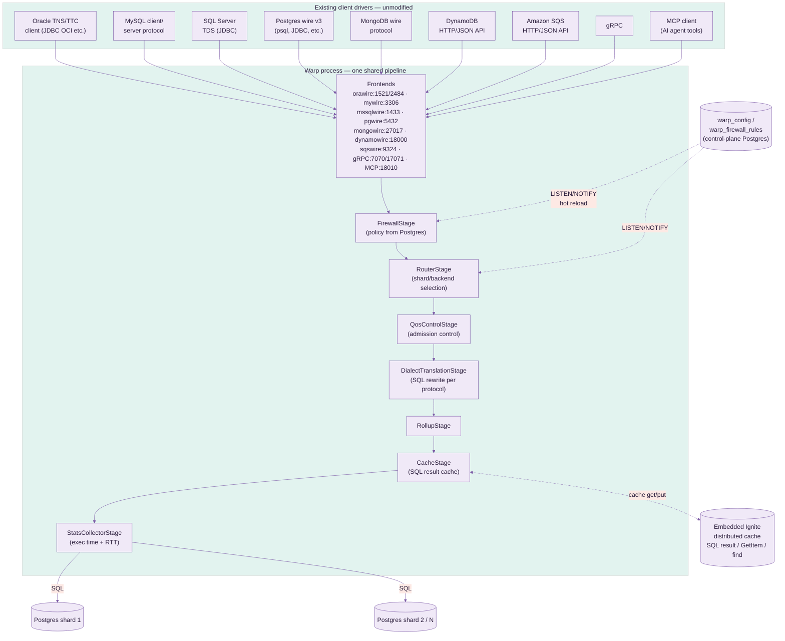
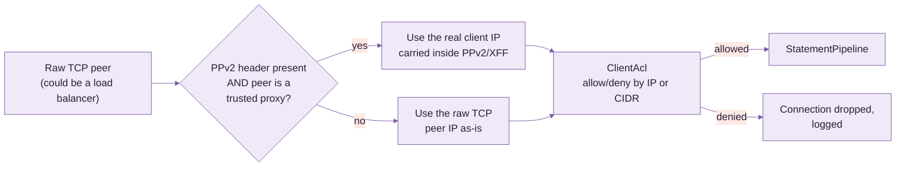
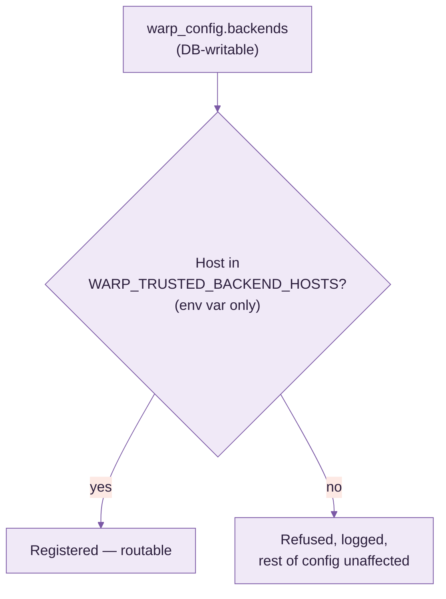
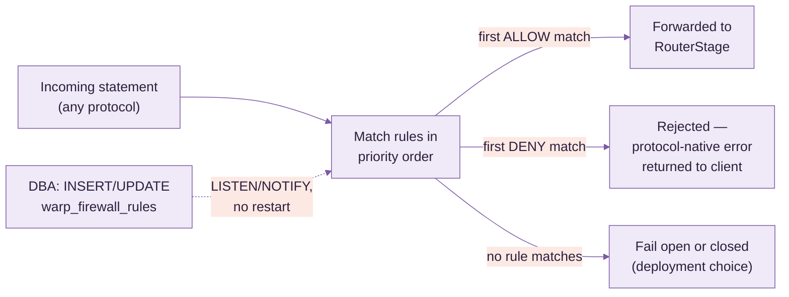
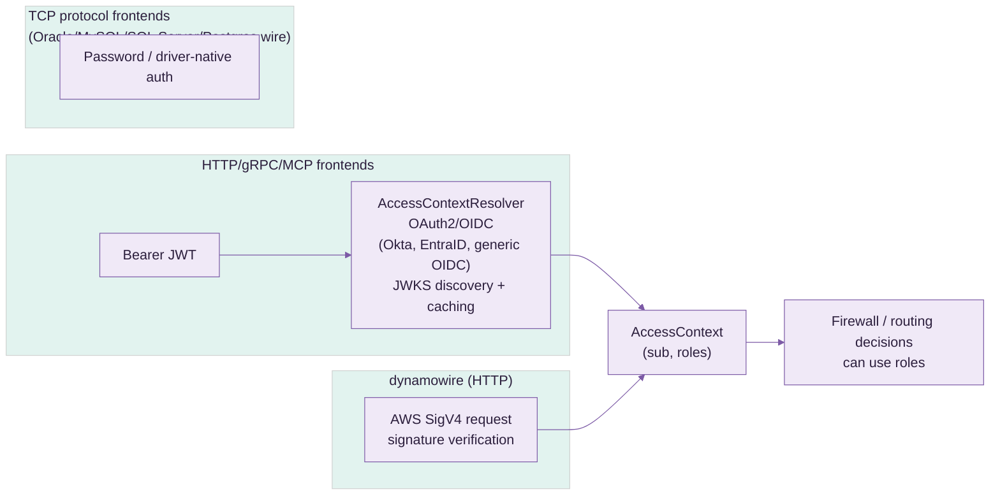
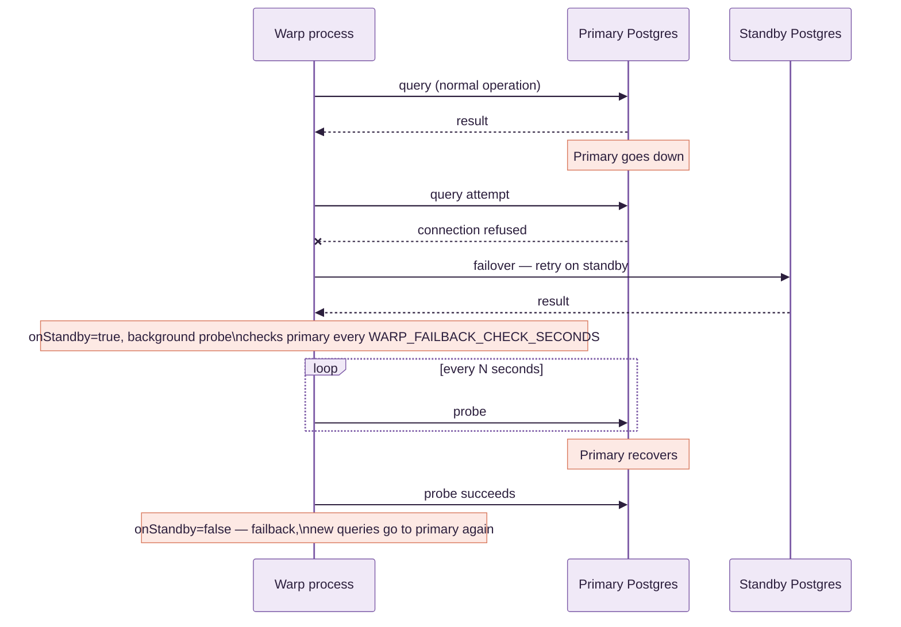
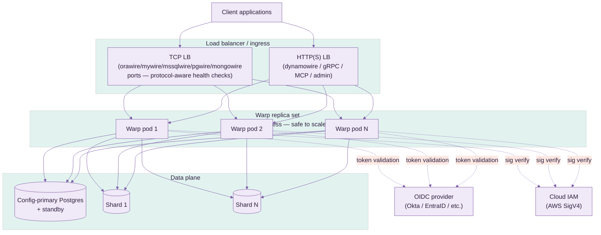

# Warp — Use Case & Deployment Guide

> **This is a technical/internal reference** for operators and contributors — pipeline internals,
> security, HA, deployment. If you're an application team looking to connect to Warp, start
> with [`USER_GUIDE.md`](USER_GUIDE.md) instead.

Warp is a mid-tier database gateway. It speaks Oracle TNS/TTC, MySQL client/server protocol,
SQL Server TDS, Postgres wire protocol v3, MongoDB wire protocol, DynamoDB's HTTP/JSON API,
Amazon SQS's HTTP/JSON API, gRPC, and MCP to clients — by default, translating and routing every
one of them to real Postgres backend(s), the wire-protocol-compatibility path for a pre- or
post-migration cutover (not a schema/data migration tool itself). mywire, orawire, mssqlwire, and
MCP can each also run in **native-backend mode** instead (§8.1.1): no translation at all, proxying
straight through to a real Oracle/MySQL/SQL Server database of your own — for keeping the engine
you already run, not just migrating off it. §4.4 covers a third, independent capability: real
Oracle/SQL Server/MySQL `WARP_BACKENDS` targets that Warp routes plain SQL to, federates `JOIN`s
against, and runs real distributed (XA) transactions across, alongside Postgres.

> **Performance**: every number claimed anywhere in this guide about latency, caching, or RTT is
> backed by a live before/after benchmark against a real client library, documented in
> [`PERFORMANCE.md`](PERFORMANCE.md) — not estimated.

> **On screenshots**: Warp is a headless gateway process — there's no UI to screenshot.
> Its "surface" is protocol traffic and the admin/metrics HTTP endpoint (`:19090`); once you
> have it running (see §4), I can capture the metrics endpoint's live output or a packet-level
> trace if that's useful.

---

## 1. What question it answers

**"Can my existing app, written against an Oracle/MySQL/SQL Server/MongoDB/DynamoDB driver,
talk to Postgres without a rewrite?"** — yes: point the app's connection string at Warp
instead of its original database, and Warp translates and routes to real Postgres.

Run it indefinitely as a permanent compatibility shim (e.g. legacy MongoDB driver code that's
not worth rewriting), or as a temporary cutover bridge while a migration tool moves schema/data
behind the scenes.

---

## 2. Architecture



- **One pipeline, many faces**: every SQL-shaped frontend (Oracle, MySQL, SQL Server, native
  Postgres, gRPC) feeds the *same* `StatementPipeline` instance — firewall, routing, QoS,
  translation, caching, and stats are protocol-agnostic. mongowire/dynamowire/sqswire don't build
  a SQL `Statement` (there's no dialect to translate), so they feed the shared metrics collector
  directly at their own single dispatch choke point instead — same dashboard, same `/api/metrics/
  summary`, different entry point. See §9 for the caching layer and §10 for what gets measured.
- **Config lives in Postgres, not just env vars**: `warp_config` (versioned, insert-only)
  and `warp_firewall_rules` (mutable, DBA-managed) are real tables in a designated
  "config-primary" Postgres. `LISTEN/NOTIFY` pushes changes to every running Warp process
  within milliseconds — no restart to change a firewall rule or add a backend.
- **Config-primary vs. data plane**: the `WARP_*` env vars point at the single Postgres
  that holds control-plane tables. `WARP_BACKENDS` / `WARP_SHARD_BACKENDS` are the
  separate, explicitly-registered data-plane shard targets actual queries are routed to — the
  config-primary is never automatically one of the shards.

---

## 3. Security

### 3.1 ACL (IP / CIDR allowlisting) & PPv2 / X-Forwarded-For



**ACL (`ClientAcl`)** — a plain, ordered allow/deny rule list evaluated per inbound
connection, on every frontend (pgwire, mywire, orawire, mssqlwire, mongowire, gRPC, dynamowire,
MCP, admin/metrics HTTP):

- Rule grammar: `allow <ip-or-cidr>` / `deny <ip-or-cidr>`, one per line/`;`-separated entry —
  e.g. `allow 10.0.0.0/8; allow 192.168.1.50; deny 0.0.0.0/0` (allow the private ranges you
  name, deny everything else).
- Sourced from **either** the env var (`WARP_ACL_RULES`) **or** `warp_config.aclRules`
  — same dual-source convention as every other setting; the DB-stored version hot-reloads via
  `LISTEN/NOTIFY` with zero restart.
- Default (unset) is fully open — no behavior change until you opt in.
- A rejected connection is dropped immediately, before it reaches the firewall/router stages,
  and logged with the offending IP — visible in Warp's own logs for audit.

**PPv2 (PROXY protocol v2) / `X-Forwarded-For`** — solves the problem that, once you put a
load balancer or connection pooler in front of Warp, every connection's raw TCP peer IP
*is the load balancer*, not the real client — so a naive ACL would only ever see one IP.

- `WARP_ACL_PPV2_ENABLED` (or `warp_config.aclPpv2Enabled`) turns on parsing of the
  PPv2 header (binary, used by TCP-level proxies — HAProxy, many cloud NLBs) or the
  `X-Forwarded-For` HTTP header (for the HTTP-based frontends) to recover the real client IP.
- **Trust is opt-in per proxy, not global**: `WARP_ACL_TRUSTED_PROXIES` (or
  `warp_config.aclTrustedProxies`) is a separate IP/CIDR list — the forwarded-IP header is
  only honored when the *direct* TCP peer is itself in this list. Without this check, any
  client could simply forge its own `X-Forwarded-For` header and impersonate an allowlisted IP
  — this is the exact spoofing vector the trusted-proxy check exists to close.
- Typical setup: `WARP_ACL_TRUSTED_PROXIES=10.0.0.0/24` (your load balancer's subnet),
  `WARP_ACL_RULES=allow 203.0.113.0/24` (the actual office/VPN range you want to allow) —
  Warp then correctly evaluates the ACL against the client's real IP even though every
  packet physically arrives from the load balancer.

### 3.2 Backend-poisoning protection

Because `WARP_BACKENDS` can be set via the DB-writable `warp_config` table, anyone
with write access to that table could otherwise register an arbitrary host and have real
client traffic silently routed to it (a config-driven SSRF). `TrustedBackendHosts`
(`WARP_TRUSTED_BACKEND_HOSTS`) closes this:



Deliberately **env-var only, never itself in `warp_config`** — if the allowlist lived in
the same DB-writable surface it gates, the protection would be circular. Entries accept IPs,
CIDR blocks, or literal hostnames (docker-compose service names, internal DNS).

### 3.3 SQL Firewall

Runs as its own pipeline stage (`FirewallStage`), first in line — every statement on every
frontend is checked before routing, translation, or execution. Rules live in a real,
DBA-managed Postgres table, **not** an env var or app config file, so a DBA can change policy
with an `UPDATE`/`INSERT` statement and see it apply in milliseconds, no Warp redeploy.



**Table schema** (`warp_firewall_rules`, auto-created, own `LISTEN/NOTIFY` trigger):

| column | meaning |
|---|---|
| `id` | primary key |
| `priority` | lower evaluates first; first matching rule wins |
| `action` | `ALLOW` or `DENY` |
| `statement_type` | `SELECT` / `INSERT` / `UPDATE` / `DELETE` / `DDL` / `*` (any) |
| `table_pattern` | glob against the target table, schema-qualification optional (`orders` matches both `orders` and `public.orders`) |
| `sql_pattern` | optional raw regex escape hatch — matched against the full SQL text when a table-level rule isn't expressive enough |
| `enabled` | boolean — disable a rule without deleting it |
| `description` | free text, shows up in denial logs |

**Example policy:**

| priority | action | statement_type | table_pattern | description |
|---|---|---|---|---|
| 10 | DENY | DELETE | `*orders*` | block bulk order deletes from any app |
| 20 | DENY | `*` | `*pii_*` | block all access (read or write) to PII-prefixed tables |
| 30 | DENY | `*` | `*` *(sql_pattern: `(?i)DROP\s+TABLE`)* | block DDL drops regardless of table name |
| 100 | ALLOW | `*` | `*` | default allow — everything not matched above |

**Config surface** — configured, like every other feature, from **either**:

- a plain SQL `INSERT INTO warp_firewall_rules (...)` (the intended day-to-day DBA path —
  no application deploy involved at all), or
- the equivalent Postgres stored procedure Warp ships (wraps the same insert/update with
  validation), for teams that prefer calling a procedure over hand-writing DML.

Changes are pushed to every running Warp process instantly via the table's `NOTIFY`
trigger — matches the same hot-reload mechanism used by `warp_config`, `ClientAcl`, and
`TrustedBackendHosts`.

### 3.4 Authentication



- OAuth2/OIDC bearer-token validation for every HTTP-based frontend (gRPC, MCP, admin API),
  with configurable claim mapping (`sub` → user id, custom claim → roles).
- AWS Signature v4 verification for `dynamowire`, opt-in via `WARP_AWS_IAM_CREDENTIALS`.
- TCP wire-protocol frontends (Oracle/MySQL/SQL Server/Postgres) authenticate with the
  client driver's own native password exchange, passed through to the real Postgres backend.

### 3.5 TLS

- `orawire` has a dedicated TLS listener (TCPS, port 2484) alongside plaintext TNS (1521).
- gRPC has a dedicated TLS listener (17071) alongside plaintext (7070).
- All built from one shared keystore — one cert to rotate, not one per frontend.

---

## 4. High Availability

### 4.1 Config-primary failover



- Configured via `WARP_STANDBY_HOST`/`WARP_STANDBY_PORT`. Applies to both the
  control-plane connection (`warp_config`/firewall rules) and, via `BackendTarget`'s
  `failoverOptions`, the actual query-execution path for the synthetic default backend.
- Explicitly-named shard backends (`WARP_BACKENDS`) do **not** get automatic failover — a
  named shard isn't presumed to be a replica pair of another named shard; pair them yourself
  at the infrastructure layer (e.g. a PgBouncer/HAProxy VIP per shard) if needed.
- Failback is automatic, probed in the background (`WARP_FAILBACK_CHECK_SECONDS`, default
  10s) — no manual intervention once the primary recovers.

### 4.2 Sharding / scatter-gather

`WARP_SHARD_BACKENDS` names a subset of the registered backends as a shard group;
`RoutingBackendExecutor` fans a matching query out to all of them and merges results — useful
for read-side aggregate queries across horizontally-partitioned Postgres backends. The protocol
frontends (DynamoDB, MongoDB, SQS, OpenSearch, InfluxDB, S3) now shard across the backends of a backend
set that enable them — see §4.7; `WARP_SHARD_BACKENDS` remains the fallback when no backend enables
the store.

### 4.3 Cross-shard / cross-backend JOIN federation

§4.2's scatter-gather path has a real, silent correctness gap: it broadcasts identical SQL to
every shard and concatenates/merges the results — wrong the instant a `JOIN`'s matching row pair
spans two different shards (never found on either shard alone, and no error raised). Two Calcite
federation engines close this gap by actually planning and executing the `JOIN`, not
broadcast-and-merge:

- **`ShardJoinExecutor`** — Warp's own homogeneous horizontal sharding (the SAME logical
  table split by row across every shard in a `WARP_SHARD_BACKENDS` group). Mounts each
  distinct `schema.table` reference in the query as a real `UNION ALL` across every shard's own
  copy, then hands the rewritten query to a real Calcite planner.
- **`SchemaFederationStage`** — Warp's own heterogeneous vertical/functional sharding
  (`WARP_ROUTER_SCHEMA_RULES` routing a whole table's traffic to one named backend, e.g. every
  `orders_db.orders` query to backend `orders`). Runs *before* `RouterStage` in the pipeline —
  federating across backends has to happen before routing narrows a statement to one target. Each
  matching backend is mounted directly as its own Calcite schema.

Both push predicates/columns down into each shard/backend's own SQL via Calcite's real JDBC
adapter rules (`JdbcRules`) — not a row-pull-and-join-in-Java.

**Real, statistics-driven cost-based planning.** When `StatisticsStore` is configured, every
mounted table is wrapped so Calcite's own join-order cost model sees a real row-count estimate
(Postgres's own `pg_class.reltuples`, the same number the Postgres planner itself already uses —
a single fast catalog lookup, not a `COUNT(*)` scan) instead of `Statistics.UNKNOWN`.
`StatisticsScheduler` proactively refreshes it in the background
(`WARP_STATS_REFRESH_INTERVAL_MINUTES`); a cold cache still gets a real number via an
on-demand probe on the first federated query after startup. TTL-bounded
(`WARP_STATS_TTL_MS`, default 24h) — a stale statistic degrades the cost estimate, never the
correctness of the result.

**Real semi-join pushdown.** Checked first whether Calcite already does this given real
statistics — it doesn't: no Bloom filter concept exists anywhere in Calcite (that's a runtime
technique with no portable way to ship into a remote backend's own SQL), and Calcite's own
semi-join rules can't apply to a federated join either (`JdbcJoinRule` only pushes a join down
when both sides already share one `JdbcConvention` — never true across two different mounted
backends). `SemiJoinPushdown` closes the gap with a real, exact filter instead: when a query is a
single, unambiguous equi-join between exactly two known table references, it collects the
smaller (build) side's real distinct join-key values (capped, `WARP_SEMIJOIN_MAX_KEYS`,
default 20,000) and pushes them down as a real `col IN (...)` predicate on the larger (probe)
side, before that side's own leaf query ever runs. Live-verified against two real Postgres
backends (10-row `customers`, 200,000-row `orders`, ~19,000 actually matching): the larger side's
real, MEASURED row count (not estimated) dropped from 200,000 to ~19,000 with an identical,
correct join result — a genuine ~90% reduction in what crossed the wire. Deliberately
conservative: no confident stats for both sides, an ambiguous `ON` clause, or either known table
reference appearing more than once in the statement (rules out self-joins) all just skip the
optimization — the real join still runs, only without the extra filter, never a wrong answer.

**Real SQL plan cache/history** (`SqlPlanStore`, `WARP_FEDERATION_PLAN_HISTORY=<capacity>` to
enable) — a `V$SQL_PLAN`-style record of every federated query's own real `EXPLAIN PLAN FOR` text,
timing, row count, and success/failure, visible in the admin UI (§11). Per-leaf-scan profiling
(`LeafScanProfiler`) goes further than `EXPLAIN PLAN FOR` (which only ever reports the planner's
own pre-execution ESTIMATE): it re-executes each leaf's own pushed-down SQL separately, with real
wall-clock timing and a real row count from actually iterating the result — the same honest
tradeoff a DBA manually running `EXPLAIN ANALYZE` on a suspect subquery makes.

**Cluster-shared, not just per-instance.** When Warp's embedded Ignite cluster is genuinely
multi-instance (`WARP_CLUSTER_ENABLED=true`, not just the default single-node cache-only
grid), both `StatisticsStore` and `SqlPlanStore` switch to an Ignite-backed shared cache instead
of a local `ConcurrentHashMap` — every instance sees the SAME row-count statistics and the SAME
federated-query plan history, regardless of which instance actually ran each query. Live-verified
with two real, separate JVM processes joining one real Ignite cluster: a plan/stat written by one
process was immediately visible to the other.

**Deliberately narrow scope, still**: a fresh Calcite connection per statement (no connection
cache), no native RLS/VPD session pass-through for the federated connection (`AccessControlStage`'s
own row-filter/column-mask SQL rewriting, run earlier in the pipeline, is the only enforcement),
and a statement referencing more than 2 federated backends in one query falls straight through to
scatter-gather's own broadcast-and-merge behavior, unfiltered.

**Real, declarative per-table sharding (`WARP_TABLE_SHARDS`).** Everything above (`ShardRule`)
needs a client to type a schema-qualifier prefix like `public.` in every query just to opt a
statement into scatter-gather — a real footgun (a client that queries `orders` unqualified, which
is completely normal, silently misses sharding and only ever sees one shard's own data) and not
how a table's own partitioning should actually work: it should be transparent, keyed by the
table's own bare name, with the query planner picking the fastest real path on its own.
`WARP_TABLE_SHARDS` is that: one declaration per table, `table:strategy:column:params`
(`|`-delimited between tables), reusing `ShardingStrategy` (hash/consistent/list/range/date, the
same real strategies `WARP_ROUTER_VALUE_SHARD_RULES` already has) —
`orders:hash:customer_id:shard1,shard2,shard3`. The table's own bare name is matched directly (no
qualifier needed anywhere), and the router picks the real fastest path per statement:

- A query that supplies a real literal value for the declared partition column (`WHERE
  customer_id = 42`) routes straight to the ONE shard `ShardingStrategy#resolve` says owns it —
  no scatter, no merge, same cost as a single-backend query. Same real, disclosed limitation
  `ValueShardColumnRule` already has: a client that BOUND the value as a parameter instead of a
  literal isn't detected this way (no real SQL parser threading bind positions back to column
  names) and just falls through to the path below instead — correct, not the fastest available.
- A query that doesn't (a full-table aggregate, or a `JOIN` of two declaratively-sharded tables)
  transparently falls back to scatter-gather (or a real federated `JOIN`, `ShardJoinExecutor`)
  across exactly THIS table's own declared shard set (`ShardingStrategy#allBackends`) — which can
  be a different subset of backends than any OTHER declaratively-sharded table uses, unlike
  `ShardRule`'s one shared `registry.shardGroup()`.

`WARP_ROUTER_SHARD_TABLES`/`WARP_ROUTER_VALUE_SHARD_RULES` keep working unchanged for
anyone not migrating — this is additive, not a replacement. Real vertical/functional sharding
(a whole table routed to one specific backend, no partitioning) is unaffected too; that's still
`WARP_ROUTER_SCHEMA_RULES` (§4.3's own `SchemaFederationStage`), a real, already-correctly-
scoped mechanism this doesn't duplicate.

**Named backend sets (`WARP_BACKEND_SETS`).** A `hash`/`consistent` params field above is
just a flat backend list typed out by hand every time — fine for one rule, tedious and
error-prone across several, and there's nowhere to give that set a name. `WARP_BACKEND_SETS`
is that: `name=backend1,backend2,...` entries, `|`-delimited (same convention
`WARP_TABLE_SHARDS` uses), each member checked against the real registered backend list at
config-load time — a typo fails loud at startup/reload, not silently at the first statement that
hits it. A set can mix engines freely: `all-engines=pg,ora,mysql,mssql,mongo` names a Postgres,
an Oracle, a MySQL, a SQL Server, and a MongoDB backend together. Reference the set's name
anywhere a `hash`/`consistent` backend list is otherwise expected —
`orders:hash:customer_id:all-engines` in `WARP_TABLE_SHARDS`, or as the params field of a
`WARP_ROUTER_VALUE_SHARD_RULES` entry — and `RouterStage` expands it to the set's members
(`BackendRegistry#backendSets`); a plain backend name alongside a set name in the same field
still works unchanged and de-duplicates against the set's own members. `list`/`range`/`date`
strategies name exactly one backend per value/range entry, not a flat set, so set expansion
doesn't apply there. Manage sets from the admin console's Backend sets page, or `PUT
/api/config` with a `backendSets` field, same as any other config.

### 4.4 Multiple backend engines (top-5-by-DB-Engines-ranking, alongside Postgres)

Warp used to be Postgres-only end to end, by explicit design (`BackendRegistry`/
`BackendConnectionPools`/`BackendTarget` all assumed it). **Oracle, SQL Server, and MySQL/MariaDB
are now real second/third/fourth backend engines** — not just something orawire's/mssqlwire's/
mywire's own wire-protocol frontends decode against, but real `WARP_BACKENDS` targets Warp
connects to, routes plain SQL to (read AND write), federates `JOIN`s against (§4.3), and
coordinates real `XAResource`-based 2PC transactions with (Oracle and SQL Server; MySQL's own
driver has no support for the 2PC path specifically — see below).

**`BackendDriverRegistry`** is the one place a real driver class gets chosen from a
`BackendTarget`'s own `jdbcUrl` prefix — `ShardJoinExecutor`, `SchemaFederationStage`,
`RollupStage`, and `BackendConnectionPools` all dispatch through it instead of each hardcoding
`"org.postgresql.Driver"`. **`XaBackendFactory`** dispatches separately (a backend can be a fine
plain read/write or federation target without being a real XA participant) — every one of Postgres,
Oracle, SQL Server, and MySQL gets a real, vendor-provided `XADataSource` implementation
(`PGXADataSource`, `OracleXADataSource`, `SQLServerXADataSource`, `MysqlXADataSource`), the same
real, proven shape the sibling Omnigate project uses for its own Postgres/Oracle pair.

**Live-verified against real instances of all three new engines**, with real bugs found and fixed
along the way — this project's own established discipline, not a claim taken on faith:

- Plain routed `SELECT`/`INSERT` against Oracle, SQL Server, and MySQL all worked through the
  existing, previously Postgres-only `RoutingBackendExecutor`/`JdbcBackendExecutor` path with
  **zero code changes** to that layer — plain JDBC `PreparedStatement`, no Postgres-specific SQL.
- A real cross-engine `JOIN` — Postgres `orders_db.orders` (~200 real, skewed rows) `JOIN` a
  10-row `customers_db.customers` table — returned correct, exact per-customer counts against
  **each** of Oracle, SQL Server, and MySQL in turn. Real bugs found and fixed getting there:
  1. `BackendConnectionPools` hardcoded `"org.postgresql.Driver"` unconditionally — crashed
     HikariCP pool creation for any non-Postgres URL. Now dispatches through
     `BackendDriverRegistry`.
  2. Oracle folds an unquoted schema/user name to UPPERCASE in its own catalog (Postgres folds to
     lowercase, SQL Server/MySQL preserve case as typed) — Calcite's backend-side table lookup
     needs that real casing even though the client's own SQL can still reference the schema in
     whatever case it likes (`BackendDriverRegistry.realCatalogSchemaName`).
  3. `BackendConnectivityTest`'s health-check probe used `SELECT version()` unconditionally (a
     Postgres — and, coincidentally, real MySQL — function) — marked a healthy Oracle/SQL Server
     backend DOWN with a real syntax error. Now dialect-aware (`v$version` for Oracle,
     `@@VERSION` for SQL Server).
  4. `DialectTranslationStage` had never had SQL Server as a translation *target* before — its
     `RENDERERS` table had no entry for it at all, forcing even a plain ANSI `INSERT`/`SELECT`
     into an (unconfigured) LLM fallback. Added a real `renderSqlServer`, handling `LIMIT n` →
     `OFFSET 0 ROWS FETCH NEXT n ROWS ONLY` the same way the existing `renderOracle` handles
     `LIMIT n` → `FETCH FIRST n ROWS ONLY`.
  5. A JDBC URL containing a literal `;` (SQL Server's own property separator, e.g.
     `;databaseName=x;encrypt=false`) collided with `WARP_BACKENDS`' own `;`-delimited entry
     separator — silently truncated the URL. The existing `%3B` escape (already documented for
     this exact reason) fixes it; a real, easy-to-hit config trap for any semicolon-bearing JDBC
     URL, not SQL-Server-specific.
  6. `TrustedBackendHosts.isTrusted()` only ever recognized `jdbc:postgresql:` URLs — with
     `WARP_TRUSTED_BACKEND_HOSTS` enabled, every other real engine's own URL shape returned
     "not trusted" (silent, full refusal), defeating the whole feature for a non-Postgres backend.
     Extended to recognize Oracle's `thin:@//host:port` shape and the plain `host:port`-style URLs
     SQL Server/MySQL/MariaDB use.
- An unbounded Oracle `NUMBER` column (no explicit precision) makes Calcite reject the plan
  outright (`DECIMAL precision 0 must be between 1 and 19`) — a real, disclosed limitation:
  Oracle tables federated into a `JOIN` need an explicit `NUMBER(p[,s])` precision today, not the
  common unconstrained-`NUMBER` idiom.
- Real, full 2PC — one client `BEGIN`/`COMMIT` touching both a real Postgres backend and a real
  Oracle **or** MySQL backend genuinely prepared and committed atomically across both engines.
  MySQL's own real, Oracle-published Connector/J ships a real `MysqlXADataSource` and it actually
  works end to end — a genuine improvement over the sibling Omnigate project's own broader
  "MySQL/MariaDB has no usable XADataSource" finding, which was specifically about the *MariaDB*
  driver, a different vendor's implementation. **SQL Server's own XA path is real code, but not
  live-verified working** — a fresh SQL Server instance needs the driver's own `sqljdbc_xa`
  MSDTC support procedures (`xp_sqljdbc_xa_init_ex` etc.) installed server-side before any XA
  transaction can even start, a genuine Microsoft-documented prerequisite this project's own test
  instance (a Linux-based Azure SQL Edge container) doesn't have installed and — being a
  reduced-feature SQL Server variant on Linux, with no native MSDTC service — may not support at
  all; a real, disclosed gap, not assumed away.
- Real, standard operational prerequisites had to be met before Postgres/Oracle 2PC worked at all
  (neither is a Warp bug): Postgres's own `max_prepared_transactions` defaults to 0 (2PC is
  off until an operator raises it), and Oracle requires an operator grant on
  `DBA_2PC_PENDING`/`PENDING_TRANS$`/`DBMS_SYSTEM` before any schema can participate in a
  distributed transaction at all — undocumented anywhere in this project until now, worth calling
  out explicitly for anyone deploying this for real.

**MongoDB was attempted and reverted — a real, unresolved blocker, not started work.** MongoDB
isn't JDBC/SQL at all, so the JDBC-based approach above doesn't apply; the real path tried was
Calcite's own `calcite-mongodb` adapter (mounting a real MongoDB database as a Calcite schema, the
same real mechanism used for every JDBC engine). It hit a genuine, verified binary-incompatible
version conflict: `calcite-mongodb:1.42.0` is compiled against `mongodb-driver-sync:4.10.2`
(confirmed directly from its own real `pom.xml`), but this project's own `mywire`/`mongowire`
compatibility work already requires `mongodb-driver-sync:5.5.1` (documented lockstep-version
requirement with `bson`, elsewhere in `pom.xml`) — connecting real Mongo 7 to a `MongoSchema`
built this way throws a real `NoSuchMethodError` (`MongoDatabase.listCollectionNames()`, a method
whose signature changed across that major version gap) the moment Calcite tries to list the
database's own collections. Downgrading the driver project-wide would regress `mongowire`'s own
real, tested functionality; there's no supported way to run two major versions of the same driver
in one shaded jar. Real follow-up options, none attempted yet: a newer `calcite-mongodb` release
built against a 5.x driver (would mean upgrading `calcite-core` project-wide too — a much larger,
riskier change given how much of §4.3's own federation work depends on today's pinned 1.42.0
behavior), or a hand-written MongoDB executor bypassing Calcite's adapter entirely.

### 4.5 Non-SQL protocol storage: backend-engine prerequisites and limitations

`dynamowire`, `influxwire`, `sqswire`, and the Bolt/Cypher graph frontend (`boltwire`) don't speak
SQL to their clients, but every one of them stores its own data as real SQL underneath, in a real
backend — `PgItemStore`, `PgTimeSeriesStore`, `PgQueueStore`, `PgGraphStore`. §4.4 above is about
letting *SQL-speaking* clients (pgwire/orawire/mywire/mssqlwire) reach a non-Postgres backend; this
section is about whether these *other four* protocols' own storage can too — a genuinely different
question, since each one owns its own schema and query logic rather than just passing through
whatever SQL a client sent.

**Real DDL, no longer hardcoded in Java.** Every one of these stores used to build its own
`CREATE TABLE`/`CREATE INDEX` text as inline Java string literals — real engine differences had
nowhere to live but a pile of if/else branches inside otherwise storage-logic-only methods. DDL
now lives in `Warp/src/main/resources/ddl/<engine>/<name>.sql` (`postgres`/`oracle`/`sqlserver`/
`mysql`), loaded and parameterized (`${table}`) at runtime by `DdlTemplates` — a real, engine-keyed
directory, not a config format for its own sake: `BackendDriverRegistry.engineDirFor`-equivalent
dispatch (`DdlTemplates.engineDirFor`) picks the right file from a `BackendTarget`'s own `jdbcUrl`,
the same real dispatch shape §4.4's `BackendDriverRegistry` already uses for driver classes.

**Only two of the four can even reach a non-default backend today.** `PgItemStore` (dynamowire)
and `PgQueueStore` (sqswire) both support real shard routing (`WARP_SHARD_BACKENDS` — hashing
by DynamoDB partition key / SQS queue name, same as real DynamoDB/SQS partitioning), so a shard
group member CAN be an Oracle/SQL Server/MySQL backend. `PgTimeSeriesStore` (influxwire) and
`PgGraphStore` (boltwire) only ever call `backendRegistry.resolveForRouting(DEFAULT_BACKEND_NAME)`
— no sharding at all — and the default backend doubles as Warp's own control-plane connection
(`warp_config`, `warp_firewall_rules`, `LISTEN/NOTIFY`), which has to stay Postgres. Adding
real shard routing to these two is a real, scoped, not-yet-started follow-up — until then, their
own storage is Postgres-only regardless of what other backends are configured.

**Live-verified, real per-engine status, table DDL vs. query logic kept separate on purpose** —
DDL portability and query portability are genuinely different problems, and this project only
solves what it's actually solved, not by engine-level vibes:

| Store | Protocol | Can target a non-default backend | Table DDL | Query logic (INSERT/SELECT/UPDATE) |
|---|---|---|---|---|
| `PgItemStore` | dynamowire | Yes (`WARP_SHARD_BACKENDS`) | **Real DDL for all 4 engines**, live-verified (`CreateTable` actually succeeds against real Oracle/SQL Server/MySQL instances) | Postgres-only (`ON CONFLICT`, `::jsonb` casts — a real, live-confirmed failure on MySQL: `PutItem` still fails past `CreateTable`) |
| `PgTimeSeriesStore` | influxwire | No (default-backend only) | Real DDL exists for all 4 engines (each engine's own `CREATE TABLE ddl/<engine>/influxwire_measurement_table.sql`, live-verified directly against real Oracle/SQL Server/MySQL) but unreachable in practice until shard routing is added | Postgres-only (`->`/`->>` jsonb operators, `date_bin()`) |
| `PgQueueStore` | sqswire | Yes (`WARP_SHARD_BACKENDS`) | **Real DDL for all 4 engines**, live-verified | **Real query support for all 4 engines**, live-verified end to end — CreateQueue, SendMessage, ReceiveMessage (including FIFO group-exclusion and dedup), DeleteMessage, ChangeMessageVisibility, GetQueueAttributes, DeleteQueue, against real Oracle/SQL Server/MySQL instances |
| `PgGraphStore` | Bolt/Cypher graph frontend | No (default-backend only) | Postgres-only — the `labels TEXT[]` array column has no cross-engine equivalent at all; a real port needs a schema redesign (JSON array column or a normalized join table), not a syntax swap | Postgres-only |

**Real bug found and fixed along the way**: `PgItemStore.createTable()` used to write its own
catalog metadata row (`_dynamo_tables`) *before* attempting the real backend `CREATE TABLE` — a
DDL failure on the real backend (the MySQL `jsonb`-syntax failure that motivated this whole
section, but just as real for a plain transient Postgres failure) left the metadata row committed
and orphaned, so every later `CreateTable` for that same name permanently, incorrectly reported
`ResourceInUseException` ("already exists") instead of the real cause — confirmed live: the client
only ever saw a misleading result from boto3's own automatic retry of the original failed call.
Physical DDL now runs first; the catalog row is only written once the real table genuinely exists.

**Real, disclosed engine-specific DDL quirk, found live**: Oracle treats an empty string (`''`) as
`NULL` — dynamowire's own "no sort key" convention (`sk_value` defaults to `''`) would violate the
item table's own `PRIMARY KEY (pk_value, sk_value)` `NOT NULL` requirement the instant such an item
reached Oracle (confirmed live: `ORA-01400`). The table DDL itself is real and correct — verified
with a non-empty `sk_value` — but a real fix for the empty-sort-key case needs a non-empty sentinel
value on Oracle specifically, not attempted here.

**sqswire is now a genuinely portable queue, not just DDL** — designed deliberately, not by
mechanically translating Postgres syntax. Each engine's own real idiomatic queue mechanism was
researched before writing any code (Oracle's own JDBC driver really does support a real
single-statement `RETURNING INTO` via `OraclePreparedStatement.registerReturnParameter`, and SQL
Server has a real, first-class `OUTPUT` clause equivalent to `RETURNING` — but adopting either
would mean a real, separate engine-specific Java code path). The deliberate design instead: keep
Postgres's own single-statement `UPDATE ... WHERE msg_id = (SELECT ... FOR UPDATE SKIP LOCKED)
RETURNING ...` claim untouched, and give Oracle/SQL Server/MySQL one shared, real, portable
**two-statement** claim (`SqswireDialect`) — a `SELECT ... FOR UPDATE` with each engine's own real
lock-skip hint (`FOR UPDATE SKIP LOCKED` for MySQL/Oracle, `WITH (ROWLOCK, READPAST, UPDLOCK)` for
SQL Server) to find and lock a candidate row, then a plain `UPDATE ... WHERE msg_id = ?` to claim
it — both in one real transaction on the same connection. One extra real round trip per claim on
those three engines versus Postgres's own single statement, a disclosed tradeoff for a uniform
code path, not a hidden cost. Insert-id capture (`SendMessage`) uses the standard portable JDBC
`getGeneratedKeys()` API instead of `RETURNING`, real and simple across all three.

Real, live-verified end to end against real Oracle, SQL Server, and MySQL instances — CreateQueue,
SendMessage (real `AUTO_INCREMENT`/`IDENTITY` ids), ReceiveMessage (including real FIFO
group-exclusion and dedup-window logic, not just plain-queue claiming), DeleteMessage,
ChangeMessageVisibility, GetQueueAttributes counts, and DeleteQueue/recreate — with real bugs found
and fixed along the way:

- **Oracle's own `Statement.RETURN_GENERATED_KEYS`** returns a `ROWID`, not the real generated
  column value, unless the generated column is named explicitly — the generic JDBC flag produced a
  real `ORA-17132: Invalid conversion requested` the moment the code tried to read it as a `long`.
  Fixed by using the real, standard `prepareStatement(sql, String[] columnNames)` overload instead
  (portable JDBC API, not Oracle-specific — harmless and equally correct on MySQL/SQL Server too).
- **Oracle rejects `ORDER BY ... FETCH FIRST n ROWS ONLY FOR UPDATE` outright** (`ORA-02014`) — and,
  found live right after switching to the textbook pre-`FETCH FIRST` `ROWNUM`-filtered-subquery
  idiom, that ALSO fails with the identical `ORA-02014`, since that subquery still carries the same
  `ORDER BY`. The real, actually-working idiom (confirmed against real Oracle community reports of
  the same wall): pick the target row's own `ROWID` through an `ORDER BY`-bearing view with NO
  `FOR UPDATE` on it at all, then a separate outer query — a trivial `ROWID` equality lookup, no
  `ORDER BY` of its own — is what actually carries `FOR UPDATE SKIP LOCKED`.
- **A real, pre-existing, non-engine-specific bug**, found live testing `DeleteQueue`+recreate: the
  `tableEnsured` per-(queue,backend) cache was only ever set, never invalidated on `DeleteQueue` —
  recreating a queue right after deleting it silently skipped `CREATE TABLE` on the next
  `SendMessage`, since the cache still thought the just-dropped table existed, producing a real
  "relation/object does not exist" failure instead of transparently recreating it. This bug existed
  on Postgres too, before this work — just never live-tested this specific sequence before now.

**TimescaleDB is a real, optional Postgres extension, not a hard requirement** — `PgTimeSeriesStore`
detects it (`SELECT 1 FROM pg_extension WHERE extname = 'timescaledb'`) and only calls
`create_hypertable(...)` when it's actually installed; without it, `influxwire` still works
correctly against plain Postgres, just without chunked partitioning/retention-deletion performance
(every write/query path — including the `date_bin()`-based time-bucketing aggregation — is
byte-for-byte identical between the hypertable and plain-table paths by design). This capability
has no equivalent at all on Oracle, SQL Server, or MySQL — none of the three expose a matching
`create_hypertable()`-style call (all three DO have their own native table partitioning, but
wiring that in is a separate, from-scratch feature, not a substitution for TimescaleDB's own real
mechanism); once influxwire gains real shard routing, those three engines' own measurement tables
will simply stay plain tables permanently, the same real, already-proven-safe fallback behavior
Postgres itself gets without the extension.

### 4.6 Multi-AZ distributed cache

The distributed cache (Ignite, `com.sayonora.warp.cluster.WarpCluster`) is cloud-native and
AZ-aware: cluster discovery via `WARP_CLUSTER_DISCOVERY=static|s3|gcs|azure` (not just a
static IP list), a configurable backup count (`WARP_CLUSTER_CACHE_BACKUPS`, default 1) whose
placement is AZ-aware — a cache entry's backup never lands on a node in the same
`WARP_AVAILABILITY_ZONE` as its primary, live-proven by
`WarpClusterAzBackupPlacementTest` (three real Ignite nodes, not a simulation) — and TLS
between cache nodes via `WARP_TLS_KEYSTORE`, live-verified both positive (two nodes on the
same keystore form one cluster) and negative (a third node on a different keystore fails the
handshake and never joins).

What's still genuinely open: the S3/GCS/Azure discovery finders are verified against the real
Ignite classes but not yet exercised against real cloud storage (no cloud credentials available
to test with in this environment — static discovery is the only mode live-tested end to end), AZ
is operator-supplied rather than auto-detected from cloud instance-metadata, and split-brain
behavior under a network partition is unaddressed (backup placement guarantees each AZ *would*
hold a full copy if reachable, not that reads stay consistent during a partition).

---

### 4.7 Backend sets and enabled stores

**Every backend belongs to a backend set, and a Postgres backend can host protocol stores.** This is
the one place backends are added, edited and removed (Admin UI → *Backend sets*, or the admin API
below).

**One concept, one name.** Warp used to have two look-alikes: `WARP_BACKEND_GROUPS` (every backend in
exactly one group; what an MCP scope `group:<name>` names) and `WARP_BACKEND_SETS` (named lists a
backend may appear in several of, used inside router rules). The user-facing **backend set** is the
first: a set has a name and an optional description, and every backend is in exactly one. A backend
with no declared group lives in the implicit set `default`, so **an existing config needs no migration
and behaves exactly as before** (`default` is the set holding the `default` backend). The older
multi-membership `WARP_BACKEND_SETS` is unchanged, is now called *router aliases*, and is edited under
"Advanced" on the Backend sets page.

**Enabled stores.** A Postgres backend can be asked to *host* any of `influxdb`, `mongodb`, `sqs`,
`neo4j`, `opensearch`, `dynamodb`, `s3` -- and the later `redis`, `azblob`, `azqueue`, `aztable`, `gcs`, `pubsub`, `firestore` and `datastore` (each has its section below). Enabling a store on a backend means:

* Warp creates that protocol's schema **in that Postgres**, idempotently, before the change is
  saved (fixed catalog/graph tables, plus a `warp_enabled_stores` marker table; per-collection tables
  such as Mongo collections, Influx measurements, OpenSearch indexes, DynamoDB item tables and SQS queue
  tables are created on first use on every host). If the schema cannot be created the request fails
  and nothing changes.
* The protocol frontend reads and writes there instead of the hard-wired `default` backend, and MCP
  lists the store as a typed store of the backend (§8.5.2).
* Only Postgres backends may enable stores; anything else is rejected with HTTP 400.
* **Disabling never drops data.** Warp stops serving the store; the tables and rows stay in that
  database. (There is deliberately no purge switch: drop the tables yourself if you want them gone.)

**Which set does a frontend serve?** The set that holds the `default` backend, unless a per-frontend
setting names another set:

| Setting | Frontend |
|---|---|
| `WARP_DYNAMOWIRE_SET` | DynamoDB (`dynamodb`) |
| `WARP_SQSWIRE_SET` | SQS (`sqs`) |
| `WARP_MONGOWIRE_SET` | MongoDB (`mongodb`) |
| `WARP_INFLUXWIRE_SET` | InfluxDB (`influxdb`) |
| `WARP_OSWIRE_SET` | OpenSearch (`opensearch`) |
| `WARP_BOLTWIRE_SET` | Neo4j (`neo4j`) |
| `WARP_S3WIRE_SET` | S3 (`s3`) |
| `WARP_FIRESTOREWIRE_SET` / `WARP_DATASTOREWIRE_SET` | Firestore (`firestore`) / Datastore (`datastore`) |
| `WARP_SNSWIRE_SET` / `WARP_KINESISWIRE_SET` / `WARP_AWSPARAMSWIRE_SET` | SNS (`sns`) / Kinesis (`kinesis`) / Secrets, SSM, KMS, STS (`awsparams`) |

A store enabled on a backend in a set the frontend does not serve is reported as `servedFromThisSet:
false` and does nothing. **A store enabled on no backend keeps its previous behavior** (the `default`
backend, or the `WARP_SHARD_BACKENDS` group for DynamoDB/MongoDB/SQS/OpenSearch), which is why
single-backend deployments are unchanged.

#### Sharding across the backends of a set

When several backends of the set enable the same store, the frontend **shards across them**, using the
same hash machinery as `WARP_SHARD_BACKENDS` (`ShardingStrategy.hash` over the enabled backends in the
order they were declared in `WARP_BACKENDS`; the mapping of a key is stable as long as that host list
is unchanged). With one enabled backend all data lives there.

| Store | Shard key | Point operations | Scatter-gather (merged) | Not supported on several hosts |
|---|---|---|---|---|
| DynamoDB | table + partition key | PutItem, GetItem, UpdateItem, DeleteItem, Query on the table or an LSI | Scan and parallel Scan (exact global `(pk, sk)` order, so `Limit`/`ExclusiveStartKey` pagination is exact), GSI Query/Scan (k-way merge in index order), item and index counts, TTL sweep, PartiQL SELECT, ListTables (catalog on the first host); table/index DDL (CreateTable, UpdateTable) runs on every host | a `TransactWriteItems` spanning hosts commits one database transaction per host after locking and validating everything (see *The DynamoDB store*); a host failing at commit time after another committed leaves a partial transaction |
| MongoDB | collection + `_id` (canonical key: `1`, `1L`, `1.0` are the same `_id`) | insert, find/update/delete by `_id` (only the owning shards are read) | **everything else**: every host's documents are scanned and the query, sort, skip/limit, projection, update, aggregation pipeline (all stages and expressions), `count`, `distinct`, cursors and `findAndModify` run **once** over the merged stream, so answers are exact whatever the topology; a unique index is enforced through key-ownership rows placed on the host that hashes the index key | a multi-document write that fails midway leaves the documents already written (as in MongoDB), but which ones were reached first depends on the host scan order; see *The MongoDB store* |
| SQS | queue name | a queue **lives wholly on one host**, so send/receive/visibility/FIFO ordering are exactly the single-host behavior | ListQueues (catalog on the first host) | dead-letter redrive between queues on different hosts is a best-effort two-step move |
| InfluxDB | measurement + full tag set (one series never splits) | line-protocol writes | every InfluxQL statement: each host returns the raw points the query needs (time range and tag equality pushed down to SQL), the points are merged and evaluated once, so **every** function is exact across shards -- count/sum/min/max/mean and also median, percentile, mode, stddev, spread, distinct, top/bottom, integral, derivative, moving_average, GROUP BY time with fill(); LIMIT/OFFSET/ORDER BY apply after the merge; DELETE / DROP SERIES / DROP MEASUREMENT / DROP DATABASE run on every host (catalog on the first host) | a write batch spanning hosts is applied host by host; if one host fails the error names the points that were **not** written (see *The InfluxDB store*) |
| OpenSearch | index + `_id` | index/get/update/delete/bulk/`_mget` by `_id` | the full search surface (query DSL, sort, `from`/`size`, `search_after`, scroll, aggregations, k-NN and hybrid) is evaluated over the documents of every host, so results and aggregations are exact; relevance is scored per host (see *The OpenSearch store*) | scroll and point-in-time contexts live in the memory of the Warp node that created them |
| S3 | bucket + object key | PutObject, GetObject (Range), HeadObject, DeleteObject, tagging, ACLs, versions (a key and all its versions live on one shard), CopyObject within a shard, multipart incl. ListParts/UploadPartCopy (an upload lives wholly on the shard owning its key) | ListObjects v1/v2 and ListObjectVersions / ListMultipartUploads (k-way merge in key order; common prefixes de-duplicated), ListBuckets and CreateBucket/DeleteBucket and every bucket configuration document (bucket catalog on the first host), DeleteObjects (grouped by shard), CopyObject across shards (streamed through Warp) | see *The S3 store* below |
| Firestore | database + document path | Get/Create/Update/DeleteDocument, single-document commits, transactions on one host (only the owner is read/locked) | collection and collection-group queries, ListDocuments, ListCollectionIds, aggregation, Listen (exact global `__name__` order via k-way merge of 1,000-row keyset pages; ordered-by-field queries collect their matches) | a commit spanning hosts is atomic except for a failure between the first and last `COMMIT` (no two-phase commit) |
| Datastore | partition + ROOT ancestor key (an entity group never splits) | Lookup, entity-group commits and transactions, ancestor queries (one host, key-range scan) | kind and kindless queries, projections, aggregation (k-way merge by key; ordered-by-property queries collect their matches) | a commit spanning entity groups on several hosts: same cross-host caveat as Firestore; ids come from one counter on the first host |
| Neo4j | — | — | — | **not sharded** (below) |

`BatchWriteItem` is not atomic (as in real DynamoDB): on several hosts a write that fails on its host is
returned in `UnprocessedItems` for the client to retry instead of failing the whole call.

**Neo4j: one backend per set.** The graph store (`warp_graph_nodes`/`warp_graph_edges`) cannot answer
traversals correctly when nodes and relationships are spread across several databases, so enabling Neo4j on
a second backend of the same set is rejected with a validation error that says why. This is the one
exception to "several hosts ⇒ sharding". A different set may host Neo4j on its own backend.

**Neo4j / Bolt (`boltwire`) in detail.** The official Neo4j drivers connect to `WARP_BOLTWIRE_PORT` (7687).

- *Protocol*: Bolt 5.0-5.4 and 4.4 (highest offered wins), HELLO/LOGON/LOGOFF (no authentication is performed),
  RUN, PULL/DISCARD with `n` and `qid`, BEGIN/COMMIT/ROLLBACK, RESET (FAILED-state IGNORED semantics), ROUTE (a
  routing table pointing at the address the client used, so `neo4j://` works), TELEMETRY, GOODBYE, chunked messages;
  the server agent is `Neo4j/5.26.30`. PackStream: every value type (int64, floats incl. NaN/Inf, bytes, unicode,
  lists, maps, Node/Relationship/Path with 4.x and 5.x layouts, Date/Time/LocalTime/DateTime/LocalDateTime/Duration,
  Point2D/3D).
- *Cypher*: a real parser, compile-time semantic analysis (Neo4j's SyntaxError family: undefined variables, type
  conflicts, ambiguous aggregation, clause composition ...) and an executor over the graph tables. Supported:
  MATCH / OPTIONAL MATCH (labels, properties, directions, type alternatives, variable-length paths, path variables,
  shortestPath / allShortestPaths, relationship uniqueness), WHERE (all predicates, pattern predicates, EXISTS/COUNT/COLLECT
  subqueries), WITH / RETURN (DISTINCT, ORDER BY, SKIP, LIMIT, aggregation incl. percentiles and stDev), UNWIND, UNION
  [ALL], CALL {} subqueries, CREATE, MERGE (ON CREATE / ON MATCH), SET (`=`, `+=`, labels), REMOVE, DELETE / DETACH DELETE,
  FOREACH, CASE, list / map / string / math / temporal (`date`, `time`, `datetime`, `localtime`, `localdatetime`,
  `duration`, truncation, arithmetic) / point functions, comprehensions, quantifiers, `reduce`, map projections.
  Parameters (`$param`) of every type. Procedures: `db.labels`, `db.relationshipTypes`, `db.propertyKeys`, `dbms.components`
  and a few more; `SHOW INDEXES|CONSTRAINTS|PROCEDURES|FUNCTIONS|DATABASES`.
- *Transactions*: auto-commit statements run in one backend transaction each; `BEGIN` pins one backend connection until
  COMMIT / ROLLBACK / RESET / disconnect (see 4.8 "Connection multiplexing"); a failed statement rolls the transaction
  back like Neo4j. Read-only statements run lazily at PULL (runtime errors surface there), updating ones at RUN.
- *Schema*: `CREATE CONSTRAINT ... REQUIRE ... IS UNIQUE` (a real unique partial index; violations are
  `Neo.ClientError.Schema.ConstraintValidationFailed`), `CREATE INDEX` (range / text; composite), `DROP`, `IF [NOT] EXISTS`.
- *Verified against real Neo4j 5.26*: the openCypher TCK (3,810 scenario instances that pass on real Neo4j all pass on
  Warp; error scenarios must return the same status code) and a ~950-case differential corpus replayed from recorded golden
  answers (`Warp/tests/python/bolt_conformance/`, `test_boltwire_conformance.py`).
- *Differences from Neo4j*: property key order follows jsonb (length, then alphabetical) instead of creation order;
  node deletions are checked at the end of each statement, not at commit; data and schema changes may share a
  transaction; `valueType()` prints `LIST<ANY>` for heterogeneous lists and `ANY` for byte arrays; the `system` database and
  security commands (users, roles, `SHOW CURRENT USER`) do not exist; an unmatched Bolt `db` name goes to the default backend
  unless strict routing rejects it. The full list is `bolt_known.py`.
- *Not supported* (clear Neo4j-style errors): full-text and vector indexes, relationship-property indexes and constraints,
  property-existence / node-key / property-type constraints (Enterprise features), APOC, GDS, `LOAD CSV`, `CREATE DATABASE`
  and other multi-database administration, cluster routing beyond a single-member table, EXPLAIN / PROFILE plans, user
  procedures. The graph lives on one Postgres backend (it is not sharded).
- *Implementation note*: Cypher is interpreted in Java over row sets; only label scans, scalar property equality and
  one-hop expansions are pushed to SQL (jsonb containment, `(from_id, type)` indexes). Very large traversals are therefore
  slower than in Neo4j.

#### Adding a backend does not rebalance

Adding a host (or enabling a store on one more backend) changes the host list, so keys re-hash over the
new list. **Warp does not move existing data.** The write/patch/delete response lists every affected store
in `rebalanceRequired` (`store`, `before`, `after`, `message`), the UI shows it as a warning, and Warp
logs it. Data written before the change stays where it was written and is no longer found for keys that now
hash elsewhere until it is copied to the host they hash to. What to do: enable the store on the extra
backend **before** the store has data; or copy the rows yourself (each store's tables have the same name
and shape on every host: `dynamo_item_<table>`, `sqs_queue_<queue>`, `"<db>"."<collection>"`,
`warp_influx_<measurement>`, `warp_search_<index>`, `warp_s3_objects`/`warp_s3_chunks`), moving each key to the host `ShardingStrategy.hash`
picks. Removing a host has the same effect. The catalogs (`_dynamo_tables`, `sqs_queues_catalog`) live on
the **first enabled host in declaration order**; keep it first.

#### Admin API

All calls take the admin bearer token, return JSON, and persist as a new `warp_config` version that every
Warp instance hot-reloads over `LISTEN/NOTIFY` (`backendStores` and `backendSetNames` sit next to
`backends`/`backendGroups`; `WARP_BACKEND_STORES=pg2=mongodb,sqs|default=dynamodb` and
`WARP_BACKEND_SET_NAMES=a,b` are the env spellings). The raw `PUT /api/config` route still works but
runs the same store validation.

| Call | Purpose |
|---|---|
| `GET /api/backend-sets[?health=true]` | Every set with its backends: `name`, `type`, `family`, masked `url`, `description`, `enabledStores`, `canHostStores`, `state`, `health` (live connectivity probe with `health=true`), plus per set `stores` (`hosts`, `sharded`, `servedFromThisSet`) and the store catalog |
| `POST /api/backend-sets` | `{"name","description"}` → 201 |
| `PATCH /api/backend-sets/{set}` | `{"description"}` |
| `DELETE /api/backend-sets/{set}` | 409 if the set is not empty or holds the `default` backend / is the `default` set |
| `POST /api/backend-sets/{set}/backends` | `{"name","url","user","password","description","enabledStores":[..]}` → 201 with `backend`, `rebalanceRequired`, `warnings`. A set is required: `POST /api/backends` (the legacy path) without `set` is HTTP 400, an unknown set is 404 |
| `PATCH /api/backend-sets/{set}/backends/{name}` | any of `description`, `enabledStores`, `url`, `user`, `password` (blank/omitted password keeps the stored one) |
| `DELETE /api/backend-sets/{set}/backends/{name}` | 409 for `default`; a hosted store's data stays in its database |
| `POST /api/backend-sets/{set}/backends/{name}/test` | connectivity probe (`POST /api/backends/{name}/test` and `/api/backends/test` keep working) |
| `GET /api/backend-stores` | the seven stores with descriptions |
| `GET /api/backends` | unchanged read endpoint, now also `backendSet` and `enabledStores` |

Errors: 400 invalid request (no set, non-Postgres backend with stores, unknown store, Neo4j twice in
one set, untrusted host, license cap), 404 unknown set/backend, 409 delete rules or duplicate name,
502 the schema could not be created on that backend (nothing was saved). Passwords are never returned.

**Limits.** The Developer license caps `WARP_BACKENDS` at 3 backends of any engine (`default` counts) and
the API refuses to add a fourth; there is no workaround. When `WARP_BACKENDS` was unset, the first backend
you add makes the implicit `default` an explicit entry (this drops its `WARP_STANDBY_*` failover settings,
and the response says so).

#### The DynamoDB store (dynamowire)

dynamowire serves the DynamoDB JSON API (`X-Amz-Target: DynamoDB_20120810.*`, SigV4 verified when
`WARP_AWS_IAM_CREDENTIALS` is set) over Postgres. It aims to behave like the real service: the validation
rules, error types and messages, expression language, pagination and limits below were checked against
Amazon's DynamoDB Local and the AWS documentation, and against Floci's DynamoDB SDK compatibility suites
(`Warp/tests/python/floci_compat/`). Where it deliberately differs, the difference is listed under
*Differences from real DynamoDB*.

**Storage.** One Postgres table per DynamoDB table (`dynamo_item_<name>`: `pk_value`, `sk_value`, `sk_num`,
`item jsonb`; `COLLATE "C"` so keys sort in UTF-8 byte order), the table's DynamoDB-level metadata (attribute
definitions, indexes, billing, deletion protection, TTL attribute, tags, PITR flag) as one JSON document in
the `_dynamo_tables` catalog row (column `meta`, added in place to existing catalogs; tables created by older
versions keep working with defaults). **Secondary indexes are Postgres expression indexes over the stored
item** (`CREATE INDEX ... ((item->'a'->>'S') COLLATE "C"), ...` with a partial predicate that is what makes
an index sparse), so an index needs no separate storage, is always consistent with the table, and adding or
dropping one is DDL only. Partition and sort keys of type `S`, `N` and `B` are supported; numbers are
arbitrary precision (up to 38 digits, `1e-130`..`9.99e125`) and stored normalised (`100.50` is `100.5`, as in
DynamoDB), binary keys are stored as lower-case hex so byte order is preserved.

**Operations.** CreateTable, DescribeTable, UpdateTable (billing mode/throughput, deletion protection, table
class, add/delete/update a global secondary index), DeleteTable (honours deletion protection), ListTables
(`Limit` 1-100, `ExclusiveStartTableName`), PutItem, GetItem, UpdateItem, DeleteItem, Query, Scan (including
`Segment`/`TotalSegments`), BatchGetItem, BatchWriteItem, TransactGetItems, TransactWriteItems,
ExecuteStatement, BatchExecuteStatement, ExecuteTransaction (PartiQL), DescribeTimeToLive, UpdateTimeToLive,
DescribeContinuousBackups, UpdateContinuousBackups, TagResource, UntagResource, ListTagsOfResource,
DescribeLimits. Every operation also accepts the legacy parameters (`AttributesToGet`, `Expected`,
`ConditionalOperator`, `AttributeUpdates`, `KeyConditions`, `QueryFilter`, `ScanFilter`) and rejects mixing
them with the expression parameters exactly as DynamoDB does.

**Secondary indexes.** `GlobalSecondaryIndexes` and `LocalSecondaryIndexes` in CreateTable; a GSI key may
have several `HASH` and several `RANGE` attributes (multi-attribute keys: every HASH attribute needs an
equality, RANGE attributes are constrained left to right with equalities and one final range condition).
Projections `ALL`, `KEYS_ONLY`, `INCLUDE`; sparse (an item without the index key attributes is not in the
index); an item whose index key attribute has the wrong type or is an empty string is rejected on write,
as in DynamoDB. Query/Scan with `IndexName` support `ScanIndexForward`, `Limit`, `ExclusiveStartKey` (the
key carries the table key *and* the index key attributes), filters, projections and `Select`; a GSI rejects
`ConsistentRead` and `Select=ALL_ATTRIBUTES` unless it projects `ALL`, a projection expression naming an
attribute the GSI does not project is rejected, an LSI can fetch the full item. `DescribeTable` reports every
index with its status, key schema, projection, ARN and item count. `UpdateTable` `Create`/`Delete` builds or
drops the index on **every** shard before the metadata change is committed; the index is usable
(`IndexStatus: ACTIVE`) as soon as the call returns, existing items included.

**Queries, scans, pagination.** As in DynamoDB, `Limit` bounds the items *evaluated* (before
`FilterExpression`), `ScannedCount` is what was evaluated, a page ends after 1 MB of evaluated items, and
`LastEvaluatedKey` is the key of the last evaluated item (returned whenever a limit ended the page, even at
the very end of the data). `Select=COUNT` returns counts only. Key conditions accept parenthesised and
`BETWEEN` forms, `begins_with`, either operand order; a `FilterExpression` may not name the queried key
attributes. On several hosts a Query with a partition-key equality (table or LSI) goes to the one host that
owns the partition; a table Scan, a GSI Query/Scan, parallel-scan segments and counts go to every host and the hosts' ordered
streams are **merged k-way**, so ordering, `Limit`, `ExclusiveStartKey` and the 1 MB cut-off are exact across
hosts (each shard's rows are streamed, never materialised). Parallel scan hashes the partition key to a
segment, so segments are disjoint and complete.

**Expressions and validation.** A full tokenizer/parser (condition, filter, key-condition, update and
projection expressions) with DynamoDB's error messages: `Invalid ConditionExpression: Syntax error; token: ...,
near: ...`, reserved words (all 573) must be aliased, every `#name`/`:value` used must be defined and every
one supplied must be used, `BETWEEN`/`IN`/operand-type/arity rules, redundant parentheses, overlapping and
conflicting update paths, the 4 KB expression limit. Conditions: `=`, `<>`, `<`, `<=`, `>`, `>=` (BOOL, NULL,
sets, lists, maps compare by value; a missing attribute is `<>` anything), `BETWEEN`, `IN`, `AND`/`OR`/`NOT`,
`attribute_exists`, `attribute_not_exists`, `attribute_type`, `begins_with`, `contains`, `size`, nested
paths and list indexes. Updates: `SET` (arithmetic, `if_not_exists`, `list_append`, nested paths,
list indexes), `REMOVE`, `ADD` (numbers and sets), `DELETE` (sets); all operands are evaluated against the
item as it was, so `SET a = b, b = a` swaps. Also enforced: 400 KB items, 2048/1024-byte key limits,
nesting depth 32, empty key strings, empty/duplicate sets, key type checks, table/index names (3-255 of
`[a-zA-Z0-9_.-]`), 25 items per BatchWriteItem, 100 per BatchGetItem/TransactGetItems/TransactWriteItems,
duplicate keys in a batch or transaction, enum values validated before the table is looked up,
`ReturnValues` valid per operation. `ReturnValues` `ALL_OLD`/`ALL_NEW`/`UPDATED_OLD`/`UPDATED_NEW` (the
`UPDATED_*` forms return the whole top-level attribute that was touched, as DynamoDB does) and
`ReturnValuesOnConditionCheckFailure=ALL_OLD` (the failed item is in the error body).

**Atomicity.** Conditional writes take a Postgres row lock (`SELECT ... FOR UPDATE`) and, because a missing
row cannot be locked, a transaction-scoped advisory lock on the item's key, both in one round trip, so
concurrent `attribute_not_exists` puts, `if_not_exists(...) + 1` counters and version-checked updates
serialise per item exactly as DynamoDB's per-item linearisability requires. `TransactWriteItems` locks every
row and evaluates every condition **before writing anything**; a failed condition cancels the transaction
with `TransactionCanceledException` and a `CancellationReasons` list with one entry per item (`None`,
`ConditionalCheckFailed`, `TransactionConflict`, `DuplicateItem` for PartiQL inserts; `None` entries have no
message). `ClientRequestToken` makes a retry within 10 minutes return success without re-applying it and a
retry with different items fail with `IdempotentParameterMismatchException` (tokens live in `_dynamo_txn_tokens`
on the catalog host, so it works across Warp nodes). `TransactGetItems` reads one snapshot per host.

**Several hosts and transactions.** A transaction whose items live on different hosts uses one database
transaction per host: all rows are locked and all conditions evaluated on every host first, then the writes
are applied and the hosts committed one after the other. If a host fails at commit time after another host
committed, the transaction is partially applied; Warp logs it as an error (Postgres `PREPARE TRANSACTION`
would close that window but needs `max_prepared_transactions`, which Warp does not assume). Deadlocks and
serialisation failures between overlapping transactions surface as `TransactionCanceledException` with reason
`TransactionConflict`.

**TTL.** `UpdateTimeToLive` enables/disables expiry on a Number attribute holding epoch seconds (a partial
expression index keeps the sweep cheap); `DescribeTimeToLive` reports `ENABLED`/`DISABLED`. A background
sweeper on every Warp node deletes expired items in batches of 1000 on **every** host and drops them from the
row cache. `WARP_DYNAMOWIRE_TTL_SWEEP_MS` (default 30000, `0` disables) sets the interval. As in DynamoDB
expiry is not instantaneous: an expired item can be read until the next sweep (real DynamoDB: typically
within 48 hours).

**PartiQL.** `SELECT` (any `WHERE`: a partition-key equality drives a Query, anything else a filtered Scan;
projections incl. nested paths; `ORDER BY` the sort key; `"table"."index"` with GSI/LSI rules;
`Limit`/`NextToken`, the token is bound to the statement), `INSERT` (duplicate key is `DuplicateItemException`),
`UPDATE` (`SET` with arithmetic, `list_append`, `set_add`/`set_delete`, `REMOVE`; `WHERE` must pin the whole primary key, other
conditions become a condition, a missing item is `ConditionalCheckFailedException`), `DELETE`, `RETURNING`,
`?` parameters and literals (`{...}` maps, `[...]` lists, `<<...>>` sets), `IS [NOT] MISSING`/`NULL`, `BETWEEN`, `IN`,
`begins_with`, `contains`, `size`. `BatchExecuteStatement` runs per-statement (reads must give the whole primary key; a bad
statement is a per-slot `Error` with code `ValidationError`, `ConditionalCheckFailed`, ...), `ExecuteTransaction`
is all reads or all writes and shares the transaction machinery above. Not supported: joins, subqueries,
`EXISTS(...)`, `GROUP BY`.

**ConsumedCapacity and ItemCollectionMetrics.** `ReturnConsumedCapacity` `TOTAL`/`INDEXES` on every
read/write/batch/transaction operation with DynamoDB's unit arithmetic (4 KB read units, halved for eventually
consistent reads and doubled for transactions; 1 KB write units, per-index breakdown). Nothing is
throttled: capacity is reported, never enforced. `ReturnItemCollectionMetrics=SIZE` on tables with an LSI
returns the item collection key and `SizeEstimateRangeGB: [0.0, 1.0]`.

**Tags, continuous backups, limits.** `TagResource`/`UntagResource`/`ListTagsOfResource` (max 50 tags; a
malformed ARN is a ValidationException, a well-formed ARN of a missing table an `AccessDeniedException`, as in
DynamoDB); `UpdateContinuousBackups`/`DescribeContinuousBackups` store and report the point-in-time-recovery flag
(`RecoveryPeriodInDays: 35` once enabled) but there is nothing to restore from; `DescribeLimits`. The ARN region
and account come from `WARP_DYNAMOWIRE_REGION` (default `us-east-1`) and `WARP_DYNAMOWIRE_ACCOUNT_ID`
(default `000000000000`).

**Differences from real DynamoDB** (and unsupported features; each of these fails with a clear
ValidationException/`UnsupportedOperationException`, never silently):

* **Not supported:** DynamoDB Streams (`StreamSpecification.StreamEnabled=true` is rejected; every
  `DynamoDBStreams_20120810.*` call answers `UnsupportedOperationException`), global tables/replicas (`ReplicaUpdates`), on-demand backups and restore,
  point-in-time restore, table export/import, contributor insights, Kinesis destinations, DAX. `SearchVectors` and the other Floci
  extensions are not DynamoDB APIs.
* Tables and indexes are `ACTIVE` as soon as the call returns (no `CREATING`/`UPDATING` phase); GSIs are
  strongly consistent with the table rather than eventually consistent; `UpdateTable` may change several
  indexes in one call.
* No throttling or provisioned-capacity enforcement; `ProvisionedThroughput`/auto scaling settings are stored
  and reported only. `DescribeTable.ItemCount`/`TableSizeBytes` are live counts (real DynamoDB refreshes them
  about every six hours); `TableSizeBytes` is the stored JSON size.
* Two table names that differ only in case or in `.`/`-`/`_` map to the same Postgres table
  (`dynamo_item_<lower-cased name with non-alphanumerics replaced by _>`); the second CreateTable is rejected
  with a ValidationException that says so.
* A schema change made through another Warp node is picked up within 10 seconds (the table schema is cached).
* A multi-host transaction is atomic except for a host failing exactly at commit time (above); Streams-driven
  triggers, PITR restore and backup of the data are Postgres-side concerns (use Postgres backups).
* A DynamoDB store hosted on a non-Postgres backend (Oracle/MySQL/SQL Server, the legacy single-store
  mode) supports item CRUD, Query, Scan, batches and transactions, but not secondary indexes, TTL, tags,
  PITR, UpdateTable or the atomic-condition advisory locks (they need the Postgres catalog).
* Numbers are normalised on write (`100.50` is stored and returned as `100.5`), including numeric keys; a numeric
  key that an older Warp version stored in a non-canonical form (`1.0`) is only found by its canonical form (`1`).
* Stricter than before: clients written against older Warp versions must now alias reserved words, give a
  billing mode (or throughput) to CreateTable, use table names of at least 3 characters and not send unused
  `ExpressionAttributeNames`/`Values` -- exactly what real DynamoDB requires.

#### The MongoDB store (mongowire)

mongowire answers like a **MongoDB 7.0 standalone `mongod`** (`hello.maxWireVersion` 21). It is verified against a real `mongod:7.0`
container and MongoDB's own driver-spec tests (see *Conformance* below), so pymongo, the Java/Node/Go drivers, mongosh and Compass work
without special cases.

*Storage.* Every collection is one Postgres table `"<db>"."<collection>"(id text PRIMARY KEY, doc jsonb, bson bytea, seq bigint identity)`:
`bson` is the authoritative, type-exact BSON document (field order and int32/int64/double/decimal128/date/binary/timestamp/regex/... survive
byte for byte), `doc` is a relaxed-JSON mirror for SQL, the MCP tools and the row cache, `seq` gives natural (insertion) order, and `id` is a
canonical key of `_id` (numbers are normalised, so `1`, `1L` and `1.0` collide as in MongoDB). Collection options and index definitions live
in `"<db>"."__warp_catalog"`, unique-index keys in `"<db>"."__warp_uk"`; both are hidden from `listCollections`/`listDatabases`. The database
name is the Postgres schema and the collection name the table name (quoted, so `my-db`, `orders.2024` and unicode work); refused with
`InvalidNamespace 73`: database names with `/ \ . space " $ * < > : | ?`, longer than 63 bytes, or `pg_*`/`information_schema`/`public`; collection
names containing `$`, longer than 63 bytes, starting with `__warp_`, and writes to `system.*`.

*Evaluation.* Queries are not translated to SQL: documents are streamed from Postgres in keyset-paged chunks (no Postgres connection is held
by an open cursor) and evaluated by a Java implementation of MongoDB's semantics (BSON type ordering and bracketing, array traversal, null vs
missing, numeric equality across types, collation, natural order). A filter on `_id` (equality or `$in`) reads only the owning rows/hosts;
anything else is a scan of the collection. Sort, group and lookup buffer in memory (there is no spill to disk).

*Supported.* Commands: `hello`/`isMaster`, `ping`, `buildInfo`, `getParameter`, `whatsmyuri`, `connectionStatus`, `listCommands`, `serverStatus`,
`hostInfo`, `startSession`/`endSessions`/`killSessions`/`refreshSessions`, `saslStart`/`saslContinue` (SCRAM-SHA-256 for the configured
credentials; commands are not authorised per user), `find`, `getMore`, `killCursors`, `insert`, `update`, `delete`, `findAndModify`, `aggregate`,
`count`, `distinct`, `explain` (COLLSCAN plans), `create`, `drop`, `dropDatabase`, `renameCollection` (same database), `listCollections`,
`listDatabases`, `listIndexes`, `createIndexes`, `dropIndexes`, `collMod`, `dbStats`, `collStats`, `validate`. Query operators: `$eq $ne $gt
$gte $lt $lte $in $nin $and $or $nor $not $exists $type $regex(+options) $mod $size $all $elemMatch $expr $jsonSchema $bitsAllSet/AnySet/
AllClear/AnyClear $comment`, dotted paths and array indexes. Projection: inclusion/exclusion, `$slice`, `$elemMatch`, positional `$`,
expressions. Updates: `$set $unset $inc $mul $min $max $rename $currentDate $setOnInsert $push($each/$position/$slice/$sort) $pull $pullAll
$addToSet $pop $bit`, positional `$`, `$[]`, `$[<id>]` with `arrayFilters`, replacement documents, aggregation-pipeline updates, upserts
(equality-seeded `_id`), `let`. Aggregation stages: `$match $project $addFields/$set $unset $sort $limit $skip $unwind $group
$lookup(field and pipeline forms) $unionWith $facet $bucket $bucketAuto $sample $sortByCount $count $replaceRoot/$replaceWith $redact
$graphLookup $setWindowFields(document windows, rank, shift) $collStats $documents $out $merge`; about 300 expression operators (arithmetic,
comparison, boolean, conditional, string, regex, array, set, object, type conversion incl. `$convert`, date incl. timezones,
`$dateAdd/Diff/Trunc/ToString/FromString/ToParts/FromParts`, accumulators, `$let $map $filter $reduce $zip $sortArray`). Accumulators:
`$sum $avg $min $max $first $last $push $addToSet $count $stdDevPop/Samp $mergeObjects $top/$bottom(N) $firstN/$lastN/$maxN/$minN`.
Indexes: single/compound/multikey/hashed/wildcard definitions with `unique`, `sparse`, `partialFilterExpression`, `collation`, `hidden`,
`expireAfterSeconds`; **unique** (also compound, multikey, sparse, partial, collated) is enforced with `E11000` errors carrying `keyPattern` and
`keyValue`; TTL expiry runs lazily on access at most once a minute per collection; other indexes are metadata (queries scan). Collections:
validators (`$jsonSchema` or query expressions, `validationLevel`, `validationAction`, `bypassDocumentValidation`, error 121). Handshake:
`compression: [zlib]` (OP_COMPRESSED), `saslSupportedMechs`, `logicalSessionTimeoutMinutes: 30`, `maxWriteBatchSize` 100000. BSON: 16 MiB
documents, all types including deprecated ones (symbol, undefined, dbpointer, code with scope).

*Multiple hosts.* Documents are placed by `_id` hash across the backends that enable `mongodb`; reads scan every host and evaluate once, so
sort/skip/limit, `$group`, `$lookup`, `distinct`, `count`, `findAndModify` and cursors are exact. A **unique index** is enforced with
key-ownership rows placed on the host chosen by hashing the *index key* (not the `_id`), so two documents that would collide always meet on
one host and one of them gets `E11000`; the insert of the document and of its key rows are separate statements (a crash between them can
leave an orphan key row that blocks that key until the collection is re-indexed). Natural order across hosts is "host 1 rows, then host 2
rows", so results of `limit`/`skip`/`$first` **without a sort** differ from a single host (MongoDB documents natural order as unspecified).

*Deliberately different from real MongoDB* (each returns a clear MongoDB-style error, never a silently wrong answer): transactions
(`startTransaction`/`txnNumber` -> `IllegalOperation 20`, exactly what a standalone `mongod` answers) and change streams
(`$changeStream` -> `40573`); `$where` and `$function`/`$accumulator` (no JavaScript engine); `$text` and geospatial operators/indexes/stages
(`2d`, `2dsphere`, `text`, `$geoNear`, `$near`...); views and time-series/clustered collections (`create` with `viewOn`/`timeseries`);
`renameCollection` across databases; `$densify`, `$fill`, `$indexStats`, `$currentOp`, `$search`; capped-collection size/max limits are
recorded but not enforced; `$$NOW`-style server clocks are the JVM clock; `collStats`/`dbStats` sizes are estimates; `explain` reports COLLSCAN
plans only; error *codes* of failing aggregation expressions follow MongoDB for common cases and may differ for rare ones (documented in
`mongo_conformance/mongo_known.py`); `SCRAM-SHA-1` and x509 are not offered. Connection multiplexing and connect-time routing by `$db`
(§4.8) are unchanged; the single-`_id` row cache is still invalidated on writes but no longer serves reads (it cannot carry BSON types).

*Conformance.* `Warp/tests/python/mongo_conformance/` runs the same pymongo operations against a real `mongod:7.0` and against Warp
(2,692 recorded steps: query operators over mixed types, sort, projection, every update operator, positional/array filters, upserts,
findAndModify, bulk writes, aggregation stages and ~800 expression evaluations, indexes and unique enforcement, admin, validators, cursors,
handshake, error shapes) and replays the oracle's recorded answers offline (`test_mongowire_conformance.py`, on one host and on two sharded
hosts), plus MongoDB's driver-spec suites (CRUD unified tests and the BSON corpus, run through pymongo). `mongo_conformance/README.md` has the
counts and the list of remaining differences.

#### The InfluxDB store (influxwire)

`influxwire` speaks InfluxDB 1.x's HTTP API (plus the 2.x write endpoint) over plain Postgres tables, so Telegraf, the `influxdb` /
`influxdb-client` SDKs, `curl` and Grafana's InfluxQL data source work unchanged. Its behaviour is defined by a **differential test
against a real InfluxDB 1.8.10** (`Warp/tests/python/influx_conformance/`: 290 scenarios, 1,821 requests replayed identically against the
real server and against Warp on one Postgres backend and on two sharded backends): 1,794 answers are byte-identical after normalisation,
16 are documented divergences, 8 are clock/server-state dependent, and 3 differ only in the wording of a parse error (before this work 208
of the 1,821 matched). The same corpus, with InfluxDB's answers recorded as a golden file, runs against Warp alone in
`tests/python/test_influxwire_conformance.py`.

| Endpoint | Behaviour |
|---|---|
| `POST /write?db=&rp=&precision=` | line protocol, gzip bodies (`Content-Encoding: gzip`), partial writes (`partial write: unable to parse '...': ... dropped=N`), `field type conflict` errors, `database not found` (404), `retention policy not found`, precision `n/ns/u/ms/s/m/h` |
| `GET|POST /query?q=&db=&rp=&epoch=&chunked=&chunk_size=&pretty=&params=` | InfluxQL (below); `Accept: application/csv`; `epoch`; `pretty=true`; `chunked=true` with `partial` markers; `params={"h":"a"}` bind parameters; several statements per request (`;`); write statements over GET run with InfluxDB's *deprecated use of ... in a read only context* warning |
| `POST /api/v2/write?org=&bucket=&precision=` | the 2.x write: bucket = database (`db/rp` allowed), `Authorization: Token ...`, errors as `{"code":"invalid","message":...}`; the org is ignored |
| `POST /api/v2/query` | Flux is **not supported**: a clear `501 {"code":"unimplemented", "message":"the Flux query language is not supported by Warp's influxwire; use InfluxQL through /query"}` |
| `GET|HEAD /ping`, `GET /health` | `204` + `X-Influxdb-Version`; `?verbose=true`; health JSON |
| credentials (optional) | `WARP_INFLUXWIRE_USER` + `WARP_INFLUXWIRE_PASSWORD` (basic auth or `u=`/`p=`) and/or `WARP_INFLUXWIRE_TOKEN` (`Authorization: Token ...`, also accepted as the password of the v1 endpoints); wrong or missing credentials give InfluxDB's 401 bodies. Unset (the default) means open, unless Warp's OAuth is configured |

**Line protocol** is a port of InfluxDB's own scanner: float, `i` integer, string, boolean (`t T true True TRUE f F false False FALSE`), all
escaping rules, comments and blank lines, missing timestamps (server time), negative and extreme timestamps (`time outside range`), and
the exact rejection texts (`invalid number`, `invalid boolean`, `missing tag value`, `unbalanced quotes`, `bad timestamp`, ...). Like the
stock 1.8 binary it rejects the unsigned `u` suffix and CRLF line ends. A second write of the same series and timestamp merges its fields
(later value wins), exactly as InfluxDB does.

**InfluxQL.** `SELECT` with fields, tags (`::tag`/`::field`/`::float` casts), `*`, `*::field`, `/regex/`, arithmetic (`+ - * / % & | ^`, integer `/` gives a float,
division by zero gives 0), aliases; `FROM` lists, regexes, `db.rp.m` qualifiers and subqueries; `WHERE` with tags, fields, `=~ !~`, `AND OR ( )`, `time` bounds
(RFC3339, `'YYYY-MM-DD hh:mm:ss'`, epoch integers, durations, `now() +/- d`); `GROUP BY` tags, `*`, `/re/`, `time(interval[, offset])` with
epoch-aligned buckets and `fill(null|none|previous|linear|<number>)`; `ORDER BY time [DESC]`, `LIMIT/OFFSET/SLIMIT/SOFFSET`; `SELECT ... INTO`.
Functions: `COUNT DISTINCT INTEGRAL MEAN MEDIAN MODE SPREAD STDDEV SUM FIRST LAST MAX MIN PERCENTILE TOP BOTTOM`, `DERIVATIVE NON_NEGATIVE_DERIVATIVE
DIFFERENCE NON_NEGATIVE_DIFFERENCE ELAPSED MOVING_AVERAGE CUMULATIVE_SUM`, `ABS ACOS ASIN ATAN ATAN2 CEIL COS EXP FLOOR LN LOG LOG2 LOG10 POW ROUND SIN SQRT TAN`,
wildcard and regex arguments (`mean(*)`, `max(/^u/)`), `count(distinct(x))`. Metadata: `SHOW DATABASES / MEASUREMENTS / TAG KEYS / TAG VALUES / FIELD KEYS / SERIES /
RETENTION POLICIES` (with `ON`, `FROM`, `WHERE`, `WITH KEY/MEASUREMENT`, `LIMIT/OFFSET`, `CARDINALITY`), `CREATE/DROP DATABASE`, `CREATE/ALTER/DROP RETENTION POLICY`,
`DROP MEASUREMENT`, `DROP SERIES`, `DELETE FROM ... WHERE time/tags`, `CREATE/DROP USER` + `SHOW USERS` (names only, in memory). Error messages,
including `error parsing query: found X, expected Y at line L, char C`, follow InfluxDB.

**Storage.** One table per measurement, `warp_influx_<measurement>` (`time timestamptz`, `tags jsonb`, `fields jsonb`, plus `db`, `rp` and `ns`, the
sub-microsecond remainder, so timestamps are exact to the nanosecond); a unique index gives the overwrite/merge semantics. Any measurement name is a
distinct measurement (case, unicode, spaces): plain lower-case identifiers keep the historical table name, others are hex-encoded. Field types (float /
integer / string / boolean, which JSON numbers cannot carry) and tag keys live in a small catalog (`_warp_influx_dbs/_rps/_meas/_fields/_tagkeys`) on the store's
first host and are cached for 2 seconds. Tables written by earlier versions (which had no databases) are adopted automatically: their points are visible from every database, are not merged with new writes of the same series and timestamp, and a database that old clients used implicitly must be created (`CREATE DATABASE`, or simply written to again in the default lenient mode) before it can be queried. TimescaleDB is used for the hypertable when present.

**Sharding.** With several hosts a series (measurement + full tag set) lives on exactly one host, chosen by hash; a query fetches the points it needs from every host
and evaluates once (there is no partial-aggregate protocol to get wrong: `median`, `percentile`, `mode`, `derivative`, ... are as exact as on one host). Deletes and drops
reach every host. The conformance corpus and `test_influxwire_conformance.py` run identically on one and on two backends.

**Databases.** By default a write to an unknown database creates it (Warp's historical behaviour; `WARP_INFLUXWIRE_STRICT_DB=true` gives InfluxDB's `404 database not found`,
which the conformance runs use). Queries always require an existing database (`database not found: x`).

**Documented differences from real InfluxDB 1.8**

- *Not implemented:* Flux, continuous queries, subscriptions, `HOLT_WINTERS`, `SAMPLE()` (returns the first N points instead of a random sample), `EXPLAIN [ANALYZE]` plans,
  msgpack responses (JSON is returned), the `_internal` database and `SHOW STATS/DIAGNOSTICS/SHARDS`, `/debug/*`, `SHOW GRANTS`, per-user privileges and password checks
  (only the optional shared credentials above), multipart `q` uploads.
- *Retention policies* are created, listed, altered, dropped and selectable (`rp=`, `db.rp.m`), but their durations are **not enforced**: nothing expires.
- *Field types* are fixed per measurement (InfluxDB fixes them per shard, so its conflicts depend on the time range written).
- *Memory:* a query loads the points it selects into memory (time range and tag equality are pushed down to SQL; field predicates, regexes and functions run in the engine),
  and a `GROUP BY time()` query is capped at 5,000,000 buckets. Very large unbounded scans belong on InfluxDB or TimescaleDB itself.
- *Postgres only:* the query path uses `jsonb` operators; other backend engines cannot host an InfluxDB store.
- *Ordering ties:* points of different series with identical timestamps in one output series come out in an unspecified order (InfluxDB's own order is a heap-merge
  artifact); `integral()` without `GROUP BY time` lists series in an order InfluxDB itself does not keep stable.
- *Wording:* a few Go-specific texts differ (the JSON decoder message for a malformed `params`, the column of a parse error after a trailing comma or a dangling `::`), the
  last digit of `acos/atan/atan2/exp/tan` can differ (Go's `math` versus the JVM's), deletion errors carry no internal shard id, `integral()` with `GROUP BY time` plus a tag
  ending exactly on a bucket boundary yields one more (correct) window than InfluxDB.
- *Cross-node caches:* with several Warp nodes a schema change made on another node is seen within 2 seconds; a measurement dropped on another node can keep a stale cache entry on this one until restart.

#### The S3 store (s3wire in Postgres mode)

s3wire serves the Amazon S3 REST API (path-style and virtual-hosted-style, SigV4 headers and presigned URLs, POST-policy form uploads) in one of two modes.
The rest of this section documents **Postgres mode**, which implements the full feature list below; **proxy mode** keeps the smaller original surface (see *Proxy mode* at the end).

| | **Postgres mode** (the `s3` store) | **Proxy mode** |
|---|---|---|
| Enabled by | `s3` in `enabledStores` of one or more Postgres backends of the set s3wire serves | `WARP_S3WIRE_BACKEND_BUCKET` (+ `_ENDPOINT`, `_ACCESS_KEY`, `_SECRET_KEY`, …) |
| Objects live in | the Postgres backends (chunked `bytea`), sharded by key | one real S3/MinIO bucket (`bucket/key` → backend key `bucket/key`) |
| Best for | small and medium objects, one operational store, no extra infrastructure | large objects, real object storage, multi-TB data |

**Minimal setup, no MinIO.** Enable the store on a Postgres backend (`PATCH /api/backend-sets/default/backends/default`
with `{"enabledStores":["s3"]}`, the *Backend sets* page, or `WARP_BACKEND_STORES=default=s3` on a fresh
config) and start Warp with `WARP_S3WIRE_CREDENTIALS=key=secret`. s3wire serves the set holding `default`
unless `WARP_S3WIRE_SET` names another set. Point boto3/aws-cli at `http://<warp>:18020` (path-style).

**Which mode?** Checked on every request, so enabling or disabling the store on a running Warp switches
mode without a restart (a store enabled in a set s3wire does not serve does nothing). If **both** are
configured, **Postgres mode wins** and Warp logs a WARN at startup that the proxy configuration is ignored
(a startup failure would take the S3 endpoint down over a config that is harmless to resolve, and removing
the store is an explicit way back to the proxy). With neither, s3wire is off. The listener itself is bound
at startup: it starts when the store is already enabled, when the proxy bucket is set, or when
`WARP_S3WIRE_ENABLED=true` (start now and adopt the store when it is enabled later); enabling the *first*
store on a Warp that started with none of these needs that flag or a restart.
`WARP_BACKEND_STORES` only seeds a config that has not yet been saved; once a `warp_config` version exists in
the config database, the admin API is the source of truth.

**Schema (created idempotently on every host that enables the store; `warp_enabled_stores` gets an `s3` row):**

| Table | Purpose |
|---|---|
| `warp_s3_buckets(name, created_at, region, versioning, object_lock, ownership)` | bucket catalog, **written on the first host of the set only** (like the queue / table catalogs of the other stores). `versioning` is NULL (never enabled), `Enabled` or `Suspended` |
| `warp_s3_bucket_config(bucket, kind, body)` | the bucket subresource documents (`cors`, `lifecycle`, `policy`, `acl`, `tagging`, `encryption`, `website`, `logging`, `notification`, `replication`, `publicAccessBlock`, `ownershipControls`, `object-lock`, `analytics:<id>`, `metrics:<id>`, `inventory:<id>`, `intelligent-tiering:<id>`, ...), stored as the (validated) XML/JSON the client sent; first host only |
| `warp_s3_objects(bucket, key, version_id, object_id, size, etag, chunk_size, segments, content_type, cache_control, content_disposition, content_encoding, content_language, expires, user_metadata, last_modified, checksums, checksum_type, extra)` | the **current version** of every key: the committed name → content pointer; `PRIMARY KEY (bucket, key)`, both `COLLATE "C"`, so the plain GET/PUT/list fast path touches this table only. `version_id` NULL = the *null* version; `checksums`/`checksum_type` = the additional checksums; `extra` (json) = tags, ACL, SSE, storage class, website redirect, object-lock retention/legal hold, annotation flag |
| `warp_s3_versions(seq, bucket, key, version_id, delete_marker, ...same columns...)` | the **history** of a key in a versioned bucket (older versions and delete markers), `PRIMARY KEY (bucket, key, version_id)`, `seq` = insertion order. See *Versioning design* |
| `warp_s3_annotations(bucket, key, version_id, name, payload, ...)` | S3 object annotations (Put/Get/List/DeleteObjectAnnotation), attached to one version |
| `warp_s3_blobs(object_id, state, size, state_at)` | lifecycle of a chunk set: `uploading` → `committed` → `garbage` (the "state" of an object: it lives here, not on the object row, because an overwrite needs the old committed row and the new upload to coexist under one key) |
| `warp_s3_chunks(object_id, seq, data)` | fixed-size pieces; `data` is `STORAGE EXTERNAL` (no compression, cheap `substring` slices for ranges) |
| `warp_s3_multipart_uploads`, `warp_s3_parts` | in-flight multipart uploads (attributes, checksum algorithm/type, tags/ACL/SSE) and their parts (size, ETag, per-part checksums, modified) |

All schema changes are `ALTER TABLE ... ADD COLUMN IF NOT EXISTS` / `CREATE TABLE IF NOT EXISTS` in `ddl/postgres/s3wire_store.sql`, so an existing store
(created by an earlier Warp) upgrades in place on first use and its objects keep working (`version_id NULL` = the null version, no checksum = none stored)

`COLLATE "C"` makes the btree order equal S3's UTF-8 byte order (`A` < `a b` < `a+b` < `a-b` < `a.b` <
`a/b` < `b` < `ü`, and U+FFEE before U+10000), so a listing is an index range scan and a prefix is a range
(`key >= prefix AND key < <prefix with its last code point incremented>`). Warp's own merge compares by code
point for the same reason (Java's `String.compareTo` is UTF-16 order and would disagree).

**Chunking and connections.** Objects are cut into chunks of `WARP_S3WIRE_CHUNK_BYTES` (default 4 MiB, 64 KiB–64 MiB;
each object records the size it was written with). Request bodies (including `aws-chunked`) are streamed
one chunk at a time and the MD5 ETag is computed on the way; at most one chunk per in-flight request is held
in memory (a 200 MiB object goes through a 384 MiB heap in the tests). **Every chunk insert and every chunk
read is its own short statement on a connection borrowed from the backend pool and returned at once**, so a
slow client upload or download never pins a pooled connection (tested with `WARP_POOL_MAX_SIZE=4` and eight
concurrent trickle uploads plus slow downloads, see §*Connection multiplexing*). Objects up to one chunk are
stored in a single transaction.

**Visibility and isolation.** A new upload is a blob in state `uploading` that no object row points at, so
a half-written object is invisible. The final step is one transaction: lock the current row, point
`(bucket, key)` at the new blob (or, for multipart, at the list of part blobs), mark the new blob
`committed` and the replaced one `garbage`. A reader resolves the row once and keeps reading *that*
version's chunks; the collector removes garbage chunks only after `WARP_S3WIRE_GC_GRACE_SECONDS`
(default 600), so a download that started before an overwrite or delete is never torn as long as it finishes
within the grace period. Concurrent overwrites of one key serialize on the row lock (last commit wins).
There is no cross-shard atomicity: DeleteObjects across shards, cross-shard CopyObject and DeleteBucket are
sequences of per-shard steps. Background collector (every `WARP_S3WIRE_GC_INTERVAL_SECONDS`, default 60):
discards `uploading` blobs idle for `WARP_S3WIRE_GC_UPLOADING_AGE_SECONDS` (default 3600; every chunk write
refreshes the clock and a chunk is only accepted while the blob is still `uploading`, so a collected upload
cannot be resurrected), deletes `garbage` blobs after the grace period, and aborts multipart uploads older
than `WARP_S3WIRE_GC_MULTIPART_AGE_SECONDS` (default 7 days).

**Multipart assembles by reference.** Each part is its own blob on the shard that owns `(bucket, key)`; the
upload id is `base64url(host).<uuid>` so its shard is readable from the id. CompleteMultipartUpload writes
one object row whose `segments` lists the part blobs (no bytes are copied); a range read maps the byte range
onto (part, chunk) slices. ETag is `md5(md5(part1)+md5(part2)+…)-N` as in S3. Rules enforced like S3:
1–10000 parts, every part except the last ≥ 5 MiB (`EntityTooSmall`), ascending order (`InvalidPartOrder`),
matching ETags (`InvalidPart`), unknown/aborted/completed upload (`NoSuchUpload`, 404). A completed part list
that no longer hashes to the upload's host (topology changed mid-upload) answers `NoSuchUpload`.

**Sharding.** The owning shard is `ShardingStrategy.hash(hosts).resolve(bucket + "/" + key)` over the
enabled hosts in declaration order (the same hash and order as the other stores). Point operations go to
that shard. Bucket catalog on the first host (not on all hosts: existence is one indexed lookup there, cached
per Warp process for `WARP_S3WIRE_BUCKET_CACHE_MILLIS`, default 2000 — on other Warp nodes a deleted bucket
may still accept writes for that long; `0` disables the cache). `DeleteBucket` requires emptiness on every
shard (`409 BucketNotEmpty`). `ListObjects` v1/v2 ask every shard for `max-keys + 1` entries after the
marker (skip-scanning over common prefixes inside each shard), merge them in code point order, drop a common
prefix reported by several shards, and truncate; the continuation token is the last returned entry
(`K<key>` or `P<prefix>`, base64url), so a page never depends on shard state and resumes after a whole
common prefix. `CopyObject` inside a shard duplicates the chunk rows in SQL (no bytes reach Warp), across
shards or from a multipart object it streams chunk by chunk through Warp; copying onto itself requires
`x-amz-metadata-directive: REPLACE` (a metadata-only update).

**Adding a backend does not rebalance** (`rebalanceRequired` lists `s3`, as for the other stores): an object
written before the change may now hash to a shard that lacks it, and a GET/HEAD for it answers `NoSuchKey`
until it is copied to the shard it hashes to (rows of `warp_s3_objects`, their `warp_s3_chunks` and
`warp_s3_blobs`). `WARP_S3WIRE_PROBE_OTHER_SHARDS=true` (default off) makes GET/HEAD/copy-source also look on
the other hosts on a miss; writes and deletes always use the owning shard, so a stale copy can remain
elsewhere. Listings only see what is on the current hosts' shards, wherever it lies.

**Limits and errors.** Single PUT and each part ≤ `WARP_S3WIRE_MAX_OBJECT_BYTES` (default 5 GiB); a completed
multipart object ≤ `WARP_S3WIRE_MAX_MULTIPART_BYTES` (default 50 GiB, a practical cap for one Postgres
shard; S3's 5 TiB is not offered) — both answer `EntityTooLarge`. Key ≤ 1024 UTF-8 bytes
(`KeyTooLongError`), no NUL or unpaired surrogates. Conditional GET/HEAD (`If-Match`, `If-None-Match`,
`If-Modified-Since`, `If-Unmodified-Since`; 304/412), single-range `Range` (`206`; `416 InvalidRange`;
multiple or malformed ranges are ignored and the whole object served, like S3), `Content-MD5` (`BadDigest` /
`InvalidDigest`; nothing becomes visible on mismatch), `x-amz-meta-*`, Content-Type (default
`binary/octet-stream`), Cache-Control, Content-Disposition, Content-Encoding, Content-Language, Expires.
Keys may contain `//`, `.`/`..` segments, `+`, spaces and any Unicode (s3wire relaxes Jetty's ambiguous-path
checks in both modes). Operations are reported to the metrics collector as protocol `s3wire`, with the same
operation labels in both modes (backend label `s3pg:<hosts>` in Postgres mode).

**Operations (Postgres mode).**

| Area | Supported |
|---|---|
| Buckets | ListBuckets (`prefix`, `max-buckets`, `continuation-token`, `bucket-region`), CreateBucket (LocationConstraint / signing region, `x-amz-object-ownership`, canned ACL, `x-amz-bucket-object-lock-enabled`), HeadBucket (`x-amz-bucket-region`), DeleteBucket, GetBucketLocation |
| Objects | PutObject (streamed, `Content-MD5`, `Expect: 100-continue`, `If-None-Match: *` / `If-Match` conditional writes), GetObject / HeadObject (Range, `partNumber`, `response-*` overrides, all four conditionals, `x-amz-checksum-mode`), DeleteObject(s) (with versions, `x-amz-bypass-governance-retention`), CopyObject (metadata / tagging / annotation directives, `x-amz-copy-source-if-*`, source `?versionId=`), GetObjectAttributes, RestoreObject (answers `InvalidObjectState`: everything is STANDARD) |
| Listing | ListObjects v1, ListObjectsV2 (`fetch-owner`, `encoding-type`, `start-after`, checksum algorithm + storage class per entry), ListObjectVersions (key/version markers, prefix, delimiter), ListMultipartUploads (prefix, delimiter, markers), ListParts (`max-parts`, `part-number-marker`) |
| Multipart | Create (checksum algorithm + type), UploadPart, **UploadPartCopy** (with `x-amz-copy-source-range`), Complete (part checksums, `If-None-Match`), Abort |
| Versioning | Put/GetBucketVersioning, version ids, delete markers, GET/HEAD/DELETE by `versionId`, copy from a version, `null` version for pre-versioning and suspended writes, per-version tagging/ACL/annotations |
| Tagging | Put/Get/DeleteObjectTagging, `x-amz-tagging` on Put/Copy/CreateMultipartUpload/POST, `x-amz-tagging-count`, `x-amz-tagging-directive`, Put/Get/DeleteBucketTagging |
| ACL / access | Put/GetBucketAcl, Put/GetObjectAcl (canned, `x-amz-grant-*`, XML body), PublicAccessBlock (Put/Get/Delete), OwnershipControls (Put/Get/Delete), Put/Get/DeleteBucketPolicy, GetBucketPolicyStatus |
| Bucket configuration documents | CORS, lifecycle (with `x-amz-transition-default-minimum-object-size`), encryption, logging, website, notification, replication, requestPayment, accelerate, analytics / metrics / inventory / intelligent-tiering (by id, plus the list calls), Object Lock configuration: validated, stored and returned verbatim (they are **configuration only**, see *Enforcement*) |
| Object lock | bucket `ObjectLockEnabled`, default retention, per-object retention / legal hold (Put/Get, request headers), deleting a locked *version* is `AccessDenied` (GOVERNANCE can be bypassed with the header) |
| CORS | stored rules; `OPTIONS` preflight answered before authentication (`403 AccessForbidden` when no rule matches, like S3); `Access-Control-*` / `Vary` headers on actual responses, including errors |
| Encryption headers | SSE-S3 (`AES256`, the default) and `aws:kms` recorded and echoed (`x-amz-server-side-encryption[-aws-kms-key-id]`), bucket default encryption applied; SSE-C answers `InvalidRequest` over HTTP like S3. Objects are **not actually encrypted** by s3wire (Postgres at-rest encryption is the operator's job) |
| Auth variants | SigV4 header auth, presigned GET/PUT URLs (expiry, and every `x-amz-*` header sent must be signed: `AccessDenied` + `HeadersNotSigned`), `STREAMING-AWS4-HMAC-SHA256-PAYLOAD[-TRAILER]` with every chunk and trailer **signature verified**, `STREAMING-UNSIGNED-PAYLOAD-TRAILER`, browser **POST policy** uploads (policy conditions, `content-length-range`, `${filename}`, `success_action_status/redirect`, signature; body buffered up to `WARP_S3WIRE_POST_MAX_BYTES`, default 64 MiB) |
| Select | SelectObjectContent over CSV / JSON (lines or document), optionally GZIP: `SELECT` lists with aliases, arithmetic and `CAST/LOWER/UPPER/TRIM/SUBSTRING/CHAR_LENGTH/COALESCE/NULLIF`, `WHERE` (AND/OR/NOT, comparisons, BETWEEN, IN, LIKE, IS NULL), `LIMIT`, aggregates `COUNT/SUM/AVG/MIN/MAX`; event-stream response (Records, Stats, End). Whole object in memory (max 128 MiB) |
| Annotations | Put/Get/List/DeleteObjectAnnotation (AWS's 2026 object annotations: named payloads of 1 byte to 1 MiB, per version; copied by CopyObject unless `x-amz-annotation-directive: EXCLUDE`) |

**Versioning design.** The current version of every key stays in `warp_s3_objects` (so an unversioned bucket, and the current-object path of a versioned one,
cost exactly what they always did); older versions and delete markers live in `warp_s3_versions` on the **same shard** (a key and all of its versions hash together).
In a bucket with versioning **Enabled**, a PUT / copy / complete-multipart moves the current row into `warp_s3_versions` in the same transaction that writes the new
current row with a fresh 32-character version id; a DELETE without a version id moves it too and inserts a delete marker (which is *not* in `warp_s3_objects`: no
current row means "deleted", so listings and GETs need no filter). Deleting a version by id removes it; when that leaves no current row, the newest remaining
non-marker version is **promoted** back into `warp_s3_objects` (deleting the latest delete marker "undeletes" the key). With versioning **Suspended** a write
creates/replaces the `null` version (its `version_id` is NULL in `objects`, `null` in `versions`) and a DELETE creates a `null` delete marker; versions written before
suspension are kept. A bucket that was never versioned reports the `null` version in ListObjectVersions and emits no `x-amz-version-id`.
ListObjectVersions asks each shard for its entries in (key ascending, current row first, then history newest first by `seq`), and merges by key exactly like ListObjects,
so order and `IsLatest` are correct across shards; the continuation is the (key, version id) of the last entry. The bucket's versioning state is read with the bucket row
(cached for `WARP_S3WIRE_BUCKET_CACHE_MILLIS`, default 2000 ms: on *other* Warp nodes a versioning change can take that long to apply).

**Checksums.** CRC32, CRC32C, CRC64NVME, SHA1 and SHA256 (`x-amz-checksum-*`, `x-amz-sdk-checksum-algorithm`, `x-amz-checksum-algorithm`, and trailing checksums of
`aws-chunked` bodies) are computed while the body streams, verified against what the client claimed (`BadDigest`, nothing becomes visible), stored with the object and returned
on PUT/UploadPart/Complete/Copy responses and (with `x-amz-checksum-mode: ENABLED`) GET/HEAD together with `x-amz-checksum-type`. When the client names no algorithm the object gets a
**CRC64NVME full-object checksum**, as on S3 since 2025. Multipart: a COMPOSITE checksum is the algorithm over the concatenated part checksums with a `-N` suffix; a FULL_OBJECT
checksum (CRC family) is **combined from the part CRCs** (`Checksums.crcCombine`, no bytes re-read); a composite upload's Complete must carry every part checksum
(`InvalidRequest ... must include the checksum for each part`); a CopyObject of a multipart object writes a single object with a full-object checksum and a plain MD5 ETag
(streamed once through Warp); GetObjectAttributes returns the un-suffixed checksum, the part list (with part checksums only for COMPOSITE) and the unquoted ETag.

**Addressing.** Path-style always. Virtual-hosted-style when the `Host` is `<bucket>.<domain>` for a domain in `WARP_S3WIRE_VHOST_DOMAIN` (comma separated), any
`<bucket>[.s3].localhost` host (localhost-friendly: browsers and SDKs resolve `*.localhost` to loopback with no DNS), the public wildcard-DNS names
`*.localhost.localstack.cloud` / `*.localhost.floci.io`, or a real AWS endpoint name (`bucket.s3.amazonaws.com`, `bucket.s3.<region>.amazonaws.com`, `bucket.s3-<region>.amazonaws.com`,
dualstack/fips). IP literals and dotless hosts are path-style; a host equal to a configured domain (or `s3.<domain>`) is the bucketless service endpoint. The request
signature covers the `Host` header, so the client must sign with the host it sends.

**Enforcement, exactly.** s3wire authenticates with SigV4 against `WARP_S3WIRE_CREDENTIALS` (one account: every valid key reaches every bucket and object) plus the connection ACL.
*Stored but not enforced:* bucket policies, ACL grants, ownership controls, lifecycle/replication/notification/website/logging/inventory/analytics/metrics/tiering
configurations (no rule runs, no event is emitted, no object expires; **anonymous requests are always denied** except CORS preflight and signed POST forms).
*Enforced:* Block Public Access `BlockPublicAcls` (a public canned ACL or grant on PutBucketAcl / PutObjectAcl / PutObject / Copy / CreateBucket is `AccessDenied`) and
`BlockPublicPolicy` (a policy with an `Allow` for principal `*` is `AccessDenied`; the check is a heuristic on the policy document), `BucketOwnerEnforced` (ACL requests fail with
`AccessControlListNotSupported`), object-lock retention/legal hold on deleting a version, `x-amz-storage-class` validity.

**Differences from real S3 (deliberate or unavoidable).**
- No bucket policy / ACL evaluation, no IAM, no anonymous access (above); `GetBucketPolicyStatus` reports `IsPublic` by the same heuristic.
- No lifecycle expiry or transition, replication, event notifications, access logs, inventory or analytics reports: the documents round-trip and nothing else happens.
- One region: CreateBucket records the LocationConstraint (or the signing region) and reports it from HeadBucket / GetBucketLocation, but data is not placed per region. A regional
  signing region other than `us-east-1` combined with a *different* constraint is `IllegalLocationConstraintException`; an empty body uses the signing region (S3 itself would reject
  that on some endpoints).
- Storage classes are accepted and reported but everything is stored the same way; RestoreObject is `InvalidObjectState`.
- Object bytes are not encrypted by s3wire; SSE-KMS keys are recorded, never used. SSE-C is refused.
- Multipart: at most 10000 parts, min part 5 MiB (last excepted); a completed object is capped at `WARP_S3WIRE_MAX_MULTIPART_BYTES` (50 GiB default), not 5 TiB.
- ListObjectsV2 `optional-object-attributes` (RestoreStatus) is ignored. `encoding-type=url` percent-encodes keys (spaces as `%20`).
- POST form uploads are buffered in memory (default cap 64 MiB); SelectObjectContent needs the whole object in memory (128 MiB cap) and does not read Parquet or BZIP2.
- `Content-MD5` is not *required* on DeleteObjects / PutBucketLifecycle etc. (S3 demands MD5 or a checksum there).
- Behaviour where Floci's own tests expect something real S3 does not: `GetBucketTagging` after `DeleteBucketTagging` is `NoSuchTagSet` (404) as on S3, and a malformed
  presigned `X-Amz-Credential` is `400 AuthorizationQueryParametersError`, not `403 InvalidAccessKeyId`.
- Verified against MinIO where it implements the operation (a practical oracle, not AWS itself); AWS documentation is the reference where MinIO differs.

**Limits and errors.** Single PUT and each part ≤ `WARP_S3WIRE_MAX_OBJECT_BYTES` (default 5 GiB); a completed
multipart object ≤ `WARP_S3WIRE_MAX_MULTIPART_BYTES` (default 50 GiB, a practical cap for one Postgres
shard) — both answer `EntityTooLarge`. Key ≤ 1024 UTF-8 bytes (`KeyTooLongError`), no NUL or unpaired surrogates. Error bodies carry `Code`, `Message`,
the operation's extra fields (`Key`, `BucketName`, `UploadId`, `VersionId`, `HeadersNotSigned`, ...), `Resource`, `RequestId`, `HostId`; every response has `x-amz-request-id` and
`x-amz-id-2`. Request header sections up to 32 KiB are parsed so Warp (not Jetty) answers oversized `x-amz-tagging` values. Operations are reported to the metrics collector as
protocol `s3wire`, with the same operation labels in both modes (backend label `s3pg:<hosts>` in Postgres mode).

**Not implemented (Postgres mode):** S3 Object Lambda / Access Points / S3 Control (a different API), Multi-Region Access Points, torrent, `x-amz-mfa` MFA delete, bucket policy /
ACL enforcement, event delivery, lifecycle execution, SelectObjectContent over Parquet/BZIP2, CopyObject of objects above the multipart cap, Content-MD5 requirement checks.

**Proxy mode (`WARP_S3WIRE_BACKEND_BUCKET`).** Unchanged from before: ListBuckets, CreateBucket, HeadBucket, DeleteBucket, GetBucketLocation, PutObject, GetObject (Range, If-Match,
If-None-Match), HeadObject, DeleteObject(s), CopyObject (single request), ListObjects v1/v2, multipart Create/UploadPart/Complete/Abort, presigned GET/PUT, plus virtual-hosted
addressing. Every operation in the table above that is not in this list answers a clear `501 NotImplemented` (`s3wire does not implement this operation ...`): the proxy maps client
buckets onto key prefixes of one backend bucket, so bucket-level subresources (versioning, tagging, CORS, policies...) have no backend equivalent to pass through to.

**When to prefer proxy mode:** objects in the hundreds of MB and above (Postgres write amplification, WAL and bloat grow with object bytes), very large
data sets, or when you already operate an object store.

#### The OpenSearch store (oswire)

oswire is OpenSearch 2.x's REST/JSON API on the Postgres backends of a set (`WARP_OSWIRE_PORT`, default 9200): real clients
(`opensearch-py`, `opensearch-java`, Logstash/Fluent Bit outputs, curl) point at Warp and get the answers OpenSearch gives --
same paths, status codes, error types (`index_not_found_exception`, `version_conflict_engine_exception`,
`mapper_parsing_exception`, `parsing_exception`, `search_phase_execution_exception` with `root_cause`, ...) and response shapes.
`GET /` advertises OpenSearch `2.19.6` (Lucene `9.12.3`); nothing else is required to run -- no OpenSearch, no Postgres extension.

**Storage.** An index is one table per host, `warp_search_<index>` (`doc_id`, `source JSONB`, `seq_no`, `version`, ...; index names
that are not plain lower-case identifiers such as `my-logs-2024.01.01` get a sanitised name plus a hash), created on **every**
host that has the `opensearch` store enabled; a document lives on exactly one host (hash of its `_id`). Settings, mappings,
aliases, uuid and creation date live in `warp_os_catalog` (templates in `warp_os_templates`) on the set's first host. Tables written by an
older oswire (no catalog row) are adopted on first use: the mapping is inferred from the documents and they are numbered. `_source` is
stored as JSONB, so key order is not preserved and duplicate keys collapse.

**How a search runs.** `_search`/`_count`/`_msearch`/by-query operations read the documents of every host of the addressed indices
(a SQL pre-filter on `term`/`terms`/`ids`/integer `range`/`bool` of those narrows the rows when the result cannot depend on
corpus statistics), evaluate the query tree per document in the JVM with **Lucene's own formulas**, sort, page and aggregate over
the union of all hosts -- so hits, `total`, sorting, `from`/`size`, `search_after` and **every aggregation are exact across hosts**
(unlike OpenSearch's approximate multi-shard `terms`). The price: a search costs O(documents read) (a 20,000-document index answers
in 10-110 ms), so oswire suits indexes up to the order of 10^5-10^6 documents, not log-analytics volumes.

**API coverage** (paths as in OpenSearch; every one answered by the same code with 1 host or many):

| Area | Supported |
|---|---|
| Documents | `PUT/POST /{index}/_doc[/{id}]`, `_create`, `GET/HEAD _doc`, `_source`, `DELETE _doc`, `_update` (doc, `doc_as_upsert`, `upsert`, `scripted_upsert`, `detect_noop`, `retry_on_conflict`, `_source` filtering, mini-Painless scripts), `_bulk` (index/create/update/delete, per-item errors, NDJSON validation, `filter_path`), `_mget`, `_delete_by_query`, `_update_by_query`, `_reindex`; `op_type=create`, `if_seq_no`/`if_primary_term`, `version`/`version_type` (internal/external/external_gte), `refresh`, auto ids, `require_alias` |
| Search | `_search` (GET/POST, URI `q=`), `_msearch`, `_count`, `_explain` (summary), `_validate/query`, scroll (`_search/scroll`, clear), point-in-time (create/delete/list; live view, not a snapshot), `search_after`, `_source` filtering, `fields`, `docvalue_fields`, `stored_fields`, `sort` (multi-key, `mode`, `missing`, `unmapped_type`, nested), `track_total_hits`, `track_scores`, `min_score`, `terminate_after`, `post_filter`, `collapse` (+ inner_hits), `highlight`, `indices_boost`, `_name`/`matched_queries`, `typed_keys`, `rest_total_hits_as_int`, `search_type=dfs_query_then_fetch` |
| Query DSL | `match_all`, `match_none`, `match`, `match_phrase`, `match_phrase_prefix`, `match_bool_prefix`, `multi_match` (best/most/cross fields, phrase, phrase_prefix, bool_prefix), `term`, `terms`, `range` (numbers, dates with formats/time zones/date math, strings), `exists`, `ids`, `prefix`, `wildcard`, `regexp`, `fuzzy`, `bool` (+ `minimum_should_match`), `constant_score`, `dis_max`, `boosting`, `function_score` (weight, field_value_factor, random_score, gauss/exp/linear), `nested` (+ inner_hits), `query_string`, `simple_query_string`, `geo_distance`, `geo_bounding_box`, `wrapper`, `knn`, `hybrid` |
| Aggregations | buckets `terms`, `rare_terms`, `multi_terms`, `histogram`, `date_histogram` (calendar/fixed intervals, time zones, `extended_bounds`, `format`), `range`, `date_range`, `filter`, `filters`, `global`, `missing`, `nested`, `reverse_nested`, `sampler`, `adjacency_matrix`, `composite`; metrics `min`, `max`, `sum`, `avg`, `value_count`, `stats`, `extended_stats`, `cardinality` (exact), `percentiles`, `percentile_ranks`, `top_hits`, `weighted_avg`, `string_stats`, `geo_bounds`, `geo_centroid`, `median_absolute_deviation`; pipelines `sum_bucket`, `avg_bucket`, `min_bucket`, `max_bucket`, `stats_bucket`, `percentiles_bucket`, `cumulative_sum`, `derivative`, `serial_diff`, `bucket_sort` |
| Index management | create (settings, mappings, aliases, templates applied), delete (lists, wildcards, date-math names), get/exists, `_mapping` (get/put, `field/`), `_settings`, `_alias`/`_aliases` (filters, write index), legacy `_template`, composable `_index_template` and `_component_template`, `_analyze`, `_field_caps`, `_refresh`/`_flush`/`_forcemerge`/`_cache/clear` (accepted), `_open`/`_close`, `_stats`, `_resolve/index` |
| Cluster / cat | `GET /`, `HEAD /`, `_cluster/health` (+ `level`), `_cluster/settings|stats|state`, `_nodes`, `_nodes/stats`, `_cat/indices|health|count|shards|aliases|nodes|master|cluster_manager|templates|plugins|allocation` (text with `v`/`h`/`s`/`bytes`, or `format=json`) |

**Analysis and scoring.** The `standard` analyzer (Unicode word breaking, lower-casing) plus `simple`, `whitespace`, `keyword`, `stop`, custom
analyzers/normalizers from index settings (standard/whitespace/keyword/letter/lowercase/pattern/ngram/edge_ngram/path_hierarchy tokenizers;
lowercase/uppercase/stop/asciifolding/trim/unique/length/truncate/reverse/ngram/edge_ngram filters; html_strip/pattern_replace char filters) run in
the JVM. Relevance is Lucene 9 BM25 (k1 1.2, b 0.75, one-byte length norms, the 2.2 factor) computed from exact corpus statistics: on one
host `_score` equals OpenSearch's to 6 digits for term, match, phrase, bool, multi_match, fuzzy (blended document frequency),
query_string and simple_query_string queries (recorded comparisons in the conformance corpus).

**Dynamic mapping** follows OpenSearch: string -> `text` + `keyword` sub-field (`ignore_above` 256) or `date`, integer -> `long`, decimal ->
`float`, boolean, object; arrays by first element; `dynamic` true/false/strict/strict_allow_templates per object; `dynamic_templates`;
numeric/date/boolean/ip values are validated and coerced exactly like OpenSearch (`mapper_parsing_exception` with the same reason). Sorting or
aggregating on a `text` field fails as in OpenSearch ("fielddata is disabled"): use the `.keyword` sub-field.

**Sharding across hosts.** With the store enabled on several backends of the set (one host = one shard):
index create/delete and template application run on every host; point operations (index/get/update/delete, `_mget`, bulk items) go to the host
owning the `_id`; search, count, by-query operations, scroll, `search_after`, aggregations, **k-NN and hybrid search** read every host and merge
exactly. Relevance is scored **per host** (like per-shard scoring in OpenSearch) unless `search_type=dfs_query_then_fetch`, so the score
and the order of score-ranked hits can differ from one host's numbers -- sorted queries, filters and aggregations do not. `_doc` sort order is
host-local; `terminate_after` applies per host. Scroll and PIT contexts are kept in the memory of the Warp node that created them (use one node
or sticky routing).

**Refresh.** Writes are visible to search at once. Set `index.refresh_interval` to `-1` to get OpenSearch's explicit-refresh behaviour: documents
become searchable only after `_refresh`/`refresh=true|wait_for` (`GET` is always realtime). Deletes are always immediate.

**Where it differs from real OpenSearch** (documented, checked by the conformance corpus): all indices are always green (there are no replica
shards to be unassigned; `number_of_replicas` is stored and echoed); `number_of_shards` is stored but sharding is by host; no delete tombstones
(the version after delete + re-index restarts at 1); `_routing` is ignored; `percentile_ranks` interpolates slightly differently from OpenSearch's t-digest (`percentiles` matches on the recorded corpus); `_explain` returns a one-line explanation; geo distance
uses a haversine with doubles (a point exactly on a bounding-box edge can differ from Lucene's 32-bit encoding); scripts are a small Painless
subset (`ctx._source` assignments and compound assignment, `remove`, `add`, `if/else`, `params`, `ctx.op`, arithmetic/comparison/logic);
`simple_query_string` and `query_string` implement the documented syntax (including Lucene's odd `mouse -pad` = `mouse OR NOT pad`) but not every flag.
Scores of documents on several hosts are per host (above).

**Not supported** (each fails with a `parsing_exception` / `illegal_argument_exception` saying so, never silently): `intervals`, `span_*`,
`more_like_this`, `terms` lookup, `percolate`, `script`/`script_score`/`script_fields`, `rescore`, `suggest`, `runtime_mappings`,
`profile`, `geo_shape`/`geo_polygon`, `has_child`/`has_parent`, `combined_fields`, `distance_feature`, `rank_feature`, aggregations
`significant_terms`/`significant_text`/`geohash_grid`/`geotile_grid`/`ip_range`/`auto_date_histogram`/`variable_width_histogram`/`scripted_metric`/
`matrix_stats`/`boxplot`/`t_test`/`rate`, scripted metrics and pipelines (`bucket_script`, `bucket_selector`, `moving_fn`), `unsigned_long`,
range field types, `flat_object`, `join`, `percolator`, data streams, rollover, snapshot/ingest/task/ISM/Security/Alerting plugin APIs (a plugin
path answers `400 no handler found`), `_termvectors`, `_search/template`, custom routing, `_reindex` from a remote cluster. OpenSearch Dashboards
has not been verified against oswire.

**Conformance evidence** (harness in `Warp/tests/python/os_conformance/`, README there): (1) OpenSearch's own REST API YAML tests
(`rest-api-spec`, 42 directories: document/search/aggregation/index/cat/cluster APIs), first run against a real OpenSearch 2.19.6 to keep the
936 tests that are valid for it, then against Warp: **21 -> 693 of 936** (the remaining failures are
classified in `results/spec_failures.tsv`: unsupported features above, routing/refresh/shard-internals that cannot exist here, details).
(2) A differential corpus of 321 request sequences replayed against the real OpenSearch and against Warp with normalised comparison of status,
error types and bodies: **18 -> 313 exactly matching** (8 more differ only in the documented ways above); with the index
sharded over two Postgres backends 310 match and 11 differ in documented ways (per-host scores). `tests/python/test_oswire_conformance.py`
replays the corpus against Warp (single and two-backend) using the recorded OpenSearch answers, so it needs no OpenSearch to run.

#### The SQS store (sqswire)

sqswire is Amazon SQS on the Postgres backends of a set: a queue is one Postgres table (`sqs_queue_<name>`, a pgmq-style
`vt` visibility column claimed with `FOR UPDATE SKIP LOCKED`, no extension needed) plus a row in the `sqs_queues_catalog` on
the set's first host. It speaks **both wire protocols real SQS speaks**: the JSON protocol current SDKs use
(`X-Amz-Target: AmazonSQS.<Action>`, `application/x-amz-json-1.0`) and the older **AWS Query protocol** (form-encoded
`Action=...` POST or GET, XML responses, `ErrorResponse/Error/{Type,Code,Message}`) that AWS CLI v1, Terraform and old SDKs
use. Both run the same operation code. Requests are not signature-verified (any SigV4 credentials are accepted; the
connection ACL is the access control).

**Queue URL / ARN.** `http://<Host header>/<account>/<queue>` and `arn:aws:sqs:<region>:<account>:<queue>`; region and account
come from `WARP_SQSWIRE_REGION` (default `us-east-1`) and `WARP_SQSWIRE_ACCOUNT_ID` (default `000000000000`). A queue is
found from the last URL path segment, so old `/queue/<name>` URLs keep working.

**Operations (both protocols).** CreateQueue, DeleteQueue, GetQueueUrl, ListQueues (`QueueNamePrefix`, `MaxResults`,
`NextToken`), GetQueueAttributes, SetQueueAttributes, SendMessage, SendMessageBatch, ReceiveMessage, DeleteMessage,
DeleteMessageBatch, ChangeMessageVisibility, ChangeMessageVisibilityBatch, PurgeQueue, TagQueue, UntagQueue, ListQueueTags,
AddPermission, RemovePermission, ListDeadLetterSourceQueues, StartMessageMoveTask, CancelMessageMoveTask,
ListMessageMoveTasks.

**Semantics implemented like real SQS**

* *Attributes*: `GetQueueAttributes` returns `QueueArn`, the three `ApproximateNumberOfMessages*` counters (visible / in
  flight / delayed), `CreatedTimestamp`, `LastModifiedTimestamp`, `VisibilityTimeout`, `MaximumMessageSize`,
  `MessageRetentionPeriod`, `DelaySeconds`, `ReceiveMessageWaitTimeSeconds`, `Policy`, `RedrivePolicy`,
  `RedriveAllowPolicy`, `SqsManagedSseEnabled`, `KmsMasterKeyId` and (FIFO) `FifoQueue`, `ContentBasedDeduplication`,
  `DeduplicationScope`, `FifoThroughputLimit`. No `AttributeNames` returns none; `All` returns everything. Ranges are
  validated (`VisibilityTimeout` 0-43200, `DelaySeconds` 0-900, `MaximumMessageSize` 1024-262144, `MessageRetentionPeriod`
  60-1209600, `ReceiveMessageWaitTimeSeconds` 0-20, `maxReceiveCount` 1-1000); unknown or read-only attributes are
  `InvalidAttributeName`; `FifoQueue` cannot be changed after creation; re-creating a queue with different attributes is
  `QueueNameExists`. Queue names: 1-80 of `[A-Za-z0-9_-]`, FIFO queues must also end in `.fifo` (and `FifoQueue=true`).
* *Messages*: `MessageAttributes` (String / Number / Binary with custom `.suffix`, max 10, name rules) are stored and
  returned; `MD5OfMessageBody`, `MD5OfMessageAttributes` (AWS's exact length-prefixed algorithm, so SDK client-side
  validation passes) and `MD5OfMessageSystemAttributes` are computed; `MessageSystemAttributes.AWSTraceHeader` is stored.
  `ReceiveMessage` filters with `AttributeNames`/`MessageSystemAttributeNames` (`All`, `SentTimestamp`,
  `ApproximateReceiveCount`, `ApproximateFirstReceiveTimestamp`, `SenderId`, `SequenceNumber`, `MessageDeduplicationId`,
  `MessageGroupId`, `AWSTraceHeader`, `DeadLetterQueueSourceArn`) and `MessageAttributeNames` (`All`, `.*`, exact names,
  `prefix.*`); the returned `MD5OfMessageAttributes` covers the returned subset. Body limit = the queue's
  `MaximumMessageSize` (body plus attribute names/types/values); a body with characters outside the SQS-allowed Unicode
  ranges is `InvalidMessageContents`.
* *Visibility*: receive hands out a receipt handle, `ChangeMessageVisibility` (0-43200 s) on a message that is not in
  flight is `MessageNotInflight`, a malformed handle is `ReceiptHandleIsInvalid`. `DeleteMessage` is idempotent (a handle for
  an already-deleted or re-received message succeeds and deletes nothing).
* *Delay*: queue `DelaySeconds` and per-message `DelaySeconds` (standard queues only; on a FIFO queue a per-message delay
  is `InvalidParameterValue`, exactly like real SQS). Delayed messages count as `...Delayed`, not `...NotVisible`.
* *Batches*: up to 10 entries with distinct ids (`[A-Za-z0-9_-]{1,80}`); per-entry results/failures
  (`Successful`/`Failed` with `Code`, `Message`, `SenderFault`); `EmptyBatchRequest`, `TooManyEntriesInBatchRequest`,
  `BatchEntryIdsNotDistinct`, `InvalidBatchEntryId`, and `BatchRequestTooLong` (sum of all entries above 262144 bytes) fail the
  whole request.
* *Long polling*: `WaitTimeSeconds` (0-20) or the queue's `ReceiveMessageWaitTimeSeconds` really waits and wakes as soon as
  a message arrives (in-process wake-up, plus a 500 ms poll to notice visibility-timeout expiry and sends via another
  Warp node). **No database connection is held while waiting** (each attempt borrows and returns one, as described under
  *Connection multiplexing*); a parked poll costs a request thread (`WARP_SQSWIRE_MAX_THREADS`, default 400), not a backend
  connection. A time spent parked is excluded from the reported RTT.
* *FIFO*: messages keep insertion order per `MessageGroupId`; one `ReceiveMessage` returns up to `MaxNumberOfMessages`
  messages, taking the group holding the oldest message first and as many of its messages as fit, then the next group; a
  group with any message in flight is skipped until its messages are deleted or become visible again; sequence numbers are
  18-digit and increasing; `ReceiveRequestAttemptId` retries within 5 minutes return the same messages and handles.
  Deduplication (`MessageDeduplicationId`, or SHA-256 of the body with `ContentBasedDeduplication`, per queue or per
  message group with `DeduplicationScope`) holds for **5 minutes even after the original was deleted** (a separate
  `sqs_queue_<name>_dd` table) and a duplicate send returns the original `MessageId`/`SequenceNumber`.
* *Dead-letter queues*: `RedrivePolicy` is validated (the DLQ must exist, be the same queue type, and its
  `RedriveAllowPolicy` must allow the source). A message received more than `maxReceiveCount` times is moved to the DLQ
  (keeping `MessageId`, attributes and enqueue time, `ApproximateReceiveCount` restarts, `DeadLetterQueueSourceArn` is
  set). `ListDeadLetterSourceQueues` reads the catalog. **Message move tasks** (`StartMessageMoveTask` with the DLQ's ARN, an
  optional `DestinationArn` - default: each message's original source queue - and `MaxNumberOfMessagesPerSecond`) run in the
  background, survive a Warp restart, allow one running task per source, and end `COMPLETED`, `FAILED` or (after
  `CancelMessageMoveTask`) `CANCELLED`.
* *Retention*: a sweeper deletes messages older than `MessageRetentionPeriod` (every `WARP_SQSWIRE_SWEEP_SECONDS`, default 30);
  expired messages are never delivered even before a sweep.
* *Tags and permissions*: up to 50 tags (`TagQueue`/`UntagQueue`/`ListQueueTags`, also `Tags` on CreateQueue);
  `AddPermission`/`RemovePermission` maintain the queue `Policy` document (they are not enforced - there is no IAM).

**Errors.** JSON responses carry `__type: com.amazonaws.sqs#<Type>` plus the awsQuery-compatibility header
`x-amzn-query-error: <legacy code>;Sender`, so SDKs report the same codes real SQS does
(`AWS.SimpleQueueService.NonExistentQueue`, `...BatchEntryIdsNotDistinct`, `...MessageNotInflight`, `QueueAlreadyExists`,
`InvalidParameterValue`, `MissingParameter`, `ReceiptHandleIsInvalid`, ...); Query responses use the same legacy codes in
`<Code>`. HTTP status is 400 for client errors.

**Sharding and backend sets.** Each queue lives wholly on **one** Postgres backend chosen by hashing the queue name over
the hosts of the set that enabled `sqs`, so ordering, FIFO groups and visibility behave exactly as on one host. The
catalog (names, attributes, tags, redrive policy, move tasks) is on the set's first host, so `ListQueues` and
`ListDeadLetterSourceQueues` see every queue whichever shard holds it. A DLQ, or a move-task destination, may be on a
different host than the source: the message is inserted into the destination first and then deleted from the source, so a
crash between the two duplicates the message rather than losing it (at-least-once). Adding a host does not move existing
queues (see *Adding a backend does not rebalance*).

**Upgrade.** Existing queues are upgraded in place the first time they are used: new columns and the dedup table are
added with idempotent `ALTER TABLE ... IF NOT EXISTS`/`CREATE TABLE IF NOT EXISTS`, and a queue created by an older Warp keeps
its table. New queues record their physical table name in the catalog so that two names which differ only in case or
`-`/`.`/`_` (which would fold to the same Postgres identifier) get different tables.

**Differences from real SQS and limits**

* No signature verification, IAM policies or KMS: `Policy`, `KmsMasterKeyId` and `SqsManagedSseEnabled` are stored and
  returned only. There is no `PurgeQueueInProgress` 60-second rule and no `QueueDeletedRecently` 60-second rule.
* Message ids are UUIDs; receipt handles look like `<n>-<hex>` (opaque to clients). `ChangeMessageVisibility` does not enforce
  the 12-hour total in-flight cap. The physical table name is derived from the queue name (lower-cased, non-alphanumerics
  folded to `_`); queues created by this version whose names are longer than 40 characters get a hash suffix so the
  80-character SQS name limit fits Postgres identifiers.
* Approximate counters are exact counts at query time, expired-but-unswept messages included.
* Long polling wake-ups are in-process: a send handled by another Warp node is noticed within 500 ms, not instantly.
* Move-task queries in the Query protocol are rendered as `<ListMessageMoveTasksResultEntry>` elements (the SQS Query
  reference for the newest actions is not published; the JSON protocol is authoritative).
* **Non-Postgres backends** (Oracle, SQL Server, MySQL in the legacy shard group) keep the older core only: create, send,
  receive, delete, change visibility, counts and FIFO group exclusion/dedup by body id. Message attributes, per-message
  delay, message move tasks, receive-request attempt ids and the rest above need a Postgres backend and return
  `UnsupportedOperation`; those engines were not re-verified in this change.
* Validation: the Floci compatibility suites (python 16/16, node 8/8, java 27/27) and `tests/python/test_sqswire_conformance.py`
  (JSON and Query protocols, one and two backends) pass; where Floci's emulator differs from real SQS, real SQS wins
  (Floci errors on deleting an already-deleted handle, clamps an out-of-range `MaxNumberOfMessages`, ignores a per-message
  delay on FIFO queues and returns all attributes when none are requested; Warp does what real SQS does).

#### The Redis store (rediswire)

rediswire speaks Redis' wire protocol (RESP2 and RESP3, `HELLO 2|3`, pipelining, inline commands, binary-safe keys and values up to 512 MB) and keeps the data in
Postgres, so one frontend serves what AWS ElastiCache/MemoryDB, Azure Cache for Redis, GCP Memorystore and Valkey clients expect. Enable the `redis` store on one or
more Postgres backends of a set (Backend sets page or `enabledStores: ["redis"]`); it listens on `WARP_REDISWIRE_PORT` (default 16379) when that variable is set, the
store is enabled, or `WARP_REDISWIRE_ENABLED=true`. `WARP_REDISWIRE_SET` picks the set, `WARP_REDISWIRE_PASSWORD` (or `CONFIG SET requirepass`) requires `AUTH`.

**Data model** (tables `warp_redis_*`, created idempotently): `warp_redis_keys` (db, key bytea, type, expiry ms, version, hash slot, element counter `n`, string value) plus one
table per type: hashes, lists (sparse bigint positions: head/tail push and pop are index lookups, a middle insert takes the midpoint and renumbers only when no gap is left),
sets, sorted sets (index on key, score, member), stream entries / groups / consumers / pending list, and a pub/sub overflow table. HyperLogLog and bitmaps are strings
(`HYLL` + 16384 one-byte registers); geo is a sorted set with Redis' 52-bit geohash score. `SELECT 0-15` is the namespace column. Each command is one statement or one short transaction on a
pooled connection that is returned before the next command; nothing is held while a client is idle, blocked or subscribed. Durability is Postgres' (no RDB/AOF; `SAVE`/`BGSAVE` are no-ops), `maxmemory` is
ignored (no eviction, `noeviction` policy is reported).

**Sharding.** A key's hash slot is CRC16 with `{hash tags}` exactly as in Redis Cluster; the 16384 slots are cut into contiguous ranges over the redis-enabled backends of the set. Commands whose keys
map to different backends (MSET, RENAME, SUNIONSTORE, ZUNIONSTORE, LMOVE, MULTI/EXEC ...) fail with `CROSSSLOT Keys in request don't hash to the same slot` unless all keys share a hash tag; on one backend nothing is
restricted. `KEYS`, `SCAN`, `DBSIZE`, `FLUSHDB`, `RANDOMKEY` fan out over all hosts (not allowed inside MULTI when sharded). Existing data is not rebalanced when a host is added.
`CLUSTER SLOTS|SHARDS|NODES|INFO|KEYSLOT|COUNTKEYSINSLOT|GETKEYSINSLOT|MYID` advertise this Warp as one node owning all slots (INFO reports `redis_mode:standalone`; `SELECT` stays available).

**Connect-time routing (4.8).** Redis has no database name: the `AUTH`/`HELLO` username plays that role (`default` = none) and the numeric `SELECT n` is looked up as the name `dbN`. Add explicit routes with
protocol `redis`, e.g. `{"protocol":"redis","database":"db3","target":"pg2"}` (SELECT 3 lives on backend `pg2`) or `{"protocol":"redis","database":"tenant-a","target":"set:a"}` (user `tenant-a`). Without a password any password is accepted and the username is only
a routing hint; with `WARP_REDISWIRE_PASSWORD` every username needs that password. `WARP_CONNECT_ROUTING=strict` rejects connections that match no route.

**Blocking and pub/sub.** `BLPOP BRPOP BLMOVE BRPOPLPUSH BLMPOP BZPOPMIN BZPOPMAX BZMPOP XREAD/XREADGROUP BLOCK` park the client thread, not a connection; a push commits a `pg_notify` and one dedicated LISTEN connection per Warp
process and host wakes the waiter (any connection, any Warp node); blocked clients are served first come, first served. Pub/sub messages travel through `NOTIFY` (over 6 KB through a side table) to the subscribers of every Warp node; `PUBLISH` returns the number of
receivers on the Warp that handled it. `SSUBSCRIBE/SPUBLISH` use the shard of the channel's slot. Keyspace notifications are accepted by `CONFIG SET` but not generated.

**Supported commands.**

| Family | Commands |
|---|---|
| Connection / server | HELLO AUTH PING ECHO QUIT RESET SELECT CLIENT (ID SETNAME GETNAME SETINFO INFO LIST KILL NO-EVICT REPLY UNBLOCK PAUSE) INFO CONFIG GET/SET/RESETSTAT COMMAND (COUNT INFO LIST DOCS GETKEYS) TIME DBSIZE SLOWLOG LATENCY MEMORY USAGE ACL WHOAMI/LIST/CAT/GENPASS CLUSTER WAIT ROLE LASTSAVE LOLWUT |
| Strings | GET SET (NX XX GET EX PX EXAT PXAT KEEPTTL) SETNX SETEX PSETEX GETSET GETDEL GETEX MGET MSET MSETNX INCR DECR INCRBY DECRBY INCRBYFLOAT APPEND STRLEN GETRANGE SUBSTR SETRANGE LCS |
| Keys | DEL UNLINK EXISTS TOUCH TYPE RENAME RENAMENX COPY MOVE EXPIRE PEXPIRE EXPIREAT PEXPIREAT (NX XX GT LT) TTL PTTL EXPIRETIME PEXPIRETIME PERSIST KEYS SCAN RANDOMKEY FLUSHDB FLUSHALL SWAPDB OBJECT DUMP RESTORE (own format) SORT SORT_RO |
| Hashes | HSET HMSET HSETNX HGET HMGET HGETALL HDEL HEXISTS HLEN HKEYS HVALS HSTRLEN HINCRBY HINCRBYFLOAT HRANDFIELD HSCAN |
| Lists | LPUSH RPUSH LPUSHX RPUSHX LPOP RPOP LLEN LRANGE LINDEX LSET LINSERT LREM LTRIM LMOVE RPOPLPUSH LPOS LMPOP BLPOP BRPOP BLMOVE BRPOPLPUSH BLMPOP |
| Sets | SADD SREM SISMEMBER SMISMEMBER SMEMBERS SCARD SPOP SRANDMEMBER SMOVE SINTER SUNION SDIFF (+STORE) SINTERCARD SSCAN |
| Sorted sets | ZADD (NX XX GT LT CH INCR) ZINCRBY ZREM ZSCORE ZMSCORE ZCARD ZCOUNT ZLEXCOUNT ZRANK ZREVRANK (WITHSCORE) ZRANGE (BYSCORE BYLEX REV LIMIT WITHSCORES) ZRANGESTORE ZREVRANGE ZRANGEBYSCORE ZREVRANGEBYSCORE ZRANGEBYLEX ZREVRANGEBYLEX ZREMRANGEBYRANK/SCORE/LEX ZPOPMIN ZPOPMAX ZMPOP BZPOPMIN BZPOPMAX BZMPOP ZUNION ZINTER ZDIFF (+STORE) ZINTERCARD ZRANDMEMBER ZSCAN |
| Streams | XADD (NOMKSTREAM MAXLEN MINID ~) XLEN XRANGE XREVRANGE XDEL XTRIM XSETID XREAD XREADGROUP (BLOCK NOACK) XGROUP CREATE/SETID/DESTROY/CREATECONSUMER/DELCONSUMER XACK XPENDING XCLAIM XAUTOCLAIM XINFO STREAM/GROUPS/CONSUMERS |
| Pub/sub | SUBSCRIBE UNSUBSCRIBE PSUBSCRIBE PUNSUBSCRIBE SSUBSCRIBE SUNSUBSCRIBE PUBLISH SPUBLISH PUBSUB CHANNELS/NUMSUB/NUMPAT/SHARDCHANNELS/SHARDNUMSUB |
| Transactions | MULTI EXEC DISCARD WATCH UNWATCH (optimistic locking with per-key versions; EXEC is one Postgres transaction) |
| HyperLogLog / bitmaps / geo | PFADD PFCOUNT PFMERGE; SETBIT GETBIT BITCOUNT BITPOS BITOP (AND OR XOR NOT) BITFIELD BITFIELD_RO; GEOADD GEOPOS GEODIST GEOHASH GEOSEARCH GEOSEARCHSTORE GEORADIUS(_RO) GEORADIUSBYMEMBER(_RO) |

**Differences from real Redis / gaps.** Not supported (clear error): `EVAL EVALSHA SCRIPT LOAD FUNCTION FCALL` (no Lua engine on the classpath, none was added: `EVALSHA` answers `NOSCRIPT`, `EVAL` an `ERR scripting is not supported` --
redis-py's `Lock` registers Lua scripts and therefore fails; plain `SET NX PX` locks work), `MONITOR`, replication (`REPLICAOF SYNC PSYNC FAILOVER`), `MODULE`, `DEBUG`, client-side caching (`CLIENT TRACKING`), ACL users beyond the single one,
eviction, keyspace notifications, `OBJECT FREQ`. Details: hashes and sets come back ordered by field/member (Redis: insertion or hash order); `INCRBYFLOAT` computes in exact decimal (Redis in long double: `1e400` and hex floats are refused);
scores print like Redis' fpconv except rare doubles where Grisu2 is not the shortest; stream ids use unsigned 64 bits, `XADD ... ~` trims in nodes of 100 like Redis; `SSCAN/HSCAN/ZSCAN` return small collections whole and use offset cursors beyond 128 elements; a WATCHed key that was
missing and is created and deleted again before EXEC is not detected; GEO searches scan the key (O(n)); memory numbers in `INFO`/`MEMORY USAGE` are estimates; `PUBLISH` counts local receivers only. `redis_version` is reported as 7.2.5.

**Conformance and performance.** `Warp/tests/python/redis_conformance/` holds a differential corpus (82 cases, 2,229 replies: RESP2 and RESP3 types, error texts, blocking, pub/sub, transactions) whose answers were recorded from a real Redis 7.4.11
(`run_redis_oracle.py record`, starts a `redis:7` container) in a gzip-JSON golden file; `test_rediswire_conformance.py` replays it against Warp offline. `test_rediswire.py` covers all families on one and on two sharded backends,
concurrency, expiry sweeper, pool starvation (`WARP_POOL_MAX_SIZE=4` with idle subscribers and blocked clients) and cluster emulation. RTT numbers: `docs/RTT_BASELINE_2026.md`.

#### The Azure Storage stores (azurewire)

azurewire speaks the Azure Storage REST APIs -- **Blob**, **Queue** and **Table** (OData JSON) -- and keeps the data in the Postgres backends of a
backend set. It reuses the machinery of the other stores (chunked rows like s3wire, a visibility-timeout queue like sqswire, key/partition sharding like
dynamowire) and is verified against Microsoft's own emulator, **Azurite 3.37**, as the oracle. Three listeners, one Jetty each:

| service | port env (default) | store type | shards by |
|---|---|---|---|
| Blob | `WARP_AZBLOBWIRE_PORT` (10000) | `azblob` | hash(account/container/blob name); snapshots live with their blob; container catalog on the first host |
| Queue | `WARP_AZQUEUEWIRE_PORT` (10001) | `azqueue` | hash(account/queue name): a queue lives wholly on one host; the queue catalog (ListQueues) on the first host |
| Table | `WARP_AZTABLEWIRE_PORT` (10002) | `aztable` | hash(account/table/PartitionKey); the table catalog on the first host |

**Why three store types, not one.** The services are independent products with different shard keys and different hosting needs (a blob store wants big
disks, a queue wants fast small writes). One type per service lets an operator put blobs on two hosts and queues on a third, and keeps `rebalanceRequired`
honest per service. Each store has its own `WARP_AZBLOBWIRE_SET` / `WARP_AZQUEUEWIRE_SET` / `WARP_AZTABLEWIRE_SET` (default: the set that holds `default`).
A listener starts when its store is enabled on a Postgres backend, when its port variable is set, or when `WARP_AZ<BLOB|QUEUE|TABLE>WIRE_ENABLED=true`. It
refuses to start without a storage account (logged, the other protocols stay up). Schema is idempotent (`CREATE ... IF NOT EXISTS`), tables are prefixed
`warp_azblob_` / `warp_azqueue_` / `warp_aztable_`, disabling a store never drops data. The admin UI lists the three stores (with one-line descriptions) as
checkboxes; MCP `describe` lists containers with blob counts and bytes, queues with message counts, tables with entity counts, per shard.

**Accounts and addressing.** `WARP_AZURE_ACCOUNTS='account1:base64key;account2:base64key'`; `WARP_AZURE_DEV_ACCOUNT=true` additionally enables Azurite's
public `devstoreaccount1` and its PUBLIC key (never enable on a reachable host). Path style (`http://host:10000/<account>/<container>/<blob>`) as Azurite, and
host style `<account>.blob.<domain>` where the domain is `WARP_AZURE_DOMAIN` (default `localhost`). Each account is its own namespace. Connect-time routing
(section 4.8): the storage **account name** is the routing key -- an account named like a backend or backend set stores in that backend / set; a route
`{protocol: "http", database: "<account>", target: ...}` maps an account elsewhere; `WARP_CONNECT_ROUTING=strict` rejects unknown account names. Connections
are borrowed per statement/chunk, never pinned across slow client I/O (see *Connection multiplexing*): a 100 MiB upload streams in 4 MiB chunk rows, each
its own short borrow, so `WARP_POOL_MAX_SIZE=4` with many slow uploaders keeps other requests responsive (tested).

**Authentication.**

| mode | support |
|---|---|
| SharedKey, SharedKeyLite | HMAC-SHA256 over the canonicalized string-to-sign exactly as documented, per service (Blob/Queue full form; Table's shorter form; Lite forms). Both the encoded and the decoded canonical path are accepted. A wrong signature answers 403 `AuthenticationFailed` with `AuthenticationErrorDetail` carrying the string Warp expected (Table: in the message) |
| service SAS | blob (`sr=b/c/bs`), queue, table (incl. `tn`, `spk/srk/epk/erk`); `sp`, `st`, `se`, `si` (stored access policy of the container / queue / table), `sip` (IP range), `spr` (https), response-header overrides; permission, expiry, IP and protocol checks -> `AuthorizationPermissionMismatch`, `AuthorizationSourceIPMismatch`, `AuthorizationProtocolMismatch`, `AuthenticationFailed` (time frame) |
| account SAS | `ss`, `srt`, `sp` for all three services |
| anonymous | Blob only, on containers whose public access level is `blob` or `container` (get blob / list) |
| Entra ID bearer | NOT validated. One static test token is accepted (`WARP_AZURE_BEARER_TOKEN`); any other bearer gets 401 `InvalidAuthenticationInfo` |

**Blob operations.** Containers: Create / Delete / Get Properties / Get+Set Metadata / Get+Set ACL (stored access policies, public access) / List (prefix, marker,
maxresults, include=metadata) / Lease (acquire, renew, change, release, break; fixed and infinite). Blobs: Put Blob (block blob up to 5000 MiB), Put Block, Put Block
List, Get Block List (committed / uncommitted / all), Append Blob (Create, Append Block with `appendpos` / `maxsize` conditions, Seal), Page Blob (Create, Put Page
update/clear, Get Page Ranges, Resize, sequence numbers), Get Blob (Range / `x-ms-range`, `x-ms-range-get-content-md5`, conditional headers, 304), Get/Set Blob
Properties, Get/Set Blob Metadata, Delete Blob (`x-ms-delete-snapshots`), Snapshot Blob + `include=snapshots`, Copy Blob and Copy Blob From URL (immediate `success`;
same Warp only, other accounts need a valid SAS or public access), Abort Copy (always "no pending copy"), Set Blob Tier (stored), Blob Tags (Set/Get, `x-ms-tags`,
Find Blobs by Tags with the `AND` of `= > >= < <=` terms and `@container`), List Blobs (flat and hierarchical with delimiter, prefix, marker, maxresults,
include=metadata/snapshots/tags/copy), Get/Set Service Properties (CORS rules are stored and drive OPTIONS preflight and response headers), Get Account Information,
Get Service Stats (always `live`), Blob Batch (Delete Blob and Set Blob Tier sub-requests), `x-ms-lease-*` and 409/412 lease errors, `Content-MD5` validation
(`Md5Mismatch`), `x-ms-request-id` / `x-ms-client-request-id` echo, `x-ms-version` echoed. **Not supported:** soft delete / Undelete, blob versioning (`x-ms-version-id`),
Query Blob Contents, user delegation keys, Set Blob Expiry, immutability policies, page-blob incremental copy / `prevsnapshot` diff, `x-ms-content-crc64`
validation, `include=uncommittedblobs` (accepted, nothing extra listed), sub-request authorization inside a batch (the outer credential is used).

**Queue operations.** Create (201, or 204 when it exists with the same metadata, 409 `QueueAlreadyExists` otherwise) / Delete / List (prefix, marker, maxresults,
include=metadata) / Get+Set Metadata (`x-ms-approximate-messages-count`) / Get+Set ACL / Put Message (`visibilitytimeout`, `messagettl` incl. -1) / Get Messages
(`numofmessages` 1-32, `visibilitytimeout`) / Peek Messages / Update Message / Delete Message / Clear Messages / service properties + CORS + stats. Messages carry
MessageId, InsertionTime, ExpirationTime, PopReceipt, TimeNextVisible, DequeueCount; wrong pop receipts answer `PopReceiptMismatch`, unknown ids `MessageNotFound`,
oversized bodies `MessageTooLarge` (64 KiB). Dequeue is one `UPDATE ... FOR UPDATE SKIP LOCKED` (no duplicates under 16 concurrent consumers, tested); expired
messages are removed by a sweeper every 10 s (`WARP_AZQUEUEWIRE_SWEEP_SECONDS`) and are invisible immediately. No long polling exists in Azure Queue, none here.

**Table operations.** Create / Delete / Query Tables (`$filter` on `TableName`, `$top`, `NextTableName`), Insert Entity (`Prefer: return-no-content|return-content`),
Get Entity (`$select`), Query Entities (full `$filter` grammar: `eq ne gt ge lt le and or not`, parentheses, string / Int32 / Int64 `L` / double / bool /
`datetime'..'` / `guid'..'` / `X'..'` / `binary'..'` literals; `$select`, `$top`, continuation via `x-ms-continuation-NextPartitionKey/NextRowKey`), Update (PUT,
`If-Match`), Merge (MERGE and PATCH), Insert Or Replace / Insert Or Merge (PUT/MERGE without `If-Match`), Delete Entity, **Entity Group Transactions** (`$batch`
changesets, one PartitionKey, up to 100 operations, 4 MiB, one Postgres transaction on the owning shard, all-or-nothing, error reported as `<index>:<message>`), Get/Set
Table ACL, service properties + CORS. `application/json;odata=nometadata|minimalmetadata|fullmetadata` are honoured; Atom is refused with 415. ETags are
`W/"datetime'<Timestamp>'"`; Timestamps have 7 fractional digits and are strictly increasing. Queries without a PartitionKey equality scatter-gather over all
shards and merge in (PartitionKey, RowKey) byte order; the continuation token is the next entity's key pair (base64), so it is stateless and survives shard changes.
Limits: 252 user properties, 1 MiB per entity, 32K characters per string, page size 1000. **Not supported:** the 5 s server-side query time limit, atom+xml,
`$expand`/`$orderby`, `Edm.Decimal`.

**Sharding semantics.** Same conventions as the other stores: deterministic hash over the hosts in declaration order, `rebalanceRequired` when a host is added
(existing data is not moved), `WARP_*_PROBE_OTHER_SHARDS` is not needed because a key's owner is computed, not looked up. Every feature works on one backend and
on two sharded backends (the whole golden corpus runs on both). Cross-partition entity group transactions are rejected like Azure; a cross-shard blob copy streams
chunk by chunk.

**Differences from real Azure / Azurite (documented, tested).** (1) Azurite is lax where real Azure is strict and Warp follows real Azure: malformed `If-*` dates, `maxresults=0`,
unknown `x-ms-blob-public-access`, `$top=0`, batches spanning partitions, PUT with a key that differs from the URL, lease operations on a leased container. (2) Azurite has
quirks Warp does not copy: `Range: bytes=-N` echoes `NaN`, no error body on many 400s, no SharedKeyLite for Blob, no `AuthenticationErrorDetail` (Azurite answers
`AuthorizationFailure` for a bad signature), delimiter listings put all prefixes first. (3) Warp deliberately differs: `MessageTooLarge` is 400 (Azurite 413), `Content-MD5`
is returned on Put Block / Append Block / Put Page, Table `odata.metadata` names the table in queries, `x-ms-version` is echoed. The classes are tracked in
`Warp/tests/python/az_conformance/az_known.py`.

**Conformance and performance.** `Warp/tests/python/az_conformance/` holds a differential corpus (36 cases, 529 REST steps: every operation above, error cases with each
code/status, conditional requests, ranges, SharedKey / SharedKeyLite / SAS generated by the harness and verified by Azurite) replayed against Azurite and Warp with
normalised comparison (status, meaningful headers, canonicalised XML/JSON/multipart bodies). Result: **443 identical, 49 same failing status with a different error code or
text, 37 documented differences, 0 unexpected**, on one backend and on two sharded backends. The oracle answers are recorded in `golden.json.gz`;
`test_azure_conformance.py` replays them offline (no Docker) on one and two backends and adds: rows really landing on both hosts, a 100 MiB block-blob upload in a JVM
with a 300 MB heap, 16 clients hammering table upserts and queue dequeues without duplicates, `WARP_POOL_MAX_SIZE=4` with slow uploaders. The official Azure SDKs were not
installed on the test machine, so the harness talks raw REST with its own signer (verified by Azurite). RTT: `RTT_BASELINE_2026.md`. Java unit tests:
`AzurewireUnitTest` (string-to-sign, SAS, OData grammar, continuation tokens, XML).

#### The Google Cloud Storage store (gcswire)

gcswire speaks the **Google Cloud Storage JSON API** (`/storage/v1`, `/upload/storage/v1`, `/download/storage/v1`, `/batch/storage/v1`) and the **XML API**
(S3-interoperable, path style and virtual-hosted) on **one port** (`WARP_GCSWIRE_PORT`, default **4443** like fake-gcs-server) and keeps the objects in the Postgres
backends of a backend set: the `gcs` store. The differential oracle is **fsouza/fake-gcs-server**; it is an emulator with many gaps, so where it deviates from real
GCS, Warp implements real GCS and the difference is documented (below and in `Warp/tests/python/gcs_conformance/gcs_known.py`).

**Why its own tables (`warp_gcs_*`) instead of the s3 store's.** The mechanics are shared (the same `ChunkMath` chunk arithmetic, 4 MiB `bytea` rows with `STORAGE
EXTERNAL`, hash sharding, `S3SigV4Verifier` helpers, the Azure-style shard/connection plumbing) but the data model is not: a GCS *generation* is an int64
microsecond timestamp with a per-generation *metageneration*, "live" vs "noncurrent" is a state of the row (versioning off deletes the old row, on keeps it with
`timeDeleted`), objects can be *composed* (component counts, no md5), a resumable upload is a session whose accepted chunks become segments of the final object without a
byte being copied again. Forcing that onto S3 version ids / delete markers would have bent both stores; sharing the tables would also make one bucket namespace answer to
two services (an S3 bucket `a` and a GCS bucket `a` are unrelated products). So: separate schema, created idempotently by `StoreBootstrap` from
`ddl/postgres/gcswire_store.sql` (`warp_gcs_buckets`, `_hmac`, `_objects`, `_data`, `_data_owner`, `_sessions`); disabling the store never drops data.

**Where things live.** Bucket catalog, bucket metadata (labels, cors, lifecycle, ACLs, IAM policy, notification configs -- stored and returned) and HMAC keys on the
first host of the set; every object generation, its data chunks and its upload sessions on the host owning `hash(bucket + "/" + object name)`, so all generations of an
object are together and a resumable session lives with its object. Listings are merged across hosts in `(name, generation)` order with one lazily advancing cursor per
host (delimiter roll-ups jump past a prefix instead of scanning it; `pageToken` encodes the last entry). `WARP_GCSWIRE_PROBE_OTHER_SHARDS=true` also looks on the other hosts
on a miss (finds data written before a topology change); adding a host does not move data (`rebalanceRequired`, like the other stores). No connection routing by project or
bucket is implemented (keep it simple: the set named by `WARP_GCSWIRE_SET`, default the one holding `default`, serves the listener). The listener starts when the `gcs`
store is enabled, `WARP_GCSWIRE_PORT` is set or `WARP_GCSWIRE_ENABLED=true`.

**JSON API.** Buckets (insert/get/list/patch/update/delete with `location`, `storageClass`, `versioning`, `labels`, `cors`, `lifecycle`, `iamConfiguration` /
`uniformBucketLevelAccess`, `retentionPolicy` (enforced on delete/overwrite), `softDeletePolicy`; `lockRetentionPolicy`), bucket / default-object / object ACLs and
`predefinedAcl`, bucket IAM policy (get/set/`testPermissions`, stored), notification configs, HMAC keys, `serviceAccount`. Objects: insert by `uploadType=media`,
`multipart` (streamed `multipart/related`) and **`resumable`**; get (`alt=json|media`, `Range`, `If-Match` / `If-None-Match` / `If-Modified-Since` /
`If-Unmodified-Since`, `ifGeneration*` / `ifMetageneration*`, `projection`, `fields=` partial responses, basic decompressive transcoding of `Content-Encoding: gzip`),
list (`prefix`, `delimiter`, `startOffset`, `endOffset`, `includeTrailingDelimiter`, `matchGlob`, `versions`, `maxResults`, `pageToken`), patch / update, delete (live
or by `generation`), `copyTo`, `rewriteTo`, `moveTo`, `compose` (up to 32 sources, 1024 components), object holds, batch (`multipart/mixed`, up to 100 metadata
sub-requests), CORS preflight. Errors are the exact envelope `{"error":{"code","message","errors":[{"message","domain","reason"[,"locationType","location"]}]}}`; XML
errors for the XML API. Responses carry `x-goog-generation`, `x-goog-metageneration`, `x-goog-hash: crc32c=..,md5=..` (computed exactly), `x-goog-stored-content-length`,
`x-goog-stored-content-encoding`, `x-goog-component-count`. Hashes declared by the client (`X-Goog-Hash`, `md5Hash` / `crc32c` in the metadata) are verified (400).

**Resumable uploads (what the client libraries use for large objects).** `POST ...uploadType=resumable` answers 200 with an empty body, `Location` (session URI with
`upload_id`) and `X-GUploader-UploadID`. `PUT` to the session URI with `Content-Range: bytes a-b/*` (or `/total` on the final chunk): every chunk but the last must be a
multiple of **256 KiB**; the server persists only the aligned prefix of a non-final chunk and answers **308** with `Range: bytes=0-(persisted-1)` (no `Range` header when
nothing is persisted), the client resumes from there; an offset below the persisted size skips the overlap; an offset beyond it is 400; `Content-Range: bytes */*`
is the status query (`*/total` finalizes when `total` equals the persisted size); the final chunk answers 200 with the object (repeatable); `DELETE` cancels with **499** and
frees the data; unknown or cancelled sessions are 404. Preconditions are checked at initiation and again at finalize; hashes are verified over the stored bytes when
finalizing. Each accepted chunk is its own data blob (its own short borrow of a pooled connection), so memory is one chunk and a 100 MiB upload runs in a JVM with a 300 MB
heap; abandoned sessions and their data are removed by a sweeper after `WARP_GCSWIRE_SESSION_TTL_SECONDS` (7 days). The same protocol serves the XML API
(`x-goog-resumable: start` -> 201 + `Location`).

**XML API.** ListBuckets (`x-goog-project-id`), bucket create/delete/head/list-objects (v1 `marker`/`NextMarker` and v2 `list-type=2` with `continuation-token`,
`start-after`, `prefix`, `delimiter`, `max-keys`, `encoding-type=url`), `?versioning`, `?location`, `?cors`, `?uploads`; object PUT / GET / HEAD / DELETE with `Range`,
conditional headers, `x-goog-meta-*`, `x-goog-generation` and the `x-goog-if-generation-match` family, `x-goog-acl`, copy (`x-goog-copy-source`, `x-goog-metadata-directive`),
**multipart upload** (initiate `POST ?uploads`, `PUT ?partNumber&uploadId`, list parts, complete with part-order and ETag validation, abort; the parts become the object's
segments, nothing is copied), resumable, virtual-hosted requests (`<bucket>.<WARP_GCSWIRE_DOMAIN>`), CORS preflight from the bucket's cors config.

**Authentication** (there is no per-bucket authorization: every accepted credential can do everything). (1) OAuth2 bearer tokens (`Authorization: Bearer` or
`access_token=`): accepted when listed in `WARP_GCSWIRE_TOKENS` (comma list; not validated as JWTs); with a list configured a wrong token is 401 even if anonymous access is allowed.
(2) `WARP_GCSWIRE_ALLOW_ANONYMOUS=true` accepts requests with no credentials (and any bearer), which is how fake-gcs-server runs; **the default is to accept nothing** (401 with the real
GCS envelope) unless a token list is configured. (3) **HMAC keys** created through `POST /storage/v1/projects/{p}/hmacKeys` (create / list / get / update ACTIVE|INACTIVE / delete)
sign XML API requests with **`AWS4-HMAC-SHA256`** (boto3, s3 tools; region `auto`) or **`GOOG4-HMAC-SHA256`**, header or presigned query. (4) **V4 signed URLs (`GOOG4-RSA-SHA256`) and V2
signed URLs** (`GoogleAccessId`/`Expires`/`Signature`, RSA-SHA256) are verified with the public keys of `WARP_GCSWIRE_SIGNING_KEYS` (`email=/path;...`: a PEM public key or certificate, a PKCS#8
private key, or a service-account JSON file), including method, canonical headers, expiry (400 `ExpiredToken`) and tampering (403). Legacy `GOOG1` HMAC v1 signatures are not supported.

**Divergences from fake-gcs-server (documented, tested).** Warp follows real GCS: (a) ETags are opaque tokens and change with the metageneration (the emulator uses the md5), object `id` includes the
generation; (b) composed objects have `crc32c` and `componentCount` but **no `md5Hash`**; (c) `bucket delete` on a non-empty bucket is 409 `conflict` (emulator: 412), deletes answer 204 (emulator: 200);
(d) objects listings count common prefixes toward `maxResults`, honour `pageToken`, `matchGlob`, `startOffset`/`endOffset`, order versions by generation; (e) PATCH merges (null removes a label / metadata
key) and bumps `metageneration`, preconditions apply to every verb (the emulator ignores them on patch/get/delete/copy/compose and answers a failing compose with 500);
(f) validation: bucket / object names, `predefinedAcl`, `alt`, `maxResults`, `pageToken`, hashes, `project` are checked; (g) the resumable protocol above (the emulator finalizes on the first
`bytes */*`, persists unaligned chunks, allows a cancelled session to be reused and answers the start with an object body); (h) an object uploaded without a content type is
`application/octet-stream`. Not implemented / approximated: `rewriteTo` always completes in one call (real GCS may return `done:false` with a `rewriteToken` for cross-location or
storage-class rewrites; a client-supplied token is rejected), lifecycle rules and notification configs are stored but never executed (no Pub/Sub), retention/holds are enforced only
on delete/overwrite, `softDelete` restore, `bulkRestore`, `watchAll`, customer-supplied / KMS encryption, `restore`, managed folders, anywhere caching, XML `?acl`/`?lifecycle`/`?tagging`/`?policy`
sub-resources (501 -- use the JSON API), a `GET /` on the XML API without `x-goog-project-id`, `matchGlob` combined with `delimiter` is approximated (the glob filters objects, prefixes are derived from matches),
`objects.list` ignores `softDeleted`, and IAM is stored but never evaluated.

**Conformance and performance.** `Warp/tests/python/gcs_conformance/` holds the differential corpus (44 cases, 394 REST steps: bucket / object CRUD, name edge cases, media / multipart / resumable
uploads with chunking, ranges, preconditions, versioning, listings with prefixes / delimiters / paging / offsets / glob, copy / rewrite / compose, ACLs, error cases) replayed against fake-gcs-server and
Warp with normalised comparison (status, meaningful headers, canonical JSON with volatile fields, generations mapped to ordinals). Result: **250 identical, 25 same failing status with a different error text,
119 documented differences, 0 unexpected**, on one backend and on two sharded backends. `golden.json.gz` records the oracle; `test_gcs_conformance.py` replays it offline (no Docker) and adds the
tests that assert real GCS behaviour where the emulator cannot be the oracle (resumable protocol, XML API, multipart, HMAC and signed URLs, auth, ACL / IAM / notifications / batch), rows landing on both
hosts, cross-shard copy and compose, a 100 MiB resumable upload with `-Xmx300m`, 16 concurrent writers with a single winner of an `ifGenerationMatch=0` race and `WARP_POOL_MAX_SIZE=4` with slow
uploaders. The Google Cloud client libraries were not installed on the test machine, so the harness talks raw REST (`requests`) with its own signers. RTT: `RTT_BASELINE_2026.md`. Java unit tests:
`GcswireUnitTest` (crc32c/md5 encodings, resumable range math, generation preconditions, glob / prefix / token / fields, name validation, error rendering, MIME parsing).

#### The Google Pub/Sub store (pubsubwire)

pubsubwire speaks **Google Cloud Pub/Sub**: the **v1 gRPC API** (`google.pubsub.v1.Publisher`, `Subscriber` including bidirectional **StreamingPull**, `SchemaService`, and `google.iam.v1.IAMPolicy`) on
`WARP_PUBSUBWIRE_PORT` (default **8085**, like the official emulator) and the **REST/JSON API** (`pubsub.googleapis.com/v1`) on `WARP_PUBSUBWIRE_REST_PORT` (default **8087**, `0` = off), and
keeps everything in the Postgres backends of a backend set: the `pubsub` store. Every Google client library works with `PUBSUB_EMULATOR_HOST=host:8085` (they then use plaintext gRPC and no
credentials). The differential oracle is **Google's official Pub/Sub emulator** (`gcloud beta emulators pubsub`); it is a lenient test double, so where it deviates from real Cloud Pub/Sub, Warp
implements Pub/Sub and the difference is documented (below and in `Warp/tests/python/ps_conformance/ps_known.py`). The listener starts when the `pubsub` store is enabled, `WARP_PUBSUBWIRE_PORT` is
set or `WARP_PUBSUBWIRE_ENABLED=true`.

**The protos are Google's own.** `Warp/src/main/proto/google/pubsub/v1/{pubsub,schema}.proto` and `google/iam/v1/{iam_policy,policy,options}.proto` are vendored from googleapis (Apache-2.0, see
`NOTICE`) and compiled by the existing protobuf plugin, so the gRPC service descriptors and messages are byte-identical to Google's. (The IAM files differ from upstream only in `option java_package`:
the `proto-google-iam-v1` jar on the classpath is built for protobuf 4 and does not load on Warp's protobuf 3.25.) Unary RPCs of all three services go through one table (`PsRpc`) shared with the REST
transport, whose routes are read from the `google.api.http` annotations of the same protos.

**Storage and sharding** (same conventions as sqswire and gcswire; schema `ddl/postgres/pubsubwire_store.sql`, all tables prefixed `warp_pubsub_`, created idempotently by `StoreBootstrap`):

| Table | Holds | Lives on |
|---|---|---|
| `_topics`, `_subs`, `_snapshots`, `_schemas`, `_iam`, `_outbox` | the catalogs: the topic / subscription / snapshot / schema as serialized protobuf, the topic-to-subscription index (`_subs.topic`), IAM policies, the publish outbox | the **first host** of the set (the "home") |
| `_msgs` | one row per message per subscription: data, attributes, ordering key, publish time, `visible_at` (the lease), delivery attempt, ack token, acked flag | the host owning `hash(subscription name)` |
| `_snapmsgs`, `_hold` | for each snapshot the ids that were unacked in its subscription; "keep acked messages" markers | with the subscription's queue |

A subscription's queue lives wholly on **one** host (hash of its full name), like an SQS queue, so leasing, ordering and acknowledgement are single-host transactions. **Publish** assigns message ids
and the publish time, reads the topic's subscriptions from the home host, evaluates each subscription's filter, and inserts the message into every remaining subscription's queue. When all targets are
on one host that is one transaction; when they span hosts the batch is first written to the **outbox** on the home host (durable, insert first), then inserted host by host (idempotent on
`(subscription, message id)`), then the outbox row is deleted. A crash or a failing host in between leaves the row; a sweeper (every 5 s) completes rows older than 5 s, so delivery is at-least-once and
never lost after Publish answered, and a retried step cannot double-insert. Ordering keys are kept per subscription (the queue is ordered by an identity sequence per host). The catalog reads
(topic exists, list of subscriptions) are two small queries on the home host per Publish; subscription documents are cached for 1 s per process (a change made on another node is seen within a second).
Project routing: like a database name, a **project id that names a backend or a backend set** (`ConnectionRouter`, protocol `http`) pins that project to those hosts (`projects/pg_east/topics/t` uses only
backend `pg_east`); otherwise every host with the store serves every project. Nothing else is routed, and `WARP_CONNECT_ROUTING=strict` does not reject unknown projects.

**Publisher.** CreateTopic / GetTopic / UpdateTopic (with `update_mask`, unknown paths rejected with Google's text) / ListTopics / ListTopicSubscriptions / ListTopicSnapshots / DeleteTopic / Publish /
DetachSubscription. Topic settings (`labels`, `message_retention_duration` 10 min - 31 days, `message_storage_policy`, `schema_settings`, `kms_key_name`, ...) are stored and returned. Publish limits: 1,000
messages and 10 MB per request, 10 MB per message, 100 attributes (keys up to 256 bytes and not starting with `goog`, values up to 1,024 bytes), ordering keys up to 1,024 bytes, at least data or one
attribute. Message ids are increasing decimal strings, `publish_time` has microsecond precision. Deleting a topic keeps its subscriptions, whose `topic` becomes `_deleted-topic_`. A topic with
`schema_settings` validates every published message (below).

**Subscriber.** CreateSubscription / GetSubscription / UpdateSubscription / ListSubscriptions / DeleteSubscription / ModifyAckDeadline / Acknowledge / Pull / StreamingPull / ModifyPushConfig / snapshots
(Create / Get / List / Update / Delete) / Seek. Defaults and bounds follow Pub/Sub: `ack_deadline_seconds` 10 (10-600), `message_retention_duration` 7 days (10 min - 7 days), an
`expiration_policy` of 31 days is reported (stored, **not enforced**: subscriptions never expire), `push_config` is always present. Behaviour:

* **Leases and ack ids.** A delivery sets `visible_at = now + deadline` and a random token; the ack id encodes `(queue sequence, delivery attempt, token)` (`PsAckId`). ModifyAckDeadline sets a new lease
  (`0` = nack: deliverable at once, or after the retry backoff). At-least-once subscriptions accept any well-formed ack id, also from an earlier delivery (like Pub/Sub); a malformed id is
  INVALID_ARGUMENT. Pull without `return_immediately` waits up to `WARP_PUBSUBWIRE_PULL_WAIT_MS` (20 s) and is woken in-process by a publish (200 ms poll otherwise, for other nodes and for lease expiry); it
  never holds a database connection while waiting.
* **Ordering** (`enable_message_ordering`): only the oldest unacknowledged message of each ordering key is deliverable, so there is **one outstanding message per key**, in publish order, and a redelivery
  keeps the order (the head is redelivered before its successors). Keys are independent; messages without a key flow freely. (Google may hand out several messages of a key at once; this is
  stricter and slower per key.)
* **Exactly-once delivery** (`enable_exactly_once_delivery`): an ack or modack counts only with the ack id of the *current* delivery and while its lease has not expired; otherwise Acknowledge / ModifyAckDeadline
  answer INVALID_ARGUMENT with a `google.rpc.ErrorInfo` (`reason: EXACTLY_ONCE_ACKID_FAILURE`, `metadata[ackId] = PERMANENT_FAILURE_INVALID_ACK_ID`) in the status details, and on a stream the
  `acknowledge_confirmation` / `modify_ack_deadline_confirmation` lists carry `ack_ids` / `invalid_ack_ids`. `subscription_properties` reports the flag.
* **Filters** (immutable, evaluated at Publish time, a non-matching message is never queued): `attributes.k = "v"`, `!=` (requires the attribute), `attributes:k`, `hasPrefix(attributes.k, "p")`, `NOT` / `-`,
  `AND`, `OR` with the precedence NOT > AND > OR and parentheses, quoted names (`attributes:"iana.org"`); up to 256 bytes; an invalid filter is INVALID_ARGUMENT. Parser and evaluator: `PsFilter`.
* **Dead letters** (`dead_letter_policy`, `max_delivery_attempts` 5-100, default 5): `delivery_attempt` is reported (from 1) on subscriptions that have a policy; a message that used its attempts is
  forwarded to the dead-letter topic (published like any message, so it fans out across shards) with the attributes `CloudPubSubDeadLetterSourceDeliveryCount`, `...SourceSubscription`,
  `...SourceSubscriptionProject` and `...SourceTopicPublishTime` and then dropped from the source, on the next Pull / stream poll or by the sweeper. The dead-letter topic must exist at creation.
* **Retry policy**: after a nack or a lease expiry a message becomes deliverable after `min(max_backoff, min_backoff * 2^(attempt-1))` (defaults 10 s / 600 s once a policy exists; `PsBackoff`); without a
  policy redelivery is immediate.
* **Seek and snapshots.** A snapshot records the ids that were unacknowledged in its subscription and turns on "keep acknowledged messages" for every subscription of the topic (they are kept until their retention
  ends, as for `retain_acked_messages`); its expiry is 7 days minus the age of the oldest unacked message. `Seek` to a snapshot acknowledges what was acknowledged then and replays the rest, also for a
  *different* subscription of the same topic (its queue may be on the other host); `Seek` to a time acknowledges everything published before it and replays everything published since (needs retained
  messages: `retain_acked_messages` or a snapshot). Seeking clears leases. Without retention an acknowledged message is deleted at once.
* **Retention**: unacknowledged messages older than the subscription's `message_retention_duration` (and retained acked ones) are deleted by the sweeper (every 5 s). Topic-level
  `message_retention_duration` is stored but a topic without subscriptions keeps nothing.
* **DetachSubscription** detaches (flag `detached`, backlog dropped, no new messages); Pull on it is FAILED_PRECONDITION.
* **BigQuery / Cloud Storage / Bigtable subscriptions**: the configuration is stored and returned; there is no export, and Pull / StreamingPull on such a subscription is UNIMPLEMENTED.

**StreamingPull** (`PsStreams`). A stream owns neither a thread nor a database connection. One *pump* per subscription that has open streams wakes on a publish (or every 200 ms when idle), leases
messages with one short query for all streams with room, and writes them to the streams round-robin; acks and modacks from the client are single statements in the gRPC callback. Flow control is the
client's `max_outstanding_messages` / `max_outstanding_bytes` (default 1,000 messages) against what the stream was sent and neither acknowledged nor expired, and gRPC's own `isReady()` backpressure;
`stream_ack_deadline_seconds` (10-600) is the lease of what the stream receives. The first response carries `subscription_properties`. A client that disconnects without acknowledging leaves its
messages leased until the deadline, then they are redelivered (with the same message id and a new ack id). The Developer edition's 25-connection cap applies to the SQL frontends and native gRPC only:
pubsubwire streams are not counted (they would starve each other), so bound them with `WARP_PUBSUBWIRE_MAX_STREAMS`.

**Push** (`PsPush`). A scanner finds subscriptions with a `push_endpoint` and drains each in the background: leases up to 100 messages, POSTs each as the documented JSON envelope
`{"message":{"data","attributes","messageId","message_id","publishTime","publish_time","orderingKey"},"subscription":"projects/../subscriptions/..","deliveryAttempt":n}` (`deliveryAttempt` with a dead letter
policy) or, with `no_wrapper`, the raw data with `X-Goog-Pubsub-*` headers when `write_metadata` is set, and acknowledges on **200, 201, 202, 204 or 102**. Any other status, a timeout or a connection error
nacks: with a retry policy the message returns after its backoff, otherwise after an exponential backoff of 1 s doubling to 60 s. `http://` endpoints are accepted (real Pub/Sub requires HTTPS).
**OIDC token settings and `push_config.attributes` are stored and returned, but no `Authorization` token is minted** (there is no Google identity here). ModifyPushConfig with an empty config turns a push
subscription back into a pull subscription.

**Schemas.** CreateSchema / GetSchema (`view` BASIC omits the definition, like Pub/Sub) / ListSchemas / DeleteSchema / ValidateSchema / ValidateMessage; a topic with `schema_settings` (schema must exist,
encoding JSON or BINARY) rejects non-conforming messages with INVALID_ARGUMENT. **Avro** definitions are parsed and messages decoded with the Avro library on the classpath (JSON and BINARY encodings; BINARY
must consume every byte). **Protocol Buffer** schemas are validated only when the schema carries `compiled_proto_schema` (a `FileDescriptorSet` and a root message: messages are parsed against it); a
`.proto` *text* definition is stored but cannot be parsed without `protoc`, so ValidateMessage and Publish against it are **UNIMPLEMENTED**. Schema revisions (ListSchemaRevisions, CommitSchema,
RollbackSchema, DeleteSchemaRevision) are UNIMPLEMENTED: a schema has one revision.

**IAM.** GetIamPolicy / SetIamPolicy / TestIamPermissions on topics, subscriptions, snapshots and schemas (gRPC `google.iam.v1.IAMPolicy` and REST `:getIamPolicy` ...): the policy is stored with a new etag and
returned; **never evaluated** (TestIamPermissions echoes the requested permissions).

**REST/JSON.** Every RPC with an HTTP binding in the protos is served with the same semantics: `PUT /v1/{name}` create, `PATCH` update (`{"topic": {...}, "updateMask": "labels"}`), `GET` / `DELETE`,
`POST /v1/{topic}:publish`, `:pull`, `:acknowledge`, `:modifyAckDeadline`, `:modifyPushConfig`, `:seek`, `:detach`, `POST /v1/{parent}/schemas`, `schemas:validate`, ..., list calls with `pageSize` / `pageToken`.
Bodies are proto3 JSON (`data` is base64, int64 as strings, `publishTime` RFC 3339). Errors are Google's envelope `{"error":{"code":404,"message":"Resource not found (resource=t).","status":"NOT_FOUND"}}` with
the HTTP status of the gRPC code (INVALID_ARGUMENT / FAILED_PRECONDITION 400, UNAUTHENTICATED 401, PERMISSION_DENIED 403, NOT_FOUND 404, ALREADY_EXISTS 409, RESOURCE_EXHAUSTED 429, UNIMPLEMENTED 501,
UNAVAILABLE 503). StreamingPull has no REST binding.

**Errors.** gRPC codes and texts follow Pub/Sub: `NOT_FOUND` "Resource not found (resource=NAME).", `ALREADY_EXISTS` "Resource already exists in the project (resource=NAME).", `INVALID_ARGUMENT` "Invalid
[topics] name: (name=...)" / "Invalid resource name given (name=...). Refer to https://cloud.google.com/pubsub/docs/pubsub-basics#resource_names for more information.", "The value for message_count is too
large. You passed 1001 in the request, but the maximum value is 1000.", `OUT_OF_RANGE` for `max_delivery_attempts`, `FAILED_PRECONDITION`, `UNIMPLEMENTED`. The exact texts of a few validations
(ack-deadline bounds, push endpoint, filter syntax) were not verifiable against the real service and follow the emulator's shape where it has one.

**Authentication.** None by default, like the emulator. `WARP_PUBSUBWIRE_TOKENS` (comma list) requires `authorization: Bearer <token>` on every gRPC call (UNAUTHENTICATED otherwise) and
`Authorization: Bearer` (or `access_token=`) on every REST request (401); tokens are not validated as JWTs. The `ConnectionGate` ACL applies to both listeners. IAM policies are not evaluated.

**Connection handling.** No pooled connection is held across a long poll, a StreamingPull, a push request or an idle wait (see *Connection multiplexing*): each poll, ack, publish or claim borrows for one short
statement / transaction. `WARP_POOL_MAX_SIZE=4` with 30 idle streams and 10 parked long polls still answers other requests promptly (tested).

**Divergences from the official emulator (documented, tested).** Warp follows real Pub/Sub: (a) error texts (`Resource not found (resource=...)` vs the emulator's `Topic not found`); (b) validation the emulator
skips: ack deadline < 10 or > 600 s, retention > 7 days, reserved / empty attribute keys, negative `page_size`, ListTopicSubscriptions of a missing topic (NOT_FOUND), filter syntax errors (the emulator
answers UNKNOWN); (c) the default `expiration_policy`, snapshot labels, `UpdateSnapshot`, `DetachSubscription` and the IAM calls, which the emulator lacks (UNIMPLEMENTED); (d) `UpdateTopic` /
`UpdateSubscription` with `update_mask: labels` (the emulator rejects the valid path); (e) StreamingPull honours `max_outstanding_messages`, sends the initial `subscription_properties`, and exactly-once
confirmations carry the documented ErrorInfo; (f) the retry policy's backoff and dead letter attributes are honoured; (g) one outstanding message per ordering key, `delivery_attempt` only with a dead
letter policy, `ListSchemas` default view BASIC.

**Not implemented / approximated.** Subscription expiration (`expiration_policy` is reported, never applied) and topic-level retention without subscriptions; BigQuery / Cloud Storage / Bigtable delivery;
Protocol Buffer schemas given as `.proto` text and schema revisions; ingestion data sources and message transforms (stored, ignored); push OIDC tokens; IAM enforcement; the publish
`ordering_key` pause / resume (`resume_publish`) protocol, `PublishFlowControl` is client side; `topic_message_retention_duration` is reported on subscriptions but does not extend queue retention; a message is
never larger than 10 MB and the whole publish batch is one gRPC message (Warp accepts up to 20 MiB inbound); a subscription's queue is never split over hosts, so one very hot subscription is bounded by
one Postgres host; adding a host does not move existing queues (`rebalanceRequired`, like the other stores); the number of subscriptions with open streams costs one lease query per pump tick
(5 per second when idle) per subscription.

**Conformance and performance.** `Warp/tests/python/ps_conformance/` holds the differential corpus (23 cases, 269 gRPC steps: topic and subscription CRUD and validation, publish limits, pull / ack /
modack / nack, expiry and redelivery, fan-out to three subscriptions, filters, ordering, dead letters, retry policy, snapshots and seek (to a snapshot and to a time), detach, push config, exactly-once,
StreamingPull incl. flow control, IAM, Avro schemas) replayed against the emulator and Warp (raw gRPC with stubs generated from the vendored protos: the Google client libraries were not installed on the test
machine) with normalised comparison (ids, timestamps and tokens masked, resource names mapped). Result on one backend and on two sharded backends: **186 identical, 83 documented divergences (about 27 of them the same error in different words) and 0 unexpected**. `golden.json.gz` records the oracle;
`test_pubsub_conformance.py` replays it offline (no Docker) and adds the tests that assert real Pub/Sub behaviour where the emulator cannot be the oracle: the REST API, push to a local HTTP server
(retries, `no_wrapper`, envelope fields), StreamingPull with 1,000 messages and reconnect semantics, exactly-once confirmations, dead letters across shards, snapshots across shards, the outbox, ordering
keys, 20 parallel pullers with no duplicate deliveries while acks are outstanding, the store on both hosts, bearer tokens, `WARP_POOL_MAX_SIZE=4` with 30 idle streams. Java unit tests: `PubsubwireUnitTest`
(filter grammar and precedence, ack-id encoding, backoff math, id generation, names, error texts, Avro validation). RTT: `RTT_BASELINE_2026.md`.

#### The SNS, Kinesis, Secrets, SSM and KMS stores

Six more Amazon services, all on Postgres, all behind the same SDKs and the same SigV4 credentials: **SNS** (`snswire`), **Kinesis Data Streams**
(`kinesiswire`), **Secrets Manager** (`secretswire`), **SSM Parameter Store** (`ssmwire`), **KMS** (`kmswire`) and **STS** (`stswire`, with the slice of IAM it needs). They are
the "simple end" of the AWS list Warp emulates on Postgres (DynamoDB, SQS and S3 came first); each speaks the protocol its SDKs use (Query/XML for SNS, STS and IAM; JSON 1.1 for
the rest, plus **CBOR** for Kinesis and **HTTP/2 without TLS** for the SDKs that need it). One HTTP listener can serve all of them -- see *The unified AWS endpoint* below --
and each can also have its own port.

**Store types (why three, not six).** `sns`, `kinesis` and `awsparams`. Secrets Manager, SSM `SecureString` and STS share key management (a secret and a SecureString are
sealed with a KMS key; a temporary credential must be accepted by every service), so they share one store, `awsparams`. SNS and Kinesis are independent products that shard on
different keys, and an operator may want topics on one pair of hosts and streams on another, so they are separate stores (the same reasoning as `azblob` / `azqueue` / `aztable`).
Schemas are prefixed `warp_sns_`, `warp_kinesis_` and `warp_awsparams_`, created idempotently by `StoreBootstrap` from `ddl/postgres/{snswire,kinesiswire,awsparamswire}_store.sql`
when the store is enabled on a backend; disabling never drops data. Enable them like any store (admin UI *Backend sets*, or `PATCH .../backends/<name> {"enabledStores":["sns","kinesis","awsparams"]}`);
they show up as typed stores in MCP (`sns`, `kinesis`, `awsparams`, described only). Set selectors: `WARP_SNSWIRE_SET`, `WARP_KINESISWIRE_SET`, `WARP_AWSPARAMSWIRE_SET` (default: the set holding `default`).

**Where things live** (deterministic hash over the hosts that enable the store, in declaration order, like the other stores; adding a host does not move data and is reported as
`rebalanceRequired`):

| Data | Host |
|---|---|
| an SNS topic, its subscriptions, its FIFO dedup window and its recorded deliveries | owner of `hash(topic name)` (ListTopics / ListSubscriptions fan out and merge by ARN) |
| SNS platform applications and endpoints, SMS settings and opt-outs | first host |
| a Kinesis stream: catalog row, shards, records, consumers | owner of `hash(stream name)`, wholly (ListStreams fans out) |
| a secret and its versions | owner of `hash(secret name)` (ListSecrets / BatchGetSecretValue by filter fan out) |
| an SSM parameter and its history | owner of `hash(parameter name)` (GetParametersByPath, DescribeParameters fan out) |
| a KMS key, its grants and import tokens | owner of `hash(key id)`; aliases on the first host |
| STS sessions, IAM roles and SAML providers, SSM run-command records | first host |

**Enabling and ports.** Nothing listens unless configured: `WARP_AWSWIRE_PORT` (or `WARP_AWSWIRE_ENABLED=true`, default 4566) starts the unified endpoint; `WARP_SNSWIRE_PORT`,
`WARP_KINESISWIRE_PORT`, `WARP_SECRETSWIRE_PORT`, `WARP_SSMWIRE_PORT`, `WARP_KMSWIRE_PORT` and `WARP_STSWIRE_PORT` start one service on its own port. Identity: `WARP_AWS_ACCOUNT_ID` (default
`WARP_SQSWIRE_ACCOUNT_ID`, else `000000000000`) and `WARP_AWS_REGION` (default `WARP_SQSWIRE_REGION`, else `us-east-1`) form every ARN; the region in a request's credential scope is ignored.

**Authentication -- exactly what is validated.** By default **nothing**: any access key and signature is accepted (like sqswire and dynamowire), access is controlled by the connection ACL. With
`WARP_AWS_IAM_CREDENTIALS=accessKey=secret;...` (the same variable dynamowire uses) every request must carry an `AWS4-HMAC-SHA256` `Authorization` header that verifies: well-formed `Credential` / `SignedHeaders` /
`Signature`; the access key is one of the pairs **or an unexpired STS temporary credential issued by this Warp** (then `X-Amz-Security-Token` must equal the issued token); the credential-scope date matches `X-Amz-Date`;
the request time is within 15 minutes; the HMAC-SHA256 over the canonical request (method, path, query, the signed headers, SHA-256 of the body) equals the signature. **Not validated:** authorization (every valid
credential may call every operation on every resource), IAM policies, role trust for AssumeRole, the region and service in the scope on a per-service port, presigned-URL (query) authentication of these services. The check
runs in `AwsSigV4` (s3wire's verifier is bound to `s3` and `x-amz-content-sha256`, so it is not reused); one client-visible quirk is handled: Jetty rewrites a `Content-Type: ...; charset=utf-8` request header to `charset=UTF-8`, so a signature
made over the lower-case spelling (botocore) is retried with it.

**Metrics.** Every operation is recorded through `SqlMetricsCollector.recordOperation` under the protocol `snswire`, `kinesiswire`, `secretswire`, `ssmwire`, `kmswire`, `stswire` or `iamwire` (per-service listener) or `awswire`
(through the unified endpoint), labelled with the operation name and the owning backend. HTTP frontends never hold a pooled connection across client I/O, long polls, SubscribeToShard streams or outbound HTTP; **and never nest a second borrow inside
a transaction** (Secrets Manager and SSM seal and unseal values with KMS *before* opening the transaction that stores them; a KMS call inside it would need a second connection and deadlock at `WARP_POOL_MAX_SIZE=4`; the pool test
`test_pool_of_four_connections_mixed_load_and_slow_subscribers_do_not_starve` covers it).

##### SNS (snswire)

Query protocol (what botocore, the Java and JS SDKs and the CLI use) and JSON protocol (`X-Amz-Target: SNS_20100331.<Action>`). **Implemented:** CreateTopic (idempotent; attribute mismatch is `InvalidParameter`; FIFO name rules),
DeleteTopic (also deletes subscriptions), ListTopics (paged), Get/SetTopicAttributes (`DisplayName`, `Policy`, `DeliveryPolicy`, `ContentBasedDeduplication`, `KmsMasterKeyId`, feedback attributes, ... stored; `SubscriptionsConfirmed/Pending` computed),
Tag/Untag/ListTagsForResource, Add/RemovePermission (maintain the `Policy` attribute), Put/GetDataProtectionPolicy (stored), Subscribe (idempotent per topic/protocol/endpoint), ConfirmSubscription, Unsubscribe, ListSubscriptions, ListSubscriptionsByTopic,
Get/SetSubscriptionAttributes (`RawMessageDelivery`, `FilterPolicy`, `FilterPolicyScope` `MessageAttributes` | `MessageBody`, `RedrivePolicy`, `DeliveryPolicy`, `SubscriptionRoleArn`), Publish and PublishBatch (message attributes of type
`String`, `String.Array`, `Number`, `Binary`, `MessageStructure=json` with per-protocol messages, FIFO `MessageGroupId` / `MessageDeduplicationId` / content-based dedup with the 5 minute window, `SequenceNumber`, 256 KiB limit including attributes, `Subject` rules,
batch limits and the per-entry `Failed` list), platform applications and endpoints (Create/Get/Set/Delete, ListPlatformApplications, ListEndpointsByPlatformApplication, publish to an endpoint ARN), SMS attributes, opt-in/out, publish to a phone number.

**Delivery.** Fan-out runs after the publish transaction commits, per subscription, after the filter policy (attribute scope: exact strings and numbers, `prefix`, `suffix`, `equals-ignore-case`, `anything-but`, `numeric`, `exists`, `cidr`, `$or`, `String.Array`; body scope: nested keys, arrays, booleans, null).
* `sqs`: sent **in process** through the sqswire operations of the same Warp (`SqsOperations.SendMessage`), synchronously, so the message is in the queue before Publish returns (stronger than AWS; SNS to a queue on another host needs sqswire in that Warp). Non-raw delivery wraps the
  message in the SNS envelope (`Type`, `MessageId`, `TopicArn`, `Subject`, `Message`, `Timestamp`, `SignatureVersion`, `Signature`, `SigningCertURL`, `UnsubscribeURL`, `MessageAttributes` as `{Type, Value}`); `RawMessageDelivery=true` sends the bare message and the
  attributes as SQS message attributes (type preserved). FIFO topics pass group and dedup id (a content hash when the topic is content-based) to FIFO queues. A failed delivery goes to the subscription's `RedrivePolicy` dead-letter queue, else is logged.
* `http` / `https`: **pending until confirmed** -- Subscribe POSTs a `SubscriptionConfirmation` (headers `x-amz-sns-message-type`, `x-amz-sns-topic-arn`, `x-amz-sns-subscription-arn: PendingConfirmation`; body with `Token` and `SubscribeURL`); the subscriber confirms with
  ConfirmSubscription or by GETting the `SubscribeURL` (a Query request on the same listener). Then `Notification` POSTs carry `x-amz-sns-message-type`, `-message-id`, `-topic-arn`, `-subscription-arn` (and `x-amz-sns-rawdelivery: true` when raw), `Content-Type: text/plain; charset=UTF-8`.
  Delivery is **asynchronous** with `WARP_SNSWIRE_HTTP_ATTEMPTS` (3) attempts, `WARP_SNSWIRE_HTTP_BACKOFF_MS` (1000) linear backoff, a 15 s timeout, then the redrive policy; retries are in memory and lost on restart. Unsubscribe sends `UnsubscribeConfirmation`.
* `lambda`, `email`, `email-json`, `sms`, `application`, `firehose`: accepted and **recorded** in `warp_sns_deliveries` (kept one day) without delivering anywhere; they are confirmed immediately (real email subscriptions stay pending until a person confirms).
* The `Signature` is a real SHA1withRSA signature over the documented string-to-sign, made with a per-process key; `SigningCertURL` is the well-known AWS URL, so it cannot be verified against a certificate Warp publishes -- a subscriber that verifies signatures must skip it.

**Not implemented:** the SMS sandbox APIs, ListSubscriptionsByEndpoint-style reverse lookups, message archiving/replay (`ArchivePolicy` stored only), FIFO high-throughput scopes, delivery status logging, per-subscription `DeliveryPolicy` retry tuning (stored, the env settings apply), and `sqs` delivery across Warp processes.

##### Kinesis Data Streams (kinesiswire)

JSON 1.1 **and CBOR** (`application/x-amz-cbor-1.1`, the Java SDK v2 default, encoded with a small built-in codec: byte strings for `Data`, tag 1 timestamps), and **cleartext HTTP/2 with prior knowledge** on the same port (the JavaScript SDK v3 speaks h2c to Kinesis; the Netty HTTP/2 codec shaded into the gRPC dependency does the framing
inside Jetty, see `H2cConnectionFactory`). **Implemented:** CreateStream (PROVISIONED / ON_DEMAND, tags), DeleteStream, DescribeStream (paged shards), DescribeStreamSummary, ListStreams, ListShards (opaque `NextToken`), PutRecord, PutRecords, GetShardIterator (TRIM_HORIZON, LATEST, AT_SEQUENCE_NUMBER,
AFTER_SEQUENCE_NUMBER, AT_TIMESTAMP), GetRecords (`Limit` up to 10000, 10 MiB, `MillisBehindLatest`, `ChildShards` and a null next iterator at the end of a closed shard), SplitShard, MergeShards, UpdateShardCount, Increase/DecreaseStreamRetentionPeriod, Add/RemoveTagsFromStream and
Tag/Untag/ListTags, Enable/DisableEnhancedMonitoring (stored), UpdateStreamMode, Start/StopStreamEncryption (stored; records are not encrypted), DescribeLimits, Register/Deregister/Describe/ListStreamConsumers, **SubscribeToShard**, Put/Get/DeleteResourcePolicy (stored).

* **Partition keys** hash exactly like Kinesis: MD5 of the key as an unsigned 128-bit integer into the shard hash ranges (`ExplicitHashKey` honoured); a new stream's shards split `0..2^128-1` evenly (`floor(i * 2^128 / n)`), so a 3-shard stream has the same ranges as AWS's.
* **Sequence numbers** are strictly increasing per shard in commit order: each shard has a counter row that every writer increments with `UPDATE ... RETURNING` in the transaction that inserts its records, so concurrent producers serialize on that row and a reader never sees N+1 before N (tested with 16 producers on one shard). A number is a fixed 36-digit shard prefix plus a 20-digit counter (56 digits, so numeric and lexical order agree).
* **Iterators** are opaque, carry the stream (routing) and expire after 5 minutes (`ExpiredIteratorException`). Records older than the retention period (24 h default) are deleted by a sweeper every `WARP_KINESISWIRE_SWEEP_SECONDS` (60).
* **SubscribeToShard** is an `application/vnd.amazon.eventstream` response (initial-response, then a `SubscribeToShardEvent` per batch, from the requested position) over HTTP/2 or chunked HTTP/1.1. **Divergence:** real Kinesis holds the subscription 5 minutes; Warp sends what is there and what arrives within `WARP_KINESISWIRE_EFO_LINGER_MS` (default 2000) and then ends the stream, so a consumer that resubscribes with the last `ContinuationSequenceNumber` (the KCL does) sees the same records. Set the linger to 300000 for real-Kinesis timing; each open subscription occupies one worker thread (200 at most).
* No throughput limits are enforced (`ProvisionedThroughputExceededException` only appears for a resharding race), stream status is always `ACTIVE`, UpdateStreamWarmThroughput / UpdateMaxRecordSize are not implemented.

##### Secrets Manager (secretswire)

JSON 1.1. **Implemented:** Create/Get/Put/Update/Describe/Delete/RestoreSecret, ListSecrets (filters `name`, `description`, `tag-key`, `tag-value`, `all`, sort, paging), ListSecretVersionIds, UpdateSecretVersionStage, BatchGetSecretValue (ids or filters, partial `Errors`), GetRandomPassword, Tag/UntagResource,
Put/Get/Delete/ValidateResourcePolicy (stored; validation is syntax only), RotateSecret / CancelRotateSecret (the rotation configuration is stored and `RotationEnabled` reflects it; **no rotation function is invoked** -- there is no Lambda), ReplicateSecretToRegions / RemoveRegionsFromReplication (status records only).
Secrets are addressed by name, full ARN or partial ARN (without the six-character suffix). Versions and stages follow the real rules: a new AWSCURRENT demotes the old one to AWSPREVIOUS (only one version holds it), custom stages move, versions without stages are deprecated and hidden unless `IncludeDeprecated`.
`DeleteSecret` schedules deletion (7 to 30 days, swept every minute) or deletes at once with `ForceDeleteWithoutRecovery`; a name scheduled for deletion cannot be reused. **Values are sealed with KMS** (the secret's `KmsKeyId`, else the AWS-managed `alias/aws/secretsmanager`, created on first use) with the secret ARN as
encryption context, so the service needs the KMS master key; a `KmsKeyId` that does not resolve to a usable key is refused with the AWS message ("You can't access the KMS key..."). A repeated `ClientRequestToken` returns the existing version without comparing the value.

##### SSM Parameter Store (ssmwire)

JSON 1.1. **Implemented:** PutParameter (String, StringList, SecureString, `Overwrite`, `AllowedPattern`, tags, tiers Standard/Advanced, policies stored, `DataType`), GetParameter (`name:version` and `name:label` selectors, ARNs), GetParameters, GetParametersByPath (recursive or one level, filters, paging), DeleteParameter(s),
DescribeParameters (filters `Name`, `Type`, `KeyId`, `Tier`, `DataType`, `Path`, options Equals / BeginsWith / Contains / Recursive / OneLevel), GetParameterHistory (100 versions kept), Label/UnlabelParameterVersion (a label lives on one version), Add/RemoveTagsFromResource, ListTagsForResource, and the **Run Command
bookkeeping** Floci's suite exercises: SendCommand (instance ids only; `TimeoutSeconds >= 30`), GetCommandInvocation, ListCommands, ListCommandInvocations, CancelCommand -- commands are recorded as `Pending` and never executed. `SecureString` values are sealed with KMS (`alias/aws/ssm` or the given `KeyId`);
`WithDecryption=false` returns the base64 ciphertext. Parameter policies (expiration, notification) are stored and echoed by DescribeParameters, **never enforced**. **Not implemented:** SSM documents, associations, maintenance windows, patching, inventory, sessions, OpsCenter, public parameters under `/aws/service/...`; `GetServiceSetting` is a stub.

##### KMS (kmswire) -- an emulator, not an HSM

JSON 1.1. **Key material at rest** is AES-256-GCM sealed (nonce, AAD = key id) under a master key derived with PBKDF2-HMAC-SHA256 from **`WARP_KMS_MASTER_KEY`**; the master key lives in the Warp process. **Without it every operation that creates or uses key material fails closed** with `KMSInternalException` ("KMS is not configured: set WARP_KMS_MASTER_KEY ...")
-- Secrets Manager and SecureString parameters therefore fail the same way -- unless **`WARP_KMS_INSECURE_DEV_KEY=true`**, which uses a fixed public key (logged as a warning; development only). Changing the master key makes existing key material unreadable (an error), never silently wrong. A symmetric `Encrypt` produces a
self-describing blob (`0x01 | len | key id | nonce | ciphertext+tag`, AAD = key id and the sorted encryption context), so `Decrypt` works without naming the key and refuses a wrong context or a tampered blob; the blob format is Warp's own, not AWS's.
**Implemented:** CreateKey (`SYMMETRIC_DEFAULT`, `RSA_2048/3072/4096`, `ECC_NIST_P256/P384/P521`, `ECC_SECG_P256K1` (BouncyCastle), `ECC_NIST_EDWARDS25519`, `HMAC_224/256/384/512`, `ML_DSA_44/65/87` (needs Java 24+), `SM2` (signing; real KMS offers it in the China regions only); usage/spec compatibility checked; tags, policy, `Origin=EXTERNAL`, `MultiRegion` flag),
DescribeKey, ListKeys, Enable/DisableKey, ScheduleKeyDeletion / CancelKeyDeletion (a sweeper deletes due keys and their aliases), UpdateKeyDescription, aliases (Create/Update/Delete/ListAliases; `alias/aws/...` reserved), Encrypt / Decrypt / ReEncrypt (symmetric AES-GCM; RSA with `RSAES_OAEP_SHA_1/256`; `IncorrectKeyException`,
`DisabledException`, `KMSInvalidStateException`, `InvalidKeyUsageException`), GenerateDataKey (+WithoutPlaintext), GenerateDataKeyPair (+WithoutPlaintext), GenerateRandom, Sign / Verify (RSASSA-PSS and PKCS#1 v1.5 with SHA-256/384/512, ECDSA, Ed25519 and Ed25519ph, ML-DSA, SM2DSA; RAW and DIGEST message types with the AWS length checks; an invalid
signature is `KMSInvalidSignatureException`), GetPublicKey (X.509 `SubjectPublicKeyInfo`), GenerateMac / VerifyMac, Get/PutKeyPolicy, ListKeyPolicies, Tag/Untag/ListResourceTags, Enable/DisableKeyRotation, GetKeyRotationStatus, RotateKeyOnDemand, ListKeyRotations, CreateGrant / ListGrants / ListRetirableGrants / RevokeGrant / RetireGrant, GetParametersForImport / ImportKeyMaterial /
DeleteImportedKeyMaterial (symmetric keys, RSAES_OAEP wrapping). **Stored, never evaluated:** key policies and grants (any caller may use any key). **Divergences:** RotateKeyOnDemand records the rotation but does not change the material (old ciphertexts keep decrypting either way); RSASSA-PSS with `MessageType=DIGEST` is refused (the JDK cannot sign a
pre-hashed digest with PSS); custom key stores, ReplicateKey / UpdatePrimaryRegion, DeriveSharedSecret and RSA_AES_KEY_WRAP import are `UnsupportedOperationException`.

##### STS and IAM identity basics (stswire, iamwire)

STS, Query protocol only: GetCallerIdentity (root of the account, or the assumed role / federated user when called with an STS credential), AssumeRole, AssumeRoleWithWebIdentity, GetSessionToken, GetFederationToken, DecodeAuthorizationMessage (echoes the message), GetAccessKeyInfo, and **AssumeRoleWithSAML**. Temporary credentials (`ASIA...` access key, secret, session token, expiry
of 15 minutes to 12 hours (36 for GetSessionToken)) are stored in the `awsparams` store and **accepted by the unified endpoint's SigV4 validation until they expire**. AssumeRole and AssumeRoleWithWebIdentity do not look the role up, do not evaluate trust or session policies and do not verify the web-identity token (any role ARN can be assumed).
IAM is only what Floci's STS suite needs: CreateRole / GetRole / DeleteRole / ListRoles and CreateSAMLProvider / GetSAMLProvider / DeleteSAMLProvider / ListSAMLProviders (on the unified endpoint; no users, groups, policies or access keys). AssumeRoleWithSAML **is validated**: the assertion must be XML-DSig signed (enveloped, over the assertion, only the
enveloped-signature and canonicalization transforms -- an XPath transform is rejected with `Response signature invalid`) by the certificate in the provider's metadata, the issuer must be the metadata's entity, the validity window and `urn:amazon:webservices` audience must hold, the `Role` attribute must carry the requested role and provider, and the role's trust policy must allow that provider `sts:AssumeRoleWithSAML`. DOCTYPEs are refused.

##### Conformance: Floci's SDK suites, and Warp's own tests

Acceptance suite: the MIT-licensed SDK compatibility tests of [Floci](https://github.com/floci-io/floci) (`compatibility-tests/`), run by `Warp/tests/python/floci_compat/run_floci_compat.py` against the unified endpoint (`launch_warp.py --aws-unified`; Python 3.9's missing `staticmethod.__name__` is worked around for `test_kms.py` by a
generated copy with one fixture hoisted). Floci's code is not copied into this repository; the tests are run from a separate checkout. Passing tests, before this work (services absent) -> after:

| service | python (pytest + boto3) | node (vitest + SDK v3) | java (JUnit + SDK v2) |
|---|---|---|---|
| SNS | 0 / 10 -> **10 / 10** | 0 / 10 -> **10 / 10** | 0 / 16 -> **16 / 16** |
| Kinesis | 0 / 9 -> **9 / 9** | 0 / 6 -> **6 / 6** (needs h2c) | 0 / 3 -> **5 / 5** (`KinesisEfoTest` included) |
| Secrets Manager | 1 / 13 -> **13 / 13** | 1 / 6 -> **6 / 6** | 1 / 22 -> **21 / 22** |
| SSM | 0 / 12 -> **12 / 12** | 1 / 7 -> **7 / 7** | 0 / 16 -> **16 / 16** (includes Run Command) |
| KMS | 0 / 39 -> **39 / 39** | 0 / 13 -> **13 / 13** | 0 / 57 -> **57 / 57** (ML-DSA, SM2, import, grants) |
| STS | 1 / 9 -> **9 / 9** | 0 / 2 -> **2 / 2** | 0 / 20 -> **20 / 20** (the class needs IAM SAML providers and roles) |

The one failing test, `SecretsManagerTest::rotateSecretStub`, is Floci-specific (class c): it first creates a Lambda function through Floci's Lambda service, which Warp does not emulate. Every failure at baseline was class a (not implemented): the services did not exist.
Per-run summaries with every failure are in `Warp/tests/python/floci_compat/results/awsx-*.md`.

Warp's own tests: `Warp/tests/python/test_awsextras_conformance.py` (boto3 against a real Warp and native Postgres, **one backend and two sharded backends**): SNS-to-SQS fan-out end to end (envelope, raw delivery, attributes, filter policies of both scopes, FIFO dedup and ordering, dead-letter redrive), real HTTP endpoints (confirmation flow, headers, retries without blocking Publish),
topics and streams and keys and secrets landing on both hosts, Kinesis iterators of every type and 16 concurrent producers with strictly increasing sequence numbers, split / merge / UpdateShardCount, the retention sweeper, SubscribeToShard, KMS crypto / grants / aliases / lifecycle, that secrets and SecureString values and key material are never in Postgres in clear, KMS failing
closed and a changed master key, SigV4 validation with STS temporary credentials (and their expiry), IAM roles and SAML, each service on its own port and SNS's JSON protocol, Kinesis over cleartext HTTP/2 with the JavaScript SDK (2.7 MB uploaded in 900 KB requests and 40 concurrent 2.7 MB responses on one session -- exercises HTTP/2 flow control in both directions; needs `node` and `FLOCI_DIR`, skipped otherwise), `WARP_POOL_MAX_SIZE=4` under a mixed load with slow HTTP subscribers. Java unit tests (`Warp/src/test/java/com/sayonora/warp/awswire/`): hash-range math and sequence numbers, filter-policy matching, SNS envelope rendering, KMS envelope crypto and algorithms,
Query and CBOR codecs, event-stream framing. Latency: `RTT_BASELINE_2026.md`.

#### The unified AWS endpoint (awswire)

`awswire` is **one HTTP listener that takes any AWS request** and hands it to the right service, so one endpoint URL (`AWS_ENDPOINT_URL`, `endpoint_url=`, `--endpoint-url`) works for every SDK and every service, the way LocalStack and Floci are used. It is off unless
`WARP_AWSWIRE_PORT` is set or `WARP_AWSWIRE_ENABLED=true` (default port **4566**). It serves **DynamoDB, SQS and S3** (the existing frontends, which keep their own ports) and **SNS, Kinesis, Secrets Manager, SSM, KMS, STS and IAM** (the stores above). Region and account
come from `WARP_AWS_REGION` and `WARP_AWS_ACCOUNT_ID` (defaults `us-east-1`, `000000000000`).

**Dispatch**, in order: (1) the `X-Amz-Target` prefix (`DynamoDB_20120810.`, `AmazonSQS.`, `Kinesis_20131202.`, `secretsmanager.`, `AmazonSSM.`, `TrentService.`, `SNS_20100331.`); (2) the service name in the SigV4 credential scope of the `Authorization` header or of a presigned URL's `X-Amz-Credential`
(`dynamodb`, `sqs`, `s3`, `sns`, `kinesis`, `secretsmanager`, `ssm`, `kms`, `sts`, `iam`); (3) the Query `Action` of an unsigned request (`Publish` is SNS, `GetCallerIdentity` is STS, `SendMessage` is SQS; this is how a subscriber's plain `GET <SubscribeURL>` confirms an SNS subscription);
(4) otherwise **S3** (path-style and virtual-hosted S3 requests carry no target and often no signature). A request signed for a service Warp does not emulate (Lambda, EC2, ...) is answered `400 UnknownServiceException` naming the supported services instead of being handed to S3. `GET /_warp/health` lists the services and whether each store is enabled.

**Design: in-process dispatch, not a reverse proxy.** The three existing servers each expose the request handler their own Jetty listener uses (`handler()`); the unified listener calls those handler objects directly. A reverse proxy to the local listeners would have cost a second HTTP hop and a second socket per request (doubling the latency of a sub-millisecond
operation and buffering or re-streaming S3 bodies), could not share the in-memory `SqsOperations` SNS delivers into, and would have had to re-sign or re-parse authentication. The price is that the unified listener lives in the same process and needs those three servers running there (a service that is not running answers `400`); the individual
ports of dynamowire, sqswire and s3wire keep working, unchanged. The new services are not behind the old servers at all: they run through `AwsHttp` (JSON 1.0/1.1, CBOR, Query decoding, errors, metrics) directly. Queue URLs returned through the unified endpoint point at it (`http://<Host>/<account>/<queue>`), so an SDK keeps using one endpoint.

**HTTP/2.** The listener accepts HTTP/1.1 and cleartext HTTP/2 with prior knowledge (`PRI * HTTP/2.0`) on the same port (the AWS SDK for JavaScript v3 uses it for Kinesis). HTTP/2 is served for the new services only; DynamoDB, SQS and S3 SDKs use HTTP/1.1.

**Authentication.** As above (*Authentication -- exactly what is validated*): nothing by default; with `WARP_AWS_IAM_CREDENTIALS` the unified endpoint validates SigV4 for the new services and for SQS (which has no verifier of its own), accepting configured pairs and STS temporary credentials. DynamoDB is validated by dynamowire's own verifier with the same variable; S3 by s3wire's
verifier with `WARP_S3WIRE_CREDENTIALS` (S3 requests are signed for `s3` and carry `x-amz-content-sha256`, which is what that verifier checks).

**Metrics.** Requests to the new services through the unified endpoint are recorded under the protocol `awswire` (label = the operation name); the delegated three record under their own protocols (`dynamowire`, `sqswire`, `s3wire`) as they do on their own ports, so nothing is counted twice. Threads: `WARP_AWSWIRE_MAX_THREADS` (400).

**Example.**
```
export WARP_KMS_MASTER_KEY='a long random secret'          # or WARP_KMS_INSECURE_DEV_KEY=true for development
export WARP_AWSWIRE_PORT=4566
# enable sns, kinesis and awsparams on a Postgres backend of the set (admin UI, or PATCH /api/backend-sets/default/backends/default)
aws --endpoint-url http://localhost:4566 sns create-topic --name orders
aws --endpoint-url http://localhost:4566 sqs create-queue --queue-name orders-q
```

#### The Firestore store (firestorewire)

firestorewire speaks **Google Cloud Firestore (native mode)**: the **v1 gRPC API** (`google.firestore.v1.Firestore`: Get/List/Create/Update/DeleteDocument, BatchGetDocuments, BeginTransaction, Commit, Rollback,
RunQuery, RunAggregationQuery, PartitionQuery, ListCollectionIds, BatchWrite and the bidirectional **Write** and **Listen** streams) **and the REST/JSON API** (`firestore.googleapis.com/v1`) on **one port**,
`WARP_FIRESTOREWIRE_PORT` (default **8080**, like the official emulator; the first bytes of a connection decide: the HTTP/2 preface goes to gRPC, anything else is HTTP/1.1), with the documents in the
`firestore` store of a backend set's Postgres hosts. Every Google client library works with `FIRESTORE_EMULATOR_HOST=host:8080` (plaintext gRPC, `Authorization: Bearer owner` accepted; the Web/Node
REST fallbacks use the REST surface). The listener starts when the `firestore` store is enabled, `WARP_FIRESTOREWIRE_PORT` is set or `WARP_FIRESTOREWIRE_ENABLED=true`.
The differential oracle is **Google's official Firestore emulator** (`gcloud emulators firestore start`). **Choice: two stores, not one "gcpdocs" store.** Firestore native mode and Datastore are different
products with different key, value and ordering models (the emulator for each is different too), so `firestore` and `datastore` are separate store types with separate tables
(`warp_firestore_*` / `warp_datastore_*`); a Datastore-mode Firestore database is served by datastorewire, never by sharing firestorewire's tables (nothing could be shared safely: key paths, index rules and
entity groups differ).

**The protos are Google's own.** `Warp/src/main/proto/google/firestore/v1/*.proto` and `google/datastore/v1/*.proto` are vendored unmodified from googleapis (Apache-2.0, see `NOTICE`) and compiled by the
existing protobuf plugin against the `google/api`, `google/rpc` and `google/type` protos of the `proto-google-common-protos` dependency; the gRPC descriptors and messages are byte-identical to Google's.
REST bodies are the same messages in proto3 JSON (`ProtoJson`, a descriptor-driven codec: protobuf-java-util is not a Warp dependency).

**Storage and sharding** (schema `ddl/postgres/firestorewire_store.sql`, tables prefixed `warp_firestore_`, created idempotently by `StoreBootstrap`; the marker row is `firestore` in `warp_enabled_stores`):

| Table | Holds | Notes |
|---|---|---|
| `warp_firestore_docs` | one row per existing document: `db`, `name_key`, the relative `path`, its parent `coll_path` / `coll_id`, `data` = the serialized `google.firestore.v1.Document` (so **every value type survives exactly**: int64 vs double, timestamps, references, geo points, vectors), `create_us`, `update_us` (microseconds) | primary key `(db, name_key)`; `name_key` is the path's UTF-8 segments joined by `0x00`, so `bytea` order is Firestore's segment-wise `__name__` order; indexes `(db, coll_path, name_key)` and `(db, coll_id, name_key)` |
| `warp_firestore_log` | append-only version log: one row per write (deletes too) with `commit_us`, the document body, `seq` | serves `read_time` reads and read-only transactions, Listen resume tokens and the Listen change feed; pruned to `WARP_FIRESTOREWIRE_HISTORY_SECONDS` (default 3600, Firestore's own one-hour read_time window), always keeping the newest row at or before the horizon of every document |

A document lives on the host that owns `hash(database + "/" + document path)` (the shared `ShardingStrategy.hash` over the enabled hosts in declaration order). **Point operations** touch only the owner;
**collection scans, queries, collection-group queries and ListCollectionIds scatter-gather** over every host: each host is read in **keyset pages of 1,000 rows on a short pooled connection** (no cursor and no connection is
held between pages) and the streams are **k-way merged by `name_key`**, so `__name__` order, cursors, `offset` and `limit` are exact across hosts. A project or database id that names a backend or set pins
that database to those hosts (`ConnectionRouter`, protocol `http`, like pubsubwire); otherwise every host with the store serves every database.

**Commits and transactions.** A `Commit` takes a Postgres advisory lock per touched document (sorted, so concurrent commits cannot deadlock) plus one lock per database (which is what makes the version
log's `commit_us` order equal commit order), loads the current documents, evaluates every precondition, update mask and transform **in memory over an overlay** (several writes to one document in one commit
apply in order), and only then writes: all-or-nothing on one host. **A commit whose documents live on several hosts** opens one database transaction per host, locks and loads on all of them, evaluates on the overlay,
and commits host by host; it is atomic except for a host (or Warp) failing exactly between the first and the last `COMMIT` -- the same trade-off as dynamowire's cross-host `TransactWriteItems` (Postgres
`PREPARE TRANSACTION` would close the window but needs `max_prepared_transactions`, which Warp does not assume). **Transactions are optimistic**: a read-write transaction records the update time of every document
it read (queries record the documents they returned; a read of a missing document records "absent"), and its `Commit` validates them under the locks; a document changed meanwhile makes it fail with
`ABORTED` and the client retries, which is what all Firestore SDKs do. (The emulator locks pessimistically: a non-transactional write to a document an open transaction read waits and then fails with
`ABORTED "Transaction lock timeout."`. Optimistic validation gives the same serializable outcome without Warp ever holding a database connection while a client thinks; the difference is documented in
`fs_known.py` and covered by `test_firestore_conformance.py`.) A transaction lives in the memory of the Warp node that began it (270 s, then `ABORTED`); behind a load balancer keep a client's gRPC connection on one
node (which gRPC does anyway). Read-only transactions and `read_time` read the version log (`commit_us <= t`), so they are true snapshots; a `read_time` older than the retention window is `FAILED_PRECONDITION`.
`new_transaction` in BatchGetDocuments / RunQuery / RunAggregationQuery starts a transaction and returns its id in a first message, like the emulator.
Commit times are microseconds (Firestore's precision), strictly increasing per database; **timestamp values are truncated to microseconds on write**; a write that changes nothing is a no-op (same
`update_time`, no version row), like Firestore.

**Values, writes and limits.** All value types: null, boolean, integer, double, timestamp, string, bytes, reference, geo point, array, map and **vector** (a map with `__type__ = "__vector__"`). Field names are
validated (`__.*__` is reserved except `__type__`, no empty names), nesting is limited to 20 map levels (`Property a contains an invalid nested entity.`), arrays may not contain arrays (`Nested arrays are not allowed`),
a string or bytes value is limited to 1,048,487 bytes and a document to 1 MiB (Firestore's size rules are computed), document and collection ids follow Firestore (`__.*__` reserved, no `/`, up to 1,500 bytes),
and resource names are validated with the exact texts Google's parser produces (`Document name "..." lacks "documents" at index 31.`). Writes: `update` with an update mask (masked fields absent from the body are
deleted, nested paths merge), `delete`, the deprecated `transform`, `update_transforms`, preconditions `exists` / `update_time`, and every field transform -- **server timestamp, increment** (integer overflow clamps,
integer+double is double), **maximum / minimum** (Firestore's mixed-type and NaN rules), **appendMissingElements / removeAllFromArray** (`1` equals `1.0`, `NaN` equals `NaN`); `transform_results` are returned.
`BatchWrite` applies each write independently (one status per write) and rejects duplicates of one document; `CreateDocument` allocates 20-character ids; `ListDocuments` pages (`page_size` default 100, `order_by`,
`mask`, `show_missing` lists nonexistent documents that have subcollections); `PartitionQuery` answers a single partition (no split points).

**Queries.** `StructuredQuery` with `select`, `from` (one selector; `all_descendants` = collection group, also below a parent document; an empty `from` = the collections directly under the parent), `where`
(field filters `EQUAL`, `NOT_EQUAL`, `LESS_THAN(_OR_EQUAL)`, `GREATER_THAN(_OR_EQUAL)`, `ARRAY_CONTAINS`, `IN`, `ARRAY_CONTAINS_ANY`, `NOT_IN`; unary `IS_NAN`, `IS_NULL`, `IS_NOT_NAN`, `IS_NOT_NULL`;
composite `AND` / `OR`), `order_by`, `start_at` / `end_at` (`before` flag), `offset`, `limit` and **`find_nearest` vector search** (EUCLIDEAN / COSINE / DOT_PRODUCT, `distance_threshold`,
`distance_result_field`, brute force over the matches). Results follow **Firestore's total order across types**: null < boolean < NaN < number (int and double compared exactly) < timestamp < string (UTF-8 byte
order) < bytes < reference (segment-wise) < geo point < array < vector < map. Semantics verified against the emulator: an inequality only matches its own type bracket; equality is IEEE (null and NaN never equal
anything through a field filter, `IN [.., null]` matches no null); `!=` / `not-in` / `IS_NOT_NAN` skip documents whose field is missing **or null** (`!= NaN` matches NaN documents; a null in a `not-in` list matches
nothing); a document lacking an order-by field is not returned; the effective ordering is the explicit `order_by`, then the fields of inequality filters (multiple inequality fields are allowed), then `__name__`
(in the direction of the last order); a cursor may have at most as many values as explicit `order_by` fields (`Cursor has too many values.`) and its `__name__` value must be a reference; only one `NOT_EQUAL` /
`NOT_IN` / `IS_NOT_*` filter and one `ARRAY_CONTAINS` per query. **No composite index is ever required**: Warp never raises `FAILED_PRECONDITION "The query requires an index"` (the emulator does not either).
The response stream ends with `done = true` on its last message and, when an offset and a limit are set, starts with a `skipped_results` message. Execution: documents stream from the store in `name_key` order and are
filtered, cursor-tested and windowed in Java; a query ordered by anything other than `__name__` collects its matches (a bounded top-k heap when a limit is given, all matches otherwise -- **the one place a
query needs memory proportional to its result**); an unfiltered `count()` is a `SELECT count(*)`. `RunAggregationQuery`: `count` (`up_to`), `sum` (integer overflow becomes double), `avg`, aliases (`field_N`
default), at most 5 aggregations.

**Listen and Write streams -- and connections.** `Listen` supports query and document targets, `once`, target ids assigned by the server when 0, `remove_target`, resume tokens and the full response protocol
(`ADD` / `CURRENT` / `NO_CHANGE` / `REMOVE` target changes with a `read_time` and resume token, `DocumentChange`, `DocumentDelete`, `DocumentRemove`, `ExistenceFilter` on resume). The initial snapshot is identical
to the emulator's (verified in the corpus); afterwards Warp sends **incremental** changes like real Firestore (the emulator re-sends the whole result after a `RESET`). Mechanism: every commit runs
`pg_notify('warp_firestore', database)` **inside its transaction** (delivered on commit); each Warp node keeps **one dedicated `LISTEN` connection per Postgres host** (outside the pool) shared by all its
streams, plus a 3 s fallback poll; a woken stream reads the version log (`commit_us > its cursor`) with one short query on a pooled connection and lets it go, so **an idle stream holds no pooled connection**
(30 idle streams with `WARP_POOL_MAX_SIZE=4` leave the pool free; tested), and changes made through *another* Warp node arrive through the shared Postgres. Queries with a `limit` or `offset` are re-run on change and
diffed; other queries are evaluated per changed document. A resume token is the microsecond read time: the target is replayed as the difference between the state at the token and now (`DocumentChange` for new
and changed documents, `DocumentDelete` / `DocumentRemove` for the rest, then an existence filter); a token older than the retention window falls back to a full re-list. Ordering caveat: a stream merges the
per-host version logs by commit time, so across hosts two changes committed within the same few milliseconds may be delivered in either order (each host's own order is exact); output is not flow-controlled
(a client that never reads accumulates responses in the gRPC buffer). `Write`: handshake (`stream_id`, `stream_token`), then atomic batches, each answered with a new token; an empty request is acknowledged
with the current token; a failed batch ends the stream with the failure status; resuming a stream is not supported by the emulator and here only accepts a known `stream_id`.

**Auth and the emulator conveniences.** No authentication by default (like the emulator; `Authorization: Bearer owner` is accepted); `WARP_FIRESTOREWIRE_TOKENS=a,b` requires one of the listed bearer tokens on
gRPC and REST (`UNAUTHENTICATED` / HTTP 401 otherwise; not validated as JWTs). **Security rules are not evaluated** (`PUT /emulator/v1/projects/{p}:securityRules` is accepted and ignored).
`DELETE /emulator/v1/projects/{p}/databases/{d}/documents` clears a database, `GET /` answers `Ok` (health check). Metrics: every RPC is reported to the SQL statistics collector as protocol `firestorewire`
(labels `GetDocument`, `Commit`, `RunQuery`, ...).

**Conformance** (`Warp/tests/python/fs_conformance/`, Docker only for the oracle, images `gcr.io/google.com/cloudsdktool/google-cloud-cli:emulators`): `fs_corpus.py` is a differential corpus of raw gRPC and REST
call sequences (CRUD and masks, every value type and the total order, ~130 filter / order / cursor / offset queries, collection groups, transforms, transactions, aggregations, BatchGet / BatchWrite, REST, Listen and Write
streams). `fs_harness.py` replays a case against the emulator and Warp, normalising ids, timestamps, transaction and page tokens, and compares status code, message, documents and order.
`golden.json.gz` holds the emulator's answers (each case recorded twice, unstable steps dropped) and `test_firestore_conformance.py` replays it **offline** against Warp on one and on two sharded Postgres backends.
Result: 418 steps in 15 cases: 383 identical to the emulator, 21 identical apart from the error-message text, 14 documented known differences, 0 unexplained, on one backend and on two sharded backends alike. The **known differences** (`fs_known.py`, each with its reason): (1) the emulator is a Cloud Datastore adapter and cannot scan keys in descending order, returns Datastore-flavoured
error texts (`no entity to update: app: "dev~..."`), accepts a document name of another project, collapses several writes to one document into one write result, does not implement PartitionQuery and ignores
`find_nearest`; Warp implements real Firestore for these; (2) it locks pessimistically; (3) it re-sends the whole result after a Listen change. Everything else -- 340+ steps including the whole value order --
is byte-for-byte the emulator's answer. Warp-side tests (`test_firestore_conformance.py`) additionally cover: documents landing on both hosts and exact merged order, atomic cross-host commits, collection groups,
optimistic contention (one of two transactions aborts, the retry succeeds), 8 threads x 10 increments losing nothing, snapshots by `read_time`, the incremental Listen feed (add / modify / leave / delete),
resume tokens, a Listen woken by a commit through a *second* Warp process, the Write stream, vector search, REST, auth, a **10,000-document collection paged with cursors while Warp runs with `-Xmx300m`**, and 30 idle
Listen streams on a 4-connection pool. Java unit tests: `FsValuesTest` (total order, exact numeric comparison, code-point string order, field paths), `FsQueryTest` (filter semantics, ordering, cursors, errors),
`FsWritesTest` (transform semantics, preconditions, masks, no-op writes), `FsNamesTest` (Google's name-parser errors, key order).
*Not verified / not implemented:* `read_time` beyond the retention window, `ExecutePipeline` (UNIMPLEMENTED), composite-index definitions and `--require-indexes`, TTL policies, multiple databases per project other
than by name, server-side `WriteStream` resume, Listen at scale (thousands of targets per node), the official client libraries themselves (the tests speak raw gRPC and REST; Google's client libraries are not installed here).

#### The Bigtable store (bigtablewire)

Enable the `bigtable` store on a backend (or set `WARP_BIGTABLEWIRE_ENABLED=true`) and Warp serves the Google Cloud
Bigtable **gRPC data API** and **table admin API** on `WARP_BIGTABLEWIRE_PORT` (default **8088**). Point a Bigtable client
at it the way you would at the emulator (`BIGTABLE_EMULATOR_HOST=localhost:8088`).

- **Data API:** ReadRows (row keys, ranges, reversed scans, the full filter language), MutateRow, MutateRows,
  CheckAndMutateRow, ReadModifyWriteRow, SampleRowKeys.
- **Admin API:** tables, column families, GC rules (applied by a background sweep, `WARP_BIGTABLEWIRE_GC_INTERVAL_SECONDS`,
  default 60), DropRowRange, consistency tokens.
- **Sharding:** a row (all its cells) lives on one backend, chosen by hash of table name and row key; the table catalog
  lives on the first backend of the set. Scans page through the hosts and merge in key order.
- **Not implemented:** instance admin, change streams, backups, authorized views, prepared queries. Timestamps have
  millisecond granularity.
- **Verified:** against Google's Bigtable emulator, 503 recorded steps, no unexplained differences on one or two backends
  (`Warp/tests/python/bt_conformance/`). Divergences from the emulator are listed with reasons in `bt_known.py`.
- **Auth:** none unless `WARP_BIGTABLEWIRE_TOKENS` is set, then a bearer token is required.

#### The Datastore store (datastorewire)

datastorewire speaks **Google Cloud Datastore v1**: the **gRPC API** (`google.datastore.v1.Datastore`: Lookup, RunQuery incl. **GQL**, RunAggregationQuery, BeginTransaction, Commit, Rollback, AllocateIds,
ReserveIds) **and the REST/JSON API** (`POST /v1/projects/{project}:{method}`) on **one port**, `WARP_DATASTOREWIRE_PORT` (default **8081**, like the official emulator), with the entities in the `datastore` store
(`ddl/postgres/datastorewire_store.sql`, tables `warp_datastore_entities` and `warp_datastore_ids`). Client libraries work with `DATASTORE_EMULATOR_HOST=host:8081`. Starts when the `datastore` store is
enabled, the port is set or `WARP_DATASTOREWIRE_ENABLED=true`; `WARP_DATASTOREWIRE_TOKENS` requires bearer tokens; `POST /reset` clears everything (the emulator's own switch); a project or database id
naming a backend or set pins it (as above). The oracle is **Google's official Cloud Datastore emulator** (`gcloud beta emulators datastore start --consistency=1.0`), which is the **legacy** Datastore; Warp
implements the current API, so the corpus steps that exercise what the emulator lacks are listed in `ds_known.py` and covered by Warp-side tests instead.

**Relation to firestorewire.** Separate store, separate tables (see above): a Datastore entity is `(project, database, namespace, key path)` with an int64-or-name id per path element, entity groups and
ancestor queries, strongly typed values (`entity_value`, `key_value`, `blob`, `meaning`, `exclude_from_indexes`), none of which map onto Firestore's path-and-document model.

**Storage and sharding.** An entity row holds `ns` (`project/database/namespace`), `key_bytes` (an **order-preserving encoding** of the key path: per element `kind 0x00` then `0x01 + 8 bytes` for an id
(biased so ids sort numerically) or `0x02 + name 0x00`; byte order == Datastore key order: elements one by one, kind, ids before names, an ancestor before its descendants), `root_key` (the first element),
`kind`, `data` = the serialized `Entity`, `version`, `create_us`, `update_us`. **An entity lives on the host that owns `hash(partition + root ancestor key)`, so an entity group -- and every ancestor
query and transaction inside it -- is on one host**; kind and kindless queries scatter-gather in keyset pages and are **k-way merged by key**. An ancestor query reads one host with a key-range predicate.
Ids: `AllocateIds` and incomplete keys in insert/upsert take ids from one counter per partition on the set's first host (`warp_datastore_ids`, `INSERT .. ON CONFLICT .. RETURNING`), unique across hosts; an
allocated id is fixed before the owner is computed. `ReserveIds` raises the counter. Entity versions are microsecond commit times (per entity strictly increasing).
**Commits** lock every touched entity (advisory locks, sorted) on every involved host, evaluate all mutations over an overlay, and commit host by host (the same cross-host caveat as firestorewire: atomic
except for a failure exactly between the first and last `COMMIT`); **transactions are optimistic** (versions read are validated under the locks, `ABORTED "too much contention on these datastore entities.
please try again."`). Read-only transactions and `read_time` read the current state (no version history is kept for Datastore): `read_time` answers `UNIMPLEMENTED`.

**Values and queries (the emulator's classic Datastore semantics).** One total order across types: null < integers and timestamps (as microseconds) < booleans < byte strings < unicode strings < doubles
(NaN greatest and equal to itself) < geo points < keys; **inequality filters are not type-bracketed** (`v > 0` also returns strings and keys, which sort after 0), integers and doubles are different types
(`v = 2` does not match `2.0`); array properties are indexed element by element (a filter matches if any element does; an array sorts by its smallest element ascending / largest descending, restricted to the
elements that satisfy the filters on that property), an empty array indexes as null, embedded entities are addressed by dotted paths (`e.y.z`) and are not indexed as values, `exclude_from_indexes` values are
invisible to queries, indexed strings and blobs are limited to 1,500 bytes, timestamps are truncated to microseconds, arrays cannot contain arrays. `Query`: kind (kindless = every non-metadata kind, key
filters and key-ascending order only), `filter` (property filters `EQUAL`, `LESS_THAN(_OR_EQUAL)`, `GREATER_THAN(_OR_EQUAL)`, `IN`, `NOT_EQUAL`, `NOT_IN`, `HAS_ANCESTOR`; composite `AND` / `OR`),
`order` (then an implicit `__key__`, and the inequality property first when there is no explicit order), **projections** (one result row per index entry of an array property; only indexed properties;
entity results of `PROJECTION` type; `__key__`-only is `KEY_ONLY`), `distinct_on`, `start_cursor` / `end_cursor` (opaque, bound to the query's order signature: `cursor does not match query`), `offset`
(`skipped_results` / `skipped_cursor`), `limit`, `more_results` (`NO_MORE_RESULTS` / `MORE_RESULTS_AFTER_LIMIT`), and the `__kind__` / `__namespace__` metadata kinds. Multiple inequality properties
and any first sort order are accepted (the current Datastore lifts the legacy restrictions the emulator still enforces). **GQL** (`gql_query` in RunQuery): `SELECT [DISTINCT [ON (..)]] * | __key__ | props FROM kind
[WHERE conds AND ..] [ORDER BY ..] [LIMIT n] [OFFSET n]`, literals (allowed only with `allow_literals`, else `Disallowed literal: 25.`), named and positional (`@1`) bindings, `KEY(..)`, `DATETIME(..)`,
`HAS ANCESTOR`, `IN (..)`; not supported: `OR`, aggregation clauses. `RunAggregationQuery`: `count` (`up_to`), `sum`, `avg`, aliases, up to 5. `Commit`: insert / update / upsert / delete, **conflict
detection** by `base_version` or `update_time` (a conflicting mutation is skipped and reported with `conflict_detected = true`, as the emulator does), `mode` rules (`NON_TRANSACTIONAL` may not name a
transaction nor touch one entity twice; `TRANSACTIONAL` needs one or `single_use_transaction`), property transforms (server timestamp, increment, maximum, minimum, appendMissingElements,
removeAllFromArray), `mutation_results` with allocated keys, versions and times. Errors carry the emulator's texts (`entity already exists`, `no entity to update`, `Key path element must not be
incomplete: [User: , Post: x]`, `The kind "__bad__" is reserved.`, ...).

**Conformance** (`Warp/tests/python/ds_conformance/`): the same method as firestorewire -- `ds_corpus.py` (CRUD and keys, every value type and the total order, ~150 filter / order / cursor / projection /
ancestor queries, namespaces and metadata queries, transactions and preconditions, ids, GQL, REST), `ds_harness.py`, `golden.json.gz`, `test_datastore_conformance.py` (offline replay on one and on two sharded
backends). Result: 330 steps in 14 cases: 285 identical, 5 message-only, 40 documented known differences (the legacy emulator lacks the feature), 0 unexplained, on one and on two sharded backends. Known differences (`ds_known.py`): everything the *legacy* emulator lacks -- RunAggregationQuery, IN / NOT_IN / NOT_EQUAL / OR, more than one inequality property,
non-ancestor queries inside transactions -- and an invalid transaction id (the emulator answers `UNKNOWN` with an empty message). Not compared: `commit_time`, `create_time`, `update_time`, `read_time` and
`index_updates` (Warp returns them like current Datastore; the emulator does not), entity versions, cursors and transaction ids (opaque), and `more_results` (the emulator always says `MORE_RESULTS_AFTER_LIMIT`;
Warp answers the real value, asserted in `test_datastore_conformance.py`). Warp-side tests: entity groups on exactly one host, id uniqueness across hosts, IN / NOT_IN / NOT_EQUAL / OR / multi-inequality,
aggregations, property transforms and base-version conflicts, optimistic contention, an atomic cross-host transaction, 6 threads x 5 increments losing nothing, GQL, REST, auth, and 10,000 entities paged with cursors under
`-Xmx300m`. Java unit tests: `DsKeysTest` (encoding order == key order, decode, ancestors, error texts), `DsValuesTest` (the total order, array / dotted-path indexing, limits), `DsGqlTest`.
*Not implemented / not verified:* `read_time` and true read-only snapshots, `find_nearest` (UNIMPLEMENTED), the `__property__` metadata kind, cross-namespace queries, Datastore-mode Firestore's newer ordering
of mixed numeric types (Warp follows the emulator), official client libraries (not installed).

### 4.8 Connecting to a specific backend or set

A client driver picks **one backend** or **one whole backend set** with the database / service name it already
sends at connect time -- no client code change. Routing by SQL text (§4.2/§4.3, router rules) still exists;
this is the missing "which database do I mean" half.

**Per-driver connection strings** (the admin UI *Backend sets* page shows these for every set and backend, with a copy button):

| Client | Selects the backend / set with | Example |
|---|---|---|
| pgwire (psql, psycopg2, pgjdbc) | startup `database` | `psql "host=warp port=15432 dbname=pg_east user=app"` |
| mywire (mysql, PyMySQL, MySQL JDBC) | handshake database, `USE db`, `COM_INIT_DB` | `mysql -h warp -P 13306 -D pg_east -u app -p` |
| mssqlwire (sqlcmd, pymssql, mssql-jdbc) | LOGIN7 database, `USE db` | `sqlcmd -S warp,14333 -d pg_east -U app` |
| orawire (sqlplus, python-oracledb, ojdbc) | TNS service name (and the login user, in routes) | `jdbc:oracle:thin:@//warp:11521/pg_east` |
| mongowire (mongosh, pymongo) | the `$db` of each command | `mongodb://warp:27017/pg_east` |
| boltwire (neo4j driver) | `db` in the Bolt RUN message | `driver.session(database="pg_east")` |
| gRPC | optional `ExecuteRequest.database` (field 5, additive) | `ExecuteRequest(database="pg_east", ...)` |

The HTTP frontends (dynamowire, sqswire, oswire, influxwire, s3wire, gcswire) have no database concept and are **not**
routed (no header/path convention was added: it would not be a boundary those protocols' own clients can express).
**pubsubwire** is the one exception, and a deliberately simple one: the **project id** in every Pub/Sub resource name
(`projects/pg_east/topics/t`) is looked up like a database name (protocol `http`), so a project named like a backend or a set uses only
that backend's / set's hosts for its topics, subscriptions and queues; other projects use every host with the `pubsub` store. Explicit
routes work the same way; strict mode does not reject unknown projects. **firestorewire** and **datastorewire** route the same way: the **project id, or a named (non-default) database id**, of every request is looked up (protocol `http`), so `projects/pg_east/databases/(default)` (or a project called like a set) keeps that database on those hosts only.

**Resolution order** (first hit wins): (1) explicit routes in `warp_config.connectionRoutes`; (2) the name equals a
backend name -> that backend; equals a backend set name -> that set; (3) otherwise nothing changes (today's
behaviour, no error) -- unless `WARP_CONNECT_ROUTING=strict`, which rejects the connection. `WARP_CONNECT_ROUTING=off`
disables the feature. Names compare **case-insensitively** on every protocol (an exact-case match is preferred if two
backends differ only by case). A bare name that is both a backend and a set resolves to the backend; write `set:NAME`
in a route to reach the set. The name is resolved *after* a successful login, so an unauthenticated client cannot probe
which names exist. The database name is **not authentication**: existing auth is unchanged, and non-strict mode is a
convenience, not a boundary -- use strict mode when the name must be enforced.

**Scope semantics** (reuses the MCP `BackendScope` machinery): a route to a backend is a DATABASE scope -- every statement
is pinned to it, no router rule is consulted, every other backend is unreachable (schema-qualified names, federation,
cursors, scatter-gather, prepared statements, transactions: SQLSTATE `42501`). A route to a set is a GROUP scope: router
rules, table-name auto-discovery and cross-backend joins apply, but only among the set's members (a rule that resolves
outside the set is refused with `42501`; a shard rule spanning outside the set is refused, never silently narrowed). A
statement no rule claims runs on the set's **default backend**: `default` when it is a member, otherwise the route's
`defaultBackend`, otherwise the set's first backend. A bare single table that lives only on another member is *not*
auto-routed there (it runs on the set's default backend); join it to a member table (auto-federated) or use a schema rule.
The result caches never serve a routed connection another backend's single-row entry. Table auto-discovery is scoped:
a same-named table on an out-of-scope backend is invisible (no "ambiguous table" error for a connection that can only see its own backend).

**Routes.** `warp_config.connectionRoutes` (env `WARP_CONNECTION_ROUTES`) is a JSON array, hot-reloaded across instances like the rest of the config:

```json
[{"protocol": "oracle", "database": "FREEPDB1", "user": "hr_*", "target": "pg_east"},
 {"database": "sales_*", "target": "set:alpha", "defaultBackend": "pg_c"},
 {"protocol": "postgres", "database": "postgres", "target": "default"}]
```

`protocol` (`postgres|mysql|sqlserver|oracle|mongodb|bolt|grpc`) and `user` are optional; `database`/`user` are exact or
`*`/`?` globs (case-insensitive); the first match wins. A matched route whose target no longer exists **rejects** the
connection (fail closed). Admin API (admin role, validated; duplicate matchers `409`, unknown target `400`):
`GET/POST /api/connection-routes`, `PATCH/DELETE /api/connection-routes/{id}` (id = `protocol|database|user`). Deleting a backend or set
a route points at is refused (`409`). `GET /api/backend-sets` now returns `connectAs` (the exact database name) per set and per
backend, and `connectionRouting` (mode + routes).

**Strict mode errors:** pgwire FATAL `3D000` `database "x" does not exist`; MySQL `1049` `Unknown database 'x'`; SQL Server `4060`
`Cannot open database "x" requested by the login`; Oracle `ORA-12514`; MongoDB `26 NamespaceNotFound`; Bolt
`Neo.ClientError.Database.DatabaseNotFound`; gRPC `sql_state 3D000`. A blank name is unknown in strict mode (add a
`{"database":"*","target":...}` route to allow it); the default `postgres` name most tools send needs an explicit route
(`postgres -> default`). A rejected `USE db` / `COM_INIT_DB` leaves the connection on its previous route.

**Per-frontend notes.** `USE db` (mywire, mssqlwire) and `COM_INIT_DB` re-resolve the route; in native passthrough modes
(`WARP_MYWIRE_BACKEND`, `WARP_MSSQLWIRE_BACKEND`) `USE` still runs on the real backend. orawire native relay mode
(dual-exec Oracle authority) bypasses Warp's pipeline and is not routed. orawire multi-statement transactions on a
non-default backend are autocommit per statement (same as rule-routed statements today), and each orawire statement
still transiently borrows a connection to the default backend, so `default` must be reachable. mongowire: the `$db`
also becomes the Postgres schema, so it must match `[A-Za-z0-9_]+` and not start with `pg_` (use an explicit route for
backends named like `pg_east`); documents live on the routed backend, a set hashes them by `_id` across its Postgres
members; only Postgres backends can host documents/graphs. boltwire: routes match on the database name only (no user
is authenticated by Bolt); graph data lives on the routed Postgres. Session `SET`s are replayed only on the default
backend's connection; on other backends each statement uses a fresh pooled connection.

**Multiplexing (`WARP_MULTIPLEX_SESSIONS`).** The session lease only ever holds the *default* backend's connection; other
backends always use per-statement pooled connections or the session's transaction map, so nothing is shared between
backends. A session routed away from `default` never borrows a `default` connection for transactions (pinned by test).

**Scale (100 backends).** The Developer license caps at 3 backends (Enterprise is unlimited); the resolver is two hash
probes plus a scan of the route list (tested: 10k resolutions across 100 backends / 10 sets in milliseconds).
Per-backend Hikari pools are created lazily on first use and idle pools shrink to 0 connections
(`minimumIdle=0`, `WARP_POOL_IDLE_TIMEOUT_MS`), but the worst case is `backends x WARP_POOL_MAX_SIZE` per Warp instance:
with many backends set `WARP_POOL_MAX_SIZE` low (4-8) and size the *backend* side accordingly (there is no global cap
across pools yet). The health checker probes all backends concurrently with a per-probe timeout
(`WARP_BACKEND_HEALTH_PROBE_TIMEOUT_SECONDS`, default 10), so one dead backend costs one timeout, not the whole cycle.

## 5. Deploying on a laptop (fastest path)

```bash
docker compose -f docker/warp/docker-compose.yml up --build
```

Run from the **repo root** — the build context is the repo root even though the Dockerfile
lives under `docker/warp/` (see `docker/warp/README.md` for why). Bring your own
Postgres, or point `WARP_*` at one running elsewhere — no cloud account, no Kubernetes
required for a full local smoke test.

For iterative Java development without Docker:

```bash
cd wire && mvn package -DskipTests && scripts/run.sh
```

---

## 6. Cloud deployment



- **Warp itself is stateless** — every pod reads its live config from the same
  config-primary Postgres via `LISTEN/NOTIFY`, so horizontal scaling is just "add more pods
  pointed at the same `WARP_*`." No sticky sessions needed at the LB beyond normal TCP
  connection affinity for the life of one client session.
- **`WARP_TRUSTED_BACKEND_HOSTS`** must be set at deploy time (env var / secret /
  Kubernetes `NetworkPolicy`-equivalent) — this is infrastructure config, not something to put
  in application config management that developers can edit.
- **Container image**: build with `docker/warp/Dockerfile`, push to a registry (e.g.
  `ghcr.io` — see the repo root `.env.example` for the token fields needed), deploy via your
  platform's normal rolling update mechanism (ECS service, GKE/EKS Deployment, etc.).
- **Secrets**: `WARP_PASSWORD`, `WARP_AWS_IAM_CREDENTIALS`, OAuth client secrets, and
  the registry token belong in your cloud's secret manager (Secrets Manager, Secret Manager,
  Key Vault) or a Kubernetes `Secret`, injected as env vars — never baked into the image.
- **What's still cloud-*agnostic* by design**: Warp has no hard dependency on any one
  cloud's networking primitives — it only needs TCP reachability to its Postgres backends and,
  optionally, an OIDC issuer and/or AWS IAM for auth. Cross-AZ cache placement (§4.3) is
  implemented and tested for all three; only live end-to-end verification against real cloud
  storage for the S3/GCS/Azure discovery finders remains open.

---

## 7. Docker packaging reference

| | Detail |
|---|---|
| Image | 1 — `docker/warp/Dockerfile` |
| Base (build) | `maven:3.9-eclipse-temurin-21` |
| Base (runtime) | `eclipse-temurin:21-jre-jammy` |
| Published ports | 15432 (pgwire), 13306 (mywire), 11521/2484 (orawire plaintext/TLS), 14333 (mssqlwire), 27017 (mongowire), 7070/17071 (gRPC plaintext/TLS), 18000 (dynamowire), 9324 (sqswire), 18010 (MCP), 19090 (admin/metrics) |
| Persistent state | none in the image — all state lives in the external config-primary Postgres |
| `.dockerignore` | repo-root only — `docker-compose.yml` sets `context: ../..`, and classic Docker only honors a root-level `.dockerignore` |

Build standalone (no compose), from the repo root:

```bash
docker build -f docker/warp/Dockerfile -t warp:latest .
```

---

## 8. Complete feature reference

### 8.1 Protocol frontends

| Frontend | Protocol | Default port | Notes |
|---|---|---|---|
| pgwire | Postgres wire protocol v3 | 15432 | native passthrough, no translation needed |
| mywire | MySQL client/server protocol | 13306 | SQL dialect translated to Postgres by default; `WARP_MYWIRE_BACKEND=mysql` switches to native mode — see §8.1.1 |
| orawire | Oracle TNS/TTC | 11521 (plaintext), 2484 (TCPS/TLS) | SQL dialect translated by default; both plaintext and TLS listeners run together; `WARP_ORACLE_BACKEND_MODE=native` switches to native mode — see §8.1.1 |
| mssqlwire | SQL Server TDS | 14333 | T-SQL dialect translated by default; `WARP_MSSQLWIRE_BACKEND=sqlserver` switches to native mode — see §8.1.1 |
| mongowire | MongoDB wire protocol (OP_MSG, OP_QUERY handshake, OP_COMPRESSED/zlib) | 27017 | a MongoDB 7.0-compatible server over Postgres: CRUD, all query/update/aggregation operators, indexes with unique enforcement, collection and database administration, validators, cursors; sharded over the `mongodb` store hosts -- see *The MongoDB store* in §4.7 |
| dynamowire | DynamoDB HTTP/JSON API | 18000 | AWS SigV4-verifiable, item ops mapped to SQL; sharded by partition key |
| sqswire | Amazon SQS (JSON and AWS Query/XML protocols) | 9324 | pgmq-style Postgres storage (no `pgmq` extension needed); batches, message attributes + MD5, long polling, FIFO groups/dedup, DLQ/redrive and message move tasks, tags, retention sweeper; a queue lives on one shard chosen by name — §4.7 *The SQS store* |
| oswire | OpenSearch 2.x REST/JSON API | 9200 | documents, `_bulk`, `_search` (query DSL, aggregations, highlight, scroll, PIT, k-NN, hybrid), index management, templates, cat/cluster probes; Lucene BM25 scoring, OpenSearch error shapes; sharded over the `opensearch` store hosts -- see *The OpenSearch store* in §4.7 |
| s3wire | Amazon S3 REST API | 18020 | two modes, chosen per request: **Postgres mode** (the `s3` store enabled on Postgres backend(s) of the set: objects chunked into bytea rows, sharded by key — §4.7 *The S3 store*) or **proxy mode** (`WARP_S3WIRE_BACKEND_BUCKET`: buckets are key prefixes in one backend S3/MinIO bucket); SigV4 verified against `WARP_S3WIRE_CREDENTIALS`; streaming PUT/GET/Range, list, copy, batch delete, multipart; Postgres mode adds versioning, tagging, ACL/public-access/policy documents, CORS, checksums (CRC32/CRC32C/CRC64NVME/SHA1/SHA256), ListParts/UploadPartCopy, presigned + POST-policy uploads, virtual-hosted addressing, SelectObjectContent |
| gcswire | Google Cloud Storage JSON + XML APIs | 4443 | the `gcs` store (chunked rows sharded by bucket/object name); media / multipart / resumable uploads, generations and versioning, copy / rewrite / compose, HMAC keys + SigV4 for the XML API, V2/V4 signed URLs, bearer tokens; verified against fake-gcs-server — see §4.7 |
| pubsubwire | Google Cloud Pub/Sub gRPC (Publisher, Subscriber incl. StreamingPull, SchemaService, IAMPolicy) + REST/JSON v1 | 8085 (gRPC), 8087 (REST) | the `pubsub` store (a subscription's queue on one host, Publish fans out with a durable outbox); ack deadlines, ordering keys, filters, dead letters, retry policy, exactly-once delivery, push, snapshots / seek, Avro schemas; no auth unless `WARP_PUBSUBWIRE_TOKENS`; see §4.7 |
| firestorewire | Google Cloud Firestore v1 (native mode): gRPC incl. bidirectional Write and Listen + REST/JSON, one port | 8080 | the `firestore` store (documents as rows, sharded by document path); structured queries with Firestore's full value order, transactions, transforms, aggregations, vector search, resume tokens; `FIRESTORE_EMULATOR_HOST` works; verified against the official emulator (see "The Firestore store") |
| datastorewire | Google Cloud Datastore v1: gRPC + REST/JSON (incl. GQL), one port | 8081 | the `datastore` store (entities as rows, sharded by root ancestor key so entity groups stay on one host); queries, projections, transactions, aggregations, ids; `DATASTORE_EMULATOR_HOST` works; verified against the official emulator (see "The Datastore store") |
| awswire | one unified AWS endpoint (DynamoDB, SQS, S3 in process, plus SNS, Kinesis, Secrets Manager, SSM, KMS, STS and IAM basics) with SigV4 dispatch; HTTP/1.1 and cleartext HTTP/2 | 4566 (off unless `WARP_AWSWIRE_PORT` / `WARP_AWSWIRE_ENABLED`) | the new services live in the `sns`, `kinesis` and `awsparams` stores (sharded by topic / stream / secret / parameter / key); each also has its own optional port (`WARP_SNSWIRE_PORT`, `WARP_KINESISWIRE_PORT`, `WARP_SECRETSWIRE_PORT`, `WARP_SSMWIRE_PORT`, `WARP_KMSWIRE_PORT`, `WARP_STSWIRE_PORT`) -- §4.7 *The SNS, Kinesis, Secrets, SSM and KMS stores*, *The unified AWS endpoint* |
| gRPC | gRPC | 7070 (plaintext), 17071 (TLS) | both listeners run together, one shared keystore |
| MCP | JSON-RPC 2.0 over Streamable HTTP | 18010 | dialect-translated to Postgres by default; `WARP_MCP_BACKEND=oracle/mysql/sqlserver` switches to native mode — see §8.1.1 and §8.5 |
| Admin / metrics | HTTP | 19090 | health, metrics, read-only config introspection (never returns passwords) |

#### 8.1.1 Native-backend mode: proxy straight to Oracle, MySQL, or SQL Server instead of translating

mywire, orawire, mssqlwire, and MCP each default to **dialect-translation mode**: the client's own
SQL/T-SQL/PL-SQL is rewritten into Postgres dialect and run against the real, configured Postgres
backend — the shared eight-stage pipeline in §8.2, unmodified. Each of the four also has a
**native-backend mode**, which instead proxies the client's SQL straight through, completely
unmodified, to a real Oracle/MySQL/SQL Server connection of Warp's own:

| Frontend | Env var to enable | Backend connection config |
|---|---|---|
| mywire | `WARP_MYWIRE_BACKEND=mysql` (default `postgres`) | `WARP_MYSQL_HOST`/`_PORT`/`_DATABASE`/`_USER`/`_PASSWORD` |
| orawire | `WARP_ORACLE_BACKEND_MODE=native` (default `jdbc`) | `WARP_ORACLE_HOST`/`_PORT`/`_SERVICE`; credentials come from the client's own O5LOGON login, not a separate config var |
| mssqlwire | `WARP_MSSQLWIRE_BACKEND=sqlserver` (default `postgres`) | `WARP_MSSQL_HOST`/`_PORT`/`_DATABASE`/`_USER`/`_PASSWORD` |
| MCP | `WARP_MCP_BACKEND=oracle` / `mysql` / `sqlserver` (default `postgres`) | Reuses the same `WARP_ORACLE_*`/`WARP_MYSQL_*`/`WARP_MSSQL_*` vars above, plus `WARP_ORACLE_USER`/`WARP_ORACLE_PASSWORD` specifically for MCP's Oracle mode — MCP has no client login step to source per-caller Oracle credentials from the way orawire's native mode does, so it needs a real, gateway-held credential configured |

**Native mode bypasses the shared pipeline entirely for every statement, not just the
dialect-translation stage** — a real, previously-live bug, not a design choice: `RouterStage`'s
"default" backend target is always Postgres-typed regardless of a frontend's own mode (it's shared
across every protocol in the same process), so running native-dialect SQL through the ordinary
pipeline still translated it toward Postgres and sent the (wrong) translated SQL to the real
non-Postgres backend — confirmed live via a real `'set_config' is not a recognized built-in
function name` error from a real SQL Server instance. The fix is that native mode never enters the
pipeline at all: it executes directly against a fresh backend connection. The consequence, stated
plainly: **the SQL Firewall and QoS admission control (both pipeline stages) do not apply to
native-mode traffic**, any more than the distributed cache, rollups, or cross-backend
value-sharding do (all of those are built against Postgres). What still applies, because it
happens before a statement ever reaches the pipeline: connection ACL (§3.1, enforced at TCP/HTTP
accept time, protocol-agnostic) and the connection pool itself (§8.4's `WARP_POOL_MAX_SIZE`, a
real fixed-size pool of backend connections that a much larger number of client connections can
share, decoupled from client concurrency exactly as it is in dialect-translation mode). Pick
native mode when keeping the current engine matters more than SQL Firewall/QoS/caching coverage,
and dialect-translation mode (the default) when it doesn't.

MCP's own native mode narrows further: `execute_sql`, `list_tables`, and `describe_table` all work
natively (with real per-dialect catalog queries for `list_tables`/`describe_table` — Oracle has no
`information_schema`, so those use `user_tables`/`all_tab_columns` instead), but `document_schema`,
`explain_query`, and `query_natural_language` stay Postgres-only — they hardcode Postgres-specific
SQL (a literal `EXPLAIN (FORMAT JSON ...)`, or an LLM schema-drafting prompt written assuming
Postgres). `tools/list` doesn't even advertise those three in native mode, and calling one anyway
returns a clear "not supported" error rather than silently running SQL that's wrong for the
configured backend. `WARP_MCP_TOOLS` (real Postgres functions/procedures registered as MCP tools
via `pg_proc` introspection) is Postgres-only for the same reason and isn't introspected at all in
native mode.

### 8.2 Statement pipeline stages

Every frontend above feeds the same shared pipeline, in this order:

| Stage | Feature |
|---|---|
| `SchemaFederationStage` | Cross-backend `JOIN` federation via Calcite, runs *before* `RouterStage` — see §4.3 |
| `FirewallStage` | SQL Firewall — see §3.3 |
| `RouterStage` | Backend/shard selection per statement |
| `QosControlStage` | Admission control — caps in-flight work per backend to protect it from overload |
| `DialectTranslationStage` | Rewrites source-dialect SQL (Oracle/MySQL/T-SQL) into Postgres SQL |
| `RollupStage` | Aggregates/merges results for scatter-gather (shard-group) queries |
| `CacheStage` | Translation-result and read caching (`warp_translation_cache`) |
| `StatsCollectorStage` | Per-statement metrics feeding the admin/metrics HTTP endpoint |

### 8.3 Security features

| Feature | Config knob | Detail |
|---|---|---|
| ACL (IP/CIDR allow-deny) | `WARP_ACL_RULES` / `warp_config.aclRules` | §3.1 |
| PPv2 / X-Forwarded-For trusted-proxy resolution | `WARP_ACL_PPV2_ENABLED`, `WARP_ACL_TRUSTED_PROXIES` | §3.1 |
| SQL Firewall | `warp_firewall_rules` table | §3.3 |
| Backend-poisoning allowlist | `WARP_TRUSTED_BACKEND_HOSTS` (env var only) | §3.2 |
| OAuth2 / OIDC bearer auth | `WARP_OAUTH_ISSUER`, `WARP_OAUTH_AUDIENCE`, claim-mapping vars | §3.4 — Okta, EntraID, any standard OIDC issuer |
| AWS SigV4 request verification | `WARP_AWS_IAM_CREDENTIALS` | §3.4 — for `dynamowire` |
| Native driver password auth | n/a, always on | TCP frontends (Oracle/MySQL/SQL Server/Postgres) |
| TLS listeners | shared keystore config | §3.5 — orawire TCPS, gRPC TLS |

### 8.4 Configuration & operations features

| Feature | Detail |
|---|---|
| Dual config source | Every setting readable from an env var **or** `warp_config` — pick per-deployment |
| Hot reload | `LISTEN/NOTIFY` on `warp_config_changed` and the firewall table's own trigger — no restart for any config change |
| Config-primary designation | `WARP_*` names the one Postgres holding control-plane tables, separate from data-plane shard backends (§2) |
| Config-primary HA failover | `WARP_STANDBY_HOST`/`_PORT`, automatic failover + failback probe (§4.1) |
| Postgres stored-procedure config API | Wraps `warp_config`/firewall inserts with validation, for teams that prefer calling a procedure over hand-writing DML |
| Backend registry | `WARP_BACKENDS` — named additional Postgres targets beyond the implicit default |
| Sharding / scatter-gather | `WARP_SHARD_BACKENDS` — fan a query to a named group, merge via `RollupStage` (§4.2) |
| Cross-shard/cross-backend `JOIN` federation | Real Calcite planning + execution for a `JOIN` spanning shards or `WARP_ROUTER_SCHEMA_RULES` backends (§4.3) |
| Federated-query statistics | `WARP_STATS_TTL_MS`, `WARP_STATS_REFRESH_INTERVAL_MINUTES` — real row-count-driven cost-based join planning (§4.3) |
| Semi-join pushdown | `WARP_SEMIJOIN_MAX_KEYS` — exact build-side-key filter pushed onto the larger side of a federated equi-join (§4.3) |
| SQL plan cache/history | `WARP_FEDERATION_PLAN_HISTORY` — real `EXPLAIN PLAN FOR` + measured per-leaf timing/rows for every federated query (§4.3) |
| Translation cache | `warp_translation_cache` — avoids re-translating identical statements |
| Failed-statement log | `warp_failed_statements` — durable record of statements the pipeline rejected or errored on, for audit/debugging |

#### Connection multiplexing (many clients, few backend connections)

The dialect-translating wire frontends — **pgwire, mywire, mssqlwire, orawire, boltwire** — multiplex client
sessions onto a small pool of Postgres connections, PgBouncer-transaction-pooling style. A client no longer owns a
backend connection for its whole life: Warp borrows one **when a statement or transaction actually needs it**
(after the firewall, QoS and cache stages, so a cache hit or a rejected statement never borrows) and returns it
**as soon as the response is computed**, unless the session holds state that lives on that one physical
connection. Hundreds of mostly-idle clients then share `WARP_POOL_MAX_SIZE=10` connections. The HTTP frontends (including pubsubwire, which never holds a connection across a long poll, a StreamingPull stream, a push request or an idle wait -- every poll, ack, publish and lease is one short borrow; the streams share one pump per subscription -- and gcswire, whose uploads borrow a connection per data chunk and never hold one while a client trickles a body, and the awswire services -- SNS, Kinesis, Secrets Manager, SSM, KMS, STS -- which borrow one pooled connection per short statement or transaction, never across an outbound SNS delivery, a SubscribeToShard stream or a KMS call, and never nest a second borrow inside a transaction) and
gRPC already borrowed per request; native-proxy modes (orawire `NativeSessionRelay`, mywire/mssqlwire native
backend) are a byte relay or a dedicated connection and are unchanged.

**What pins a session** (it keeps its connection until the state is gone):

| Trigger | pgwire | mywire | mssqlwire | orawire | boltwire | Released when |
|---|---|---|---|---|---|---|
| Open transaction: `BEGIN`/`START TRANSACTION`, JDBC/driver autocommit=false | `BEGIN` | `START TRANSACTION`/`BEGIN`; with `SET autocommit=0` from the first statement that is not a plain read | `BEGIN TRAN`; with `SET IMPLICIT_TRANSACTIONS ON` from the first statement that is not a plain read | Oracle's implicit transaction: from an uncommitted write (a plain `SELECT` runs in autocommit mode and does not pin) | Bolt `BEGIN` (explicit transaction) | `COMMIT`/`ROLLBACK` (or disconnect: rolled back) |
| SQL-level cursor | `DECLARE ... CURSOR` until `CLOSE`/end of transaction | — | — | — | — | `CLOSE` / transaction end |
| Session state on the backend | non-`LOCAL` `SET`/`RESET`, `SET ROLE`, `SET SESSION AUTHORIZATION`, `DISCARD`, `LISTEN`, SQL `PREPARE`, `CREATE TEMP TABLE`, `SELECT ... INTO TEMP`, `pg_advisory_lock*`, `set_config`, `nextval`/`currval`/`lastval`, `DECLARE ... WITH HOLD` | `SET time_zone`, `SET TRANSACTION ISOLATION LEVEL`, `CREATE TEMPORARY TABLE`, sequences | `#temp` tables, sequences | `seq.NEXTVAL/CURRVAL`, `ALTER SESSION`, `DBMS_OUTPUT`/`DBMS_SESSION` | none | **disconnect only** (irreversible) |

Notes:

* **Session-state pins are irreversible** — Warp cannot prove a `SET` or temp table is gone, so the session keeps
  that physical connection until it disconnects. On disconnect the connection is wiped before it returns to the pool
  (`RESET ALL`, `DISCARD TEMP`, `DISCARD SEQUENCES`, `CLOSE ALL`, `UNLISTEN *`, `pg_advisory_unlock_all()`), or
  evicted from the pool if the wipe fails. Not wiped: SQL-level `PREPARE` names and extension-private state such as
  pg_oracle's `DBMS_OUTPUT` buffer. Transaction and cursor pins are reversible.
* **Prepared statements and portals need no pin.** Warp keeps a named prepared statement as SQL text on its own
  side and executes it (through the JDBC driver's per-connection prepared-statement cache) on whichever connection
  the statement borrows; results are fully materialised before the connection is returned, so a partly-fetched
  pgwire portal or an un-`PULL`ed Bolt result holds nothing on the backend. Reusing a prepared statement across
  releases is therefore correct and cheap.
* **Per-session results Warp answers itself:** `LAST_INSERT_ID()` (mywire) and `SCOPE_IDENTITY()`/`@@IDENTITY`
  (mssqlwire) are session-scoped in the real products; since the connection changes between statements they are
  served from the generated key of the session's last `INSERT`.
* **Identity and dialect emulation follow the connection, not the session.** What Warp applied to a physical
  connection (`warp.*` RLS identity via `set_config`, `db_emulation`, orawire's tenant `search_path`) is recorded per
  physical connection and reconciled before each statement: the same connection handed back costs no extra round
  trip; a different client's leftovers are replaced, and an identity-less client gets the identity **cleared** —
  one client's identity never reaches another. Internal callers (HTTP frontends, MCP, the admin API) get connections
  scrubbed on borrow.
* Idle time in the pool: Hikari validates a connection idle for more than 500 ms when it is borrowed, so the first
  statement after client think time can cost one extra round trip.

**Streams and long-lived requests hold nothing.** The document frontends built on gRPC streams (firestorewire's `Listen` and `Write`) never pin a pooled connection while a stream is open or idle: a stream waits on the per-node `LISTEN` connection (one dedicated, non-pooled connection per Postgres host, shared by every stream of the node), and each wake-up borrows a pooled connection for one short query. Thirty idle `Listen` streams with `WARP_POOL_MAX_SIZE=4` leave the pool free (tested). Transactions of firestorewire and datastorewire are optimistic and held in Warp's memory, so an open transaction holds no database connection either; a commit borrows one connection per involved host for the length of its own database transaction.

**Kill switch:** `WARP_MULTIPLEX_SESSIONS=false` restores the previous behaviour for all five frontends (a session
borrows one connection at its first statement and holds it until it disconnects; orawire still releases at
`COMMIT`/`ROLLBACK`). Default: on.

**Sizing.** `WARP_POOL_MAX_SIZE` (default 30) now bounds peak *concurrent work*, not connected clients: size it for
(concurrent open transactions) + (sessions that pinned state) + (statements in flight), within Postgres's
`max_connections`. Every pinned session is one connection removed from the shared set, so a fleet of `SET`-happy or
`autocommit=false`-and-idle clients still needs a large pool. The Developer license caps **25 concurrent client
connections per instance** regardless of pool size (Enterprise has no cap); multiplexing relieves the backend, not
that cap.

**When the pool is exhausted** (every connection pinned or busy) a statement waits up to
`WARP_POOL_CONNECT_TIMEOUT_MS` (default 5000) and then fails with an error in the client's own protocol that names
Warp's backend pool, the wait, and the knob — SQLSTATE `53300`, mapped to `ORA-00018` (orawire), error 1040 (mywire),
`53300` (pgwire), a generic 50000-class error (mssqlwire) and `Neo.TransientError.General.DatabaseUnavailable`
(boltwire), e.g. `Warp backend connection pool exhausted: waited 5000ms for one of 10 pooled backend connections (10 in
use, 3 other request(s) waiting ...): raise WARP_POOL_MAX_SIZE, shorten transactions, or raise
WARP_POOL_CONNECT_TIMEOUT_MS`. Connecting and the handshake never wait for the pool. To fail fast instead of queueing,
set `WARP_QOS_POOL_WAIT_THRESHOLD=N`: a statement is rejected immediately (same `53300`) when N or more requests are
already waiting for a connection of its backend's pool.

Related hardening shipped with this: an aborted client connection can no longer end a wire listener; the
failed-statement log is written off-thread and its schema check runs once per process (it used to run on the accept
thread for every connection); mssqlwire accepts `USE <db>` as a no-op.

### 8.5 MCP (AI agent tool access)

| Feature | Detail |
|---|---|
| Generic SQL tools | `execute_sql`, `list_tables`, `describe_table` exposed as MCP tools out of the box |
| Native-backend mode | `WARP_MCP_BACKEND=oracle/mysql/sqlserver` (default `postgres`) points the generic SQL tools at a real Oracle/MySQL/SQL Server connection instead of the dialect-translated Postgres backend — see §8.1.1 for exactly which tools work in each mode and which are refused |
| Data-investigation tool set | `run_sql`, `inspect_schema`, `column_stats`, `compare_groups`, `correlation`, `sample_rows`, `find_outliers`, `find_join_path`, `explain_sql` — see §8.5.1. Real per-dialect SQL, available in every `WARP_MCP_BACKEND` mode |
| Registered stored-procedure tools | `WARP_MCP_TOOLS` names specific Postgres functions/procedures to expose as individually-named MCP tools — only what's explicitly registered is callable, not arbitrary SQL; Postgres mode only (skipped, with a clear log message, in native mode) |
| Automatic input-schema generation | Introspects each registered function's real Postgres parameter types and builds the matching JSON Schema (`PgFunctionIntrospector`, `PgTypeToJsonSchema`) |
| OUT-parameter handling | OUT parameters are correctly excluded from the callable input schema |
| JSON Streamable HTTP transport | Standard MCP transport, so any MCP-compatible AI client can connect without custom glue |

#### 8.5.1 Data-investigation tool set (for training/evaluating a small model against a database)

Nine tools, real per-dialect SQL, available in every `WARP_MCP_BACKEND` mode — built for the
agent-loop approach [this post](https://www.linkedin.com/pulse/how-train-small-model-databases-kumar-rajamani-n1i5c/)
describes for training a small model (SLM) to investigate a real database: a fixed toolset of
structured, JSON-shaped operations an agent calls step by step to build up evidence, rather than
generating raw SQL as the only interface. The database is external working memory the model
learns which evidence to seek from, not something to embed into the model's own weights.

| Tool | What it does | Real dialect difference |
|---|---|---|
| `run_sql` | Executes a SQL statement and returns the results — identical to `execute_sql` | — |
| `inspect_schema` | Lists every table and column | Oracle has no `information_schema`; uses `user_tab_columns` instead |
| `column_stats` | Row count, null count, mean, standard deviation, min, max, distinct count for one column | SQL Server's population-stddev function is `STDEVP`, not `STDDEV_POP` |
| `compare_groups` | Aggregates a metric column grouped by another column | Row-cap syntax: `LIMIT` (Postgres/MySQL), `FETCH FIRST n ROWS ONLY` (Oracle), `TOP n` (SQL Server, a prefix not a suffix) |
| `correlation` | Pearson correlation coefficient between two numeric columns | Postgres/Oracle have a real `CORR()` aggregate; MySQL/SQL Server don't, so their SQL derives it by hand from `AVG`/`STDDEV_POP` — SQL Server additionally needs an explicit `FLOAT` cast to avoid its own integer-division truncation in that formula |
| `sample_rows` | A representative sample of rows | Same row-cap syntax split as `compare_groups` |
| `find_outliers` | Rows more than *threshold* standard deviations from the column's own mean (z-score), most extreme first | Same stddev-function and row-cap differences as `column_stats`/`compare_groups` |
| `find_join_path` | Real breadth-first search over the schema's own foreign keys — the shortest JOIN chain between two tables, as a hop list plus ready-to-use JOIN SQL | Postgres/MySQL/SQL Server share one ANSI query (`information_schema.referential_constraints` joined to `key_column_usage` twice); Oracle uses `user_constraints`/`user_cons_columns` (no `information_schema` at all) |
| `explain_sql` | A real EXPLAIN plan, no LLM narration (unlike the Postgres-only `explain_query`) | Postgres/MySQL: one `EXPLAIN ... FORMAT JSON` statement, never executes the query. Oracle: `EXPLAIN PLAN FOR` then `DBMS_XPLAN.DISPLAY()` reads the plan back from the session's own `PLAN_TABLE` — two statements, same connection. SQL Server: `SET SHOWPLAN_ALL ON` puts the whole session into plan-only mode for the next statement — genuinely different in kind, not just spelling, and must be turned back `OFF` before the connection returns to its pool |

Table/column/group-by identifiers arrive as free-form tool arguments and get interpolated
directly into SQL text (bind parameters can't stand in for identifiers) — every tool validates
each one against a plain-identifier pattern first, the one guard against a caller closing a
string and injecting arbitrary SQL through what's supposed to be a bare name.

#### 8.5.2 MCP endpoints, backend types and automatic tool association

An MCP endpoint reaches **one backend or a whole backend set**, each backend has a **type derived
automatically from its own definition**, and the tools `tools/list` advertises follow the types
present in the endpoint's scope. An agent learns what is behind an endpoint with `list_backends` /
`describe_backend`; the operator supplies the human descriptions.

**Terms used by Warp today** (unchanged): a *backend* is one `WARP_BACKENDS` entry
(`name=URL|user|password[|fallback]`, `;`-separated; persisted in the `warp_config` table and
hot-reloaded); a *backend group* (`WARP_BACKEND_GROUPS`, `name[:sharded|:plain]=a,b|...`; every
backend is in exactly one) is the "backend set" an MCP scope can name (`group:<name>`); the older
`WARP_BACKEND_SETS` (named routing lists, a backend may be in several) are also reported. Scope
grammar is unchanged: `WARP_MCP_SCOPE` = `db:<backend>` / `group:<name>` / `all`, plus per-token
`warp_scope` claims and `WARP_MCP_ROLE_SCOPES`.

**Types (never configured).** `BackendTypes` reads the type off the URL: `jdbc:postgresql:` →
`postgres`, `jdbc:mysql:` → `mysql`, `jdbc:mariadb:` → `mariadb`, `jdbc:oracle:` → `oracle`,
`jdbc:sqlserver:` → `sqlserver`, every other bundled JDBC dialect is its lower-cased name
(`snowflake`, `redshift`, `bigquery`, `clickhouse`, `trino`, ...; unknown `jdbc:` prefix → `jdbc`), and
`mongodb://` → `mongodb`, `dynamodb://` → `dynamodb`, `s3://` → `s3`, `kafka://` → `kafka`,
`cassandra://` → `cassandra`, `splunk://` → `splunk`. Each type belongs to a tool *family*:
**relational** (every JDBC type: today's SQL tools, unchanged), `dynamodb`, `mongodb`, `s3`, and
the emulated `influx`; `kafka`/`cassandra`/`splunk` have no MCP data tools (they are federated SQL
sources) but are listed and described.

**Backend sets and enabled stores (§4.7).** The user-facing *backend set* is the group concept above
(a backend with no group is in the implicit `default` set). A Postgres backend that *enables* a store
(`influxdb`, `mongodb`, `sqs`, `neo4j`, `opensearch`, `dynamodb`, `s3`) lists it as a typed store named
`<backend>.<kind>` (`pg2.dynamodb`, `default.mongodb`, `default.influx`, `pg2.sqs`, `default.opensearch`,
`default.neo4j`, `pg2.s3store`), one per hosting backend, with `hostedOn` (all hosts) and `sharded`. `list_backends` /
`describe_backend` also show `enabledStores` and `backendSet` on the real backend. The tools behind
`dynamodb`/`mongodb`/`influx` stores run the sharded frontends' own logic, so a call sees the whole
store whichever host's entry it addresses (`query_influxql`, list/scan, find, count, writes); Influx's
`query_sql` / `get_measurement_schema` run on the addressed host and see only that host's shard.
`sqs`, `opensearch`, `neo4j` and `s3store` are listed and described (queues with their shard, indexes with document
counts, node/relationship counts, S3 buckets with object counts and bytes plus per-host totals) but have no MCP data tools yet
(the MCP kind of the `s3` store is `s3store`, distinct from `s3`, which is a real external S3 backend). This replaces reliance on the
environment variable below for any store enabled through config; `WARP_MCP_EMULATED_STORES` still works
as a fallback and only adds `default.<kind>` for stores not enabled through config.

**Warp-emulated stores** (dynamowire / mongowire / influxwire, data in Postgres tables) appear as
*logical backends of the default backend*: `default.dynamodb`, `default.mongodb`, `default.influx`
(type `dynamodb`/`mongodb`/`influx`, `engine: warp-emulated`, `host: default`). They show up only when
(a) the `default` backend is inside the scope, (b) the wire frontend is running, and (c) the operator
opted in with `WARP_MCP_EMULATED_STORES=dynamodb,mongodb,influx` (or `all`; default none, so a plain
gateway's tool list does not change).

**Descriptions (operator-supplied).** Two more fields in the same `warp_config` document as the
backends, settable by env var at bootstrap or `PUT /api/config` afterwards (hot-reloaded, persisted,
cluster-wide like every other backend setting). Both are JSON objects of name → text:
`WARP_BACKEND_DESCRIPTIONS='{"default":"Gateway Postgres: people","pg2":"Orders (finance)","default.dynamodb":"Sessions"}'`
(config key `backendDescriptions`; emulated stores are keyed by their `default.<kind>` name) and
`WARP_BACKEND_GROUP_DESCRIPTIONS='{"sales":"Everything sales may query"}'` (`backendGroupDescriptions`;
group names, and `WARP_BACKEND_SETS` names). A malformed value is logged and ignored (never fails a
reload). `GET /api/backends` returns `type`, `family`, `description`, `group`, `sets` per backend.

**Tool association and routing.**

| Scope contains | `tools/list` advertises |
|---|---|
| relational backend(s) | today's SQL tools, unchanged |
| dynamodb / mongodb / s3 / influx backend(s) | that family's tools (tables below) |
| any scope | `list_backends`, `describe_backend` |

The advertised list is the **union** over the backends in scope. Names are bare. Where several
families use the same name (`list_tables`, `describe_table` for relational/dynamodb/influx) there is
**one** entry: its description lists the backends it applies to ("Applies to backends: pg2
(postgres), default.dynamodb (dynamodb)") and its schema is the union of the properties. The
routing argument is `backend`:

* single-backend endpoint (e.g. `db:pg2`): only that type's tools, never needs `backend`;
* a tool call may carry `backend`: it must name an in-scope backend of a type that supports the tool,
  else a tool error (`ERROR [42501]` for unknown/out-of-scope names -- the same text for both, so
  names outside the scope are not revealed -- or "does not apply to backend ..." listing the valid ones);
* omitted: if exactly one in-scope backend of the non-relational types supports the tool it is used;
  if several do, the call errors with `argument "backend" is required ... applies to N backends: a
  (mongodb), b (mongodb)` and the schema marks `backend` required;
* **relational exception:** SQL tools (`execute_sql`, `run_sql`, `list_tables`, `describe_table`,
  `column_stats`, `compare_groups`, `correlation`, `sample_rows`, `find_outliers`, `find_join_path`,
  `explain_sql`) treat `backend` as an *optional pin*: omitted = the gateway's own routing/federation
  exactly as before (Warp's SQL pipeline already spans relational backends by design; requiring it
  would regress every existing client); `query_federated`, `inspect_schema`, `document_schema`,
  `query_natural_language`, `explain_query` are gateway-wide and take none. A bare `list_tables` with
  no `backend` therefore stays the relational one.

Rationale for bare names + `backend` over kind-prefixed names: agents already know each system's
official tool names; the routing argument is the same for every type and the single-type case stays
bare. (The legacy prefixed form is still available with `WARP_MCP_KIND=a,b`.)

**Enforcement is unchanged.** `McpScope` still applies per statement/tool call: an endpoint scoped
to one backend cannot reach another (SQLSTATE 42501 / `Unknown tool` / tool error), including via
the new non-SQL tools; group scope still refuses non-members; emulated stores need `default` in
scope; `WARP_MCP_READ_ONLY=true` hides and refuses every non-relational write tool (`put_item`,
`insert-many`, `put_object`, `write_line_protocol`, ...); SQL types keep going through the full
pipeline (firewall, QoS, RLS, stats). Real backends are bound to what the operator registered: a
`mongodb://host/appdb` backend refuses other databases, an `s3://bucket` backend refuses other buckets.

**list_backends / describe_backend.** `list_backends` → `{scope{type,name,description}, endpoint?,
backends:[{name, type, family, engine, host?, description, groups, sets, status, tools}], backendSets:
[{name, kind, description, members}]}` (`status` = the registry state, ACTIVE/DRAINING/DOWN).
`describe_backend {backend}` (name optional when the endpoint has one backend) adds `contents`, listed
live: relational → tables + columns (JDBC metadata, ≤200 tables); dynamodb → tables + key schema;
mongodb → databases + collections; influx → measurements; s3 → bucket, top-level prefixes, root
objects; kafka → topics; cassandra → keyspaces → tables; splunk → the searches declared on the
URL. An unreachable backend degrades to `contents: null` + `contentsNote` (relational waits the
connection-pool timeout, ~30 s; Mongo 8 s). `inspect_schema`'s multi-backend listing gains
`backend_type` and `backend_description` columns.

**Real external backends.** The tools also operate on backends registered with `mongodb://`,
`dynamodb://`, `s3://` URLs, through the same client construction/credential handling the federated
connectors use (`MongoSchemaFactory`, `DynamoSchemaFactory`, `S3SchemaFactory`; `vault:`/`cyberark:`
passwords resolve as usual). One client per backend, rebuilt on config change. The `table.<name>=...`
federation declarations are not needed for MCP (it lists what the credentials can see).

**Endpoints (`/e/<id>`) with optional expiry.** A user-created *endpoint* is a scoped, credentialed
handle served by the existing MCP listener (no port per endpoint): name, scope (`db:`/`group:`/`all`),
description, `createdAt`/`createdBy`, and `expiresAt` (null = never). It authenticates with
`Authorization: Bearer wmcp_...` at `POST /e/<id>`, and can only **narrow** the listener/caller scope
(an endpoint wider than `WARP_MCP_SCOPE` / the caller's `warp_scope` is refused). Admin API (admin
token, same surface as backends; stored as the `mcpEndpoints` JSON array inside `warp_config`, so it
persists and hot-reloads on every instance sharing the config DB via LISTEN/NOTIFY):

| Call | Body / result |
|---|---|
| `POST /api/mcp-endpoints` | `{name, scope, description?, expiresAt? \| ttlSeconds?}` → 201 `{id, name, scope, path:"/e/<id>", expiresAt, status, token, mcpPort}`; the token is shown **once** |
| `GET /api/mcp-endpoints`, `GET /api/mcp-endpoints/<id>` | endpoint views (never token or hash); `status` active/expired |
| `PATCH /api/mcp-endpoints/<id>` | `{expiresAt \| ttlSeconds \| null, description?}` -- extend, shorten, revive an expired one, or `expiresAt: null` = never expires |
| `DELETE /api/mcp-endpoints/<id>` | revoke (hot-reloaded, no restart) |

`expiresAt` is ISO-8601 **with** an offset (`2026-12-31T23:59:00Z`, `...-05:00`); zone-less,
unparseable, non-future, both-given, duplicate-name, unknown backend/group are 400/409 with a clear
message. Expiry is compared with server time on **every** request (`initialize`, `tools/list`,
`tools/call`); an expired, revoked, unknown or wrong-token endpoint gets the same HTTP 401 +
JSON-RPC error -32001 ("MCP endpoint is not valid (unknown, expired or revoked)"), so ids are not
enumerable. `WARP_MCP_REQUIRE_ENDPOINT=true` makes the listener refuse everything except `/e/<id>`.
Security notes: tokens are 256-bit random, only their SHA-256 is stored, compared in constant time;
`warp_config` is readable by anyone with DB access (hashes only, but so are backend passwords
unless `SAYONORA_ENCRYPTION_KEY` is set); create/patch/delete are read-modify-write of the config
document (two admins editing at once on different instances can lose an update); there is no
rate limit or audit-of-denials beyond the server log; tool calls through an endpoint carry its name
in the `MCP_TOOL_CALLED` audit event. Revocation/expiry reach other instances at NOTIFY latency
(milliseconds).

**Legacy `WARP_MCP_KIND`** is now only a backward-compatible override/filter: unset (default) =
automatic association as above. Set = restrict the endpoint to those families; with more than one
family the non-relational tools are `<kind>_`-prefixed (`dynamodb_query_table`, `mongodb_find`), a
request to `/kinds/<kind>` returns one family's bare vocabulary (without `list_backends`), and the
named non-relational families' emulated stores are opted in implicitly. `/kinds/<kind>` also works in
automatic mode.

| Family | Tools (arguments) | Notes |
|---|---|---|
| dynamodb | `list_tables`{limit, exclusiveStartTableName}, `describe_table`{tableName}, `create_table`{tableName, partitionKey, partitionKeyType, sortKey, sortKeyType}, `put_item`{tableName, item}, `get_item`{tableName, key}, `update_item`{tableName, key, updateExpression, expressionAttributeNames/Values, conditionExpression, returnValues}, `query_table`{tableName, keyConditionExpression, expressionAttributeValues/Names, filterExpression, limit, indexName}, `scan_table`{tableName, filterExpression, expressionAttributeValues/Names, limit, indexName}, `delete_item` | Names/args from imankamyabi/dynamodb-mcp-server. Items/keys accept DynamoDB typed JSON or plain JSON; results are typed JSON. Real DynamoDB enforces its own rules (e.g. reserved words need `expressionAttributeNames`), and dynamowire enforces them too. `query_table`/`scan_table` accept `indexName`. Not exposed as tools: `create_gsi`, `update_gsi`, `create_lsi`, `update_capacity` (use UpdateTable / CreateTable through the DynamoDB endpoint). |
| mongodb | `list-databases`, `list-collections`{database}, `find`{database, collection, filter, projection, sort, limit, skip}, `aggregate`{database, collection, pipeline}, `count`{database, collection, query}, `collection-schema`{database, collection}, `insert-many`{...documents}, `update-many`{...filter, update}, `delete-many`{...filter} | Follows mongodb-js/mongodb-mcp-server. Emulated store: mongowire's command subset. Real: full server semantics. Unsupported: `create/drop-collection`, `drop-database`, `rename-collection`, index tools, `explain`, `db-stats`, `collection-storage-size`, upsert. |
| s3 (real only) | `list_buckets`, `list_objects`{prefix, delimiter, maxKeys, continuationToken}, `head_object`{key}, `get_object`{key, maxBytes ≤1 MiB; UTF-8 or base64}, `put_object`{key, content \| contentBase64, contentType}, `delete_object`{key} | Bound to the backend's one bucket. The Postgres-hosted S3 store (s3wire Postgres mode) is a different kind, `s3store`: listed and described only (§4.7). |
| influx (emulated only) | `health_check`, `list_databases`, `get_measurements`, `list_tables`, `get_measurement_schema`, `describe_table`, `query_sql`, `query_influxql`, `write_line_protocol` | Follows influxdata/influxdb3_mcp_server; `db` selects the InfluxDB database (default `default`, created on first write); `query_influxql` runs the full InfluxQL engine (SELECT/SHOW; DDL and DELETE need the HTTP frontend). No real InfluxDB backend type. |
| relational | `execute_sql`, `list_tables`, `describe_table`, `run_sql`, `inspect_schema`, `column_stats`, `compare_groups`, `correlation`, `sample_rows`, `find_outliers`, `find_join_path`, `explain_sql`, `query_federated`, `document_schema`, `explain_query`, `query_natural_language` (+ `WARP_MCP_TOOLS`) | unchanged (optional `backend` pin on the SQL ones) |
| kafka / cassandra / splunk | none | `list_backends`/`describe_backend` only; query them with `query_federated` |

**Not supported / limits:** real InfluxDB backends; real-backend *write governance* beyond the
credentials the operator registered (the firewall/QoS pipeline governs SQL types only); Kafka/
Cassandra/Splunk data tools; `describe_backend` of Splunk lists only declared searches; a
Developer-edition process registers at most 3 `WARP_BACKENDS` (the license cap), so `default` + two
more; descriptions/endpoints are not yet editable in the admin web UI (API/config only).

---

## 9. Caching

An embedded Apache Ignite node (single-node cache-only mode by default; see §4.3 for the
multi-AZ caveat) backs three independent caches, one per data shape:

| Cache | Backs | Key | What it stores | Invalidated by |
|---|---|---|---|---|
| `CacheStage`'s result cache | SQL frontends (pgwire/mywire/mssqlwire/orawire/gRPC) | tenant + backend + normalized SQL + binds | full `ExecutionResult` (rows), via `ObjectOutputStream` | write statements matching `WARP_CACHE_TABLES` |
| `DynamoCache` | dynamowire | table + partition/sort key | the item's JSON | `PutItem`/`DeleteItem`/`UpdateItem` on that key |
| `MongoCache` | mongowire | db + collection + `_id` | the `Document` object directly | `updateMany`/`deleteMany` on that `_id` |

- **Opt-in, not automatic**: `WARP_CACHE_TABLES` (SQL) is a table allowlist — nothing is
  cached until named. `WARP_DYNAMOWIRE_CACHE_ENABLED`/`WARP_MONGOWIRE_CACHE_ENABLED`
  default **on**, but only for exact-key lookups (`GetItem`, `find({_id: ...})`) — never a
  `Scan`/`Query`/filtered `find`, since those have no single cache key to invalidate correctly.
- **`CacheStage` deliberately does *not* use a typed Ignite value** — tried it (to skip the
  manual `ObjectOutputStream` serialization below), and it crashed real requests: Ignite's
  reflective marshaller doesn't support Java `record` types (`ExecutionResult` is one). Reverted;
  see [`PERFORMANCE.md`](PERFORMANCE.md) §4 for the full story.
- **TTL, not size-bounded**: each cache has a configurable TTL (`WARP_CACHE_TTL_MS` /
  `WARP_DYNAMOWIRE_CACHE_TTL_MS` / `WARP_MONGOWIRE_CACHE_TTL_MS`, default 30s) rather
  than an LRU eviction policy.
- **A cache hit bypasses `StatsCollectorStage`** for the SQL result cache specifically —
  `CacheStage` sits earlier in the pipeline and returns immediately on a hit, so SQL cache hits
  don't currently appear in `/api/metrics/summary`'s exec-time/RTT breakdown (a known blind spot,
  not a bug — DynamoDB/Mongo's caches sit differently and don't have this gap; see
  [`PERFORMANCE.md`](PERFORMANCE.md) §1.2).

---

## 10. SQL Statistics & RTT

Every protocol's traffic is measured, not estimated — `SqlMetricsCollector` tracks two distinct
numbers per normalized statement/operation (fingerprinted `pg_stat_statements`-style: literals
replaced with `?`, so `WHERE id = 7` and `WHERE id = 42` share one bucket):

- **Exec time** — time inside the pipeline/backend round trip.
- **RTT** — the fuller request-read-to-response-written span, including response serialization
  and the socket write. This is **server-side round trip** (the same thing a reverse proxy's
  `$request_time` means), not network RTT to the client — no server can measure that about
  itself.

Exposed at `GET /api/metrics/summary` (admin HTTP, bearer-token gated) — top-10 statements by
cumulative cost, per-backend breakdown, reads/writes-per-sec, protocol counts — and rendered on
the Metrics page in the admin UI (§11) with an "Avg RTT" tile and column, showing **"—"** rather
than a misleading `0ms` wherever a call site genuinely doesn't report RTT (pgwire's `Bind` step,
by design — see [`PERFORMANCE.md`](PERFORMANCE.md) §1.2 for exactly why).

Full methodology, per-protocol coverage table, and the seven real bottlenecks this
instrumentation found (each with a live before/after benchmark) are in
[`PERFORMANCE.md`](PERFORMANCE.md).

---

## 11. Admin UI

A React/TS/Vite app (`Warp/web`) gives Warp a real operator UI on top of the HTTP endpoints in
§4.3/§8.3/§9/§10 — built with `npm run build` and served directly by Warp's own admin HTTP
server (`WARP_ADMIN_WEB_DIR` pointing at the built `dist/`, no separate process). An operator
opens the admin URL, enters the `WARP_ADMIN_TOKEN` bearer token once, and the browser talks to
Warp's admin API directly — the token is kept only in that tab's own session storage, never
sent anywhere else.

| Page | Backs onto |
|---|---|
| Metrics | `/api/metrics/summary` — live traffic dashboard, top-SQL-by-cost, per-backend breakdown, Avg RTT (§10) |
| Federation Plans | `/api/federation/plans` — real `EXPLAIN PLAN FOR` plus MEASURED per-leaf-scan timing/rows for every cross-shard/cross-backend `JOIN` (§4.3) |
| SQL Firewall | `warp_firewall_rules` CRUD (§3.3) |
| ACL | `warp_config.aclRules`/PPv2 settings (§3.1) |
| OAuth | OIDC issuer/audience/claim-mapping config (§3.4) |
| Backend sets | `/api/backend-sets` — the single place backends live (§4.7): sets and their backends (type, masked target, description, enabled-store tags, health), add/edit/test/delete a backend inside a set, "Enable stores" for Postgres backends (with sharding and Neo4j-once notes), create/delete sets; router aliases and the legacy shard group under "Advanced". `/backends` redirects here |
| Queues | sqswire's queues — live depth (visible/in-flight), FIFO/DLQ attributes, resolved shard backend, delete action; polls every 5s |
| Data Explorer | object browser + ad-hoc SQL console against any configured backend, bypassing the wire pipeline (firewall/ACL don't apply — gated the same way as every other admin route instead) |
| Router rules | `RouterStage` schema/predicate/value-shard rules |
| QoS | admission-control rate/burst/per-class limits |

Every admin route is gated by the same `WARP_ADMIN_TOKEN` bearer check.

---

## 12. Use case matrix

| Scenario | Feature | Notes |
|---|---|---|
| Keep a legacy Oracle-driver app running against Postgres, permanently | orawire | No app rewrite; TNS/TTC + TCPS supported |
| Join or 2PC-coordinate a transaction across Postgres AND a real Oracle/SQL Server/MySQL database | `WARP_BACKENDS` (non-Postgres target) + `SchemaFederationStage`/`XaBackendFactory` | Real Calcite `JOIN` federation for all three; real `XAResource`-based 2PC for Postgres+Oracle and Postgres+MySQL (SQL Server real but not live-verified — see §4.4) |
| Cut over a MySQL-protocol app during a migration window | mywire | Temporary bridge, decommission after cutover |
| Let an AI agent call vetted stored procedures as tools | MCP frontend | Only `WARP_MCP_TOOLS`-registered functions are exposed, not arbitrary SQL |
| Enforce "no bulk deletes from `orders`" org-wide, DBA-editable, no redeploy | SQL Firewall | Rule lives in Postgres, hot-reloaded |
| Multi-region app needing Okta-based access control on a DynamoDB-protocol endpoint | dynamowire + OAuth | SigV4 or OIDC bearer, per deployment choice |
| Horizontally shard reads across N Postgres backends | shard group + RouterStage | Scatter-gather via `WARP_SHARD_BACKENDS` |
| Run a correct `JOIN` across shards or functionally-separated backends | `ShardJoinExecutor` / `SchemaFederationStage` | Real Calcite planning, cost-based ordering, semi-join pushdown — not scatter-gather's own broadcast-and-merge (§4.3) |
| Restrict which IPs/subnets can even open a connection | ACL + PPv2 | Trusted-proxy-aware, works behind a load balancer |
| Stop config-table write access from becoming a routing-hijack vector | `WARP_TRUSTED_BACKEND_HOSTS` | Env-var-only allowlist, not itself DB-writable |
| Try Warp locally before committing to infrastructure | Docker Compose | See §5 |

### MCP data tools of the Warp-hosted stores

Stores enabled on a backend (redis, azblob, azqueue, aztable, gcs, sns, kinesis, awsparams, pubsub, firestore, datastore, bigtable) are listed as `<backend>.<kind>` and now carry real data tools (previously describe-only). Tools appear automatically for the backend types in an endpoint's scope (single backend, group/backend set, or all); with several hosts of one store the `backend` argument names the host entry (a call always reaches the whole store). Each tool calls the frontend's own service classes in process on the same Postgres tables, so data is shared both ways with the wire protocol. `WARP_MCP_READ_ONLY=true` hides and refuses the write tools (marked W). Results are bounded (1000 items, 256 KiB text, 1 MiB object reads) with `truncated` flags. Endpoint expiry, scope, audit and MCP metrics apply as for every tool; wire-level operation metrics use protocol `mcp-<kind>`.

Sensitive data: `secrets_get_secret_value`, `ssm_get_parameter(s_by_path)` with `withDecryption`, and `kms_decrypt` are refused on read-only endpoints unless `WARP_MCP_ALLOW_SECRET_READS=true`. No tool returns KMS key material. Defaults: `WARP_MCP_GCP_PROJECT` (default `warp-project`), `WARP_MCP_BIGTABLE_INSTANCE` (`warp-instance`); Azure tools use the configured storage account (`account` when several).

| Store | Tools (W = write) |
|---|---|
| redis | redis_get, set W, delete W, type, expire W, ttl, rename W, incr W, scan_keys, scan_all_keys, hset W, hget, hgetall, hdel W, hexists, lpush/rpush/lpop/rpop W, lrange, llen, sadd/srem W, smembers, zadd W, zrange, zrem W, xadd W, xrange, xdel W, publish W, dbsize, info (all `redis_*`; `db` selects the logical database) |
| azblob | list_containers, create_container W, delete_container W, list_blobs, get_blob_properties, get_blob, upload_blob W, delete_blob W |
| azqueue | list_queues, create_queue W, delete_queue W, get_queue_metadata, send_message W, receive_messages W, peek_messages, delete_message W, clear_messages W |
| aztable | list_tables, create_table W, delete_table W, insert_entity W, upsert_entity (replace/merge) W, get_entity, query_entities ($filter/$select/$top, continuation), delete_entity W |
| gcs | list_buckets, get_bucket_metadata, create_bucket W, delete_bucket W, list_objects, get_object_metadata, get_object, put_object W, copy_object W, delete_object W |
| sns | list_topics, create_topic W, delete_topic W, get/set_topic_attributes, subscribe W, unsubscribe W, list_subscriptions, publish W |
| kinesis | list_streams, describe_stream_summary, list_shards, create_stream W, delete_stream W, put_record W, put_records W, get_records |
| awsparams | secrets_{list_secrets, describe_secret, get_secret_value*, create_secret W, put_secret_value W, delete_secret W}, ssm_{get_parameter*, get_parameters_by_path*, describe_parameters, put_parameter W, delete_parameter W}, kms_{list_keys, describe_key, list_aliases, create_key W, encrypt, decrypt*}, sts_get_caller_identity (* sensitive) |
| pubsub | list_topics, get_topic, create_topic W, delete_topic W, publish W, list_topic_subscriptions, list_subscriptions, get_subscription, create_subscription W, delete_subscription W, pull W (leases), ack W, modify_ack_deadline W |
| firestore | list_collections, list_documents, get_documents, add_document W, set_document W, update_document W, delete_document W, query_collection, run_query, count (plain JSON documents) |
| datastore | lookup, run_query (kind filters or GQL), count, upsert_entity W, insert_entity W, delete_entity W |
| bigtable | list_tables, get_table, create_table W, delete_table W, read_rows, read_row, mutate_row W, mutate_rows W, delete_row W, increment W, drop_row_range W |

Names are `<store>_<verb>` (secrets/ssm/kms/sts for awsparams). Vendor MCP tool lists (redis/mcp-redis, Azure MCP, Firebase/Google MCP, AWS labs servers) could not be verified offline; names follow those ecosystems from memory. A new store plugs in with a `StoreToolProvider` subclass plus one `registerStoreTools(...)` line.

#### The Cassandra store (cqlwire)

Enable the `cql` store on a backend (or set `WARP_CQLWIRE_ENABLED=true`, or `WARP_CQLWIRE_PORT`) and Warp speaks the **Apache Cassandra CQL native protocol** (versions 3 and 4) on
`WARP_CQLWIRE_PORT` (default **19042**). That is the protocol Amazon Keyspaces and Azure Cosmos DB's Cassandra API expose, so an unmodified Cassandra driver (or `cqlsh`) connects with
`Cluster(["warp-host"], port=19042)`; no Cassandra process exists, the data lives in the Postgres backends of the backend set (`WARP_CQLWIRE_SET` names the set, default the one holding `default`).

- **Protocol.** STARTUP / OPTIONS / READY / SUPPORTED, AUTHENTICATE + AUTH_RESPONSE (`PasswordAuthenticator`, SASL PLAIN), QUERY, PREPARE / EXECUTE (statement id = MD5 of keyspace + text, bind
  metadata and the partition key indexes drivers use for token-aware routing, `UNPREPARED` with the id so drivers re-prepare), BATCH (logged, unlogged, counter; prepared and simple entries), REGISTER +
  EVENT (`SCHEMA_CHANGE` pushed to every registered session), paging (`page_size`, opaque `paging_state`), named values, UNSET, default timestamps, serial consistency; consistency levels are accepted and
  ignored. A v5 STARTUP is answered with Cassandra's "Invalid or unsupported protocol version" error so drivers negotiate down to v4; frame compression is not offered.
- **Types.** Every native type (`ascii bigint blob boolean counter date decimal double duration float inet int smallint text time timestamp timeuuid tinyint uuid varchar varint`) with the exact
  native-protocol type options and encodings, `list` / `set` / `map`, `tuple`, user defined types, `frozen<>`, nesting. Clustering keys of every type sort with a **type-aware order-preserving byte
  encoding** (reverse order = inverted bytes), checked against Cassandra's own comparators for every orderable type.
- **CQL.** `CREATE / ALTER / DROP KEYSPACE`, `TABLE` (partition + clustering keys, static columns, `CLUSTERING ORDER BY`, options, `ADD` / `DROP` / `RENAME` of primary key columns), `TYPE`, `INDEX` (secondary
  indexes are catalog entries: indexed queries run without `ALLOW FILTERING` as in Cassandra and are answered by a filtered scan), `TRUNCATE`, `USE`, `DESCRIBE` (the server-side statement `cqlsh` 6 uses:
  cluster, keyspaces, tables, types, index, schema, exact `CREATE` text). `INSERT` (also `JSON`), `UPDATE`, `DELETE` with `USING TTL` / `TIMESTAMP`, `IF NOT EXISTS` / `IF EXISTS` / `IF col = ..`
  (lightweight transactions, `[applied]` rows exactly as Cassandra returns them), collection operations (`+`, `-`, `[i] =`, `[key] =`, deletes of elements), counters, `BEGIN [UNLOGGED|COUNTER] BATCH`.
  `SELECT` with partition key restrictions (`=`, `IN`, `token()`), clustering slices / `IN` / multi-column relations, `ORDER BY`, `LIMIT`, `PER PARTITION LIMIT`, `ALLOW FILTERING`, `CONTAINS [KEY]`,
  `DISTINCT`, `GROUP BY`, `count / sum / avg / min / max`, `writetime` / `ttl` (also of collections), `SELECT JSON`, arithmetic, `cast`, `token`, `toTimestamp`, `minTimeuuid`, `blobAs*` and friends. Cassandra's
  restriction rules are reproduced, including which queries need `ALLOW FILTERING`.
- **Discovery.** `system.local` (with a token ring drivers can build a token map from), `system.peers` / `peers_v2` (empty: Warp presents one node), `system_schema.*` (keyspaces, tables, columns, indexes,
  types, views, functions, aggregates, triggers, dropped_columns, column_masks) and `system_virtual_schema.*`, all derived from the catalog, so driver metadata, `cqlsh` and schema-aware tools work.
  `release_version` is `WARP_CQLWIRE_RELEASE_VERSION` (default 4.0.0), the cluster name `WARP_CQLWIRE_CLUSTER_NAME`.
- **Storage.** Two tables per Postgres host (`ddl/postgres/cqlwire_store.sql`): `warp_cql_schema` (keyspaces, tables, types, indexes as JSON specs; **written only on the first host of the set**, read by
  every node with a `WARP_CQLWIRE_SCHEMA_TTL_MS` (1000) cache, invalidated at once by DDL through the same node) and `warp_cql_cells`, Cassandra's own storage model: one row per **cell**
  `(table id, token, partition key, clustering key, column, path, value, write timestamp, expiry)`. A row marker cell is what `INSERT` adds (so `INSERT` and `UPDATE` keep their different
  existence rules), a collection element is a cell whose `path` is the element (set member, map key, list position), a static column is a cell at the empty clustering key. Cells resolve like Cassandra's: the
  higher write timestamp wins, a tie goes to a tombstone, then to the greater value. Deletes leave the tombstones Cassandra leaves (cell, row, collection overwrite, clustering range and whole
  partition), swept `gc_grace_seconds` (10 days) later; TTL expiry is hidden by every read at once and physically swept every `WARP_CQLWIRE_SWEEP_MS` (5000).
- **Sharding.** A partition (all its cells) lives on **one** backend, chosen by hash of the serialized partition key over the backends of the set that enabled the store; the token is the real
  `Murmur3Partitioner` token. Single-partition statements, LWTs (a Postgres advisory lock per partition) and batches are one local transaction. Queries **without a partition key**
  (`SELECT *`, `token()` ranges, `ALLOW FILTERING`, secondary index queries, `DISTINCT`) **scatter-gather**: every host is read in keyset pages and merged in Cassandra's global order
  `(token, partition key, clustering key)`, so results and `paging_state` are exactly what one node would return. A batch that touches partitions on several hosts is applied host by host (one
  transaction each): it is not atomic across hosts and has no batchlog. Adding a backend is reported in `rebalanceRequired` (existing data is not moved).
- **Auth.** None by default. `WARP_CQLWIRE_AUTH=true` (or `WARP_AUTH_CREDENTIALS` set) requires `PasswordAuthenticator` login checked against the shared `CredentialStore` (`WARP_AUTH_USER` /
  `WARP_AUTH_PASSWORD`, or the `WARP_AUTH_CREDENTIALS` list); nothing but OPTIONS / STARTUP is accepted before authentication.
- **Pool discipline.** A pooled JDBC connection is borrowed for one statement or transaction and returned before a response is written or a page is waited for: stalled readers and paging
  clients pin nothing (`WARP_POOL_MAX_SIZE=4` stays responsive under 8 stalled drivers and 8 clients that never read a multi-megabyte result). Every operation is recorded under the protocol name `cqlwire`.
- **Not implemented** (each listed with its reason in `Warp/tests/python/cql_conformance/cql_known.py`): native protocol v5 framing and compression, materialized views, user defined functions and aggregates,
  triggers, roles and permissions, the `system_views` tables and most `system.*` tables other than `local` / `peers`, tracing, non-frozen UDT field updates (`col.f = x`), real secondary index
  structures (SASI / SAI), cross-host batch atomicity, schema-change events for DDL executed through another Warp node (that node's clients see it after the schema cache TTL).
  Paged `DISTINCT` / `GROUP BY` / aggregate queries re-run the whole query per page.
- **Verified against a real Apache Cassandra 5.0.9** (`Warp/tests/python/cql_conformance/`, run by `test_cql_conformance.py`). `cql_corpus.py` holds 98 cases (DDL, every type and its clustering order, DML,
  TTL and tombstones, LWT, counters, batches, paging, collections, UDTs, indexes, JSON, functions, `DESCRIBE`, system tables, errors, and 34 seeded random-operation cases with explicit timestamps),
  run through the DataStax python driver against a `cassandra:5.0` container; each case was recorded twice and the answers (rows, column names and types, page sizes, error classes and texts) stored in
  `golden.json.gz`. The test replays the corpus offline against Warp on one and on two sharded Postgres backends: **6,329 compared steps, 6,290 identical, 38 with the same error class and a cosmetic
  difference in the text (four documented classes: ANTLR syntax-error wording, Jackson JSON errors, the `cast` overload list, role manager), 1 documented semantic difference (a deleted counter that is
  incremented again resumes from its old value in Cassandra), 0 unexplained**, on both. The real `cqlsh` 6.2 of that image also runs `DESCRIBE`, paging and `CONSISTENCY` against Warp. Also tested: v3 / v4
  protocol, v5 refusal, malformed and truncated frames, `UNPREPARED`, events, auth, restart durability, concurrent counters and LWT, both-host placement and cleanup, `WARP_CQLWIRE_SET`, MCP describe, and 28
  Java unit tests (Murmur3 tokens as Cassandra computed them, type codecs, order-preserving keys against the comparators, parser, JSON, schema specs). The Cassandra driver is a test-time dependency only.

### 4.9 A/B routing: the real cloud service versus Warp's local emulation (AWS family)

For A/B testing an application against both the real AWS service and Warp's Postgres-backed emulation of it. Clients keep
pointing at Warp and keep authenticating to Warp as today. Per store, an operator configures a **routing policy** that decides,
per request, whether it is served **locally** (Warp's own emulation), by the **cloud**, or by **both** (compare). It covers
**S3** (s3wire), **DynamoDB** (dynamowire) and **SQS** (sqswire), and therefore also the unified **awswire** endpoint, which
dispatches to those same handlers in process. The design leaves room for other frontends (the routing hook is one line around a
frontend's Jetty handler, see `com.sayonora.warp.ab.AbRouting.wrap`).

There is **no data copy and no mirror-write mode**: the feature assumes the data already exists on both sides.

#### Concepts

| Term | Meaning |
|---|---|
| Store | `s3`, `dynamodb` or `sqs`; one policy per store. The store is served by that frontend's backend set as usual. |
| Cloud target | A named cloud endpoint set plus an **auth provider** (how Warp itself authenticates to the cloud). |
| Policy | Mode (`local`, `cloud`, `split`, `compare`), split percentage, sticky key, rules, compare settings, write owner, dual-write, role overrides. |
| Kill switch | One call that sends everything (or one store) to one side, overriding every policy and rule. |

Policies, targets and the kill switch live in the control-plane database (table `warp_ab_routing`, versioned, appended on every
change) and reach **every Warp node immediately** through a `NOTIFY` on that table (a ~10 s poll backs up a missed notification),
the same mechanism `warp_config` uses for backend sets. A change made through any node's admin API is effective on that node at
once and on the others within moments; **no restart**.

#### Decision order

1. **Kill switch** (per store, else global): local or cloud, for reads and writes.
2. The first matching **rule** (rules are evaluated in order): route `local`, `cloud` or `compare`.
3. Otherwise the policy **mode**: `local`, `cloud`, `compare`, or `split`.

`split` is **sticky per client**: the client key (`stickyBy`: `accessKey` (default), `ip`, or `header:<Name>`; falling back to the
access key, then the IP) is hashed together with the policy `seed` into a bucket 0..9999. A client whose bucket is below
`cloudPercent * 100` is a cloud client. The same client always lands on the same side; raising the percentage only ever moves
clients from local to cloud.

Rule matchers: `accessKey` (exact or `*` glob; the access key id is read from the SigV4 `Authorization` header or a presigned URL,
which Warp verifies as always), `ip` (address or CIDR, IPv4 or IPv6; the TCP peer, or the first `X-Forwarded-For` entry when
`trustXForwardedFor` is set), `header` + `headerValue` (glob). A rule needs at least one matcher; several matchers must all match.

#### Reads, writes, compare

* **Reads and idempotent operations** follow the decision above.
* **Compare** (`mode: "compare"` or a `compare` rule): a read is sent to **both** sides; the answer of `compare.primary`
  (`local` default, or `cloud`) is returned to the client; the other side runs alongside and is only recorded. Per compared
  request Warp records: status of each side, latency of each side, a **normalised body diff** (JSON and XML are flattened to
  path/value pairs; key order, number formatting and volatile keys such as `RequestId`, `HostId`, `ResponseMetadata`,
  `ConsumedCapacity` are ignored, configurable in `compare.ignoreKeys`; opaque bodies such as S3 object bytes are compared by SHA-256
  and length), and the outcome. Diffs list paths, not values, unless `compare.recordValues` is `true`.
  Results go into a **bounded in-memory ring buffer per node** (`compare.bufferSize`, default 500, max 5000), into counters and latency
  histograms per store and side (`GET /api/ab-routing/stats`, and `warp_ab_*` series on `/metrics`), and into the
  `SqlMetricsCollector` traffic dashboard (backend label `ab-cloud:<target>`, next to the local traffic). Compare buffers at most
  `compare.maxBodyBytes` (default 4 MiB) of each body; bigger bodies are still hashed completely.
* **Writes** (everything not idempotent: PutObject, DeleteObject, multipart, PutItem, SendMessage, ...; DynamoDB PartiQL statements and
  SQS `ReceiveMessage` are treated as writes because they can change state) in a split-family situation go to **ONE side only**, the
  policy's `writeOwner` (`local` default, or `cloud`). A rule with `pinWrites: true` sends that client's writes to the rule's side instead.
  Pure `local` / `cloud` modes send everything to that side.
* **Dual-write** is off unless `dualWrite: true`. The write owner answers the client; the same write is then sent to the other side (local
  request bodies are buffered up to `dualWriteMaxBytes`, default 16 MiB; larger writes are refused with `EntityTooLarge`). If the second
  write fails, Warp counts it (`dualWriteFailed`) and logs a warning, and **the two sides now differ**. Dual-write is best effort and is
  **not** a transaction: **it drifts whenever either side fails**, and split-mode writes to one owner leave the other side stale by design.
  Reads that are routed to the side that does not own the writes therefore return that side's (older) data. That is the point of an
  A/B test; do not use split with a single write owner as a replication strategy.

#### Passthrough (what the cloud sees)

Warp first **authenticates the client exactly as it does for a local request** (connection ACL, SigV4 against the configured
credentials, OAuth), then forwards the request at the HTTP layer:

* the request is **re-signed** (SigV4) for the cloud endpoint with the cloud target's identity; the client's own credentials never
  leave Warp;
* **S3 bodies are streamed**, never buffered whole (the client's `aws-chunked` framing is decoded, each chunk signature verified as for a
  local upload, and the body sent with `UNSIGNED-PAYLOAD`; a plain single-part upload keeps the client's payload hash); JSON protocols
  (DynamoDB, SQS) are small and buffered;
* status, headers, body and **error XML/JSON are the cloud's own** (`x-amz-request-id` and friends are preserved);
* SQS queue URLs are translated in both directions (Warp's address and account for the cloud's; set `sqsAccountId` on the target when the cloud
  account differs), so a client never learns a cloud URL;
* when the cloud cannot be reached or Warp cannot obtain credentials, the client gets a `503 ServiceUnavailable` / `502 WarpCloudAuthFailure`
  in the protocol's own error format (no secret in the message).

Not supported on the cloud path: browser POST-policy uploads and CORS preflight (both local only), and S3 Select event streams beyond
what a plain HTTP pass-through carries.

#### Cloud targets and authentication

A target is `{region, endpoint | endpoints{s3,dynamodb,sqs}, sqsAccountId?, timeoutSeconds?, auth{...}}`. Without an explicit endpoint the
regional AWS endpoint is used (`https://s3.<region>.amazonaws.com`, ...). `auth.type`:

| type | fields | notes |
|---|---|---|
| `static` | `accessKeyId`, `secretAccessKey`, `sessionToken?` | Long-lived keys. |
| `assume-role` | `roleArn`, `externalId?`, `sessionName?`, `durationSeconds?`, `refreshSkewSeconds?` (default 300), `stsEndpoint?`, `source{static, web-identity or default-chain}` (default `default-chain`) | STS `AssumeRole` signed with the source credentials; the temporary credentials are **refreshed automatically** before they expire (and the previous credentials keep being used if a refresh fails while they are still valid). |
| `web-identity` | `roleArn`, `tokenFile` (or `AWS_ROLE_ARN` / `AWS_WEB_IDENTITY_TOKEN_FILE`), `stsEndpoint?` | STS `AssumeRoleWithWebIdentity` (IRSA); the token file is re-read on every refresh. |
| `default-chain` | none | IRSA environment when present, else the AWS SDK for Java v2 default chain (environment, system properties, profile, container credentials, instance/pod role). |
| `azure-service-principal`, `azure-managed-identity`, `google-service-account`, `google-workload-identity`, `google-impersonation` | | **UNIMPLEMENTED stubs**: the `AbAuthProvider` interface is the extension point; configuring one is rejected with an `UNIMPLEMENTED` error. |

**Narrowing permissions per Warp client.** Warp calls the cloud with its own configured identity (the target). A policy's `roleOverrides`
map (`{"<client key>": "<role ARN>"}`, client key = the access key id) makes Warp assume that role, using the target's credentials as
the base, for that client's requests, each role with its own refreshed credential cache. Use it to give a Warp client a cloud identity
narrower than the target's.

**Secrets.** Keys, session tokens and client secrets are encrypted field by field at rest with the repository's existing field cipher
(AES-256-GCM, `SAYONORA_ENCRYPTION_KEY`, base64 of 32 bytes) and are **never returned** by the admin API (only `secretAccessKeySet: true`),
never logged and never in metrics. Warp **refuses to store** a secret while `SAYONORA_ENCRYPTION_KEY` is not set (override only for a lab with
`WARP_AB_ALLOW_PLAINTEXT_SECRETS=true`); the key must be set on every node. Updating a target without repeating a secret keeps the stored one.
Targets of type `default-chain` and `web-identity` need no stored secret at all.

#### Admin API and UI

All under `/api/ab-routing`; reads need the read role, changes the admin role.

| call | purpose |
|---|---|
| `GET /api/ab-routing` | policies, targets (redacted), kill switch, config version |
| `PUT /api/ab-routing/targets/{name}` | create or replace a cloud target |
| `POST /api/ab-routing/targets/{name}/test` | resolve credentials once; returns ok, expiry, never the credentials |
| `DELETE /api/ab-routing/targets/{name}` | refused while a policy uses it |
| `PUT /api/ab-routing/policies/{store}` / `DELETE` | set / remove a store's policy (`s3`, `dynamodb`, `sqs`) |
| `POST /api/ab-routing/kill-switch` `{"side":"local"\|"cloud","store"?,"reason"?}` / `DELETE [?store=]` | engage / lift |
| `GET /api/ab-routing/compare[?store=&onlyDiff=true&limit=]` / `DELETE` | this node's compare ring buffer |
| `GET /api/ab-routing/stats` | per store and side: requests, errors, error rate, latency histogram; compare and dual-write counters |

```bash
curl -X PUT $WARP/api/ab-routing/targets/prod -H "Authorization: Bearer $TOKEN" -d '{
  "region":"eu-west-1",
  "auth":{"type":"assume-role","roleArn":"arn:aws:iam::123456789012:role/warp-ab","source":{"type":"default-chain"}}}'
curl -X PUT $WARP/api/ab-routing/policies/s3 -H "Authorization: Bearer $TOKEN" -d '{
  "mode":"split","target":"prod","cloudPercent":10,"stickyBy":"accessKey","writeOwner":"local",
  "rules":[{"name":"canary","accessKey":"AKIACANARY*","route":"compare"}],
  "roleOverrides":{"AKIAREADONLYAPP":"arn:aws:iam::123456789012:role/warp-ab-readonly"}}'
curl -X POST $WARP/api/ab-routing/kill-switch -H "Authorization: Bearer $TOKEN" -d '{"side":"local","reason":"incident 42"}'
```

The **A/B routing** page of the admin UI shows the kill switch, edits the mode / percentage / write owner / dual-write / target per store,
and lists compare differences and per-side counters. Rules, sticky key and role overrides are edited through the API.

#### Limits and what is not covered

* Kill switch and policy changes affect **new requests**; requests already running finish on the side they started on.
* The compare ring buffer and the counters are **per node and in memory** (the dashboard shows the node it is connected to).
* Diff samples can reveal data when `compare.recordValues` is on; it is off by default.
* Azure and Google auth providers are interface stubs only, and Azure/Google frontends do not use this feature yet.
* The AWS SDK default chain is used as is; IMDS/pod-role/IRSA flows against real AWS infrastructure depend on that environment.

#### The Kafka store (kafkawire)

Enable the `kafka` store on a backend (or set `WARP_KAFKAWIRE_ENABLED=true`, or `WARP_KAFKAWIRE_PORT`) and Warp speaks the **Apache Kafka wire protocol** on `WARP_KAFKAWIRE_PORT` (default **19092**).
Unmodified Kafka clients connect with `bootstrap.servers=warp-host:19092`: the Java client, librdkafka (`confluent-kafka`, `kcat`), `kafka-python`, and the console tools (`kafka-topics.sh`,
`kafka-console-producer.sh` / `-consumer.sh`, `kafka-consumer-groups.sh`, `kafka-producer-perf-test.sh`, ...). No Kafka process exists: the log lives in the Postgres backends of the backend set
(`WARP_KAFKAWIRE_SET` names the set, default the one holding `default`).

- **Advertised listener.** Kafka clients reconnect to whatever the broker advertises, so set `WARP_KAFKAWIRE_ADVERTISED_HOST` (default `localhost`) to the name clients can reach, and
  `WARP_KAFKAWIRE_ADVERTISED_PORT` when a proxy or a published port differs from the listening port (default: the listening port). Every Warp node registers `host:port` in the `warp_kafka_brokers`
  table of the first host and heartbeats it (a node is live for 15 s after its last beat); Metadata and FindCoordinator list the live nodes, node ids are handed out from 0 in registration order and a
  restarted node gets its id back. Any node serves any partition (the log is shared through Postgres); the partition "leader" reported in Metadata is spread over the live nodes by hash and only
  balances client connections.
- **Protocol.** Non-flexible and flexible versions as clients negotiate them. ApiVersions advertises exactly what is implemented: Produce 3-9, Fetch 4-12, ListOffsets 1-7, Metadata 1-12, OffsetCommit 2-8,
  OffsetFetch 1-7, FindCoordinator 0-3, JoinGroup 0-7, Heartbeat 0-4, LeaveGroup 0-4, SyncGroup 0-5, DescribeGroups 0-5, ListGroups 0-4, SaslHandshake 0-1, ApiVersions 0-3, CreateTopics 2-7, DeleteTopics 1-5,
  DeleteRecords 0-2, InitProducerId 0-4, OffsetForLeaderEpoch 2-4, DescribeConfigs 1-4, AlterConfigs 0-2, IncrementalAlterConfigs 0-1, SaslAuthenticate 0-2, CreatePartitions 0-3, DeleteGroups 0-2,
  DescribeCluster 0-1 (topic ids are answered by Metadata v10+ and DeleteTopics by name; Fetch stays name based). A request for an unknown API or version closes the connection, as Kafka does;
  an ApiVersions version newer than the broker knows is answered in the v0 format with `UNSUPPORTED_VERSION` so the client retries lower. Requests on one connection are answered in order.
- **Produce.** `acks` 0 (no response), 1 and all (always durable: one Postgres transaction per partition batch). Record batches are magic 2 only; the CRC32C is verified, the base offset and the
  leader epoch are assigned by the broker (neither is covered by the CRC), and the batch is stored **exactly as sent**: gzip, snappy, lz4 and zstd batches are opaque to the broker and returned
  byte for byte on fetch, so headers, timestamps, producer ids and sequence numbers survive. One batch per partition per request (Kafka 4 rejects more with `INVALID_RECORD`), `max.message.bytes` is enforced
  per topic (`MESSAGE_TOO_LARGE`). Idempotent producers: `InitProducerId` hands out a fresh producer id (epoch 0) as Kafka does for a non-transactional producer; per (partition, producer id) the last
  sequence is kept in the partition's transaction, a retry of the last batch is answered with its original offset and nothing is appended, a gap or a repeat is `OUT_OF_ORDER_SEQUENCE_NUMBER`, an older
  epoch `INVALID_PRODUCER_EPOCH`; a producer the partition has no state for is accepted at any sequence (Kafka 4 does the same).
- **Fetch.** Offsets, `max_bytes` / `partition_max_bytes` (the first batch is always returned, whatever its size), `min_bytes` / `max_wait_ms` long polling, high watermark == last stable offset == log end (single
  replica, no transactions; `read_committed` and `read_uncommitted` answer alike), out-of-range errors with Kafka's `-1` watermarks. A Fetch that has to wait **holds no database connection**: it waits on
  an in-process signal that every local append raises (a produce through this node wakes the fetch at once) and re-checks the partitions every 100 ms so an append made through another Warp node is seen
  within that time; each check borrows a pooled connection for one query and returns it (`WARP_POOL_MAX_SIZE=3` stays responsive under twelve fetches that wait). Fetch sessions (KIP-227) are not created:
  the broker answers `session_id` 0 and clients send full requests.
- **ListOffsets / DeleteRecords / OffsetForLeaderEpoch.** Earliest, latest, max timestamp (v7) and by-timestamp (the first record at or after the time; exact for uncompressed and gzip batches, batch granularity for
  snappy / lz4 / zstd); DeleteRecords moves the log start (`-1` = high watermark) and drops whole batches below it; the leader epoch is always 0.
- **Topics and configs.** CreateTopics (all validation rules and error codes of Kafka: name syntax, partitions, replication factor above the live brokers, assignments, `validate_only`, unknown or invalid configs),
  DeleteTopics, CreatePartitions (grow only), DescribeConfigs (the 33 topic configurations of Kafka 4.3 with its defaults and types, plus a handful of broker configs), AlterConfigs (replaces the override set) and
  IncrementalAlterConfigs (set, delete, append, subtract). `retention.ms`, `retention.bytes`, `cleanup.policy`, `max.message.bytes` are enforced; the others are stored and reported. Metadata auto-creates a topic
  the way `auto.create.topics.enable=true` does (`WARP_KAFKAWIRE_AUTO_CREATE=false` disables, `WARP_KAFKAWIRE_NUM_PARTITIONS` sets the count, default 1). Replication factor is always 1 (Metadata reports the
  hash-chosen node as the only replica and in-sync replica).
- **Consumer groups** (classic protocol). FindCoordinator, JoinGroup (member id assignment with `MEMBER_ID_REQUIRED` from v4, session and rebalance timeouts, protocol vote), SyncGroup, Heartbeat, LeaveGroup (single and
  batched), OffsetCommit / OffsetFetch, DescribeGroups, ListGroups (with state filter), DeleteGroups. The broker only coordinates: range, roundrobin, sticky and cooperative-sticky assignors run in the
  clients; the leader's assignment bytes are relayed verbatim. The state machine is Kafka's (Empty, PreparingRebalance, CompletingRebalance, Stable): a member that joins or leaves, a leader that rejoins or a
  changed subscription starts a rebalance, `Heartbeat` answers `REBALANCE_IN_PROGRESS`, the rebalance completes when every member has rejoined or the rebalance timeout passed, the generation increments, silent members
  are expired after their session timeout, the chosen protocol is the first maximum of the members' votes in `java.util.HashMap` order (which is what Kafka's coordinator does, so ties break identically).
  `WARP_KAFKAWIRE_GROUP_INITIAL_REBALANCE_DELAY_MS` (default 0) delays the first rebalance of an empty group. Static membership (`group.instance.id`) is accepted (a rejoin with the instance id reuses the member id; a different member id for the same instance is `FENCED_INSTANCE_ID`) but is not
  optimized to avoid rebalances and is not covered by the corpus. The new consumer protocol (KIP-848, `ConsumerGroupHeartbeat`) is not advertised, so clients use the classic one.
- **Multiple Warp nodes.** The in-flight group state (members, rebalance in progress) lives in the memory of the node that coordinates the group, chosen deterministically: `hash(group id)` over the live node
  list. Every node answers FindCoordinator with the same node; group requests that reach another node get `NOT_COORDINATOR` and the client asks again. A group snapshot (state, generation, protocol) is
  persisted every 200 ms when it changes, so DescribeGroups / ListGroups / MCP see it from any node and the generation keeps counting after a restart; the members of a restarted or moved group must rejoin
  (Kafka does the same when a coordinator moves). Committed offsets are in Postgres, so they are seen by every node at once.
- **Storage.** Nine tables per Postgres host (`ddl/postgres/kafkawire_store.sql`): `warp_kafka_log` (one row per record batch: topic, partition, base offset, last offset, size, first and max timestamp, the batch bytes),
  `warp_kafka_parts` (log start and log end per partition; the row lock of an append is what serializes writers of one partition), `warp_kafka_pseq` (idempotence state) on the host that owns the partition;
  `warp_kafka_topics` (name, topic id, partition count, config overrides), `warp_kafka_brokers`, `warp_kafka_producers`, `warp_kafka_groups`, `warp_kafka_offsets`, `warp_kafka_meta` (cluster id) **written only on the
  first host of the set**.
- **Sharding.** A partition's log lives on **one** backend, chosen by `hash(topic + "-" + partition)` over the backends of the set that enabled the store, so a Produce or Fetch of one partition touches one
  host, and a Fetch of many partitions issues one short query per partition. Topic metadata, groups and offsets are on the first backend. Adding a backend is reported in `rebalanceRequired` (existing partitions are
  not moved and would be looked up on the host they now hash to).
- **Retention.** `retention.ms` (by the batch's largest record timestamp) and `retention.bytes` are applied every `WARP_KAFKAWIRE_SWEEP_MS` (default 300000, Kafka's `log.retention.check.interval.ms`) to topics whose
  `cleanup.policy` contains `delete`; expired batches are deleted and the log start moves to the first remaining batch. Records with old timestamps are therefore removed at the next sweep (as in Kafka once their segment is
  closed). Log compaction (`cleanup.policy=compact`) is **not** performed: compacted topics keep every record (a valid, if space-hungry, reading of "compaction is best effort").
- **Auth.** None by default. `WARP_KAFKAWIRE_AUTH=true` (or `WARP_AUTH_CREDENTIALS` set) requires SASL/PLAIN (`SaslHandshake` v0 and v1, `SaslAuthenticate`) against the shared `CredentialStore`
  (`WARP_AUTH_USER` / `WARP_AUTH_PASSWORD`, or the `WARP_AUTH_CREDENTIALS` list); nothing but ApiVersions and the SASL exchange is accepted before authentication and a failed login closes the connection
  (`SASL_AUTHENTICATION_FAILED`). There is no TLS listener: put a TLS terminating proxy in front and advertise its name and port.
- **MCP tools.** `kafka_list_topics`, `kafka_describe_topic`, `kafka_create_topic`, `kafka_delete_topic`, `kafka_produce` (Kafka's default partitioner: murmur2 of the key), `kafka_fetch` (by offset, no group, text or base64),
  `kafka_list_groups`, `kafka_group_lag`. The three write tools are hidden and refused under `WARP_MCP_READ_ONLY`. The tools use the same tables, batches and validation as the wire protocol.
- **Pool discipline and metrics.** A pooled connection is borrowed for one statement or transaction and returned before a response is written or a wait begins. Every request is recorded under the protocol name
  `kafkawire` (label = API name; writes: Produce, OffsetCommit, JoinGroup, SyncGroup, LeaveGroup, topic and config changes).
- **Not implemented** (each listed with its reason in `Warp/tests/python/kafka_conformance/kf_known.py`): transactions and exactly-once (`InitProducerId` with a `transactional.id` answers `UNSUPPORTED_VERSION`;
  AddPartitionsToTxn, AddOffsetsToTxn, EndTxn, TxnOffsetCommit are not advertised), log compaction, `message.timestamp.type=LogAppendTime` rewriting, produce down-conversion of magic 0 / 1 (rejected with
  `INVALID_RECORD`, as Kafka 4 does for Produce v3+), fetch sessions, the new consumer group protocol and share groups, ACLs, quotas, `DescribeTopicPartitions`, `DescribeLogDirs`, partition reassignment,
  replication factors above 1, consumer offset expiry, TLS.
- **Verified against a real Apache Kafka 4.3.1** (`Warp/tests/python/kafka_conformance/`, run by `test_kafka_conformance.py`). `kf_corpus.py` holds 32 cases: raw-protocol requests built at explicit versions (the
  official Kafka message schemas shipped with kafka-python are used to encode and decode them) for ApiVersions, Metadata (v1-12, topic ids, auto creation), CreateTopics / DeleteTopics / CreatePartitions,
  DescribeConfigs / AlterConfigs / IncrementalAlterConfigs, Produce (acks, validation, all four codecs, idempotent sequences and epochs), Fetch (versions 4-12, limits, long polls, out-of-range), ListOffsets
  (including by timestamp), DeleteRecords, OffsetForLeaderEpoch, and the whole consumer group surface (join / sync / heartbeat / leave at versions 0-7, member id required, rebalance with two members, protocol
  vote, session and rebalance timeouts, describe / list states, OffsetCommit / OffsetFetch / DeleteGroups error codes), plus real `kafka-python` clients (producer and consumer with headers and timestamps,
  compression, idempotence, commits and resume, two-consumer rebalance, admin client). It was recorded against a `apache/kafka` KRaft container (`--memory 1g`, `-Xmx512m`) twice; the 435 recorded steps (error
  codes, offsets, watermarks, ordering, state transitions, rebalance results) are replayed **offline** against Warp on one Postgres and on two sharded Postgres backends: **431 identical, 4 documented differences
  (`kf_known.py`), 0 unexplained**, on both. The documented differences are the transactional `InitProducerId` (`UNSUPPORTED_VERSION`) and the source label of `min.insync.replicas` in DescribeConfigs. Normalized away
  because they differ by construction: broker and node ids, hosts and ports, member and producer ids, topic ids, timestamps of the server, throttle times and the text of error messages. The test suite also drives
  the real tools of the `apache/kafka` image against Warp (`kafka-topics.sh`, `kafka-console-producer.sh` / `-consumer.sh`, `kafka-consumer-groups.sh` including `--reset-offsets`, `kafka-producer-perf-test.sh`,
  `kafka-consumer-perf-test.sh`, `kafka-get-offsets.sh`, `kafka-delete-records.sh`, `kafka-configs.sh`, `kafka-broker-api-versions.sh`), librdkafka through `confluent-kafka` (idempotent producer with every codec,
  consumer group, admin), a 16-partition topic over two Postgres hosts (each partition on exactly one, metadata and offsets on the first), 100 topics x 10 partitions (1,000 topic-partitions: one Fetch of all of
  them in 0.1 s, 514 / 486 split over two hosts), eight concurrent producers (dense, unique offsets), restart durability, retention by time and size, SASL/PLAIN, the advertised listener, two Warp nodes
  on one database, twelve waiting Fetches on a pool of three connections, the MCP tools and read-only mode, and 20 Java unit tests (`KBatchTest`, `KWireTest`, `GroupCoordinatorTest`).
  To re-record: start `apache/kafka` (see the header of `kf_harness.py`) and run `python3 kf_harness.py localhost 29092`; `python3 kf_diff_dev.py HOST PORT [case]` prints the differences against a running broker.
  `python3 kf_rtt_bench.py --kafka-port 29092` prints the RTT table of `docs/RTT_BASELINE_2026.md`.

#### The Gremlin store (gremlinwire)

Enable the `gremlin` store on a backend (or set `WARP_GREMLINWIRE_ENABLED=true`, or `WARP_GREMLINWIRE_PORT`) and Warp speaks the **Apache TinkerPop Gremlin Server protocol** on `WARP_GREMLINWIRE_PORT`
(default **8182**, WebSocket and HTTP on the same port). That is what Azure Cosmos DB's Gremlin API exposes too, so an unmodified Gremlin driver connects: `gremlinpython`
(`DriverRemoteConnection("ws://warp-host:8182/gremlin", "g")`), the Java `gremlin-driver` (`Cluster.build("warp-host").port(8182).create()`), the Gremlin Console
(`:remote connect tinkerpop.server conf/remote.yaml`), Node/.NET/Go drivers, or plain `curl -d '{"gremlin":"g.V().count()"}' http://warp-host:8182/`. No TinkerPop or Groovy is embedded and no
graph database runs: the traversal **interpreter is written for Warp** and the graph lives in the Postgres backends of the backend set (`WARP_GREMLINWIRE_SET` names the set, default the one holding
`default`).

| Variable | Meaning |
|---|---|
| `WARP_GREMLINWIRE_PORT` | listener port (default 8182); setting it starts the frontend |
| `WARP_GREMLINWIRE_ENABLED` | `true` starts the frontend even when no backend enables the store |
| `WARP_GREMLINWIRE_SET` | backend set holding the graph |
| `WARP_GREMLINWIRE_AUTH` | `true` (or `WARP_AUTH_CREDENTIALS` set) requires SASL PLAIN / HTTP Basic against the shared `CredentialStore` |
| `WARP_GREMLINWIRE_BATCH_SIZE` | default results per response message (64, the reference's `resultIterationBatchSize`) |
| `WARP_GREMLINWIRE_EVAL_TIMEOUT_MS` | default evaluation timeout (30000); a request's `evaluationTimeout` argument overrides it |
| `WARP_GREMLINWIRE_SESSION_TIMEOUT_MS` | idle session lifetime (28800000); idle sessions are evicted lazily, when many sessions exist |
| `WARP_GREMLINWIRE_MAX_CONTENT_LENGTH` | largest WebSocket message / HTTP body (10485760) |
| `WARP_GREMLINWIRE_READ_ONLY` | `true` refuses every mutating step (also what the MCP `gremlin_query` tool always does) |

- **Protocol.** WebSocket (RFC 6455: masking, fragmentation, ping/pong, close, a size cap that closes with 1009) carrying Gremlin Server request messages `{requestId, op, processor, args}`. Ops:
  `eval` (script; standard and `session` processors), `bytecode` (traversal bytecode; `traversal` processor), `close` (session), `authentication` (SASL). Serializers are negotiated per message by mimetype:
  `application/json` and `application/vnd.gremlin-v3.0+json` (GraphSON 3.0, typed), `...;types=false` (untyped, what the HTTP endpoint answers by default), `application/vnd.gremlin-v2.0+json`
  (GraphSON 2.0), `application/vnd.graphbinary-v1.0` and `...-stringd` (GraphBinary 1.0, results as strings). A text frame is a plain JSON request and is answered with a text frame; a binary frame is
  `[mimetype length][mimetype][body]` and answered with a binary frame. Results stream in chunks of `batchSize` (default 64): `206` for every chunk but the last, `200` for the last, `204` (data null)
  when nothing came back, exactly like the reference; a bytecode request answers with `g:Traverser` objects (value + bulk) as Gremlin Server does, which drivers expand.
- **Status codes.** `200 / 204 / 206`; `407` (authenticate challenge) and `401` (bad credentials); `498` malformed message or unknown op ("Message with op code [x] is not recognized."); `499` invalid arguments
  (missing `gremlin` / `aliases` / `session`, unknown processor, bad alias); `597` script evaluation error (unknown method, bad arguments, runtime errors of the interpreter); `598` evaluation timeout;
  `599` serialization error and, for bytecode requests, an unknown step or bad arguments; `500` a bytecode traversal failing while it runs and a store failure. Error messages are the interpreter's own,
  not Groovy's; the codes are the reference's (checked case by case).
- **HTTP.** `POST /` (or `/gremlin`) with `{"gremlin": "...", "bindings": {...}, "language": "gremlin-groovy", "aliases": {...}}` (also `GET /?gremlin=...`), keep-alive, chunked bodies, `Expect: 100-continue`.
  `Accept` picks the serializer (default GraphSON 3.0 untyped `application/json`; GraphSON typed, GraphBinary on request). The body is one message `{"requestId", "status", "result": {"data": [...], "meta": {}}}`
  (an empty result is `200` with `[]`, unlike WebSocket's 204); a bad body is `400 {"message": "body could not be parsed"}`, a missing script `400`, a failing script `500` with `message`,
  `Exception-Class`, `exceptions`, `stackTrace`; over the size cap `413`.
- **Sessions.** Requests with processor `session` and a `session` id share one script environment (variables, `def` functions) until `close` or the idle timeout; sessionless requests do not. Transactions
  are not supported, like TinkerGraph: `graph.tx().commit()` answers 597 "Graph does not support transactions"; every mutating step commits at once.
- **Auth.** None by default. `WARP_GREMLINWIRE_AUTH=true` answers the first request `407`; the driver's `authentication` op carries `base64(\0user\0password)` (SASL PLAIN), checked against the shared
  `CredentialStore` (`WARP_AUTH_USER` / `WARP_AUTH_PASSWORD` or the `WARP_AUTH_CREDENTIALS` list); on success the request that triggered the challenge runs, on failure `401`. HTTP uses Basic auth.
  For a Cosmos-style client whose user name is `/dbs/<db>/colls/<coll>`, list that name in `WARP_AUTH_CREDENTIALS`. (Only the message flow is implemented; the reference's own secure configuration needs
  TLS and could not be run here, so the flow follows its source, not a recording.)
- **The graph.** A property graph of its own, **not** the Neo4j tables of boltwire (`warp_graph_nodes` / `warp_graph_edges` have `BIGSERIAL` ids, flat `JSONB` properties and cannot be sharded), because a Gremlin graph
  needs arbitrary element ids (Long, String or UUID), several values per property key with meta-properties, typed values, and a layout that spreads over several hosts. `ddl/postgres/gremlinwire_store.sql`
  creates two tables per Postgres host: `warp_gremlin_vertices (vkey, label, props jsonb)` where `vkey` is `l:<long>`, `s:<string>` or `u:<uuid>` and `props` is `{"name": [{"v": <GraphSON value>, "m": {meta}}]}`,
  and `warp_gremlin_edges (ekey, label, out_key, in_key, out_label, in_label, props jsonb)`, with indexes on `(out_key, label)`, `(in_key, label)`, the label and a GIN index on the vertex properties (used to push
  `hasLabel(..)` and `has('key','string')` prefixes of `g.V()` into the scan), and a sequence on the first host for generated ids. Values keep their type (Int32, Int64, Float, Double, BigDecimal, Date, UUID, ...)
  because they are stored as GraphSON 3.0. Integral ids are Longs (`g.V(1)` and `g.V(1L)` are the same vertex); `T.id` may also be a string or UUID (TinkerGraph's Long id manager refuses those; Cosmos uses string ids).
- **Sharding.** A **vertex** lives on the host owning `hash(vertex key)` over the backends of the set that enabled the store; an **edge lives with its out-vertex**. Consequences, all handled by
  scatter-gather so results are identical to a single host: `out()` / `outE()` touch one host; `in()` / `inE()` / `both()` ask every host for the edges pointing at the vertices (one query per host and
  per batch of up to 128 traversers, not per traverser); `g.E(id)` and edge updates look on every host; `inV()` / `outV()` / neighbours are fetched by id from the owning hosts; full scans (`g.V()`,
  `g.E()`) page each host by id and **merge in id order (numeric ids first), so a traversal returns the same order whatever the number of hosts**; dropping a vertex removes its out-edges with it and
  deletes the edges pointing at it on the other hosts (one transaction per host, not a distributed one: a crash in between leaves edges on other hosts whose in-vertex no longer exists, which `out()` skips but `outE()` / `g.E()` still list until they are dropped with `g.E(id).drop()`). A single mutation is one local transaction; a script or traversal with several mutations commits each one on its own. Edge existence of an `addE`
  is checked by reading both end vertices first. The id sequence lives on the first host. Adding a backend is reported in `rebalanceRequired` (existing data is not moved; new elements hash over the new list).
- **Pool discipline.** A pooled JDBC connection is borrowed for one statement or transaction and returned before a response chunk is written or a client is waited for: stalled readers pin nothing
  (`WARP_POOL_MAX_SIZE=4` stays responsive with 8 clients that requested a large result and never read it). The interpreter is lazy (one iterator per step, adjacency fetched in batches of 128
  traversers, scans paged 500 rows at a time), so `limit()` stops early and a result is streamed, not materialised. Every request is recorded under the protocol name `gremlinwire`.
- **The interpreter.** *Sources:* `V`, `E`, `inject`, `addV`, `addE`, `mergeV`, `mergeE`, `withSideEffect`, `withSack`. *Graph:* `out in both outE inE bothE outV inV bothV otherV`, `id label key value`, `values properties
  valueMap elementMap propertyMap` (`valueMap(true)`, `with(WithOptions.tokens)`), `constant identity index`. *Filters:* `has hasNot hasLabel hasId hasKey hasValue is where filter and or not coin sample dedup limit
  skip range tail simplePath cyclicPath timeLimit none`, with `P` (`eq neq lt lte gt gte within without between inside outside and or negate`) and `TextP` (`containing startingWith endingWith notContaining
  notStartingWith notEndingWith regex notRegex`); `where(P)` resolves labels and side effects, `where(as('a').out()...)` binds like TinkerPop. *Maps and branches:* `map flatMap local coalesce choose (predicate,
  traversal and option/Pick forms) union optional repeat/until/emit/times/loops sideEffect`. *Reducers and collections:* `count sum min max mean fold unfold order group groupCount project select (Pop, Column,
  by) path tree aggregate cap sack barrier math`, `local` scope variants of `count sum min max mean dedup order limit range tail skip`. *Mutations:* `property` (`single`, `list`, `set`, meta-properties, map form),
  `addV/addE(.property)`, `from/to`, `drop` (vertices, edges, properties), `mergeV/mergeE` with `Merge.onCreate/onMatch`. *Strings:* `asString toLower toUpper trim lTrim rTrim length split replace substring
  concat reverse`. `by` accepts keys, tokens, traversals, columns, `Order`, closures. *Script language* (a Groovy subset): numeric literals with `L f d` suffixes (Groovy's `BigDecimal` for `1.5`), strings and
  `${}` interpolation, lists, maps, ranges, arithmetic, comparison, ternary, `def` variables and functions, `if / for-in / while / return`, closures (`{ it.get() }`, `{ a, b -> }`) for `map filter
  flatMap sideEffect by choose` and collection methods, the static names Gremlin scripts use (`T`, `P`, `Order`, `__`, bare `gt(1)`, `label`, `desc`, ...), `Math`, `UUID`, `Date`, and the traversal terminals
  `toList toSet next(n) hasNext iterate`. The result of a script is the reference's: an iterable or traversal streams its items, a map streams its entries, a single value is one result, `null` is `[null]`.
- **Matching TinkerGraph.** Where the reference server (TinkerGraph, 3.8.2) has a behaviour that looks odd, Warp copies it because clients and tests observe it: adjacency iterates edges the way TinkerGraph's
  `HashMap<label, HashSet<edge>>` does (so `out()` order and `path()` results match), `g.E(7)` with an Integer id finds nothing while `g.E(7L)` does (its edge id manager does not convert; `g.V(1)` does),
  properties folded into `addV()` default to list cardinality but `property('k', v)` on an existing vertex replaces, `valueMap(false)` still returns the tokens, `sum()` of an empty stream returns nothing,
  `by(traversal)` that yields nothing filters the traverser (`project` omits the key), `coalesce` extends a path by its result only, `loops()` outside a loop is 0 only when the traversal tracks paths,
  `store()` does not exist in 3.8, `range(3,1)` is an error, `limit(-1)` means no limit, `inject('a','b','a')` merges equal values into one bulked traverser (`fold()` sees `[a, a, b]`).
- **MCP.** Tools `gremlin_query` (any script, **always read-only**: a mutating step is refused), `gremlin_list_labels`, `gremlin_count`, `gremlin_get_vertex`, and the write tools `gremlin_write`
  (a script that may mutate), `gremlin_add_vertex`, `gremlin_add_edge`, `gremlin_drop_vertex`, which are hidden and refused under `WARP_MCP_READ_ONLY`. Results are plain JSON bounded by `maxResults` (default 100,
  at most 1000). `describe_backend` on the store (`default.gremlinstore`) lists vertex and edge counts, label counts and per-host counts. Add to the store-tools table above:
  `gremlin | gremlin_query, gremlin_list_labels, gremlin_count, gremlin_get_vertex, gremlin_write W, gremlin_add_vertex W, gremlin_add_edge W, gremlin_drop_vertex W`. Tool calls are recorded as `mcp-gremlinstore`.
- **Not implemented** (each of the first group answers 597, or 599 for bytecode): `match()`, `explain()`, `profile()`, `subgraph()`, `io()`, the OLAP / computer steps (`pageRank`, `shortestPath`, ...), graph
  transactions, custom `TraversalStrategy` (accepted and ignored), `GraphSON 1.0`, Kryo. The script language is a subset, not Groovy: classes, `import`, string templates beyond `${expr}` / `$name`, most JDK methods
  and a Groovy `GString` result (the reference fails to serialise one, Warp returns the text) are outside it. A TinkerGraph-specific quirk not listed under "Matching" may differ; the divergences the
  tests know about are in `Warp/tests/python/gremlin_conformance/gr_known.py`. Cosmos DB specifics (partition key `pk`, request units, `x-ms-*` headers) are not emulated: a Cosmos client
  works, its partition key is an ordinary property.
- **Verified against a real Apache TinkerPop Gremlin Server 3.8.2** (`tinkerpop/gremlin-server:latest`, default TinkerGraph, run memory-capped at 1 GiB; `Warp/tests/python/gremlin_conformance/`, run by
  `test_gremlin_conformance.py`). `gr_corpus.py` holds 1,546 cases (source and filter steps, predicates, navigation, properties and value maps, ordering and paging, grouping and projection, paths, repeat,
  branching, side effects, sacks, math and string steps, the classic and modern toy graphs, 48 mutation sequences, script-language cases, error cases, batching, and **700 seeded random traversals**); each was
  sent to the reference twice as an `eval` script over GraphSON 3.0 and, when the python DSL can express it (1,310 of them), as `bytecode`; 1,539 answers were identical both times and are stored (compressed) in
  `golden.json.gz`. The test replays the corpus **offline** (no Docker) against Warp on one and on two sharded Postgres backends and requires the same status codes and the same results after canonicalisation
  (maps, sets and unordered results compared unordered, `VertexProperty` ids ignored): **1,539 of 1,539 match on one backend and on two**, of which 3 cases (`match()`, a `GString` result, a string vertex id) and
  the bytecode form of one (`P.inside`, where the reference's GraphSON reader includes the lower bound) are documented divergences. `test_gremlin_conformance.py` also runs the real `gremlinpython` (script and
  bytecode, GraphSON 3.0 and GraphBinary), the **reference's own Java serializers** (gremlin-util `GraphBinaryMessageSerializerV1` / `GraphSONMessageSerializerV3` decode 88 of Warp's answers exactly as the
  reference's; the Java `gremlin-driver` and the Gremlin Console are not in that image, so the driver itself and the console were **not** run), sessions, chunking, the HTTP endpoint, WebSocket framing, SASL PLAIN and
  Basic auth, timeouts, 6 concurrent writers, both-host placement of vertices and edges with traversals crossing hosts, restart durability, `WARP_POOL_MAX_SIZE=4` with stalled readers, `rebalanceRequired`, MCP tools
  and metrics; and 18 Java unit tests of the parser, engine, codecs and server. GraphSON 2.0 is implemented and tested for shape only (the reference's default configuration does not enable it).

## The Cosmos DB store (cosmoswire)

cosmoswire speaks the **Azure Cosmos DB for NoSQL (SQL/Core) REST API** over plain HTTP on port **18081** (`WARP_COSMOSWIRE_PORT`; 8081 is
datastorewire's). The official SDKs connect with an `http://` endpoint and a master key; the emulator's well-known key works out of the box:

```python
from azure.cosmos import CosmosClient, PartitionKey
client = CosmosClient("http://warp-host:18081/", credential="C2y6yDjf5/R+ob0N8A7Cgv30VRDJIWEHLM+4QDU5DE2nQ9nDuVTqobD4b8mGGyPMbIZnqyMsEcaGQy67XIw/Jw==")
container = client.create_database_if_not_exists("app").create_container_if_not_exists("orders", partition_key=PartitionKey(path="/customer"))
container.upsert_item({"id": "1", "customer": "alice", "total": 12.5})
list(container.query_items("SELECT c.customer, SUM(c.total) AS t FROM c GROUP BY c.customer", enable_cross_partition_query=True))
```

**Enable it** by ticking *Azure Cosmos DB (NoSQL)* on a Postgres backend of a backend set (`WARP_COSMOSWIRE_SET` names the set), or set
`WARP_COSMOSWIRE_ENABLED=true` / `WARP_COSMOSWIRE_PORT`. Tables are created per backend from `ddl/postgres/cosmoswire_store.sql`.

**Placement.** A document lives on **one** backend: the hash of `database/container/first partition key value`. A query with a partition key
(header, or `WHERE c.pk = ...` on every partition key path) goes to that backend only; other queries scatter-gather over all backends and the
merge (ORDER BY, TOP, OFFSET/LIMIT, DISTINCT, GROUP BY, COUNT/SUM/AVG/MIN/MAX) happens in Warp, so results do not depend on the number of
backends. The database and container catalog (and stored scripts) live on the first backend. Adding a backend does not move existing data
(`rebalanceRequired` in the backend set view).

**What works.** Databases and containers (partition key paths, hierarchical partition keys of up to 3 paths, indexing policy stored, default TTL,
unique keys per logical partition, throughput offers stored); items: create, upsert, replace, patch (add/set/replace/remove/incr/move, conditional),
delete, point read, ETags with `If-Match`/`If-None-Match`, `_rid/_self/_etag/_ts`, session tokens, `x-ms-request-charge` (synthetic),
`x-ms-continuation` paging with `x-ms-max-item-count`; transactional batch inside one partition key (atomic, 207/424 on failure); incremental
change feed (`A-IM: Incremental feed`, etag continuation, 304 when nothing changed); TTL with a sweeper (`WARP_COSMOSWIRE_SWEEP_SECONDS`, 5);
the SQL language: `SELECT [DISTINCT] [TOP n] [VALUE]`, `FROM` with aliases, `IN` iteration and `JOIN`, `WHERE`, `GROUP BY`, `ORDER BY` (several
keys), `OFFSET LIMIT`, parameters, `EXISTS`/`ARRAY()`/scalar subqueries, and the string, math, type-checking, array, date/time and minimal spatial
functions; the query-plan and partition-key-ranges endpoints and the database account document (`writableLocations` point at the request's host,
or `WARP_COSMOSWIRE_ADVERTISED_URL`).

**What does not.** Stored procedures, triggers and UDFs are stored but **never executed** (501 / 400): there is no JavaScript engine. No feed
ranges / EPK ranges (so hierarchical-key prefix queries through the SDKs), no full-fidelity change feed, no users/permissions, no TLS, no RU
throttling, and the indexing policy is stored but not used. The complete list is in `tests/python/cosmos_conformance/cosmos_known.md`. **cosmoswire
has not been compared with a real Cosmos DB service or emulator**; it was tested with the Python SDK, documentation-derived expectations and a
randomized differential test.

**Auth and settings.** `WARP_COSMOSWIRE_KEYS` (comma list of base64 master keys), `WARP_COSMOSWIRE_AUTH=false` (no checks),
`WARP_COSMOSWIRE_MAX_SKEW_SECONDS` (900), `WARP_COSMOSWIRE_RU` (constant request charge), `WARP_COSMOSWIRE_RESOURCE_TOKENS` / `WARP_COSMOSWIRE_AAD_TOKENS`
(allow-lists, not validated), `WARP_COSMOSWIRE_QUERY_PLAN_HANDSHAKE=true` (answer cross-partition queries with the gateway's 400/1004 plan error),
`WARP_COSMOSWIRE_ORDERBY_EXCLUDE_UNDEFINED=true`, `WARP_COSMOSWIRE_MAX_MATERIALIZE_DOCS` (1,000,000).

**MCP.** `cosmos_list_databases`, `cosmos_list_containers`, `cosmos_query`, `cosmos_get_item` and (hidden under `WARP_MCP_READ_ONLY`)
`cosmos_create_database`, `cosmos_create_container`, `cosmos_upsert_item`, `cosmos_delete_item` work on the same tables the REST API uses.

#### The AMQP store (amqpwire)

Enable the `amqp` store on a backend (or set `WARP_AMQPWIRE_ENABLED=true`, or `WARP_AMQPWIRE_PORT`) and Warp speaks **AMQP 0-9-1**, the protocol of RabbitMQ clients (pika, amqplib, the RabbitMQ Java, .NET and Go
clients, Spring AMQP, Celery/kombu), on `WARP_AMQPWIRE_PORT` (default **5672**), and **AMQP 1.0** (Azure Service Bus, ActiveMQ / Artemis clients, qpid-proton, RabbitMQ's own 1.0 clients) on the same port by
protocol-header sniffing (`AMQP 0 0 9 1` is 0-9-1, `AMQP 0 1 0 0` plain 1.0, `AMQP 3 1 0 0` SASL then 1.0; any other header is answered with the 0-9-1 header and the socket is closed). No RabbitMQ process
exists: exchanges, bindings, queues and messages live in the Postgres backends of the backend set (`WARP_AMQPWIRE_SET` names the set, default the one holding `default`).

- **AMQP 0-9-1.** `connection.start` / `start-ok` (PLAIN and AMQPLAIN against the shared `CredentialStore`), `tune` (channel_max 2047, frame_max 131072, heartbeat 60), `open` (vhosts: `WARP_AMQPWIRE_VHOSTS`, default
  `/`, `*` = any, else `530 NOT_ALLOWED - vhost x not found` like RabbitMQ), heartbeats both ways (Warp sends every half interval and drops a peer that stayed silent for two), `close`; channels; `exchange.declare` /
  `delete` / `bind` / `unbind` (direct, fanout, topic with `*` and `#`, headers with `x-match` all / any / all-with-x / any-with-x, the default exchange, the predeclared `amq.*` exchanges, internal exchanges,
  alternate-exchange, auto-delete, exchange-to-exchange bindings); `queue.declare` (durable, exclusive, auto-delete, server-named `amq.gen-...`, passive; arguments `x-message-ttl`, `x-expires`, `x-max-length`,
  `x-max-length-bytes`, `x-overflow` drop-head / reject-publish / reject-publish-dlx, `x-dead-letter-exchange`, `x-dead-letter-routing-key`, `x-max-priority`, `x-queue-type` classic / quorum),
  `queue.bind` / `unbind` / `purge` / `delete` (if-unused, if-empty); `basic.publish` with `mandatory` (`basic.return`, 312 NO_ROUTE), CC and BCC headers, `basic.consume` (prefetch per consumer or per channel, consumer
  priorities, exclusive consumers, no-ack, server-generated tags, `basic.cancel`, `consumer_cancel_notify`), `basic.get`, `ack` / `nack` / `reject` (multiple, requeue), `basic.recover`, publisher confirms
  (`confirm.select`, ack / nack, `reject-publish` overflow is a nack), transactions (`tx.select` / `commit` / `rollback`), direct reply-to (`amq.rabbitmq.reply-to`), the 14 content header properties with
  their exact encoding, `delivery_mode` 2, redelivery flags, per-message TTL (`expiration`), message priorities, dead-lettering with RabbitMQ's `x-death` / `x-first-death-*` / `x-last-death-*` headers and cycle
  detection. `immediate=true`, `channel.flow active=false` and `basic.qos prefetch_size != 0` are refused with 540 like RabbitMQ. Every error carries RabbitMQ's code and text
  (`PRECONDITION_FAILED - inequivalent arg 'x-message-ttl' for queue ...`, `RESOURCE_LOCKED - cannot obtain exclusive access to locked queue ...`, `NOT_FOUND - no queue ... in vhost '/'`).
- **AMQP 1.0.** SASL PLAIN, AMQPLAIN and ANONYMOUS (ANONYMOUS only while no login is required), open (idle timeout with heartbeats, `hostname` = `vhost:<name>` picks the vhost), begin, attach, flow (credit, drain,
  echo), transfer (multi-frame in both directions, 16 MiB message limit), disposition, detach, end, close. **Addresses are RabbitMQ 4's v2 forms**: a sender's target is `/queues/<q>`, `/exchanges/<x>/<key>`,
  `/exchanges/<x>` (empty routing key) or none (anonymous relay: each message's `to` names the queue or exchange); a receiver's source is `/queues/<q>`; anything else is refused with `amqp:invalid-field`
  (`amqp_address_v1_not_permitted`, RabbitMQ's text). A missing queue or exchange detaches the link with `amqp:not-found`. Link credit is the prefetch window; a message is leased to the link when it is delivered.
  Outcomes: accepted deletes the message, released puts it back unchanged, modified with `delivery-failed` puts it back and counts a failed delivery (`delivery-count` in the header, `first-acquirer` false),
  rejected dead-letters it, undeliverable-here dead-letters it; whatever is unsettled goes back when the link is detached, the session ended or the connection lost. A sender's transfer is answered with accepted (routed),
  released (unroutable or the queue is gone) or rejected with the error RabbitMQ gives (`amqp:resource-limit-exceeded` for a `reject-publish` overflow, `amqp:precondition-failed` for a bad `to`); a wrong
  settle mode, a `user_id` that is not the login, or an undecodable message detaches the link with RabbitMQ's condition and text. **Messages convert both ways as RabbitMQ does it**: an AMQP 1.0 message is stored
  in its original encoding (an AMQP 1.0 consumer gets it back as sent plus `x-routing-key` / `x-exchange` annotations and the broker's header) and as properties + body for 0-9-1 consumers (`durable` = delivery_mode 2,
  `ttl` = expiration, `creation-time` = timestamp, `group-id` = app_id, `reply-to` `/queues/x` = `x`, application properties = headers, message annotations = headers, a body that is not a data section travels as its
  encoding with type `amqp-1.0`); a 0-9-1 message reaches a 1.0 consumer with header, annotations (`x-routing-key`, `x-exchange`, `x-basic-type`), properties and application properties built the same way.
- **Storage.** Six tables per Postgres host (`ddl/postgres/amqpwire_store.sql`): `warp_amqp_exchanges`, `warp_amqp_bindings`, `warp_amqp_nodes` (instance heartbeats) and `warp_amqp_outbox` are only **written on the
  first host of the set**; `warp_amqp_queues` (definition and arguments) and `warp_amqp_msgs` (one row per queued message: exact content header, body, priority, expiry, redelivery flag, the lease holder, dead-letter
  history, the original AMQP 1.0 sections) live on the host that owns the queue. Exchanges and bindings are cached in the instance (`WARP_AMQPWIRE_TOPOLOGY_TTL_MS`, 250, invalidated at once by changes through the same instance).
- **Delivery.** A dispatcher per queue leases up to 200 ready messages per statement (`UPDATE ... FROM (SELECT ... ORDER BY priority DESC, seq FOR UPDATE SKIP LOCKED)`, a materialized CTE because a plain `IN (... LIMIT)` may
  lease more rows than its limit) and hands them round robin to the consumers with prefetch or link credit left, highest consumer priority first. In-process wake-ups make delivery immediate within an instance; a poll
  every `WARP_AMQPWIRE_POLL_MS` (200) covers publishes through other instances. **No pooled JDBC connection is held while a consumer waits**: a connection is borrowed for one statement or transaction and returned
  (`WARP_POOL_MAX_SIZE=4` stays responsive under 30 idle consumers). Acknowledgements delete the row, requeues clear the lease and keep the message in its original position. Leases of an instance that died are released
  by the sweeper of the others once its heartbeat is 30 s old; exclusive queues of dead instances are removed the same way.
- **Sharding.** A queue and all its messages live on **one** backend, chosen by hash of vhost and queue name over the backends of the set that enabled the store. A publish is routed against the cached topology and then
  written per host: one host is one transaction; a publish that reaches queues on several hosts is first written to the outbox on the home host, then inserted on each host (idempotent on queue and message id), then
  the outbox row is deleted, and the sweeper finishes anything a crash left (confirms are sent after all inserts). Dead-lettering across hosts uses the same path with deterministic message ids, so a repeat is a no-op.
  Adding a backend is reported in `rebalanceRequired` (existing queues are not moved).
- **TTL, limits, expiry.** `x-message-ttl` and per-message `expiration` expire only at the head of a queue, like RabbitMQ (an expired message behind a live one waits, is never delivered and is dropped or dead-lettered as
  soon as it reaches the head); `x-expires` removes an unused queue; `x-max-length[-bytes]` drops the head (dead-lettered with reason `maxlen`) right after the publish commits or, with `reject-publish`, refuses the publish
  inside the insert. The sweeper runs every `WARP_AMQPWIRE_SWEEP_MS` (1000).
- **Configuration.** `WARP_AMQPWIRE_ENABLED` / `WARP_AMQPWIRE_PORT` (5672) / `WARP_AMQPWIRE_SET`, `WARP_AMQPWIRE_VHOSTS` (`/`), `WARP_AMQPWIRE_AUTH`, `WARP_AMQPWIRE_HEARTBEAT` (60 s proposed to 0-9-1 clients),
  `WARP_AMQPWIRE_FRAME_MAX` (131072), `WARP_AMQPWIRE_MAX_MESSAGE_BYTES` (16 MiB), `WARP_AMQPWIRE_POLL_MS` (200), `WARP_AMQPWIRE_SWEEP_MS` (1000), `WARP_AMQPWIRE_TOPOLOGY_TTL_MS` (250). Port 5672 is exposed by the
  Dockerfile and the compose file.
- **Auth.** None by default. `WARP_AMQPWIRE_AUTH=true` (or `WARP_AUTH_CREDENTIALS` set) requires SASL PLAIN / AMQPLAIN against the shared `CredentialStore` (`WARP_AUTH_USER` / `WARP_AUTH_PASSWORD`, or the list); a
  refused login is `403 ACCESS_REFUSED - Login was refused using authentication mechanism PLAIN...`; `user_id` properties must equal the login (406 / `amqp:unauthorized-access`); a plain AMQP 1.0 header without SASL is
  answered with the SASL header and the socket is closed. Connections count against the licence tier's session cap like every TCP wire.
- **MCP tools.** `amqp_list_exchanges`, `amqp_list_queues` (ready and unacknowledged counts, the host of each queue), `amqp_list_bindings`, `amqp_get_messages` (look without leasing), `amqp_publish`, `amqp_purge_queue`,
  `amqp_declare_exchange` / `queue`, `amqp_delete_exchange` / `queue`, `amqp_bind`, `amqp_unbind`; the write tools are hidden and refused under `WARP_MCP_READ_ONLY`; `describe_backend` lists queues and backlogs. The tools run the
  same broker code as the wire protocol.
- **Not implemented** (each with its reason in `Warp/tests/python/amqp_conformance/amqp_known.py`): streams and other plugin exchange types (`x-consistent-hash`, `x-delayed-message`, ...), Raft-replicated quorum queues
  (`x-queue-type=quorum` is accepted and behaves like a durable classic queue), single-active-consumer, delivery limits, memory / disk alarms and `connection.blocked`, federation and shovel, TLS on the listener,
  SASL EXTERNAL / OAuth 2, AMQP 1.0 transactions, `rcv-settle-mode` second, dynamic nodes and selector filters (refused like RabbitMQ 4), link resume and unsettled-state exchange on re-attach, transfers whose
  `message-format` is not 0. Non-durable and exclusive-less transient queues are accepted (RabbitMQ 4 refuses them), transient messages survive a restart, `consumer_count` counts the consumers of the answering instance,
  and TTL / limit enforcement is not atomic with the publish across concurrent publishers.
- **Verified against a real RabbitMQ 4.3.6** (`Warp/tests/python/amqp_conformance/`, run by `test_amqp_conformance.py`, RabbitMQ needed only to re-record). AMQP 0-9-1: `amqp_corpus.py` holds 119 cases over raw
  frames (connection and channel exceptions, every exchange / queue / basic method and its errors, routing tables for topic and headers exchanges, confirms, transactions, dead-lettering and `x-death`, TTL, priorities,
  limits, direct reply-to); each was recorded twice against `rabbitmq:4` (`--memory 1g`) and the answers (reply methods, codes and texts, delivery order, tags, redelivery flags, properties, returns, frame counts)
  stored in `golden.json.gz`. The test replays the corpus offline against Warp on one and on two sharded Postgres backends: **1,581 compared steps, 1,577 identical on both, 4 documented divergences, 0 unexplained**.
  AMQP 1.0: `amqp10_corpus.py` holds 38 cases over raw 1.0 frames (SASL, open, begin, attach with every address form and error, credit, drain, dispositions and dead-lettering, settle modes, multi-frame messages, message
  conversion in both directions, TTL, heartbeats, session and link errors), recorded the same way in `golden10.json.gz`: **318 steps, 313 compared and identical on both topologies, 4 dropped as unstable in the recording (x-death timestamps, timing), 1 documented divergence**. Also
  tested with real clients: pika `BlockingConnection` and `SelectConnection`, python-qpid-proton (blocking and event driven), sharding over two hosts (placement, cross-host fan-out, the outbox re-delivering a crashed
  publisher's row exactly once, exchange-to-exchange chains, dead-lettering across hosts), auth and vhosts, `WARP_POOL_MAX_SIZE=4` with 30 idle consumers, restart durability (queues, bindings, priorities and the
  unacknowledged message coming back flagged redelivered), a `kill -9` of the instance (its leases and exclusive queues released by the survivor), competing consumers (no loss, no duplicate), MCP tools, metrics, heartbeats, and 29 Java unit tests (codecs, topic and headers matching, argument
  validation, AMQP 1.0 types and message conversion). RabbitMQ's own `rabbitmq-perf-test` is not in the image (no Java runtime); the RTT comparison is in `docs/RTT_BASELINE_2026.md`.
